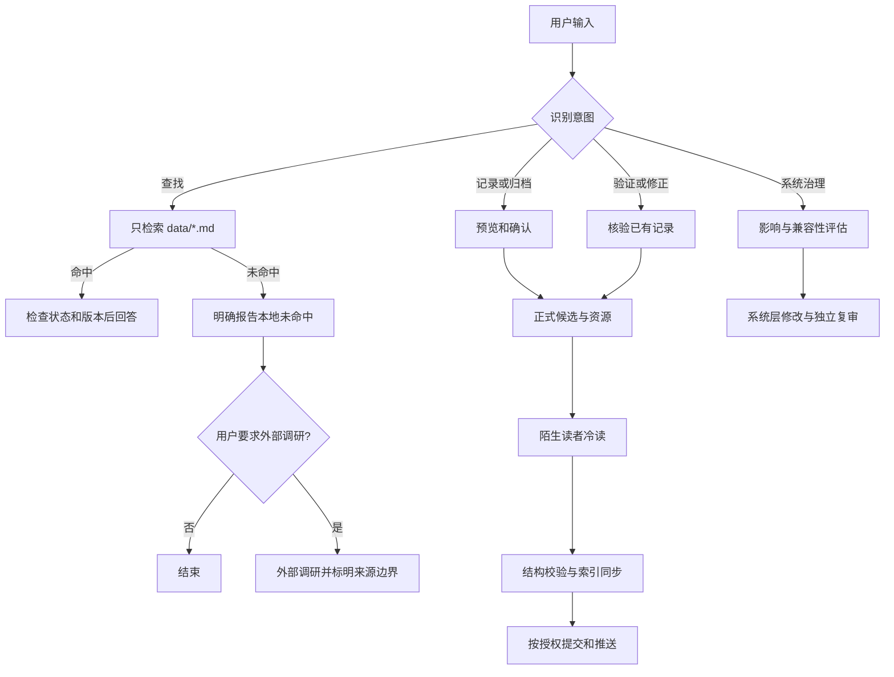

# 🧠 Akasha-KT | 阿卡西记录

> 把可复用的经验、知识、创意和公开资料整理成可检索、可验证、可离线阅读的长期知识库。

Akasha-KT 是一个面向 AI Agent 的本地知识库 Skill。它支持查找既有记录、整理新知识、完整离线保存公开文章、修正旧记录，以及维护模板和索引规则。

本 README 用于安装和能力概览，不另行定义执行规则；实际行为以 `SKILL.md` 及其路由到的对应 workflow 为准。

## 能做什么

| 能力 | 结果 |
|---|---|
| 查找经验 | 只从 `data/*.md` 检索，并检查状态与适用版本 |
| 整理知识 | 把原创经验、知识或创意写成正式、可独立阅读的记录 |
| 离线归档 | 完整保存公开文章的正文结构、代码、表格、引用和内容图片 |
| 验证修正 | 核验正确性、时效性、来源、资源、结构和可读性 |
| 系统治理 | 维护 workflow、模板、标签、索引与 Web 解析契约 |

## 工作流程



查询、联网、写入、删除、提交和推送是不同动作，分别服从当前用户授权。阿卡西不会把外部调研结果冒充为库内已有知识。

## 内容类型

| 类型 | 适合保存的内容 | 典型结构 |
|---|---|---|
| 经验 | 问题、排障、实践方案 | 场景 → 根因 → 方案 → 验证与边界 |
| 知识 | 概念、原理、技术分析 | 定义 → 前提 → 原理 → 示例 → 结论 |
| 创意 | 产品或技术想法 | 来源 → 核心想法 → 可行性 → 风险与下一步 |
| 学习用途本地留档 | 公开博客、论坛文章等 | 本地概要和元数据 + 完整原文与本地资源 |

原创记录应达到知识博客或技术/学术论文的可读性：没有参与当前对话的目标读者，也能理解背景、核心论证、证据边界、使用方法和结论。篇幅取决于主题，不要求机械写成长文。

## 目录结构

```text
<Skill 根目录>/
├── SKILL.md
├── README.md
├── data/                         # 正式记录，扁平存放
│   └── *.md
├── assets/                       # 正文资源
│   ├── <record-name>/
│   └── archives/                 # 非 data 层历史资料
└── references/
    ├── INDEX.md                  # 派生文件清单与标签概览
    ├── tag-registry.md           # 标签注册表
    ├── EXAMPLES.md
    ├── workflows/
    │   ├── search.md
    │   ├── record.md
    │   ├── validate.md
    │   └── governance.md
    ├── templates/
    │   └── record-template.md
    ├── reviews/                  # 冷读审核证据
    │   └── README.md
    └── scripts/
        ├── README.md
        ├── validate_records.py
        ├── regenerate_index.py
        └── fix_records_structure.py
```

`data/*.md` 是回答知识问题的唯一来源；`references/` 只负责流程、契约、索引和审核证据。

## 安装

### VS Code Copilot

```bash
# macOS / Linux
git clone https://github.com/KTSAMA001/AgentSkill-Akasha-KT.git ~/.copilot/skills/akasha-kt

# Windows PowerShell
git clone https://github.com/KTSAMA001/AgentSkill-Akasha-KT.git $HOME\.copilot\skills\akasha-kt
```

### Claude Code

```bash
git clone https://github.com/KTSAMA001/AgentSkill-Akasha-KT.git ~/.claude/skills/akasha-kt
```

## 验证安装

在 AI Chat 中尝试：

> “帮我找下之前有没有遇到过这个问题。”

> “把刚才的解决办法记一下。”

> “离线保存这篇公开文章。”

> “验证一下这条记录是否过时。”

Agent 能识别并进入相应流程，即表示 Skill 已加载。完整规则见 [SKILL.md](SKILL.md)，典型操作见 [references/EXAMPLES.md](references/EXAMPLES.md)。

## 重要边界

- 正式知识只能放在 `data/*.md`，分类依靠标签而不是子目录。
- 公开文章离线留档要求完整保存正文和内容资源，不能只留摘要或链接。
- 新增或实质改写的记录必须经过无上下文读者审核；脚本检查不能替代内容审核。
- 模板、workflow、schema、索引或标签规则的变更走治理流程，不混进普通记录。
- Git 发布只处理本次目标文件，不夹带工作树中无关改动。

## 许可证

MIT License
