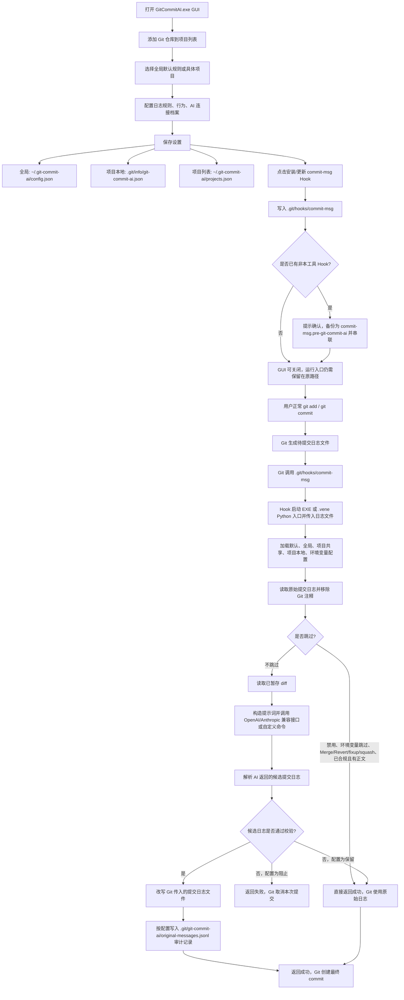

# Git Commit AI：commit-msg Hook 日志优化工具设计与实现实践

**标签**：#git #python #tools #ai #windows #experience #hook #ui #conventional-commits #credential
**来源**：实践总结 - Git Commit AI 本地工具设计、实现、打包与测试
**收录日期**：2026-05-25
**来源日期**：2026-05-25
**更新日期**：2026-06-02
**状态**：✅ 已验证
**可信度**：⭐⭐⭐⭐（本地端到端验证 + 官方资料核对）
**适用版本**：Git commit-msg hook / Python 3.13 / PySide6 / PyInstaller 6.20 / Python venv 源码版 / OpenAI-compatible Chat Completions / Anthropic Messages API

### 概要

本记录总结一个本地 Windows GUI 工具的完整实践：长期管理多个 Git 仓库的 `commit-msg` hook，在提交时只优化 commit message，不介入代码检查、push hook 或其他 Git 自动化。关键经验是把“Hook 运行边界、AI 连接档案、项目配置继承、GUI 可读性、单 exe 打包、失败回退”拆清楚，避免工具从日志优化器偏移成泛 Git 自动化平台。

### 内容

#### 目标与边界

该工具的唯一核心职责是管理 Git `commit-msg` hook：用户照常执行 `git commit`，Git 在提交日志确认阶段调用本工具，本工具读取原始 commit message 与已暂存 diff，按配置调用 AI 重写日志，并可在日志末尾保留原始提交内容用于回忆。

明确排除的范围同样重要：

- 不做 `pre-commit` 代码检查。
- 不做 `pre-push` 检查或发布流程。
- 不把工具设计成通用 Git 自动化平台。
- 不要求用户手动寻找 hook 文件或配置文件。

这个边界来自 Git hook 本身的语义：`commit-msg` 接收提交日志文件路径，适合检查或改写提交信息；代码扫描、格式化、测试等行为应属于其他 hook 或独立工具。

#### 配置分层

配置应只有一层“当前编辑目标”，避免用户同时面对全局、项目、连接档案多套保存按钮而不知道自己在保存什么。

推荐分层：

| 层级 | 用途 | 生命周期 |
|------|------|----------|
| 全局默认规则 | 未设置项目的兜底规范、AI 默认连接、跳过规则 | 用户级长期保存 |
| 项目本地配置 | 单仓库覆盖全局规则 | 存在于仓库 `.git/info`，不进入提交 |
| 项目列表 | GUI 左侧长期管理多个仓库路径和 hook 状态 | 用户级长期保存 |
| 连接档案 | 同一协议下保存不同 Base URL、Key、环境变量名和模型 | 随当前配置目标保存 |

实践中最容易混乱的是“请求协议”和“连接档案”看起来像同一个东西。应将二者分离：

- 请求协议只决定请求格式，例如 OpenAI 兼容或 Anthropic 兼容。
- 连接档案保存实际服务商、网关、账号或 Key，例如不同 URL、不同 API Key、不同模型。
- 档案名称只在新建时输入；创建后只通过下拉框选择，保存按钮只更新当前档案字段。
- 重复档案名必须提示并拒绝创建，避免“保存过但下拉框不显示、再添加又说已存在”的状态错乱。

#### Hook 安装策略

Hook 安装只修改仓库内的 `.git/hooks/commit-msg`。如果已有非本工具管理的 hook，不应直接覆盖；应提示用户确认后备份并串联执行，例如备份为 `commit-msg.pre-git-commit-ai`，再由新 hook 调用旧 hook。

Hook 脚本应调用同一个 exe，而不是再拆一个 runner exe。这样用户桌面只需要一个程序：

```sh
"$TOOL_EXE" hook commit-msg "$1"
```

同一个入口根据参数区分 GUI 模式和 hook 模式：

- 双击无参数：启动 GUI。
- Git hook 带参数：处理日志文件并返回退出码。
- 命令行 `doctor` / `install` / `uninstall`：用于诊断和脚本化操作。

失败处理应可配置，但默认要保守。AI 请求失败、日志校验失败时可以弹窗提示，并根据配置选择阻止本次提交或保留原文继续。默认不应在用户无感知的情况下写入明显错误或空日志。

#### 完整工作流程

工具不是后台常驻服务。GUI 只负责配置、保存项目列表和安装/更新 hook；安装后可以关闭 GUI，但 hook 中记录的运行入口必须继续存在。EXE 版本需要保留 `GitCommitAI.exe`，源码版本需要保留源码目录和 `.vene` 虚拟环境。后续每次提交时，由 Git 的 `commit-msg` hook 临时启动同一套运行入口处理提交日志。



这条链路的关键边界：

- 安装 hook 后不需要 GUI 常驻，但不能删除或移动 hook 指向的 EXE、源码目录或 `.vene` 虚拟环境；移动后需要重新安装/更新 hook。
- 只处理 Git 传入的提交日志文件，不检查代码、不处理 push。
- AI 只基于原始日志和已暂存 diff 工作，未暂存改动不应进入提示词。
- 合规且已有正文的原始日志默认直接放行，避免二次改写。
- 原始日志保留应优先写入 `.git` 下审计文件，避免污染公开提交历史。

#### 跳过规则

跳过规则应由用户可配置，按提交日志首行正则匹配。常见默认规则包括：

```regex
^Merge
^Revert
^fixup!
^squash!
```

满足跳过规则的提交应直接放行，不进入 AI 优化。这样可以避免 merge commit、revert、fixup、squash 这类 Git 默认或工作流专用日志被无意义改写。

还需要额外处理一种更常见的语义跳过：用户原始提交日志已经符合规则时，不应再交给 AI 二次改写。实践中可增加 `behavior.skip_valid_original`，默认开启；判断条件建议是：

- 首行已通过 Conventional Commits 校验。
- 在配置要求正文按模块说明时，原始日志已经包含正文。
- 以上条件满足时直接返回成功，不调用 AI、不追加“原始提交日志”区块、不写入二次优化后的内容。

这个判断应放在读取原始日志、正则跳过之后，调用 AI 之前。否则用户已经认真写好的日志仍会被模型重新组织，导致提交历史中出现“优化版 + 原文版”的重复内容，降低日志可读性。

#### AI 协议设计

常见模型网关数量很多，但 GUI 不应堆满服务商枚举。更稳的设计是只提供两类通用协议：

| 协议 | 请求端点 | 用途 |
|------|----------|------|
| OpenAI 兼容接口 | `/chat/completions` | 大量兼容 OpenAI Chat Completions 的网关 |
| Anthropic 兼容接口 | `/v1/messages` | Claude/Anthropic Messages 格式及兼容网关 |

具体服务商 URL 由用户在连接档案里填写。Base URL 可以是根地址，也可以是完整 endpoint；程序负责避免重复拼接路径。例如用户填写 Anthropic 兼容根地址时，请求落到 `/v1/messages`；如果用户已经填完整 messages endpoint，则不再重复追加。

模型列表只能作为辅助能力，不应作为强依赖。部分网关不支持模型枚举，GUI 必须允许用户手动输入模型名。

Key 管理建议：

- 允许保存 API Key 到当前档案。
- 也允许只填写环境变量名，让 hook 运行时从系统环境读取。
- 连接档案的名称不等于协议名称，也不等于服务商名称；它只是用户自己识别账号、网关或用途的标签。

#### GUI 交互经验

早期手搓布局或过度依赖基础控件，容易出现区域遮挡、文字看不清、按钮消失、滚轮串动、保存层级不明等问题。实践中改用 PySide6/Qt 后，重点不是“换框架就自动好看”，而是利用成熟布局系统把信息结构整理清楚。

有效的布局原则：

- 左侧是长期项目列表，项目卡片必须有明确选择反馈和 hook 状态。
- 左侧保留“全局默认规则”作为一个可选项，编辑兜底设置；选择具体项目时才允许安装或卸载 hook。
- 右侧顶部只展示当前项目与 hook 操作，不放重复的“添加项目”“检查当前项目”按钮。
- 配置区只保留一个保存目标：当前选择的是全局就保存全局，当前选择的是项目就保存项目。
- 每个参数的说明放在参数右侧，不单独占一行；下拉框、输入框统一宽度，按钮在右侧。
- 对容易误解的控件加 tooltip，但不要用大段说明文本淹没操作区。
- 下拉框滚轮事件应只作用于当前控件，不应带动左侧项目列表滚动。

UI 文案也要按用户任务命名，而不是按内部实现命名。例如“请求协议”“选择档案”“新建自定义档案”“保存此档案”比 `Provider`、`Profile`、`Base URL + API Key` 更容易理解。

#### 单 exe 与相对路径

打包要求是一个 exe。实践中使用 PyInstaller onefile 构建统一入口：

- GUI 与 hook runner 共用同一个 exe。
- Hook 中写入当前 exe 路径，移动桌面包后需要在 GUI 中重新安装 hook。
- 桌面包只包含 `GitCommitAI.exe` 和说明文件，zip 保持相对结构。
- GUI 双击时隐藏控制台窗口；Git hook 调用时保留可等待的命令行退出码语义。

要避免把持久配置写进 PyInstaller 解包临时目录。打包后只读资源可以跟随 bundle；用户配置、项目列表、审计日志、原始日志保留文件必须写入用户目录或仓库 `.git/info` 这类持久位置。

#### 源码虚拟环境版与自动依赖检测

当不打包 exe 时，可以提供源码虚拟环境版。它的设计目标是：用户双击一个 `.cmd` 启动器即可运行 GUI，首次运行自动创建 `.vene` 虚拟环境，并按 `requirements.txt` 安装缺失依赖；安装 hook 后，Git 提交时也走同一个源码运行入口。

源码版的关键文件分工：

| 文件/目录 | 职责 |
|-----------|------|
| `GitCommitAI_Source.cmd` | Windows 双击入口，负责把所有参数转发给 PowerShell 启动脚本。 |
| `run_source.ps1` | 创建 `.vene`、检测依赖、安装缺失依赖、用虚拟环境 Python 启动 `git_commit_ai_app.py`。 |
| `.vene/` | 自动创建的虚拟环境，保存 PySide6 等运行依赖；不进入源码包 zip。 |
| `requirements.txt` | 源码版依赖清单，例如 `PySide6>=6.11,<7`。 |
| `git_commit_ai_app.py` | 统一入口：无参数启动 GUI，有参数进入 CLI/hook 处理。 |
| `git_commit_ai/` | 程序核心源码。 |
| `package_source_desktop.ps1` | 生成桌面源码包，复制源码、启动器、README、requirements，排除 `.vene`、`dist`、`build` 和缓存。 |

实现取舍：

- `.cmd` 只做入口转发，复杂逻辑放在 PowerShell 中，避免批处理脚本维护复杂条件分支。
- `run_source.ps1` 先解析脚本所在目录，保证无论从哪里双击，都以源码包根目录作为运行根。
- 找系统 Python 时优先 `python`，再回退到 `py -3`；找不到则提示安装 Python 3.10+。
- 通过 `python -m venv .vene` 创建环境，不要求用户手动激活虚拟环境；后续直接调用 `.vene\Scripts\python.exe`。
- 依赖检测用 `importlib.util.find_spec("PySide6")`，只在缺失时执行 `.vene\Scripts\python.exe -m pip install -r requirements.txt`。
- 依赖检测片段应使用单行 `python -c`，避免 PowerShell here-string 在 `.cmd -> PowerShell -> python -c` 的多层转发中出现换行/引号兼容问题。
- 源码版安装 hook 时，由于当前进程就是 `.vene\Scripts\python.exe`，hook 会写入虚拟环境 Python，并带上源码父目录作为导入路径。这样 Git 提交触发 hook 时不依赖全局 Python 环境。
- 源码包只保留 `README.md` 作为说明文档；不要再生成 `README-SOURCE.txt` 这类重复说明，避免用户不清楚哪个文档才是权威。
- `examples/` 和 `tests/` 属于参考和验证内容，可在 README 中明确为“普通使用可删”；运行必需项应单独列清楚。

需要提醒用户：Python 官方文档指出虚拟环境通常包含解释器路径等位置信息，移动环境后应重建。因此源码版安装 hook 后，不需要 GUI 常驻，但不能移动源码包目录；移动后需要重新运行启动器重建 `.vene` 并重新安装 hook。

#### 验证闭环

本次实现采用以下验证组合：

- Python 编译检查：验证 GUI、CLI、入口和测试文件无语法错误。
- 单元测试：覆盖配置合并、OpenAI/Anthropic 请求格式、commit-msg hook 改写与原文保留。
- 合规日志跳过测试：覆盖“首行合规且已有正文”的原始日志不调用 AI、不追加原始日志区块。
- Qt offscreen 冒烟测试：验证 GUI 不需要真实显示即可创建窗口、切换测试仓库、新建连接档案、刷新下拉框、重复名称提示。
- PyInstaller 构建：确认单 exe 能成功生成。
- 桌面包验证：确认桌面目录和 zip 只有一个 exe 入口和说明文件。
- exe 命令行验证：执行 `--version` 和 `doctor --repo <test-repo>`，确认打包后的 exe 能加载测试仓库配置并识别 hook 状态。
- 源码虚拟环境版验证：执行 `GitCommitAI_Source.cmd --version`，确认首次自动创建 `.vene`、安装 PySide6，并在二次运行时直接复用依赖。
- 源码版 hook 验证：在临时仓库安装 hook，确认 hook 写入 `.vene/Scripts/python.exe` 和源码模块路径。

这些验证比单纯“能打开 GUI”更可靠，因为该工具同时有桌面交互、Git hook 子进程、网络请求格式、文件持久化和打包运行路径几个失效面。

#### 可复用结论

1. 做 Git hook 工具时，先明确 hook 类型和边界；本工具只处理 commit message，因此只管理 `commit-msg`。
2. GUI 的“保存”必须围绕用户当前选择的目标，而不是暴露内部多层配置结构。
3. 协议和连接档案要分离；协议决定请求格式，档案保存实际 URL、Key 和模型。
4. 多服务商适配优先提供通用协议，不要把 GUI 做成服务商清单。
5. 新建档案时才输入名称，后续只下拉选择；否则用户会误以为每次编辑都在重命名档案。
6. AI 失败、模型枚举失败、日志校验失败都要有明确提示和可配置处理方式。
7. 已经符合规则且包含必要正文的原始日志应跳过 AI；AI 优化只处理随手写、不完整或不规范的日志。
8. PyInstaller onefile 工具要区分 bundle 临时目录与用户持久目录，配置和日志不能写入解包目录。
9. 源码版应把自动环境创建、依赖检测和入口转发封装进启动器，避免让普通用户手动执行 `venv`、`pip install` 或寻找配置文件。
10. 虚拟环境不要打进源码 zip；首次运行重建更可靠，也能避免搬运环境造成路径失效。
11. “一个 exe”或“一个源码入口”并不意味着只能有一种运行模式；可以由同一入口根据参数切换 GUI、hook 和诊断命令。

### 关键代码

Hook 调用入口的核心形态：

```sh
"$TOOL_EXE" hook commit-msg "$1"
```

源码版 hook 调用入口的核心形态：

```sh
GIT_COMMIT_AI_MODULE_PARENT="<source-parent>"
export GIT_COMMIT_AI_MODULE_PARENT
"<source-root>/.vene/Scripts/python.exe" -c 'import os, sys; sys.path.insert(0, os.environ["GIT_COMMIT_AI_MODULE_PARENT"]); from git_commit_ai.cli import main; raise SystemExit(main())' hook commit-msg "$1"
```

源码启动器核心流程：

```powershell
if (-not (Test-Path ".vene\Scripts\python.exe")) {
  python -m venv .vene
}

$missing = & .\.vene\Scripts\python.exe -c "import importlib.util; print('PySide6' if importlib.util.find_spec('PySide6') is None else '')"
if ($missing) {
  .\.vene\Scripts\python.exe -m pip install -r requirements.txt
}

.\.vene\Scripts\python.exe git_commit_ai_app.py @AppArgs
```

连接档案的抽象结构：

```json
{
  "provider": "anthropic-compatible",
  "active_profile": "Work Gateway",
  "endpoint_profiles": [
    {
      "name": "Work Gateway",
      "provider": "anthropic-compatible",
      "base_url": "https://example.invalid/api/anthropic",
      "api_key_env": "ANTHROPIC_API_KEY",
      "selected_model": "model-name",
      "models": ["model-name"]
    }
  ]
}
```

合规日志跳过配置：

```json
{
  "behavior": {
    "skip_valid_original": true
  }
}
```

### 参考链接

- [Git githooks 文档](https://git-scm.com/docs/githooks) - `commit-msg` hook 接收提交日志文件路径，适合检查或改写提交信息。
- [Qt for Python Layout Management](https://doc.qt.io/qtforpython-6/overviews/qtwidgets-layout.html) - Qt 布局系统用于自动组织子控件尺寸与位置。
- [PyInstaller Run-time Information](https://pyinstaller.org/en/stable/runtime-information.html) - 打包运行时路径、`sys.frozen`、`__file__` 与 bundle 资源定位说明。
- [PyInstaller Operating Mode](https://www.pyinstaller.org/en/stable/operating-mode.html) - onefile/onedir 打包模式与单文件可执行程序说明。
- [Python venv 文档](https://docs.python.org/3/library/venv.html) - 虚拟环境创建、Windows `Scripts` 目录、无需激活即可直接调用解释器，以及移动环境后应重建的限制。
- [pip requirements file format](https://pip.pypa.io/en/stable/reference/requirements-file-format/) - `requirements.txt` 用于列出 `pip install` 要安装的依赖项。
- [Python importlib.util.find_spec](https://docs.python.org/3.13/library/importlib.html#importlib.util.find_spec) - 用于检测模块是否可导入，缺失时再触发依赖安装。
- [OpenAI Chat Completions API](https://platform.openai.com/docs/api-reference/chat/create-chat-completion) - OpenAI 兼容接口的 `/chat/completions` 请求形态参考。
- [Anthropic Messages API](https://docs.anthropic.com/en/api/messages-examples) - Anthropic Messages 请求示例，包含 `x-api-key` 与 `anthropic-version`。
- [Anthropic API Overview](https://docs.anthropic.com/en/api/overview) - Anthropic API 认证请求头说明。

### 相关记录

- [Qt / PySide6 GUI 框架术语](./qt-pyside6-gui-framework-terms.md) - 解释本记录中出现的 Qt/PySide6、Qt offscreen 冒烟测试与 CI/CD 术语。
- [PyInstaller 打包 Python 为 Windows EXE 完整指南](./pyinstaller-windows-exe-packaging.md) - 单 exe 打包、资源路径与持久目录问题的相邻经验。
- [Markdown to Word 转换器实现详解](./md-to-word-converter-implementation.md) - Python GUI 工具实现与桌面工具交付经验。
- [Claude Code Skill 触发模式与 Hook 提升自动触发率](./claude-code-skill-hook-trigger-boost.md) - Hook 机制与自动化边界的相邻经验。

### 验证记录

- [2026-05-25] 初次记录，来源为 Git Commit AI 本地工具设计、实现、GUI 反馈修正、单 exe 打包与测试实践。
- [2026-05-25] 本地查重：阿卡西 data 中未发现“Git commit-msg Hook + AI 日志优化 GUI 工具”的直接记录；已有 PyInstaller、GUI 工具和 Hook 相关相邻记录，已在“相关记录”中引用。
- [2026-05-25] 外部核对：Git 官方 githooks 文档确认 `commit-msg` 的输入和语义；Qt for Python 文档确认布局系统适合解决控件排版和尺寸管理；PyInstaller 官方文档确认 onefile 与运行时路径边界；OpenAI 与 Anthropic 官方文档确认两个通用请求协议的端点形态。
- [2026-05-25] 工具验证：执行 Python 编译检查、单元测试、Qt offscreen 冒烟测试、PyInstaller 构建、桌面包验证，以及打包后 exe 的 `--version` 与 `doctor --repo <test-repo>` 诊断。
- [2026-05-25] 补充关联：新增开发工具术语词条后，反向补充 Qt、冒烟测试、CI/CD 的术语解释引用。
- [2026-05-25] 修正：补充 `behavior.skip_valid_original` 实践结论。经本地单元测试与打包后临时仓库 hook 验证，原始日志首行合规且已有正文时会静默跳过 AI，不再二次改写，也不会追加“原始提交日志”区块；该结论与 Git 官方 `commit-msg` hook 可检查/改写消息文件的语义一致。
- [2026-05-25] 补充完整工作流程 Mermaid 流程图，覆盖 GUI 配置、配置保存、hook 安装、Git 首次提交触发、跳过判断、AI 优化、校验、审计记录与最终 commit 的全链路；外部依据为 Git 官方 `commit-msg` hook 文档。
- [2026-06-02] 修正：补充源码虚拟环境版设计与关键实现。经本地验证，`GitCommitAI_Source.cmd --version` 可首次创建 `.vene`、按 `requirements.txt` 安装 PySide6，并在二次运行时复用环境；临时仓库安装 hook 后，hook 内容指向 `.vene/Scripts/python.exe` 和源码模块路径。外部核对 Python `venv`、pip requirements 与 `importlib.util.find_spec` 官方文档，确认实现依据一致。

---
