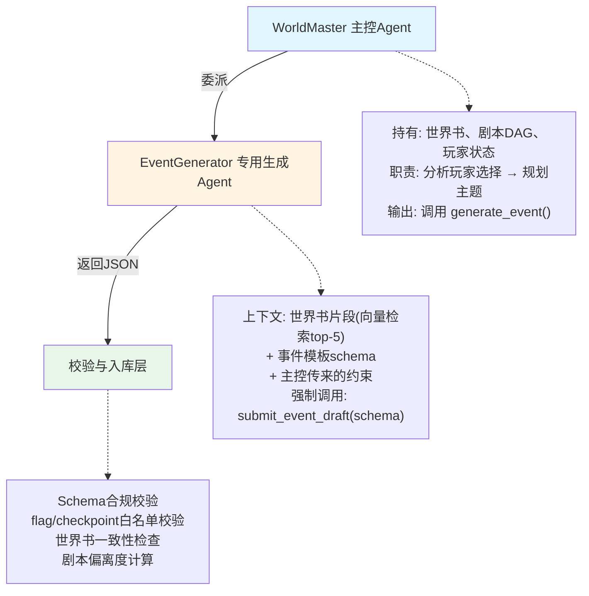

# LLM 结构化事件生成架构 - 游戏动态剧情系统

**标签**：#ai #game-design #llm #architecture #narrative #procedural-generation #structured-output #agent-workflow #error-handling
**来源**：KTSAMA 实践构想 + 生产级 Agent 系统架构模式研究
**收录日期**：2026-07-23
**来源日期**：2026-07-23
**状态**：💡 构想中
**可信度**：⭐⭐⭐（架构设计合理,部分模式已在生产环境验证,完整方案待游戏项目实装）

### 概要

基于 LLM + Agent 的游戏动态事件生成架构设计,通过三层架构(主控规划 + 专用生成 + 校验入库)、JSON Schema 强制输出、边界查询机制和错误自纠错模式,实现千人千面但有界的剧情事件生成。技术栈无关,可用于任意游戏引擎和编程语言组合。

### 内容

#### 一、问题与场景

**核心需求**:
游戏中需要根据玩家选择动态生成后续事件,要求:
- **千人千面但有界**: 叙事文本自由发挥(LLM 创作),但结构/分支数/后果范围受约束
- **不脱离世界书**: flag/势力/NPC/剧情节点必须来自预定义集合,禁止 LLM 编造
- **推向剧本关键节点**: 生成的事件选项需解锁指定 checkpoint,确保玩家朝结局推进
- **固定结构可配置**: 不同危险等级(1-5)对应不同的事件复杂度要求

**典型场景**:
```
玩家拒绝商人公会贿赂 → 声望降至 -15
→ 主控 Agent 分析: 应触发"商人公会报复"事件,危险等级 4,推向 chapter2_exile_crisis
→ EventGenerator 生成: 3 个选择分支,包含战斗检定/逃跑/求助,至少一个分支解锁目标 checkpoint
→ 校验通过: 所有 flag 来自世界书,checkpoint 在剧本 DAG 中存在
→ 入库并呈现给玩家
```

---

#### 二、解决方案架构



**分层职责**:
- **主控层**: 持有全局上下文(完整世界书、剧本 DAG、玩家历史),只负责规划"生成什么主题的事件",不负责编写事件内容(避免上下文爆炸)
- **生成层**: 只持有任务片段上下文(相关世界书片段 + 事件模板 + 目标约束),专注于内容创作,按 schema 填充结构
- **校验层**: 无状态的验证器集合,确保生成结果不违反边界

---

#### 三、核心设计模式

##### 1. Schema 分级约束

**原理**: 不同危险等级的事件对应不同的 JSON Schema,LLM 可自由发挥叙事文本,但结构字段受强约束。

**示例**:
```json
// 危险等级 1 (日常事件)
{
  "type": "object",
  "required": ["title", "description", "choices"],
  "properties": {
    "title": {"type": "string", "maxLength": 30},
    "description": {"type": "string", "minLength": 50, "maxLength": 200},
    "choices": {
      "type": "array",
      "minItems": 2,
      "maxItems": 3,
      "items": {
        "properties": {
          "text": {"type": "string"},
          "immediate_effect": {
            "properties": {
              "reputation_delta": {"type": "integer", "minimum": -5, "maximum": 5}
            }
          },
          "long_term_flag": {"type": "string"}
        }
      }
    },
    "decay_turns": {"type": "integer", "minimum": 1, "maximum": 3}
  }
}

// 危险等级 5 (生死事件) - 要求更多
{
  "required": ["title", "description", "choices", "failure_consequence"],
  "properties": {
    "choices": {
      "minItems": 3,
      "maxItems": 5,
      "items": {
        "required": ["text", "success_check", "on_success", "on_failure"],
        "properties": {
          "success_check": {
            "properties": {
              "attribute": {"enum": ["strength", "intelligence", "charm"]},
              "threshold": {"type": "integer"}
            }
          }
        }
      }
    }
  }
}
```

**结果**: LLM 在 `description`/`narrative` 字段自由创作(千人千面),但分支数、数值范围、必填字段由 schema 控制(有界)。

##### 2. 委派纪律

**原则**: 主控 Agent 不直接生成内容,专用 sub-agent 不持有全局上下文。

**类比**:
- 主控 = 制片人: 决定这一集的主题、基调、要推进哪个剧情线
- Sub-agent = 编剧: 只负责写这一集的剧本,不需要知道整季的完整大纲

**实现**:
```python
# 主控 Agent
def plan_next_event(player_choice):
    analysis = analyze_world_state(player_choice)
    theme = "商人公会报复"
    danger_level = 4
    target_checkpoint = "chapter2_exile_crisis"
    
    # 委派给 EventGenerator,只传递必要上下文
    event = generate_event(
        theme=theme,
        danger=danger_level,
        context=f"推向 {target_checkpoint},玩家声望 -15"
    )
    return event

# 专用生成 Agent 的上下文
def generate_event(theme, danger, context):
    world_snippets = vector_search(theme, limit=5)  # 只检索相关片段
    schema = EVENT_SCHEMAS[danger]
    
    prompt = f"""
你是事件编剧。根据以下信息生成事件:
主题: {theme}
世界背景: {world_snippets}  # 不是完整世界书
目标: {context}

你必须调用 submit_event_draft 提交草稿。
    """
    return call_sub_agent(prompt, schema)
```

##### 3. 边界查询机制

**问题**: 如何防止 LLM 编造世界书中不存在的 flag/checkpoint?

**方案**: 提供只读查询工具 `query_world_book()`,校验失败时引导 Agent 调用该工具获取可用项。

**工具定义**:
```python
def query_world_book(query_type: str, keyword: str = None) -> dict:
    """
    EventGenerator 查询边界的只读工具。
    
    Args:
        query_type: "flags" | "checkpoints" | "factions" | "npcs"
        keyword: 可选的过滤关键词
    
    Returns:
        可用项的枚举列表 + 描述
    """
    if query_type == "flags":
        return {
            "available_flags": [
                {"key": "angered_merchant_guild", "description": "激怒商人公会"},
                {"key": "saved_child_npc", "description": "救过小孩"}
            ]
        }
    elif query_type == "checkpoints":
        return {
            "current_chapter": 2,
            "unlockable_checkpoints": [
                {"key": "chapter2_boss_fight", "description": "第二章 BOSS 战"},
                {"key": "chapter2_exile_crisis", "description": "被驱逐出城"}
            ]
        }
```

**工作流**:
```
EventGenerator 提交草稿 → 使用了 flag "angered_duke_family"
→ 校验层: flag 不在世界书中
→ 返回错误: { "error_code": "undefined_flag", "hints": ["调用 query_world_book('flags', 'duke') 查询可用项"] }
→ EventGenerator 看到 hints,调用 query_world_book
→ 获得可用 flag 列表 → 修正草稿 → 重新提交
```

##### 4. 向量检索 + 白名单双保险

**软约束**(激发创意): 向量检索世界书相关片段,给 sub-agent 提供"这个势力的背景故事"
**硬约束**(防止越界): 白名单校验拒绝不在预定义集合中的 flag/checkpoint

**示例**:
```python
# 软约束: 检索提供背景
world_snippets = vector_search("商人公会", limit=5)
# 返回: "商人公会控制城市贸易...与城主有矛盾...成员包括..."

# sub-agent 根据背景创作叙事
description = "你走在回旅店的路上,三个穿商人公会制服的人堵住了你..."  # 自由发挥

# 硬约束: 校验 flag
submitted_flag = "angered_merchant_guild"  # sub-agent 填的
if submitted_flag not in WORLD_BOOK_FLAGS:
    return {"error": "undefined_flag", "hints": [...]}
```

##### 5. 错误重试与自纠错机制

> **实证来源**: 多个生产级 Agent 系统中已验证的错误处理模式

**模式 1: Hints-based Self-Correction**

工具返回错误时必须附带 `hints[]` 数组,提供恢复指导:

```json
{
  "status": "validation_failed",
  "error_code": "undefined_flag",
  "param": "long_term_flag",
  "value": "angered_duke_family",
  "hints": [
    "Flag 'angered_duke_family' is not defined in world book",
    "Call query_world_book('flags', 'duke') to find available flags",
    "Similar available flags: angered_merchant_guild, angered_city_guard"
  ]
}
```

**Agent 行为约束**:
- ✅ 必须读取 `hints[]` 再决定下一步
- ❌ 禁止忽略 hints 直接重试
- ❌ 禁止改变关键参数盲目重试(如把 "PlayerController" 改成 "player-controller" 再试)

**模式 2: Escalation Over Retry(升级策略而非重试)**

当一个操作失败时,不要重复调用同类工具,而是立即切换到更确定性的工具:

```
❌ 错误做法:
submit_event_draft() 失败("flag X 不存在")
→ 再次 submit_event_draft() 用相似的 flag Y  # 仍可能失败
→ 再次 submit_event_draft() 用 flag Z        # 浪费 token

✅ 正确做法:
submit_event_draft() 失败
→ 切换工具: query_world_book("flags") 获取完整列表  # 确定性操作,无 LLM 调用
→ 用列表中的 flag 修正草稿
→ 再次 submit,成功率高
```

**通用规则**:
- 搜索类工具失败 → 切换到浏览/列表类工具(范围更广)
- 校验失败 → 切换到查询边界工具(获取准确约束)
- 仍不确定 → 返回主控 Agent,由它提供更明确的指令

**模式 3: 计费操作禁止盲目重试**

某些操作一旦执行即产生成本(LLM API 调用、云服务请求),必须禁止自动重试:

```python
# EventGenerator 已调用 LLM API 生成草稿(已计费)
draft = call_llm_api(prompt)  # ← 已扣费

# 校验失败
validation_result = validate(draft)
if validation_result["status"] == "failed":
    # ❌ 错误: 直接重新调用 LLM(再次计费,可能仍失败)
    # draft = call_llm_api(prompt)  
    
    # ✅ 正确: 先用本地工具获取边界
    available_flags = query_world_book("flags")
    
    # ✅ 在草稿基础上修正(文本替换,无需重新生成)
    draft["choices"][0]["long_term_flag"] = available_flags[0]["key"]
    
    # ✅ 再次校验,仍失败才考虑重新生成
    if validate(draft)["status"] == "failed":
        # 此时才重新调用 LLM,并附带更明确的约束
        pass
```

**适用场景**:
- LLM API 调用(按 token 计费)
- 云端图像/语音生成
- 数据库写入操作(有副作用)
- 外部服务请求(有限额)

**模式 4: 类型化错误码 + 差异化恢复策略**

不同类型的错误需要不同的恢复策略,通过错误码枚举 + 策略映射实现:

```python
# 错误码定义
ERROR_CODES = {
    "undefined_flag": "使用的 flag 不在世界书中",
    "undefined_checkpoint": "checkpoint 不在剧本大纲中",
    "danger_level_mismatch": "选择分支数不符合危险等级要求",
    "schema_violation": "JSON 结构不符合 schema",
    "reputation_out_of_range": "声望变化超出当前等级允许范围"
}

# 恢复策略映射
def get_recovery_strategy(error_code: str, context: dict) -> str:
    strategies = {
        "undefined_flag": lambda ctx: f"调用 query_world_book('flags', '{ctx.keyword}')",
        "undefined_checkpoint": lambda ctx: "调用 query_world_book('checkpoints')",
        "danger_level_mismatch": lambda ctx: f"当前等级 {ctx.danger} 要求 {ctx.min_choices}-{ctx.max_choices} 个选择",
        "schema_violation": lambda ctx: f"字段 {ctx.field} 类型错误,应为 {ctx.expected_type}",
        "reputation_out_of_range": lambda ctx: f"等级 {ctx.danger} 的声望变化限制为 ±{ctx.max_delta}"
    }
    return strategies.get(error_code, lambda ctx: "未知错误")(context)

# 使用
if error_code == "undefined_flag":
    hint = get_recovery_strategy(error_code, {"keyword": extract_keyword(value)})
    return {"error_code": error_code, "hints": [hint, ...]}
```

---

#### 四、技术实现要点

**技术栈组合(任意选择)**:

| 维度 | 可选技术 |
|---|---|
| **游戏引擎** | Godot / Unity / Unreal / 自研引擎 / 纯后端 |
| **编程语言** | Python / C# / JavaScript / TypeScript / Lua / GDScript / Blueprint |
| **LLM 提供商** | Claude / OpenAI / Gemini / Qwen / DeepSeek / 本地模型(Ollama/LM Studio) |

**关键技术要求**(与具体技术栈无关):

1. **强制结构化输出**
   - sub-agent 的输出工具必须绑定 JSON Schema
   - 框架层保证返回对象合规(拒绝不符合 schema 的响应)
   - 参考实现: Claude API 的 `response_format: { type: "json_schema", schema: {...} }` 参数

2. **配置与状态分离**
   - 事件模板(配置层,可被多个实例共享): 存储 schema 定义、危险等级映射
   - 事件实例(运行时状态): 记录玩家是否触发、选择了哪个分支、当时的世界状态快照

3. **枚举自动生成**
   - 世界书配置文件(YAML/JSON) → 自动生成 flag/checkpoint 枚举/常量
   - 供 schema 校验和 IDE 代码补全使用
   - 世界书更新后自动重新生成,避免手动同步

4. **高层语义工具**
   - 主控 Agent 调用的是 `generate_event(theme, danger, context)` 一个工具
   - 背后封装: 向量检索 + sub-agent 调用 + 校验 + 入库
   - 而不是让主控 Agent 自己组装 10 个底层步骤

5. **向量检索世界书**
   - 世界书文档 → 分块(chunk) → 嵌入(embedding) → 向量数据库
   - 生成事件时检索相关片段,而非把整个世界书塞进 sub-agent 上下文

**实现示例**(Python + Claude API):

```python
import anthropic

def generate_event(theme: str, danger: int, context: str) -> dict:
    # 1. 向量检索世界书相关内容
    world_snippets = vector_search(theme, limit=5)
    
    # 2. 选择对应危险等级的 schema
    schema = EVENT_SCHEMAS[danger]
    
    # 3. 构造 sub-agent prompt
    prompt = f"""
你是游戏事件生成专家。根据以下信息生成一个事件:

**主题**: {theme}
**危险等级**: {danger}
**世界背景**:
{world_snippets}

**策划要求**:
{context}

你必须返回符合 schema 的 JSON,包含 title、description、choices 等字段。
如果不确定可用的 flag/checkpoint,先调用 query_world_book 工具查询。
    """
    
    # 4. 调用 Claude API,强制 JSON Schema
    client = anthropic.Anthropic()
    response = client.messages.create(
        model="claude-3-5-sonnet-20241022",
        max_tokens=2000,
        tools=[
            {
                "name": "submit_event_draft",
                "description": "提交事件草稿,必须符合 schema",
                "input_schema": schema
            },
            {
                "name": "query_world_book",
                "description": "查询可用的 flag/checkpoint",
                "input_schema": {
                    "type": "object",
                    "properties": {
                        "query_type": {"type": "string", "enum": ["flags", "checkpoints"]},
                        "keyword": {"type": "string"}
                    }
                }
            }
        ],
        messages=[{"role": "user", "content": prompt}]
    )
    
    # 5. 处理 tool_use(可能是 submit 或 query)
    for block in response.content:
        if block.type == "tool_use":
            if block.name == "submit_event_draft":
                # 6. 校验
                draft = block.input
                validation = validate_event(draft, danger)
                if validation["status"] == "ok":
                    return store_event(draft)
                else:
                    # 返回错误 + hints,让 Agent 重试
                    # (实际需要多轮对话处理)
                    return validation
            elif block.name == "query_world_book":
                # 返回边界数据
                return query_world_book(**block.input)
```

---

#### 五、验证记录

**已验证的模式**:
- ✅ **Schema 强制输出**: Claude API 的 `tools[].input_schema` 机制,OpenAI 的 `response_format: json_schema`
- ✅ **Sub-agent 委派**: 生产级 Agent 系统的多 Agent 架构(主控 agent → 专用子 agent 委派模式)
- ✅ **Hints-based 自纠错**: 多个 Agent 系统的搜索类工具统一采用 `{ error: { code, hints[] } }` 返回契约
- ✅ **Escalation over retry**: 生产级 Agent 系统的"搜索失败 → 立即切换工具"纪律
- ✅ **计费操作禁止重试**: 生产系统的 vision 分析/agent 对话等计费功能的"must not be automatically retried"约束

**待验证的部分**:
- ⚠️ 完整的三层架构在实际游戏项目中的集成
- ⚠️ 向量检索世界书的检索质量(chunk 大小、embedding 模型选择)
- ⚠️ 危险等级 → Schema 映射的游戏平衡性
- ⚠️ 玩家体验(生成事件的可玩性、叙事连贯性)

---

#### 六、扩展与变体

**适用的其他场景**:
- **任务/副本生成**: 主题(护送/刺杀/调查) + 难度 → 生成任务目标、奖励、失败条件
- **对话生成**: NPC 性格 + 玩家关系 + 当前剧情 → 生成多分支对话树
- **关卡生成**: 地形类型 + 难度 + 可用素材 → 生成房间布局、敌人配置
- **物品/技能生成**: Roguelike 游戏中根据当前 build + 进度 → 生成平衡的装备/技能

**可复用的模式**:
- 三层架构(规划 → 生成 → 校验)
- Schema 分级约束(不同复杂度 → 不同 schema)
- 边界查询工具(防止生成越界内容)
- Hints-based 自纠错(所有生成类任务通用)

---

### 相关记录

- [claude-code-2-1-feature-inventory.md](./claude-code-2-1-feature-inventory.md) - `--json-schema` 强制结构化输出的 CLI 实现
- [claude-code-source-architecture.md](./claude-code-source-architecture.md) - "失败时先诊断再换策略,不要盲目重试也不要一次失败就放弃"的系统提示词约束
- [agent-skills-spec.md](./agent-skills-spec.md) - Agent Skills 开放标准,sub-agent 委派的规范基础

---

### 验证记录

- [2026-07-23] 架构设计完成,核心模式已在生产级 Agent 系统和公开 LLM API 中验证,待游戏项目实装
