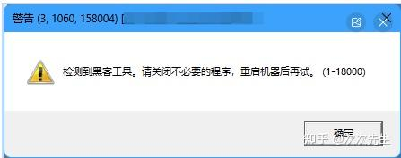

# 魔改 RenderDoc 截帧 PC 端《鸣潮》

**标签**：#rendering #graphics #knowledge #reference #renderdoc #anti-bot #hook #windows
**来源**：[知乎专栏 - 魔改RenderDoc截帧PC端《鸣潮》](https://zhuanlan.zhihu.com/p/2020093825977168718)
**收录日期**：2026-04-04
**来源日期**：未知（知乎文章）
**更新日期**：2026-04-04
**状态**：⚠️ 待验证
**可信度**：⭐⭐⭐（社区经验，有详细代码路径但未实测）
**适用版本**：RenderDoc v1.x | Windows | PC 端鸣潮

### 概要

通过修改 RenderDoc 源码中的所有特征字符串（`renderdoc` → `rendertest`），绕过《鸣潮》对 RenderDoc 的检测（包括文件特征码扫描和 CrashSight 检测），实现在 PC 端使用 RenderDoc 进行截帧和 Shader 分析。

### 背景

《鸣潮》的检测机制：
- **特征码扫描**：直接检测 RenderDoc 的文件名、DLL 名称、注册表项等特征字符串，即使不启动注入也会触发
- **CrashSight 检测**：腾讯的崩溃监控系统，会检测进程注入行为，需要修改注入方式（使用 `SetThreadContext` 注入）




### 前期准备

- RenderDoc 源码（v1.x 分支）：https://github.com/baldurk/renderdoc/tree/v1.x
- Visual Studio 2022 + v140 工具集组件（RenderDoc 默认使用 VS2015 v140）
- 替代方案：在源码中手动更新平台工具集到 v143

### 内容

#### 一、修改 RenderDoc 特征（核心：全部 `renderdoc` → `rendertest`）

**1. 核心 DLL — Replay Marker 符号**

| 文件路径 | 行号 | 修改前 | 修改后 |
|----------|------|--------|--------|
| `renderdoc/api/replay/renderdoc_replay.h` | 52 | `renderdoc__replay__marker()` | `rendertest__replay__marker()` |

> 这是最核心的修改。`REPLAY_PROGRAM_MARKER()` 宏定义所有 RenderDoc 可执行文件导出的符号，DLL 通过动态查找该符号判断当前是 replay 环境还是目标游戏进程。

**2. 进程创建与注入 — 可执行文件路径硬编码**

| 文件路径 | 行号 | 修改前 | 修改后 |
|----------|------|--------|--------|
| `renderdoc/os/win32/win32_process.cpp` | 933 | `L"\\Win32\\Development\\renderdoccmd.exe"` | `L"\\Win32\\Development\\rendertestcmd.exe"` |
| `renderdoc/os/win32/win32_process.cpp` | 946 | `L"\\Win32\\Release\\renderdoccmd.exe"` | `L"\\Win32\\Release\\rendertestcmd.exe"` |
| `renderdoc/os/win32/win32_process.cpp` | 961 | `L"\\x86\\renderdoccmd.exe"` | `L"\\x86\\rendertestcmd.exe"` |
| `renderdoc/os/win32/win32_process.cpp` | 973 | `L"\\x64\\Development\\renderdoccmd.exe"` | `L"\\x64\\Development\\rendertestcmd.exe"` |
| `renderdoc/os/win32/win32_process.cpp` | 986 | `L"\\x64\\Release\\renderdoccmd.exe"` | `L"\\x64\\Release\\rendertestcmd.exe"` |
| `renderdoc/os/win32/win32_process.cpp` | 1006 | `L"\\renderdoccmd.exe"` | `L"\\rendertestcmd.exe"` |

**3. Shim DLL 路径硬编码**

| 文件路径 | 行号 | 修改前 | 修改后 |
|----------|------|--------|--------|
| `renderdoc/os/win32/win32_process.cpp` | 1783 | `"\\renderdocshim64.dll"` | `"\\rendertestshim64.dll"` |
| `renderdoc/os/win32/win32_process.cpp` | 1792 | `"\\Win32\\Development\\renderdocshim32.dll"` | `"\\Win32\\Development\\rendertestshim32.dll"` |
| `renderdoc/os/win32/win32_process.cpp` | 1803 | `"\\Win32\\Release\\renderdocshim32.dll"` | `"\\Win32\\Release\\rendertestshim32.dll"` |
| `renderdoc/os/win32/win32_process.cpp` | 1811 | `"\\x86\\renderdocshim32.dll"` | `"\\x86\\rendertestshim32.dll"` |
| `renderdoc/os/win32/win32_process.cpp` | 1818 | `"\\renderdocshim32.dll"` | `"\\rendertestshim32.dll"` |

**4. 进程白名单 — 避免注入到 RenderTest 自身**

| 文件路径 | 行号 | 修改前 | 修改后 |
|----------|------|--------|--------|
| `renderdoc/os/win32/sys_win32_hooks.cpp` | 342 | `"renderdoccmd.exe"` \|\| `app.contains("qrenderdoc.exe")` | `"rendertestcmd.exe"` \|\| `app.contains("qrendertest.exe")` |
| `renderdoc/os/win32/sys_win32_hooks.cpp` | 351 | `"renderdoccmd.exe"` \|\| `cmd.contains("qrenderdoc.exe")` | `"rendertestcmd.exe"` \|\| `cmd.contains("qrendertest.exe")` |

**5. 崩溃处理 — 命名内核对象**

| 文件路径 | 行号 | 修改前 | 修改后 |
|----------|------|--------|--------|
| `renderdoccmd/renderdoccmd_win32.cpp` | 603 | `"RENDERDOC_CRASHHANDLE"` | `"RENDERTEST_CRASHHANDLE"` |
| `renderdoccmd/renderdoccmd_win32.cpp` | 818 | `GetModuleHandleA("renderdoc.dll")` | `GetModuleHandleA("rendertest.dll")` |
| `core/crash_handler.h` | 62 | `"RenderDoc\\dumps\\a"` | `"RenderTest\\dumps\\a"` |
| `core/crash_handler.h` | 168 | `"RenderDocBreakpadServer%llu"` | `"RenderTestBreakpadServer%llu"` |

**6. 文件路径与注册表**

| 文件路径 | 行号 | 修改前 | 修改后 |
|----------|------|--------|--------|
| `renderdoc/os/win32/win32_stringio.cpp` | 289 | `"/qrenderdoc.exe"` | `"/qrendertest.exe"` |
| `renderdoc/os/win32/win32_stringio.cpp` | 300 | `"/../qrenderdoc.exe"` | `"/../qrendertest.exe"` |
| `renderdoc/os/win32/win32_stringio.cpp` | 316 | `L"RenderDoc.RDCCapture.1\\DefaultIcon"` | `L"RenderTest.RDCCapture.1\\DefaultIcon"` |
| `renderdoc/os/win32/win32_stringio.cpp` | 358 | `L"RenderDoc\\%ls_..."` | `L"RenderTest\\%ls_..."` |
| `renderdoc/os/win32/win32_stringio.cpp` | 367 | `L"RenderDoc\\%ls_..."` | `L"RenderTest\\%ls_..."` |

**7. OpenGL 窗口类名**

| 文件路径 | 行号 | 修改前 | 修改后 |
|----------|------|--------|--------|
| `driver/gl/wgl_platform.cpp` | 28 | `L"renderdocGLclass"` | `L"rendertestGLclass"` |

**8. 全局 Hook 共享内存名称**

| 文件路径 | 行号 | 修改前 | 修改后 |
|----------|------|--------|--------|
| `renderdocshim/renderdocshim.h` | 36 | `"RenderDocGlobalHookData64"` | `"RenderTestGlobalHookData64"` |
| `renderdocshim/renderdocshim.h` | 39 | `"RenderDocGlobalHookData32"` | `"RenderTestGlobalHookData32"` |

**9. 资源文件**

| 文件路径 | 行号 | 修改前 | 修改后 |
|----------|------|--------|--------|
| `data/renderdoc.rc` | 87 | `"Core DLL for RenderDoc"` | `"Core DLL for RenderTest"` |
| `data/renderdoc.rc` | 92 | `"ProductName", "RenderDoc"` | `"ProductName", "RenderTest"` |

**10. Qt UI 层**

| 文件路径 | 行号 | 修改前 | 修改后 |
|----------|------|--------|--------|
| `qrenderdoc/renderdocui_stub.cpp` | 62 | `L"qrenderdoc.exe"` | `L"qrendertest.exe"` |
| `qrenderdoc/Code/qrenderdoc.cpp` | 173 | `"qrenderdoc"` | `"qrendertest"` |
| `qrenderdoc/Code/qrenderdoc.cpp` | 198 | `"QRenderDoc initialising."` | `"QRenderTest initialising."` |
| `qrenderdoc/Code/qrenderdoc.cpp` | 267 | `"QRenderDoc"` | `"QRenderTest"` |
| `qrenderdoc/Code/qrenderdoc.cpp` | 330 | `"Qt UI for RenderDoc"` | `"Qt UI for RenderTest"` |
| `qrenderdoc/Code/qrenderdoc.cpp` | 393 | `"QRenderDoc v%s"` | `"QRenderTest v%s"` |
| `qrenderdoc/Windows/MainWindow.cpp` | 1217 | `"RenderDoc "` | `"RenderTest "` |

**11. VS 项目文件（编译输出名 + UAC 提权）**

| 文件路径 | 属性 | 修改类型 | 修改前 | 修改后 |
|----------|------|----------|--------|--------|
| `qrenderdoc/renderdocui_stub.vcxproj` | RootNamespace | 修改 | `renderdocui_stub` | `rendertestui_stub` |
| `qrenderdoc/renderdocui_stub.vcxproj` | ProjectName | 修改 | `renderdocui_stub` | `rendertestui_stub` |
| `qrenderdoc/renderdocui_stub.vcxproj` | PrimaryOutput | 新增 | (无) | `rendertestui` |
| `qrenderdoc/renderdocui_stub.vcxproj` | TargetName | 新增 | (无) | `rendertestui` |
| `qrenderdoc/renderdocui_stub.vcxproj` | UACExecutionLevel | 新增 | (无) | `RequireAdministrator` |

#### 二、CrashSight 检测绕过

《鸣潮》采用 CrashSight（腾讯崩溃监控）检测进程注入行为。需要修改注入方式：

- **修改文件**：`renderdoc/os/win32/win32_process.cpp`
- **方案**：使用 `SetThreadContext` 注入替代默认注入方式
- **关键代码位置**：

```cpp
uintptr_t loc = FindRemoteDLL(pi.dwProcessId, STRINGIZE(RDOC_BASE_NAME) ".dll");
CloseHandle(hProcess);
hProcess = NULL;
if(loc != 0)
```

### 关键要点

1. **全局替换策略**：将所有 `renderdoc` 相关字符串替换为 `rendertest`，确保游戏无法通过特征码匹配
2. **UAC 提权**：VS 项目文件需要新增 `RequireAdministrator` 以获得进程注入权限
3. **CrashSight 绕过**：仅改特征码不够，还需要改注入方式（`SetThreadContext`）
4. **源码分支**：使用 v1.x 分支（稳定版），不是 main 分支

### 图片资源清单

| # | 文件名 | 说明 |
|---|--------|------|
| 1 | `01-article-cover.jpg` | 文章封面（代码截图） |
| 2 | `02-wuwa-hacktool-detection.jpg` | 鸣潮检测到"黑客工具"的提示截图 |
| 3 | `03-qrcode-simulator.jpg` | 模拟器方案参考二维码 |

> 图片存放于 `../assets/modified-renderdoc-wuwa-capture/`

### 参考链接

- [魔改RenderDoc截帧PC端《鸣潮》](https://zhuanlan.zhihu.com/p/2020093825977168718) - 原文
- [RenderDoc v1.x 源码](https://github.com/baldurk/renderdoc/tree/v1.x) - GitHub

### 相关记录

- [endfield-rendering-study.md](./endfield-rendering-study.md) - 终末地角色渲染技术分析（同为游戏渲染逆向分析）
- [RenderDoc 抓帧 Steam 及带启动器游戏通解](https://mos9527.com/posts/cg/renderdoc-inject/) - 另一种 RenderDoc 注入方案

### 验证记录

- [2026-04-04] 初次记录，来源：知乎专栏文章，完整抓取含图片，未实测验证
