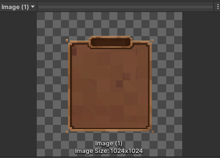
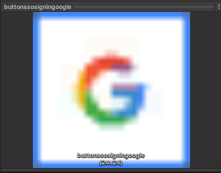
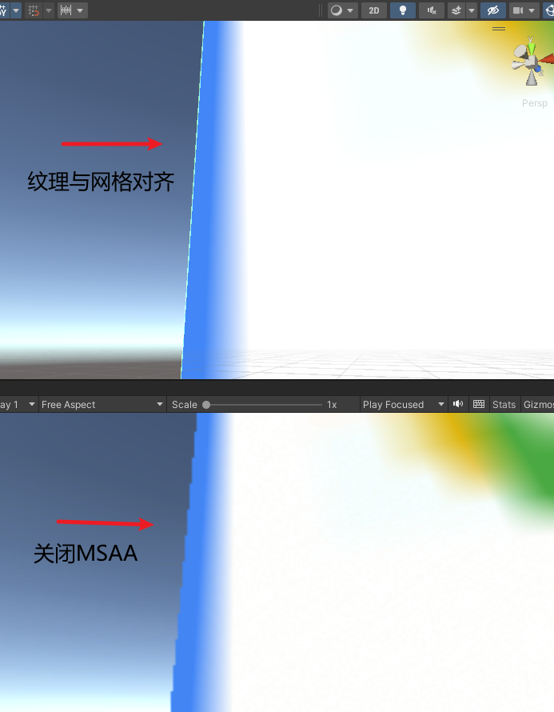
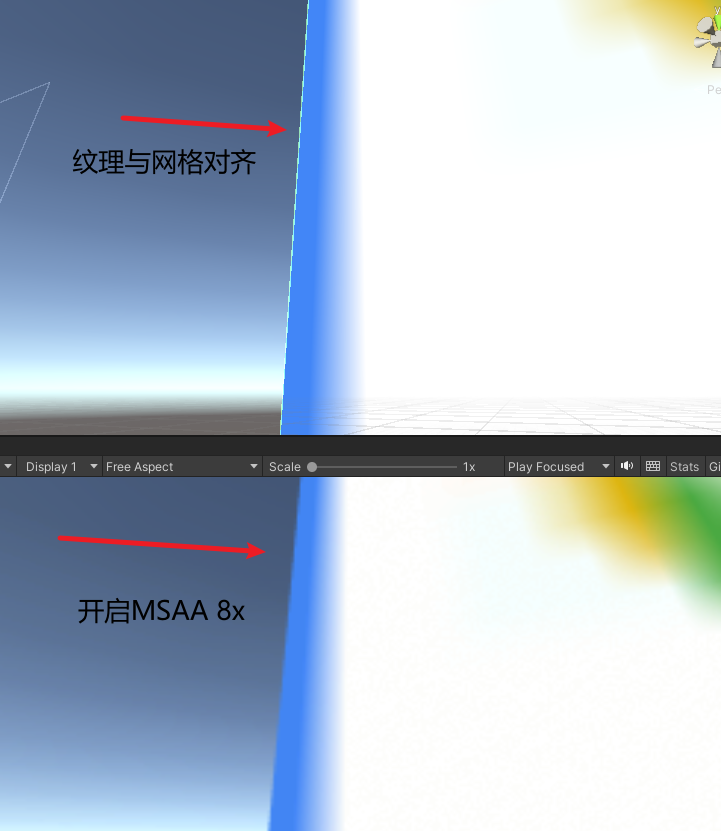
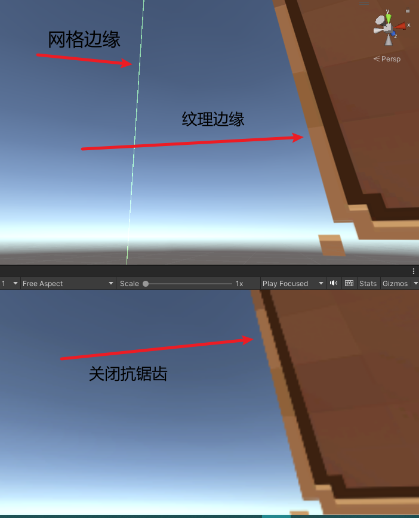
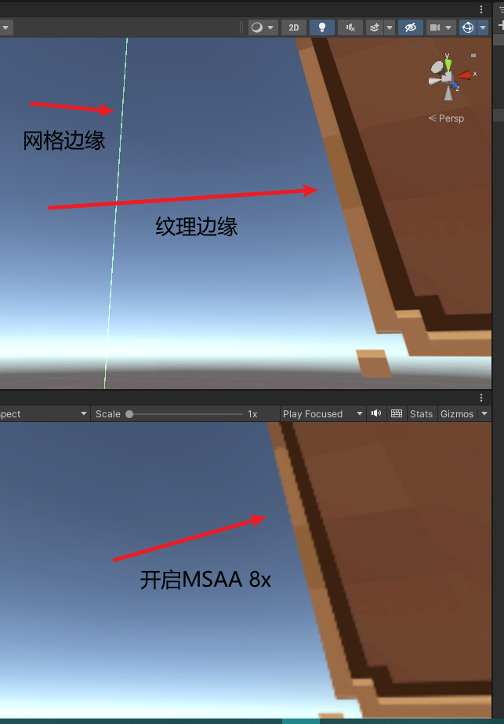
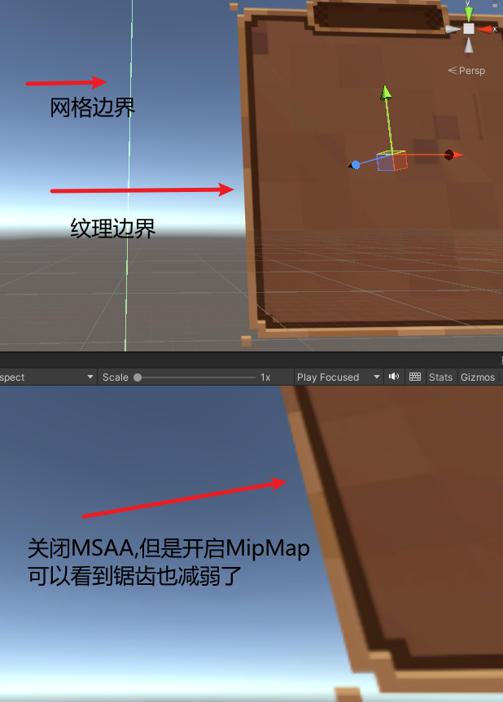

# MSAA 与纹理显示效果优化 — 纹理边缘对齐对抗锯齿的影响

**标签**：#unity #graphics #rendering #texture #performance #knowledge
**来源**：实践总结（项目内部文档）
**收录日期**：2026-03-31
**状态**：✅ 已验证
**可信度**：⭐⭐⭐⭐（实地分析验证）
**适用版本**：Unity 2020+（URP / Built-in 均适用）

### 概要

MSAA（多重采样抗锯齿）只对**多边形（Mesh）边缘**产生抗锯齿效果，**不会**对纹理（Texture）的 Alpha 镂空边缘生效。因此，纹理应尽量与网格边界对齐以获得 MSAA 的抗锯齿效果；若无法对齐，只能通过 MipMap 来缓解锯齿（代价是增加内存占用）。

### 内容

#### 问题场景

在 Unity 项目中，UI 元素或场景中的面片使用纹理时，常见两种纹理裁切方式：

1. **纹理与网格边界完全对齐**：纹理内容完全填满 Mesh，边缘由多边形形状决定
2. **透明度（Alpha）镂空**：纹理通过 Alpha 通道裁切出形状，Mesh 比实际可见区域大

#### 核心结论

| 对齐方式 | MSAA 效果 | 备选方案 | 内存影响 |
|----------|-----------|----------|----------|
| 纹理与网格边界对齐 | ✅ 有效（平滑多边形边缘） | — | 无额外开销 |
| Alpha 镂空（纹理与网格不对齐） | ❌ 无效（锯齿仍在） | MipMap | 增加约 33% 纹理内存 |

**原理**：MSAA 的采样点分布在像素覆盖的三角形边缘，它检测的是**几何图元是否覆盖子采样点**，而非纹理内容。因此 Alpha 测试 / Alpha Blend 产生的"纹理边缘"完全不受 MSAA 影响。

#### 对比验证

##### 纹理素材

**纹理 1**：透明度抠出来的 UI 边界

**纹理 2**：小图标纹理（24×24）

##### 场景 A：纹理与网格对齐

**关闭 MSAA** — 可以看到多边形边缘有明显锯齿：

**开启 MSAA 8x** — 多边形边缘被平滑，抗锯齿效果显著：

##### 场景 B：纹理与网格不对齐（Alpha 镂空）

**关闭抗锯齿** — 网格边缘和纹理边缘都可以清晰看到，纹理边缘有明显锯齿：

**开启 MSAA 8x** — 网格边缘被平滑了，但**纹理边缘的锯齿依然存在**：

##### 场景 C：MipMap 替代方案

**关闭 MSAA，但开启 MipMap** — 可以看到纹理边缘的锯齿也减弱了：

#### 实践建议

1. **优先对齐**：制作 UI 或面片纹理时，尽量让纹理内容与网格边界完全匹配，避免使用 Alpha 镂空来裁切形状
2. **MipMap 兜底**：若无法避免 Alpha 镂空，为该纹理开启 MipMap 以获得一定的抗锯齿效果（内存增加约 33%）
3. **Alpha To Coverage**：部分渲染管线支持 Alpha To Coverage（ATOC），可以让 MSAA 在一定程度上作用于 Alpha 测试边缘，但效果有限且需要额外配置

### 图片资源清单

| # | 文件名 | 说明 | 大小 |
|---|--------|------|------|
| 1 | `01-texture-alpha-cutout-ui.png` | Alpha 镂空的 UI 纹理示例 | 17 KB |
| 2 | `02-texture-small-icon-24x24.png` | 小尺寸图标纹理示例 | 29 KB |
| 3 | `03-texture-aligned-vs-msaa-off.png` | 纹理对齐 + 关闭 MSAA 对比 | 168 KB |
| 4 | `04-texture-aligned-vs-msaa-8x.png` | 纹理对齐 + 开启 MSAA 8x 对比 | 164 KB |
| 5 | `05-texture-not-aligned-msaa-off.png` | 纹理不对齐 + 关闭抗锯齿 | 148 KB |
| 6 | `06-texture-not-aligned-msaa-8x.png` | 纹理不对齐 + 开启 MSAA 8x（锯齿仍在） | 139 KB |
| 7 | `07-texture-not-aligned-mipmap-on.png` | 不对齐 + MipMap 替代方案 | 167 KB |

> 图片存放于 `../assets/msaa-texture-display-optimization/`

### 相关记录

- [渲染管线概览](./rendering-pipeline-overview.md) - MSAA 在渲染管线中的位置
- [色带与抖动](./color-banding-dither.md) - 另一种常见的视觉质量问题

### 验证记录

- [2026-03-31] 初次记录，来源：项目内部文档《MSAA与纹理相关的显示效果优化.doc》，含 7 张 Unity 编辑器实际截图验证
