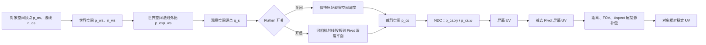
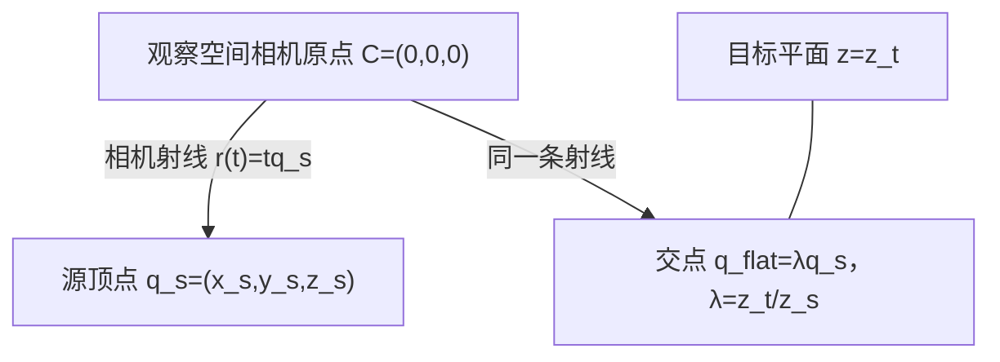
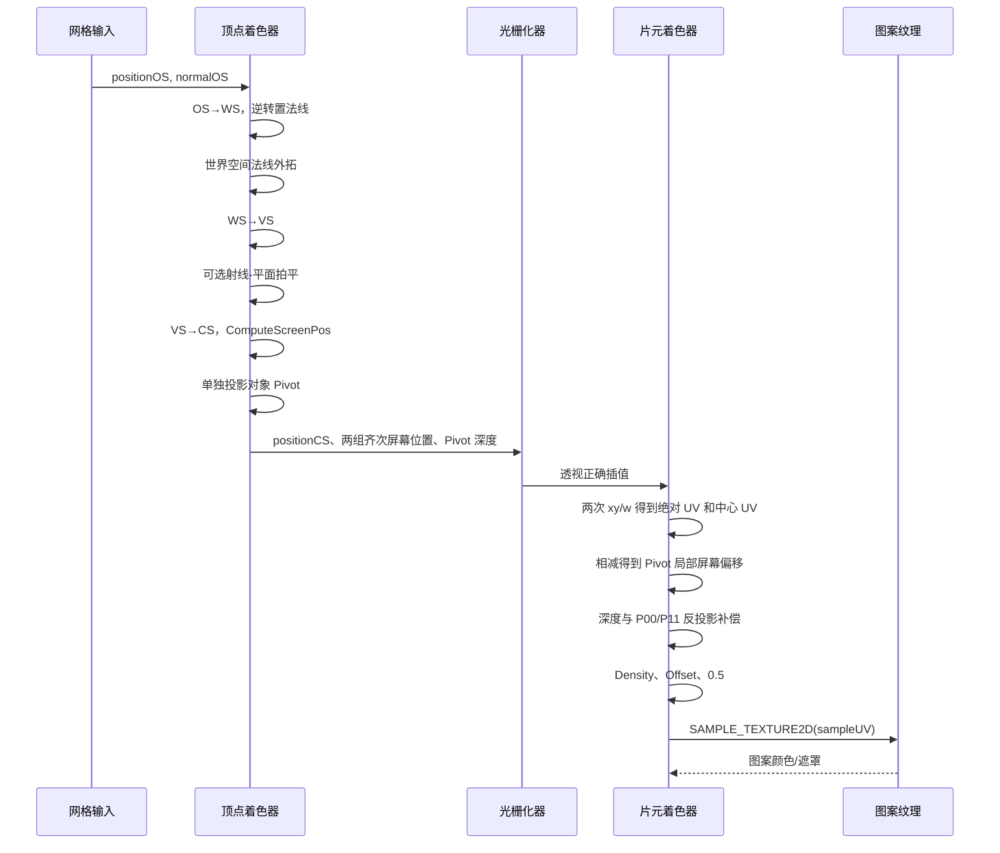

# Unity 保持轮廓的视空间拍平与对象中心稳定屏幕 UV

**标签**：#unity #graphics #shader #urp #hlsl #vr #math #experience
**来源**：原创实践整理 - Unity URP 移动端 Shader 原型与数值测试
**收录日期**：2026-08-06
**来源日期**：2026-08-06
**更新日期**：2026-08-06
**状态**：✅ 已验证
**可信度**：⭐⭐⭐⭐（Unity 运行时编译、画面切换与数学数值验证）
**适用版本**：Unity 2022.3 / URP 14；数学原理适用于常规透视与正交渲染管线

### 概要

本文给出一种沿相机射线投影、能够保持原屏幕轮廓的视空间拍平方法，以及一种以对象 Pivot 为中心、同时补偿距离、FOV 与宽高比的稳定屏幕 UV；二者可组合使用，也可通过独立开关直接对比。

1. **保持投影轮廓的视空间拍平**：顶点沿相机射线投影到对象 Pivot 所在的等深平面，而不是只修改视空间 Z。该变换保持顶点的透视比值以及投影后的 NDC XY，因此拍平前后的屏幕外轮廓一致。
2. **对象 Pivot 居中的稳定屏幕 UV**：以对象空间原点投影到屏幕的位置作为 UV 中心，用对象中心的观察空间深度补偿距离，用投影矩阵的 `P00`、`P11` 补偿视场角与宽高比，从而让纹理采样密度相对对象保持稳定。

实现同时保留 `_FlattenEnabled` 独立开关：关闭时模型维持原始深度形状，开启时几何被拍到 Pivot 深度；两种模式共用同一套对象中心屏幕 UV，便于直接对比效果。

### 内容

## 一、问题定义与设计目标

目标 Shader 先沿顶点法线将模型外拓，再在外拓结果上建立一种不依赖普通模型 UV 的程序化屏幕坐标。它需要满足以下条件：

- 外拓距离使用世界空间单位，避免对象缩放直接改变视觉厚度。
- 屏幕 UV 的中心跟随对象，而不是固定在屏幕中心。
- 相机拉近或拉远时，纹理相对对象的重复密度尽量不变。
- 修改 FOV 或画面宽高比时，X、Y 方向的采样尺度不被拉伸。
- 拍平是独立开关，关闭时不改变原始几何深度。
- 开启拍平后，所有顶点具有与对象 Pivot 相同的视空间 Z。
- 拍平前后保持投影后的外轮廓，而不是让模型在屏幕上收缩或膨胀。
- 适用于移动端 URP，并兼容 GPU Instancing 与现代 XR 单通道实例化/Multiview。

本文讨论的是顶点变换和程序化 UV 坐标，不限定最终片元效果。稳定 UV 可以用于纹理图案、流动噪声、溶解、火焰、气体、扫描线或其他对象绑定的屏幕空间效果。

## 二、坐标空间、符号与约定

### 2.1 空间流转



### 2.2 坐标空间定义

| 缩写 | 全称 | 坐标原点与轴 | 本文用途 |
|---|---|---|---|
| OS | Object Space，对象空间 | 原点是模型 Pivot，轴随对象 Transform 旋转 | 读取网格顶点和法线；定义 UV 中心 |
| WS | World Space，世界空间 | 原点和轴由 Unity 世界定义 | 以世界单位进行法线外拓 |
| VS | View Space，观察空间 | 原点是当前眼睛/相机位置 | 定义相机射线、深度平面和拍平 |
| CS | Clip Space，裁剪空间 | 投影矩阵变换后的齐次坐标 | 提供透视除法前的 `xyzw` |
| NDC | Normalized Device Coordinates | `CS.xyz / CS.w` | 表示投影后、映射到屏幕前的位置 |
| Screen UV | 归一化屏幕坐标 | 左下/左上原点由平台宏处理，常用范围为 0 到 1 | 片元阶段构造对象相对程序化 UV |

### 2.3 数学符号

| 符号 | 类型 | 空间 | 单位 | 含义 |
|---|---:|---|---|---|
| \(p_{os}\) | 三维点 | OS | 模型单位 | 原始顶点位置 |
| \(n_{os}\) | 三维方向 | OS | 无量纲 | 原始顶点法线 |
| \(p_{ws}\) | 三维点 | WS | 世界单位 | 原始顶点的世界位置 |
| \(n_{ws}\) | 三维单位方向 | WS | 无量纲 | 正确处理缩放后的世界法线 |
| \(p^{exp}_{ws}\) | 三维点 | WS | 世界单位 | 法线外拓后的世界位置 |
| \(q_s=(x_s,y_s,z_s)\) | 三维点 | VS | 世界单位 | 拍平前的源顶点 |
| \(c=(x_c,y_c,z_c)\) | 三维点 | VS | 世界单位 | 对象空间原点在观察空间的位置 |
| \(z_t\) | 标量 | VS | 世界单位 | 拍平目标平面的 Z |
| \(\lambda\) | 标量 | 无 | 无量纲 | 相机射线上的缩放参数 |
| \(P\) | 4×4 矩阵 | VS→CS | 无量纲 | 当前眼睛使用的投影矩阵 |
| \(P_{00}\) | 标量 | 投影矩阵 | 无量纲 | 水平方向投影缩放系数 |
| \(P_{11}\) | 标量 | 投影矩阵 | 无量纲 | 垂直方向投影缩放系数 |
| \(d_c\) | 标量 | VS | 世界单位 | 相机到 Pivot 的正值观察深度，代码中为 `abs(z_c)` |
| \(u\) | 二维点 | Screen UV | 无量纲 | 当前片元的绝对屏幕 UV |
| \(u_c\) | 二维点 | Screen UV | 无量纲 | Pivot 的绝对屏幕 UV |
| \(\Delta u\) | 二维向量 | Screen UV | 无量纲 | 当前片元相对 Pivot 的屏幕偏移 |
| \(q\) | 二维向量 | Pivot 深度平面 | 世界单位 | 反投影补偿后的对象相对坐标 |
| \(\rho\) | 标量 | UV | 周期/世界单位 | `_ScreenUVDensity`，纹理重复密度 |

Unity 常规相机的观察空间前方通常位于负 Z，因此可把正值眼深记为：

```text
d = -z_v
```

工程代码使用 `abs(z_v)`，是因为正常可见物体位于相机前方，此时 `abs(z_v)` 与 `-z_v` 相同。物体位于相机后方或穿过相机平面时，投影本身已经进入无效或退化区域，不属于本技巧的正常工作范围。

## 三、材质公开参数逐项说明

| 参数 | HLSL 类型 | ShaderLab 默认值/范围 | 单位 | 含义与影响 |
|---|---|---|---|---|
| `_BaseMap` | `Texture2D` | 白色纹理 | 无量纲 | 使用稳定 UV 采样的图案或遮罩。纹理 Wrap Mode 决定 UV 超出 0 到 1 后是重复、钳制还是镜像。需要连续重复图案时通常使用 Repeat。 |
| `sampler_BaseMap` | `SamplerState` | 由 Unity/纹理导入设置提供 | 无量纲 | 定义 `_BaseMap` 的过滤和寻址方式。它不是材质面板中的独立数值参数，但直接决定采样结果。 |
| `_Color` | `half4` | `(0,0,0,1)` | 线性或 Gamma 颜色值 | 最终颜色与透明度乘数。RGB 调色，A 控制整体透明度。颜色运算使用 `half`，因为移动端通常不需要 32 位颜色精度。 |
| `_NormalExpand` | `float` | `0.02`，面板范围 `0..0.5` | 世界单位 | 沿世界空间单位法线的外拓距离。值为 0 时不外拓；正值向外；负值会向内收缩，但面板范围默认禁止负值。 |
| `_FlattenEnabled` | `float` | `0`，Toggle 通常写入 0 或 1 | 无量纲 | 拍平权重。代码使用 `saturate`，所以小于 0 按 0、大于 1 按 1；0 保持原深度，1 拍到 Pivot 深度，0 到 1 之间可以连续混合。 |
| `_ScreenUVDensity` | `float` | `1` | UV 周期/世界单位 | 每个反投影平面单位包含多少次纹理周期。值越大图案越密；0 会让整个对象采样同一个 UV；负值会同时翻转 UV 方向。 |
| `_ScreenUVOffset` | `float4` | `(0,0,0,0)` | UV 周期 | 只使用 `.xy` 平移程序化 UV；`.z`、`.w` 保留，当前实现不参与计算。动画该值可以产生整体流动，但不会改变中心与采样密度。 |
| `_Cull` | ShaderLab 枚举数值 | `1` | 枚举 | `0=Off`、`1=Front`、`2=Back`。传统反向外壳描边通常剔除正面，即使用 `Front`，只绘制外拓后的背面壳层。 |

### 3.1 `_ScreenUVDensity` 的物理含义

最终采样坐标定义为：

```text
sampleUV = objectRelativeUV * _ScreenUVDensity
         + _ScreenUVOffset.xy
         + 0.5
```

若 `objectRelativeUV.x` 的单位是世界单位，且 `_ScreenUVDensity = 4`，则沿反投影平面 X 方向移动 1 个世界单位会跨越 4 个纹理周期。纹理每个周期对应 UV 增量 1，因此 `_ScreenUVDensity` 可以理解为“每单位长度的重复次数”，而其倒数是“一次重复覆盖的长度”：

```text
patternLength = 1 / _ScreenUVDensity
```

当密度接近 0 时倒数失去意义，但直接采样公式仍然有效。

### 3.2 为什么在末尾加 `0.5`

当前片元恰好落在 Pivot 屏幕位置时：

```text
screenUV - centerScreenUV = 0
objectRelativeUV = 0
```

加上 `(0.5, 0.5)` 后，Pivot 对应纹理中心。删除该常量则 Pivot 对应纹理左下角 `(0,0)`。这只是采样原点约定，不参与距离、FOV 或宽高比补偿。

## 四、第一步：世界空间法线外拓

### 4.1 位置变换

对象空间顶点通过对象到世界矩阵 \(M\) 变换：

```text
p_ws = M * float4(p_os, 1)
```

代码使用：

```hlsl
float3 positionWS = TransformObjectToWorld(input.positionOS.xyz);
```

位置的齐次分量为 1，因此矩阵中的旋转、缩放和平移都会生效。

### 4.2 法线为什么不能直接乘对象到世界矩阵

法线描述的是表面的垂直方向。对象存在非均匀缩放时，直接使用 \(M n\) 会破坏法线与切平面的垂直关系。正确数学形式是：

```text
n_ws = normalize(transpose(inverse(M_3x3)) * n_os)
```

其中：

- `inverse` 抵消对象缩放对垂直关系的破坏。
- `transpose` 让变换结果仍与变换后的切平面垂直。
- `normalize` 把结果恢复为单位向量，使外拓距离只由 `_NormalExpand` 决定。

URP 封装函数：

```hlsl
float3 normalWS = normalize(
    TransformObjectToWorldNormal(input.normalOS));
```

### 4.3 外拓公式

```text
p_exp_ws = p_ws + n_ws * _NormalExpand
```

代码：

```hlsl
float3 expandedPositionWS =
    positionWS + normalWS * _NormalExpand;
```

因为 `normalWS` 长度为 1，`_NormalExpand` 就是实际世界空间位移长度。若法线未归一化，外拓宽度会额外乘上法线长度，导致模型不同区域厚度不一致。

### 4.4 外拓阶段内部变量

| 变量 | 类型 | 空间 | 单位 | 含义 |
|---|---:|---|---|---|
| `input.positionOS` | `float4` | OS | 模型单位 | 网格顶点；`.xyz` 是位置，位置语义隐含齐次分量 1 |
| `input.normalOS` | `float3` | OS | 无量纲 | 网格顶点法线 |
| `positionWS` | `float3` | WS | 世界单位 | 尚未外拓的世界位置 |
| `normalWS` | `float3` | WS | 无量纲 | 归一化世界法线 |
| `expandedPositionWS` | `float3` | WS | 世界单位 | 外拓后、拍平前的位置 |
| `objectOriginWS` | `float3` | WS | 世界单位 | 对象空间 `(0,0,0)` 经过对象到世界变换后的 Pivot 位置 |

Pivot 是模型导出时定义的对象空间原点，不一定等于 Renderer Bounds 中心或视觉中心。如果美术资产的 Pivot 偏离主体，屏幕 UV 中心和拍平深度也会跟随这个偏移。需要视觉中心时，应在模型、Transform 或 Shader 参数层提供一个明确的中心偏移，而不能假设 Pivot 永远位于几何中心。

## 五、第二步：保持轮廓的视空间拍平

### 5.1 为什么“只改 Z”会改变屏幕轮廓

设外拓后的观察空间顶点为：

```text
q_s = (x_s, y_s, z_s)
```

透视投影的核心关系可以简化为：

```text
x_ndc ∝ x_s / z_s
y_ndc ∝ y_s / z_s
```

如果只把 Z 改成 Pivot 深度 \(z_t\)，同时保持 X、Y 不变：

```text
q_wrong = (x_s, y_s, z_t)
```

则投影比例变成：

```text
x'_ndc ∝ x_s / z_t
y'_ndc ∝ y_s / z_t
```

只要 \(z_t \ne z_s\)，屏幕位置就会变化。离相机更近的顶点被推远时会向屏幕中心收缩；更远的顶点被拉近时会向外扩张。因此“Z 相等”本身不能保证轮廓一致。

### 5.2 正确几何解释：相机射线与等深平面相交

观察空间相机位于原点。穿过顶点 \(q_s\) 的射线为：

```text
r(t) = t * q_s
     = (t*x_s, t*y_s, t*z_s)
```

目标平面与相机成像平面平行，并满足：

```text
z = z_t
```

令射线的 Z 分量等于目标深度：

```text
t * z_s = z_t
```

得到交点参数：

```text
t = z_t / z_s
```

记：

```text
lambda = z_t / z_s
```

正确拍平点为：

```text
q_flat = (
    x_s * lambda,
    y_s * lambda,
    z_t
)
```



关键不是把顶点沿相机 Z 轴平移，而是让它沿“相机到该顶点”的射线移动。这样拍平点与原顶点位于同一条投影视线上。

### 5.3 轮廓保持证明

代入 \(\lambda=z_t/z_s\)：

```text
x_flat / z_flat
= (x_s * z_t / z_s) / z_t
= x_s / z_s
```

同理：

```text
y_flat / z_flat = y_s / z_s
```

因此拍平前后：

```text
x_flat / z_flat = x_s / z_s
y_flat / z_flat = y_s / z_s
```

透视投影后的 NDC XY 不变，顶点在屏幕上的位置不变。每个三角形的三个投影顶点均不变，所以在未触发近裁剪、远裁剪或相机平面退化的正常情况下，三角形覆盖范围与对象外轮廓也保持一致。

### 5.4 对非对称透视矩阵和 XR 的证明

常规非对称透视矩阵的 X 分量可以写成：

```text
clipX = P00 * x + P02 * z
clipW = -z
```

所以：

```text
ndcX = clipX / clipW
     = (P00*x + P02*z) / (-z)
```

`P02` 表示非对称投影的水平偏移。XR 左眼和右眼常使用不同的 `P02`。拍平时 X、Z 同时乘以 \(\lambda\)：

```text
ndcX_flat
= (P00*lambda*x + P02*lambda*z) / (-lambda*z)
= (P00*x + P02*z) / (-z)
= ndcX
```

Y 方向对 `P11`、`P12` 同理。由此可见，只要使用当前眼睛的 View/Projection 矩阵，沿相机射线拍平同样适用于非对称双眼视锥。

这里假设的是 Unity 常规透视矩阵：裁剪空间 X、Y 不包含独立于视空间位置的平移常量，`clipW` 与视空间 Z 成比例。普通透视相机和常见 XR 非对称投影满足该条件。

### 5.5 独立开关与连续权重

定义：

```text
w_f = saturate(_FlattenEnabled)
```

其中：

- `_FlattenEnabled <= 0` 时，`w_f = 0`。
- `_FlattenEnabled >= 1` 时，`w_f = 1`。
- 中间值保留，可用于连续观察拍平过程。

目标深度使用线性插值：

```text
z_t = lerp(z_s, z_c, w_f)
```

当开关关闭：

```text
w_f = 0
z_t = z_s
lambda = z_s / z_s = 1
```

顶点完全不变。

当开关开启：

```text
w_f = 1
z_t = z_c
lambda = z_c / z_s
```

所有顶点最终都具有 Pivot 的观察空间 Z。

中间权重仍然使用同一套 \(\lambda=z_t/z_s\) 同步缩放 XY，所以任意权重下都保持原投影位置，而不是只有 0 和 1 两端正确。

### 5.6 除零保护参数

当顶点接近相机平面时，`z_s` 接近 0，直接计算 `z_t / z_s` 会产生极大数值、无穷大或 NaN。实现使用：

```hlsl
float safeSourceDepthVS =
    max(abs(sourceDepthVS), 1e-4) *
    (sourceDepthVS < 0.0 ? -1.0 : 1.0);
```

各部分含义：

| 表达式 | 含义 |
|---|---|
| `abs(sourceDepthVS)` | 取深度绝对值，便于与正的最小阈值比较 |
| `1e-4` | 最小安全深度 \(\varepsilon=0.0001\)；单位与观察空间位置一致 |
| `max(abs(z), epsilon)` | 保证除数绝对值不小于阈值 |
| 三元表达式 | 恢复源 Z 的正负号，防止点被无意翻转到相机另一侧 |

`1e-4` 不是视觉参数，而是数值安全参数。它应显著小于正常近裁剪距离。若项目世界尺度非常小，应按实际单位调整；但进入相机平面附近的几何仍应通过裁剪或业务约束处理，不能依赖 epsilon 产生合理画面。

### 5.7 正交相机为何不同

正交投影没有透视除法带来的“近大远小”。其屏幕 X、Y 与观察空间 Z 无关：

```text
ndcX = P00*x + P03
ndcY = P11*y + P13
```

因此正交相机拍平只需改变 Z，不能再按 `z_t/z_s` 缩放 XY，否则会主动破坏原屏幕位置。

Unity 提供：

```hlsl
unity_OrthoParams.w
```

其约定为：

- `0`：透视相机。
- `1`：正交相机。

代码使用：

```hlsl
float viewXYScale = lerp(
    perspectiveScale,
    1.0,
    unity_OrthoParams.w);
```

透视相机选择 `perspectiveScale`，正交相机选择 1。

### 5.8 拍平阶段变量逐项说明

| 变量 | 类型 | 空间/单位 | 定义与用途 |
|---|---:|---|---|
| `expandedPositionVS` | `float3` | VS，世界单位 | 法线外拓后的观察空间顶点；它是拍平源点 |
| `objectOriginVS` | `float3` | VS，世界单位 | Pivot 的观察空间位置 |
| `flattenWeight` | `float` | 无量纲 | `_FlattenEnabled` 经过 `saturate` 后的 0 到 1 权重 |
| `sourceDepthVS` | `float` | VS Z，世界单位 | 源顶点的 `expandedPositionVS.z` |
| `targetDepthVS` | `float` | VS Z，世界单位 | 原始 Z 与 Pivot Z 插值得到的目标平面深度 |
| `safeSourceDepthVS` | `float` | VS Z，世界单位 | 带符号且经过 epsilon 限制的安全除数 |
| `perspectiveScale` | `float` | 无量纲 | `targetDepthVS / safeSourceDepthVS`，即射线参数 \(\lambda\) |
| `viewXYScale` | `float` | 无量纲 | 透视相机使用 \(\lambda\)，正交相机使用 1 |
| `unity_OrthoParams.w` | `float` | 无量纲 | Unity 相机投影类型标志，透视为 0，正交为 1 |
| `positionCS` | `float4` | CS | 最终顶点经过投影后的齐次裁剪坐标 |

## 六、第三步：获取绝对屏幕 UV 与 Pivot 屏幕中心

### 6.1 当前顶点的屏幕位置

最终观察空间顶点投影到裁剪空间：

```hlsl
output.positionCS =
    TransformWViewToHClip(expandedPositionVS);
```

随后：

```hlsl
output.screenPosition =
    ComputeScreenPos(output.positionCS);
```

`ComputeScreenPos` 返回的是用于插值和透视校正的齐次屏幕位置，不是已经完成除法的二维 UV。片元阶段需要：

```hlsl
float2 screenUV =
    input.screenPosition.xy /
    input.screenPosition.w;
```

参数含义：

- `screenPosition.xy`：尚未除以齐次 W 的屏幕坐标分子。
- `screenPosition.w`：透视插值和透视除法所需的齐次分母。
- `screenUV`：除法后常规范围约为 0 到 1 的绝对屏幕 UV。

不能在顶点阶段先除 W，再把二维 UV 当普通线性插值量传入片元阶段，否则三角形内部会丢失正确的透视插值关系。

### 6.2 Pivot 的屏幕位置

对象中心定义为对象空间原点：

```hlsl
float3 objectOriginWS =
    TransformObjectToWorld(float3(0.0, 0.0, 0.0));
float3 objectOriginVS =
    TransformWorldToView(objectOriginWS);
float4 objectOriginCS =
    TransformWViewToHClip(objectOriginVS);
float4 centerScreenPosition =
    ComputeScreenPos(objectOriginCS);
```

片元阶段：

```hlsl
float2 centerScreenUV =
    input.centerScreenPosition.xy /
    input.centerScreenPosition.w;
```

Pivot 随对象 Transform 平移、旋转层级和父级变换移动，因此 `centerScreenUV` 会随对象本身移动，而不会固定在 `(0.5,0.5)` 屏幕中心。

### 6.3 为什么使用屏幕差值而不是绝对屏幕 UV

定义：

```text
deltaUV = screenUV - centerScreenUV
```

当对象整体在屏幕上平移时，`screenUV` 和 `centerScreenUV` 会发生近似相同的平移，二者相减后公共平移被抵消。这样程序化图案以 Pivot 为锚点，不会像投影在玻璃上的屏幕贴纸那样让对象从图案下面滑过。

## 七、第四步：距离、FOV 与宽高比稳定的对象相对屏幕 UV

### 7.1 同深度平面上的透视投影

先考虑当前片元与 Pivot 位于相同观察深度 \(d_c\) 的情况。忽略非对称投影中的常量偏移，因为在 `screenUV - centerScreenUV` 中它会被抵消。

NDC 水平差值为：

```text
deltaNdcX = P00 * deltaX / d_c
```

屏幕 UV 从 NDC 的 `[-1,1]` 映射到 `[0,1]`，范围缩小一半：

```text
deltaUvX = 0.5 * deltaNdcX
         = 0.5 * P00 * deltaX / d_c
```

反解观察空间平面长度：

```text
deltaX = deltaUvX * 2 * d_c / P00
```

Y 方向同理：

```text
deltaY = deltaUvY * 2 * d_c / P11
```

合并成二维形式：

```text
q = (u - u_c) * (2 * d_c) / (P00, P11)
```

这里的乘除均为逐分量运算。

### 7.2 每一个因子的意义

| 因子 | 为什么存在 | 缺少后的现象 |
|---|---|---|
| `screenUV - centerScreenUV` | 消除对象在屏幕上的整体平移，以 Pivot 建立局部原点 | 图案固定在屏幕上，对象移动时从图案下方滑过 |
| `2` | 抵消 NDC `[-1,1]` 到 UV `[0,1]` 时产生的 0.5 缩放 | 结果整体缩小一半，但相对稳定性仍在 |
| `centerViewDepth` | 抵消透视投影中的 `1/d`，让相机远近变化不改变对象上的采样密度 | 远处纹理更密、近处纹理更疏 |
| `/ P00` | 取消水平 FOV 与 Aspect 对 X 投影尺度的影响 | 改变 FOV 或宽高比时，X 密度发生变化 |
| `/ P11` | 取消垂直 FOV 对 Y 投影尺度的影响 | 改变 FOV 时，Y 密度发生变化 |
| `_ScreenUVDensity` | 把恢复出的平面长度转换为用户需要的纹理周期密度 | 只能得到固定的 1 周期/单位比例 |
| `_ScreenUVOffset.xy` | 平移程序化图案或驱动流动动画 | 图案始终从固定相位开始 |
| `+0.5` | 让 Pivot 对应纹理中心 | Pivot 对应纹理 `(0,0)` |

### 7.3 `P00`、`P11` 与 FOV、Aspect 的关系

对常规透视投影：

```text
P11 = cot(verticalFov / 2)
P00 = P11 / aspect
```

其中：

- `verticalFov` 是垂直视场角。
- `aspect = viewportWidth / viewportHeight`。
- `cot` 是余切函数。

FOV 变小时，`cot(FOV/2)` 变大，同样的观察空间长度会占据更多屏幕像素；除以 `P00`、`P11` 正好抵消这种放大。

宽屏下 `P00` 与 `P11` 不相等，因此 X、Y 必须分别补偿。只乘一个 Aspect，或只使用屏幕宽高 `_ScreenParams`，无法同时严格消除 FOV 和非对称投影带来的缩放。

代码通过当前眼睛的投影矩阵直接读取：

```hlsl
float2 projectionScale =
    abs(float2(
        UNITY_MATRIX_P._m00,
        UNITY_MATRIX_P._m11));
```

使用矩阵而不是重新从 Camera FOV 计算，有三个优点：

1. 自动匹配实际渲染使用的投影。
2. 支持非对称投影和 XR 每眼不同的投影矩阵。
3. 避免 CPU 参数与 GPU 相机矩阵不同步。

### 7.4 投影缩放的数值保护

实现使用：

```hlsl
float2 projectionScale = max(
    abs(float2(
        UNITY_MATRIX_P._m00,
        UNITY_MATRIX_P._m11)),
    float2(1e-4, 1e-4));
```

逐项解释：

- `UNITY_MATRIX_P._m00`：当前眼睛投影矩阵第一行第一列，控制 X 投影缩放。
- `UNITY_MATRIX_P._m11`：第二行第二列，控制 Y 投影缩放。
- `abs`：只取尺度大小；屏幕方向翻转由 Unity 的屏幕坐标辅助函数处理。
- `max(..., 1e-4)`：避免异常投影矩阵导致除零。
- `float2(1e-4,1e-4)`：X、Y 分别具有独立的最小安全值。

### 7.5 透视与正交相机统一处理

透视相机使用 Pivot 深度补偿：

```text
projectionDepth = d_c
```

正交相机的屏幕大小不随深度变化，所以不应乘实际深度：

```text
projectionDepth = 1
```

代码：

```hlsl
float projectionDepth = lerp(
    max(input.centerViewDepth, 1e-4),
    1.0,
    unity_OrthoParams.w);
```

正交投影中：

```text
deltaUvX = 0.5 * P00 * deltaX
```

仍然可以通过：

```text
deltaX = deltaUvX * 2 / P00
```

恢复观察空间平面长度，所以统一公式只需把深度因子设为 1。

### 7.6 未拍平模型的精度边界

不开启拍平时，模型表面不同点通常具有不同深度。此时使用统一的 Pivot 深度 \(d_c\) 得到：

```text
q_x = deltaUvX * 2 * d_c / P00
```

它表示“把当前屏幕偏移反投影到 Pivot 深度平面”后的坐标，而不是原始曲面上的真实弧长。

结论分为两种：

- **开启拍平**：所有点与 Pivot 同深度，公式在标准投影假设下是精确的平面坐标恢复。
- **关闭拍平**：公式仍能抵消对象整体远近、FOV 和 Aspect 的主要变化，并保持 Pivot 锚定；但厚模型上不同深度层仍保留透视视差，因此它不是曲面参数化，也不保证每个三维表面位置拥有严格恒定的世界空间纹素密度。

这项限制是有意保留的：关闭拍平意味着保留真实三维深度和透视形状。若要求厚模型表面每处都严格按世界长度采样，应改用世界空间三平面映射、局部空间映射或专门的曲面 UV，而不是屏幕反投影坐标。

### 7.7 稳定 UV 阶段变量逐项说明

| 变量 | 类型 | 空间/单位 | 定义与用途 |
|---|---:|---|---|
| `screenPosition` | `float4` | 齐次屏幕坐标 | 当前顶点经 `ComputeScreenPos` 处理后的值，供片元透视插值 |
| `centerScreenPosition` | `float4` | 齐次屏幕坐标 | Pivot 的齐次屏幕位置；同一对象各顶点写入相同中心 |
| `centerViewDepth` | `float` | 世界单位 | `abs(objectOriginVS.z)`，相机到 Pivot 的正值观察深度 |
| `screenUV` | `float2` | Screen UV | 当前片元绝对屏幕坐标 |
| `centerScreenUV` | `float2` | Screen UV | Pivot 的绝对屏幕坐标 |
| `projectionDepth` | `float` | 世界单位或正交单位因子 | 透视时为 Pivot 深度，正交时为 1 |
| `projectionScale` | `float2` | 无量纲 | 投影矩阵 X、Y 缩放系数的安全绝对值 |
| `objectRelativeScreenUV` | `float2` | Pivot 平面世界单位 | 当前片元相对 Pivot 的反投影平面坐标 |
| `sampleUV` | `float2` | UV 周期 | 乘密度、加偏移和中心常量后的最终纹理采样坐标 |

## 八、完整数据流



## 九、Unity 内置矩阵、函数与宏逐项说明

| 名称 | 类型/阶段 | 含义 | 为什么需要 |
|---|---|---|---|
| `TransformObjectToWorld` | URP HLSL 函数，顶点阶段 | 使用当前对象矩阵把 OS 点变到 WS | 获取可按世界单位外拓的位置，也用于求 Pivot 世界位置 |
| `TransformObjectToWorldNormal` | URP HLSL 函数，顶点阶段 | 使用适合法线的变换处理 OS 法线 | 正确支持旋转和非均匀缩放 |
| `TransformWorldToView` | URP HLSL 函数，顶点阶段 | 把 WS 点变到当前相机/眼睛的 VS | 相机射线和等深平面必须在观察空间定义 |
| `TransformWViewToHClip` | URP HLSL 函数，顶点阶段 | 使用当前投影矩阵把 VS 点变到 CS | 输出 `SV_POSITION` 并构造屏幕坐标 |
| `ComputeScreenPos` | Unity HLSL 函数 | 从裁剪坐标构造适合屏幕 UV 的齐次坐标 | 统一处理透视除法前的数据和平台 Y 方向差异 |
| `UNITY_MATRIX_P` | 当前眼睛投影矩阵 | VS→CS | 提供 `P00`、`P11`，并自动匹配 XR 每眼投影 |
| `unity_OrthoParams.w` | 相机内置标志 | 透视为 0，正交为 1 | 在无动态分支的情况下选择正确公式 |
| `UNITY_SETUP_INSTANCE_ID` | Instancing 宏 | 恢复当前实例索引 | 多实例绘制时选择正确对象数据 |
| `UNITY_TRANSFER_INSTANCE_ID` | Instancing 宏 | 从顶点输入传递实例 ID | 片元阶段或后续宏可能仍需实例上下文 |
| `UNITY_INITIALIZE_VERTEX_OUTPUT_STEREO` | XR 宏 | 初始化顶点输出中的眼睛/切片数据 | 支持 Single Pass Instanced 与 Multiview |
| `UNITY_SETUP_STEREO_EYE_INDEX_POST_VERTEX` | XR 片元宏 | 在片元阶段恢复当前眼睛索引 | 确保片元读取当前眼睛的投影相关状态 |
| `SV_POSITION` | 顶点输出系统语义 | 最终裁剪/光栅位置 | GPU 光栅化的必需输出 |
| `TEXCOORD0..2` | 插值寄存器语义 | 在顶点与片元之间传递自定义数据 | 传递齐次屏幕位置、中心位置和中心深度 |

### 9.1 `float` 与 `half` 的选择

| 数据 | 推荐精度 | 原因 |
|---|---|---|
| 顶点位置、观察深度、矩阵运算、投影除法 | `float` | 深度范围和除法对精度敏感；低精度可能导致轮廓抖动、UV 漂移或远距离误差 |
| 颜色、透明度、最终纹理样本 | `half` | 移动 GPU 通常可用更低带宽和更高吞吐完成颜色计算 |
| 开关、密度、UV Offset | `float` | 参与位置或 UV 尺度计算，保留 32 位精度更稳妥 |

如果目标设备验证表明中距离范围内 `half` 足够，可以进一步压缩部分片元变量；但不要优先降低 `positionCS.w`、`centerViewDepth`、`P00/P11` 或相关除法链路的精度。

## 十、参考实现

以下是只包含本文两个核心技巧的最小 URP Shader。代码中的所有公开参数和关键内部变量都已在前文逐项定义。

### 关键代码

```hlsl
Shader "Example/MobilePerspectiveCorrectOutline"
{
    Properties
    {
        [MainTexture][NoScaleOffset]
        _BaseMap("Pattern Texture", 2D) = "white" {}

        [MainColor]
        _Color("Tint", Color) = (0, 0, 0, 1)

        _NormalExpand(
            "Normal Expand (World Units)",
            Range(0, 0.5)) = 0.02

        [Toggle]
        _FlattenEnabled(
            "Flatten To Pivot Depth",
            Float) = 0

        _ScreenUVDensity(
            "Screen UV Density",
            Float) = 1

        _ScreenUVOffset(
            "Screen UV Offset",
            Vector) = (0, 0, 0, 0)

        [Enum(UnityEngine.Rendering.CullMode)]
        _Cull("Cull Mode", Float) = 1
    }

    SubShader
    {
        Tags
        {
            "RenderPipeline" = "UniversalPipeline"
            "RenderType" = "Transparent"
            "Queue" = "Transparent"
            "UniversalMaterialType" = "Unlit"
        }

        Pass
        {
            Name "PerspectiveCorrectOutline"
            Tags { "LightMode" = "UniversalForwardOnly" }

            Cull [_Cull]
            ZWrite Off
            ZTest LEqual
            Blend SrcAlpha OneMinusSrcAlpha

            HLSLPROGRAM
            #pragma target 3.0
            #pragma vertex Vert
            #pragma fragment Frag
            #pragma multi_compile_instancing

            #include "Packages/com.unity.render-pipelines.universal/ShaderLibrary/Core.hlsl"

            TEXTURE2D(_BaseMap);
            SAMPLER(sampler_BaseMap);

            CBUFFER_START(UnityPerMaterial)
                half4 _Color;
                float _NormalExpand;
                float _FlattenEnabled;
                float _ScreenUVDensity;
                float4 _ScreenUVOffset;
            CBUFFER_END

            struct Attributes
            {
                float4 positionOS : POSITION;
                float3 normalOS : NORMAL;
                UNITY_VERTEX_INPUT_INSTANCE_ID
            };

            struct Varyings
            {
                float4 positionCS : SV_POSITION;
                float4 screenPosition : TEXCOORD0;
                float4 centerScreenPosition : TEXCOORD1;
                float centerViewDepth : TEXCOORD2;
                UNITY_VERTEX_INPUT_INSTANCE_ID
                UNITY_VERTEX_OUTPUT_STEREO
            };

            Varyings Vert(Attributes input)
            {
                Varyings output = (Varyings)0;
                UNITY_SETUP_INSTANCE_ID(input);
                UNITY_TRANSFER_INSTANCE_ID(input, output);
                UNITY_INITIALIZE_VERTEX_OUTPUT_STEREO(output);

                // 世界空间单位法线外拓：非均匀缩放下仍保持明确的距离语义。
                float3 positionWS =
                    TransformObjectToWorld(input.positionOS.xyz);
                float3 normalWS = normalize(
                    TransformObjectToWorldNormal(input.normalOS));
                float3 expandedPositionWS =
                    positionWS + normalWS * _NormalExpand;

                // 对象空间原点是拍平平面的深度来源，也是稳定 UV 的中心。
                float3 objectOriginWS =
                    TransformObjectToWorld(float3(0.0, 0.0, 0.0));
                float3 expandedPositionVS =
                    TransformWorldToView(expandedPositionWS);
                float3 objectOriginVS =
                    TransformWorldToView(objectOriginWS);

                // 透视相机沿相机射线拍平，保证 x/z、y/z 不变。
                // 正交相机的屏幕 XY 与深度无关，只修改 Z。
                float flattenWeight = saturate(_FlattenEnabled);
                float sourceDepthVS = expandedPositionVS.z;
                float targetDepthVS = lerp(
                    sourceDepthVS,
                    objectOriginVS.z,
                    flattenWeight);

                const float depthEpsilon = 1e-4;
                float safeSourceDepthVS =
                    max(abs(sourceDepthVS), depthEpsilon) *
                    (sourceDepthVS < 0.0 ? -1.0 : 1.0);

                float perspectiveScale =
                    targetDepthVS / safeSourceDepthVS;
                float viewXYScale = lerp(
                    perspectiveScale,
                    1.0,
                    unity_OrthoParams.w);

                expandedPositionVS.xy *= viewXYScale;
                expandedPositionVS.z = targetDepthVS;

                output.positionCS =
                    TransformWViewToHClip(expandedPositionVS);
                output.screenPosition =
                    ComputeScreenPos(output.positionCS);

                float4 objectOriginCS =
                    TransformWViewToHClip(objectOriginVS);
                output.centerScreenPosition =
                    ComputeScreenPos(objectOriginCS);
                output.centerViewDepth =
                    abs(objectOriginVS.z);

                return output;
            }

            half4 Frag(Varyings input) : SV_Target
            {
                UNITY_SETUP_INSTANCE_ID(input);
                UNITY_SETUP_STEREO_EYE_INDEX_POST_VERTEX(input);

                float2 screenUV =
                    input.screenPosition.xy /
                    input.screenPosition.w;
                float2 centerScreenUV =
                    input.centerScreenPosition.xy /
                    input.centerScreenPosition.w;

                const float projectionEpsilon = 1e-4;
                float projectionDepth = lerp(
                    max(input.centerViewDepth, projectionEpsilon),
                    1.0,
                    unity_OrthoParams.w);

                float2 projectionScale = max(
                    abs(float2(
                        UNITY_MATRIX_P._m00,
                        UNITY_MATRIX_P._m11)),
                    float2(
                        projectionEpsilon,
                        projectionEpsilon));

                float2 objectRelativeScreenUV =
                    (screenUV - centerScreenUV) *
                    (2.0 * projectionDepth) /
                    projectionScale;

                float2 sampleUV =
                    objectRelativeScreenUV *
                    _ScreenUVDensity +
                    _ScreenUVOffset.xy +
                    float2(0.5, 0.5);

                half4 pattern = SAMPLE_TEXTURE2D(
                    _BaseMap,
                    sampler_BaseMap,
                    sampleUV);
                return pattern * _Color;
            }
            ENDHLSL
        }
    }

    FallBack Off
}
```

## 十一、ShaderLab 状态逐项说明

| 状态 | 当前值 | 含义 | 设计原因与风险 |
|---|---|---|---|
| `RenderPipeline` | `UniversalPipeline` | 只在 URP 中选择该 SubShader | 防止内置管线误用 URP HLSL |
| `RenderType` | `Transparent` | 把材质归为透明类别 | 与 Alpha Blend 和 `ZWrite Off` 的用途一致 |
| `Queue` | `Transparent` | 在常规不透明物体之后绘制 | 适合半透明图案；大量透明对象会增加排序和 Overdraw 成本 |
| `UniversalMaterialType` | `Unlit` | 不参与 URP Lit 光照模型 | 核心效果只验证几何与 UV，不引入额外光照变量 |
| `LightMode` | `UniversalForwardOnly` | 由 URP Forward Pass 调用 | 限定 Pass 的渲染路径 |
| `Cull [_Cull]` | 默认 `Front` | 剔除材质指定朝向的三角形 | 外壳描边常剔除正面；若作为包裹表面效果可改成 Back 或 Off |
| `ZWrite Off` | 关闭深度写入 | 该 Pass 不覆盖深度缓冲 | 避免透明外壳阻挡后续透明物；也意味着不能依靠它建立可靠的自身深度遮挡 |
| `ZTest LEqual` | 小于等于时通过 | 仍尊重场景已有深度 | 外壳被前方不透明物体遮挡；拍平会改变测试深度，这是预期副作用 |
| `Blend SrcAlpha OneMinusSrcAlpha` | 标准 Alpha 混合 | 按源 Alpha 混合颜色 | 适用于非预乘透明色；预乘纹理需改用对应混合方式 |
| `#pragma target 3.0` | Shader Model 3.0 目标 | 支持当前除法、插值和 URP 基础能力 | 面向现代移动 GPU；不以旧 GLES2 为目标 |
| `#pragma multi_compile_instancing` | 生成实例化变体 | 支持 GPU Instancing | 会增加必要变体，但多个对象可共享网格/材质绘制 |

## 十二、移动端实现与性能取舍

### 12.1 为什么拍平开关没有创建 Shader Keyword

当前实现使用：

```hlsl
flattenWeight = saturate(_FlattenEnabled)
targetDepthVS = lerp(...)
viewXYScale = lerp(...)
```

它是固定成本的无分支数学路径：

- 优点：不增加 `_FLATTEN_ON` 变体；可以在运行时按材质连续切换；便于同材质直接对比。
- 代价：即使关闭拍平，仍会执行少量顶点除法和插值。

拍平计算发生在顶点阶段，通常比片元阶段分支便宜。对于移动端大量简单网格，这种方式往往比增加材质变体更易管理。若项目顶点量极高、拍平模式永久固定并且已有严格的变体收集系统，也可以改为 `shader_feature_local`，但必须重新评估包体、变体预热和 SRP Batcher 使用方式。

### 12.2 主要 GPU 成本

| 阶段 | 主要成本 |
|---|---|
| 顶点阶段 | 两次对象点变换、一次法线变换、两次世界到观察变换、拍平除法、两次投影 |
| 插值带宽 | 两个 `float4` 齐次屏幕位置和一个 `float` 中心深度 |
| 片元阶段 | 两次齐次除法、X/Y 投影补偿除法、一次纹理采样、一次颜色乘法 |
| 光栅成本 | 法线外拓可能增加屏幕覆盖；透明 Pass 与 `Cull Off` 会显著增加 Overdraw |

在实际移动端性能中，透明 Overdraw 和纹理采样常比顶点拍平公式更昂贵。优化顺序通常应先控制外壳覆盖面积、Cull 模式和透明层数，再考虑减少少量顶点 ALU。

### 12.3 推荐精度与数据组织

- 保持顶点、深度、投影尺度和除法链路为 `float`。
- 颜色和纹理样本使用 `half`。
- 所有每材质 HLSL 参数放进同一个 `UnityPerMaterial` CBUFFER，保持 SRP Batcher 兼容。
- `_Cull` 只被 ShaderLab Render State 使用，无需重复放入 HLSL CBUFFER。
- 对象中心数据在单个对象内是常量，但当前通过 Varyings 传入。需要进一步优化时，可评估 `nointerpolation` 支持和目标平台兼容性，不能未经设备验证直接替换。

## 十三、XR、动态分辨率与屏幕纹理采样边界

### 13.1 XR 每眼矩阵

每只眼睛都有自己的 View 和 Projection 矩阵。正确顺序是：

1. 顶点开始时调用 `UNITY_SETUP_INSTANCE_ID`。
2. 调用 `UNITY_INITIALIZE_VERTEX_OUTPUT_STEREO`。
3. 使用 Unity 的空间变换函数计算当前眼睛的 VS、CS。
4. 片元开始时调用 `UNITY_SETUP_STEREO_EYE_INDEX_POST_VERTEX`。
5. 再读取 `UNITY_MATRIX_P._m00/_m11`。

这样 Pivot 中心、拍平射线和 FOV 补偿都基于当前眼睛，不会错误地把左眼结果复用到右眼。

### 13.2 程序化 UV 与相机颜色纹理不是一回事

本文的 `sampleUV` 用于采样普通可重复图案纹理，因此不需要 RTHandle 的动态分辨率缩放。

如果把绝对 `screenUV` 用于采样相机颜色、深度或自定义全屏 RT，则还必须考虑：

- RTHandle scale。
- 动态分辨率。
- 非全屏 Viewport。
- XR 纹理数组或双宽布局。
- 平台和渲染目标 Y 翻转。

这些修正属于“屏幕 RenderTexture 寻址”，不能用 `_ScreenUVDensity` 或本文的对象相对反投影公式代替。

## 十四、常见错误与诊断

| 错误实现 | 现象 | 根因 | 正确做法 |
|---|---|---|---|
| 拍平时只写 `positionVS.z = pivotZ` | 轮廓收缩、膨胀或错位 | 改变了 `x/z`、`y/z` | 透视相机同步令 `xy *= pivotZ/sourceZ` |
| 在世界空间沿相机 Forward 把点推到同一平面 | 轮廓仍变化 | 这是平行投影，不是从相机原点出发的射线投影 | 在 VS 使用 `r(t)=tq` 与 `z=z_t` 求交 |
| UV 直接使用绝对 `screenUV` | 对象移动时图案留在屏幕上 | 缺少对象中心锚点 | 减去 `centerScreenUV` |
| 只乘 Pivot 深度，不除 `P00/P11` | 改 FOV 后纹理密度变化 | 只抵消距离，没有抵消投影缩放 | 使用 `2*d/(P00,P11)` |
| X、Y 使用同一个投影系数 | 宽屏或非方形画面发生拉伸 | 忽略 Aspect 和两个轴独立缩放 | 分别使用 `P00`、`P11` |
| 用 `_ScreenParams` 代替投影矩阵 | 某些 FOV、XR 视锥仍不稳定 | 分辨率不能表达完整投影关系 | 直接读取当前眼睛 `UNITY_MATRIX_P` |
| 直接用对象矩阵变换法线 | 非均匀缩放时外拓厚度变形 | 法线需要逆转置语义 | 使用 `TransformObjectToWorldNormal` 并归一化 |
| 忘记 `xy/w` | UV 随深度和三角形插值异常 | `ComputeScreenPos` 输出是齐次量 | 在片元阶段执行齐次除法 |
| 在顶点阶段先除 W 后普通插值 | 三角形内部图案弯曲或漂移 | 丢失透视正确插值 | 传递齐次 `float4`，在片元阶段除 W |
| 忽略 Pivot 位置 | 中心看似偏离模型 | 对象空间原点不等于视觉中心 | 修正资产 Pivot 或增加显式中心偏移 |
| 开启拍平后仍期待原自遮挡 | 内部遮挡关系变化 | 所有顶点深度被统一 | 接受其作为平面壳效果，或关闭拍平 |

## 十五、成立条件与明确限制

### 15.1 可以保证的内容

- 正常透视投影下，沿相机射线拍平保持各顶点投影后的 NDC XY。
- 在未跨越裁剪边界的情况下，三角形投影覆盖和对象外轮廓保持一致。
- 拍平开启时，所有处理后顶点的观察空间 Z 等于 Pivot Z。
- Pivot 屏幕中心随对象 Transform 和当前眼睛相机变化。
- 对 Pivot 深度平面，稳定 UV 精确抵消透视距离、FOV 和 Aspect 的投影尺度。
- 正交相机走独立尺度逻辑，不会错误应用透视深度补偿。

### 15.2 不能保证的内容

- 拍平不保持原始深度缓冲、自遮挡、三角形前后关系或与场景的遮挡结果。
- 顶点投影轮廓保持不代表光照结果保持；若继续使用原法线做 Lit 光照，几何位置和法线代表的表面可能不再一致。
- 未拍平的厚模型只能获得 Pivot 深度平面的稳定反投影坐标，不等价于严格的曲面世界空间 UV。
- 顶点穿过相机平面、近裁剪面或产生负 `clip.w` 时，投影会退化。
- 透明排序问题不会因该坐标技巧自动解决。
- 网格法线断裂、硬边或错误法线仍会直接影响法线外拓形状。

## 十六、验证方法与结果

### 16.1 Shader 编译与平台支持

- `Shader.isSupported = true`。
- Shader 编译消息数量为 0。
- 基础实现使用 Shader Model 3.0、URP Core HLSL、GPU Instancing 和 XR Stereo 宏。

### 16.2 轮廓保持数值验证

对一组观察空间测试点执行：

```text
lambda = targetZ / sourceZ
flattened = (sourceX*lambda, sourceY*lambda, targetZ)
```

分别投影源点和拍平点，比较 NDC XY：

```text
error = length(ndcSource.xy - ndcFlattened.xy)
```

测得最大 NDC XY 误差：

```text
2.98e-8
```

该误差处于 32 位浮点运算的正常舍入范围，支持“投影轮廓保持”的数学结论。

### 16.3 独立功能验证

- `_FlattenEnabled = 0`：保留原始几何深度，稳定屏幕 UV 继续工作。
- `_FlattenEnabled = 1`：所有顶点拍到 Pivot 深度，屏幕外轮廓与关闭拍平时对齐。
- 改变 `_ScreenUVDensity`：只改变纹理重复频率，不移动 Pivot 中心。
- 改变 `_ScreenUVOffset.xy`：只改变纹理相位，不改变采样密度。
- 移动物体：UV 中心随对象 Pivot 移动。
- 改变相机距离：图案相对对象的主要采样密度保持稳定。
- 改变 FOV 与宽高比：X、Y 通过 `P00/P11` 分别补偿。

## 十七、核心结论

1. 透视拍平的本质不是“统一 Z”，而是“沿相机射线与统一 Z 平面求交”。
2. 只要同时按 `targetZ/sourceZ` 缩放观察空间 XY，`x/z`、`y/z` 就保持不变，屏幕轮廓随之保持。
3. 稳定屏幕 UV 的本质是把屏幕差值反投影回 Pivot 深度平面，而不是直接使用绝对屏幕坐标。
4. `centerDepth` 抵消距离，`P00/P11` 抵消 FOV 与 Aspect，因子 2 抵消 NDC 到 UV 的区间缩放。
5. 拍平开关与稳定 UV 可以独立工作；开启拍平时 UV 恢复是精确平面关系，关闭时保留真实深度并得到以 Pivot 平面为基准的稳定投影坐标。
6. 移动端应优先保证位置和除法链路的 `float` 精度，同时控制透明 Overdraw；颜色部分可使用 `half`。

### 相关记录

- [深度偏移边缘光](./depth-offset-rim-light.md) - 同样涉及视空间、屏幕空间与轮廓方向，但目标是深度差边缘判定。
- [URP 中 GrabPass 替代方案](./urp-grabpass-alternative.md) - 当对象相对 UV 进一步用于屏幕颜色或自定义 RenderTexture 采样时，需要结合其 RTHandle、动态分辨率与 XR 边界。

### 验证记录

- [2026-08-06] 初次记录：由 Unity URP 移动端描边 Shader 实践整理；完成 Shader 支持性与编译消息检查，编译消息为 0。
- [2026-08-06] 数学验证：随机/代表性观察空间顶点沿相机射线拍到 Pivot 深度后，最大 NDC XY 误差为 `2.98e-8`。
- [2026-08-06] 功能验证：拍平开关、对象中心跟随、距离补偿、FOV/Aspect 补偿、UV Density 与 Offset 均可独立观察和调整。
- [2026-08-06] 本地查重：`data/*.md` 中未发现“保持屏幕轮廓的透视拍平 + 对象 Pivot 稳定屏幕 UV”的直接记录；已有屏幕空间 UV 与视空间边缘相关记录仅作为相邻知识引用。
- [2026-08-06] 脱敏审查：已移除真实项目名、本机路径、测试资产名和内部业务语境，保留为可复用的 Unity/URP 数学原理与通用示例。

---
