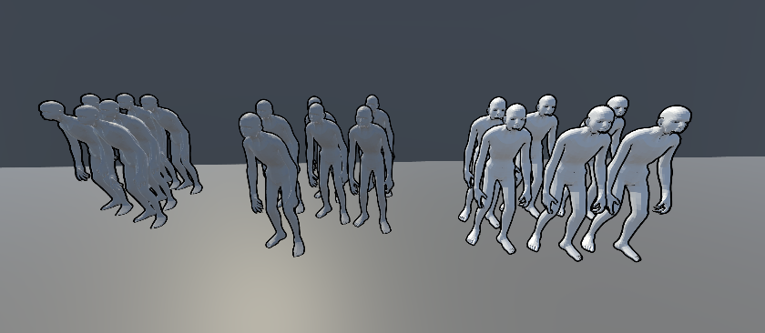
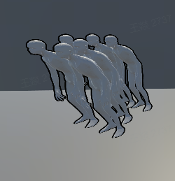
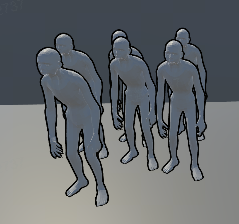
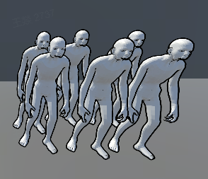

# Unity URP 多方案描边方案对比

**标签**：#unity #shader #graphics #urp #npr #reference
**来源**：用户授权资料整理
**收录日期**：2026-05-28
**来源日期**：2026-05-28
**更新日期**：2026-05-28
**状态**：📘 有效
**可信度**：⭐⭐⭐ (方案资料、素材与表格已本地校验)
**适用版本**：Unity URP

### 概要

Unity URP 中常见的非后处理描边可以按实现方式分为 RenderObject Pass、逐角色多 Pass 外描边、顶点外拓三类。选型时核心权衡是效果准确性、批次数量、对象级开关能力和是否需要 Mask 处理内描边。

### 内容

## 顶点几何膨胀描边（Vertex Extrusion Outline）

依据做法不同，描边方案可以分为三类：

第一类（左）：描边在渲染层之前渲染，描边不写入深度，只做深度测试，因此总会被后续渲染的内容覆盖；优势是通常只需要新增一个批次即可增加描边。

第二类（中）：当前测试中效果最完整的非后处理外描边方案，但性能代价较大。它需要先绘制单个角色的描边与本体，再进入下一个角色，批次数量最低也是角色数量的 2 倍。

第三类（右）：最常见的顶点外拓手段，写深度并剔除正面。它容易出现内描边，并且面部等不应描边的区域也可能被描边，需要 Mask 贴图或顶点色 Mask 控制。



## 多方案描边核心对比

| 特性 / 方案 | 第一类：RenderObject Pass（全局 / 材质队列） | 第二类：Per-Object Outline（逐角色多 Pass） | 第三类：顶点外拓（Vertex Extrusion） |
|---|---|---|---|
| 实现方式 | URP RenderObject 或材质队列插入额外 Pass | 按角色顺序分别渲染描边和本体 | URP RenderObject 或材质队列多 Pass，Shader 顶点膨胀 |
| 批次数量 | +1（共 2 次：描边 + 本体） | =2×角色数 | 2（描边 Pass + 本体 Pass） |
| 深度写入 | Off（仅测试） | On（分角色各自写入） | On |
| 剔除模式 | 无特殊剔除（依赖深度测试） | 按常规 Shader 设置 | Cull Front |
| 对象级开关 | 支持（Layer 或材质开关） | 支持（材质开关） | 支持（Layer / 材质开关） |
| 性能开销 | 低 | 高 | 低 |
| 效果特点 | 会被后续本体覆盖；简单轮廓 | 最精准、无内描边、无遮挡问题 | 会有内描边，需要 Mask 优化 |
| 可控性 | 中等（全局或材质级） | 高（每角色独立） | 中等（可通过 Mask 调整） |
| 典型应用场景 | 批量快速开关描边，性能敏感的项目 | 少量角色截图或动画预渲染 | 大多数游戏卡通描边，需兼顾性能与效果 |

## 1. 多方案描边方案一览

### 第一类（左组）：RenderObject Pass



- 使用 RenderObject 或材质队列实现描边。
- 支持全局开关与单对象开关。
- 仅增加 1 个批次，兼容性高。

### 第二类（中组）：Per-Object Outline



- 按角色逐个渲染描边与本体。
- 无内描边，效果最优。
- 批次数 = 角色数 × 2，性能开销大。

### 第三类（右组）：顶点外拓（Vertex Extrusion）



- 多 Pass（RenderObject 或材质队列）外拓顶点。
- 批次数 = 2。
- 会产生内描边，需要 Mask 优化。

## 2. 第一类：RenderObject 描边 Pass

### 2.1 原理

1. 在 URP 自定义 Renderer Features 中添加 RenderObject 描边 Pass。
2. 描边 Pass 使用 Depth Write=Off，仅 Depth Test=LessEqual。
3. 渲染纯色膨胀模型，贴合原表面。

### 2.2 开关策略

- 全局开关：在 SRP Asset 或 Renderer Feature 中统一启用或禁用。
- Layer 策略：将对象分配到专用 Layer，RenderObject 规则仅对该 Layer 生效。
- 材质队列策略：为 MeshRenderer 添加描边材质与主材质，使用 Render Queue 控制顺序，启用或禁用描边材质即可控制单对象描边。

### 2.3 优缺点

优点：

- 增加批次少，开关灵活。
- 无需修改原 Shader，集成快捷。

缺点：

- 全局模式缺乏对象粒度控制。
- Layer 管理与材质管理复杂度提升。

### 2.4 适用场景

- 需要快速批量控制描边，且性能敏感。
- 项目中已有 SRP Feature 管线扩展需求。

## 3. 第二类：逐角色非后处理外描边

### 3.1 原理

按角色顺序执行两步渲染：先渲染角色描边，再渲染角色本体。一个角色完成后切换到下一个角色，重复同样流程。

### 3.2 优缺点

优点：

- 无被遮挡描边、无内描边。
- 深度关系与色彩一致性最佳。

缺点：

- 批次数高，约等于 2×角色数。
- 与场景其他对象混合困难。
- 仅适用于少量角色或预渲染场景。

## 4. 第三类：顶点外拓（Vertex Extrusion）

### 4.1 原理

1. 在 URP 管线中，通过 RenderObject Feature 或材质队列插入第二 Pass。
2. 描边 Pass Shader 中将顶点沿法线方向外拓，使用 Depth Write=On 和 Cull Front，渲染纯色外轮廓。

### 4.2 优缺点

优点：

- 批次仅 2（描边 + 本体）。
- 实现简单，可在多管线复用。
- 支持材质或 Feature 级别开关。

缺点：

- 会有内描边，需要 Mask 解决。
- 细节区容易误描，需要顶点色或贴图标记。

### 4.3 优化建议

- 在 UV 或顶点色中标记描边区域，Shader 中读取 Mask 决定是否外拓。
- 动态根据摄像机距离调整 `outlineWidth`。
- 与 Stencil Buffer 或后处理结合，增强精度。

## 5. 附录：术语与建议

- Render Queue：Unity 渲染顺序控制参数，数值越小越先渲染。
- RenderObject Feature：URP 中自定义 Renderer Feature，用于插入自定义 Pass。
- Mask 绘制：在模型贴图或顶点色上标注需要或不需要描边的面。

建议根据项目需求混合使用以上方案，权衡性能与效果；为不同场景准备多套可切换的描边策略。

### 关键代码

```hlsl
// 顶点外拓描边 Pass 的核心思想：沿法线方向外扩顶点。
float3 outlinePosition = positionOS + normalOS * outlineWidth;
```

### 图片资源清单

| # | 文件名 | 说明 | 大小 |
|---|--------|------|------|
| 1 | `01-outline-three-schemes.png` | 三类描边方案整体对比 | 186 KB |
| 2 | `02-renderobject-pass.png` | RenderObject Pass 描边示意 | 47 KB |
| 3 | `03-per-object-outline.png` | Per-Object Outline 描边示意 | 50 KB |
| 4 | `04-vertex-extrusion.png` | Vertex Extrusion 描边示意 | 72 KB |

### 参考链接

- [Unity Manual - Scriptable Renderer Features](https://docs.unity3d.com/Manual/urp/renderer-features/intro-to-scriptable-renderer-features.html) - URP Renderer Feature 官方说明

### 相关记录

- [非真实感渲染 (Non-Photorealistic Rendering) 相关经验](./npr-rendering-outline.md) - 屏幕空间描边与 Renderer Feature 实践，可与本文的非后处理描边方案对比。
- [URP SRP 架构](./urp-srp-architecture.md) - URP 渲染管线与扩展点背景。
- [URP Renderer Feature 开发指南](./urp-renderer-feature-guide.md) - RenderObject / Renderer Feature 相关实现背景。

### 验证记录

- [2026-05-28] 初次记录，来源为用户授权资料；已脱敏移除原始来源平台、临时资源链接、素材标识、目录路径和节点标识，仅保留可复用技术内容。
- [2026-05-28] 读取原始资料正文结构，确认包含 4 张图片与 1 个嵌入表格；表格内容已转写为 Markdown 表格。
- [2026-05-28] 下载 4 张图片到 `assets/unity-urp-outline-scheme/`，并用 `file` 确认为 PNG 图片。
- [2026-05-28] 修正：进一步移除记录中的原始来源平台名、采集工具名和外部素材接口链接，避免脱敏说明本身反向暴露来源。
- [2026-05-28] 外部核对：Unity 官方文档确认 URP 支持 Scriptable Renderer Feature 扩展渲染流程。

---
