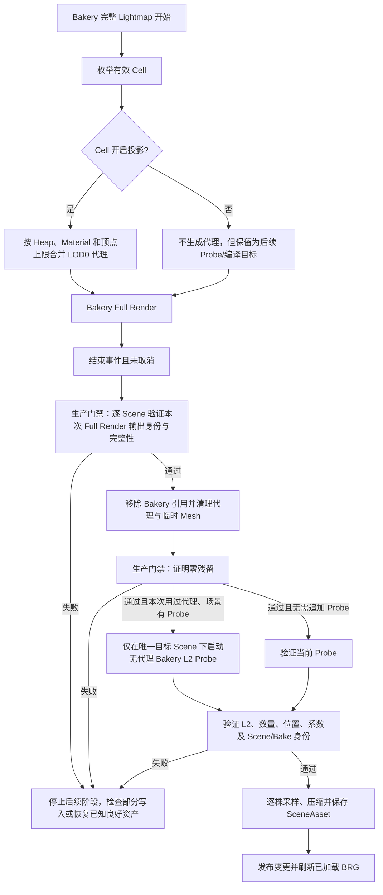

# Unity BatchRendererGroup（BRG）植被接入 Bakery L2（二阶球谐 SH）静态光照：投影、采样与生产边界

**标签**：#unity #graphics #architecture #rendering #shader #editor
**来源**：冻结工程实现分析与内部历史观察 - BRG 植被静态光照、烘焙代理与运行时解码
**收录日期**：2026-08-25
**来源日期**：2026-08-25
**更新日期**：2026-09-03
**状态**：📘 有效
**可信度**：⭐⭐⭐（核心机制已由冻结源码静态核对；历史真实 Bake 缺少可公开复跑的证据包，生产故障门禁和目标设备成本尚未验证）
**适用版本**：Unity 2022.3 LTS、URP 14、BatchRendererGroup、Bakery 1.98；升级 Bakery 时必须重验反射契约

---

### 概要

Unity `BatchRendererGroup`（BRG）是一套由程序提交批量实例、而不是为每株植物保留 `MeshRenderer` 的渲染接口。Bakery L2 是 Bakery 烘焙出的二阶球谐光照探针；球谐函数（Spherical Harmonics，SH）用每个颜色通道九个系数近似记录一个位置从各方向收到的低频间接光。两者直接组合时存在断层：BRG 植被没有可供 Bakery 收集的逐株 Renderer，也不能自动获得普通 Renderer 的 Probe 数据。

本文分析的实现用两条彼此独立的路径弥合断层：完整 Lightmap 烘焙前，临时生成只投射阴影、不占 Lightmap 图集的合并代理；Probe 烘焙完成后，在编辑器中为每株实例采样一次 Bakery L2，再保存为“最终静态 RGB”或“可按顶点法线求值的紧凑方向参数”。运行时不再查询 Unity Probe 系统，只从 BRG Buffer 读取已编译结果。

运行时数据按 `Cell → SceneAsset → Heap` 理解：Cell 是场景中的一个植被管理单元，并引用一份 SceneAsset；SceneAsset 是该区域全部植被实例和场景专属光照的权威资产；Heap 是 SceneAsset 内按空间划分的实例块，也是光照量化和粗粒度运行处理的单位。Prototype 只保存跨场景复用的网格、材质、Bounds 和光照模式声明，不保存某个场景的逐株光照。

冻结源码足以证明上述数据流和当前失败边界，但不能单独证明一次真实 Bake 的画面正确或生产恢复能力。历史案例曾观察到正常 Bake、代理清理和两种 Shader 输出差异，但缺少公开证据包，因此本文将其列为不可独立复核的内部观察，不据此标记“已验证”。

### 内容

#### 一、问题、目标与非目标

目标是让没有逐株 GameObject 的 BRG 植被同时具备：

- 对静态场景的 Lightmap 产生植被阴影；
- 从 Bakery Probe 获得随实例位置变化的间接光；
- 不为每株植物常驻 Renderer、动态 Probe 绑定或 Lightmap UV；
- 把场景光照保存在对应 SceneAsset/Heap，而不是污染可跨场景复用的 Prototype。

投影贡献和 Probe 接收是两个不同问题。关闭某个 Cell 的投影，只表示完整 Lightmap 阶段不为它生成代理；如果它的 Prototype 选择静态 Probe 光照，仍需要把最新 Probe 编译进 SceneAsset。

该方案也不是逐株 Lightmap 方案。代理使用 `ShadowsOnly` 且 `ScaleInLightmap = 0`，作用是让 Bakery 看见投影几何；运行时植被不会读取代理的 Lightmap UV 或纹理区域。

#### 二、数据所有权与失效条件

| 数据 | 所有者 | 生命周期 |
|---|---|---|
| Mesh、Material、LOD0、视觉 Bounds、风摆上限、光照模式声明 | Prototype | 跨场景资源生命周期 |
| 实例变换、Heap、逐株静态 RGB 或方向参数 | SceneAsset | 对应场景内容生命周期 |
| 合并投影 Mesh、代理 Renderer、代理根 | Bakery 临时工作集 | 一次完整 Bake；结束或失败后应清理 |
| BRG Buffer 与每 Heap 量化参数 | 已加载的运行时 Cell | Cell 加载至卸载 |

逐株光照依赖实例位置、场景灯光、遮挡和 Probe 布局，所以不能写入 Prototype。以下变化需要分别判断：

- 只改视觉 Bounds 尺寸而不改中心、投影几何和材质时，可重建剔除数据并保留光照。
- 改视觉 Bounds 中心会改变采样点，必须重新采样 SceneAsset。
- 改 Mesh、LOD0、Material、Alpha Clip 或 Cull 会改变静态投影，必须对引用它的场景重跑完整 Lightmap；存在 Probe 时还要重跑无代理 Probe，再编译逐株光照。
- 只改碰撞形状不影响本文光照链。

当前刷新器能够扫描 Prototype 依赖并重编译引用，但“引用资产已重编译”和“目标场景已经重新烘焙并验证”是两个状态，不能用依赖 Hash 代替真实光照结果。

#### 三、正常路径：先投影，再在无代理状态下取 Probe

下面区分当前实现和生产要求。实线节点来自冻结源码；标为“生产门禁”的节点尚未接入 Bakery 原生面板的自动生命周期。

当前自动生命周期已经实现 A 至 G、代理清理尝试、唯一 Scene 条件下的自动无代理 Probe，以及 Probe 验证后的 SceneAsset 刷新；但它没有把 H 和 J 作为硬门禁。换言之，观察到 Bakery 的 Finished 事件且没有取消，只能说明流程抵达结束边沿，不能证明新 Lightmap 已完整应用，也不能证明清理后零残留。

Probe 阶段必须没有投影代理。代理虽然关闭了自身 Probe 接收，却仍是 Bakery 可见的静态投影/遮挡几何；若它留在 Probe Bake 中，高密度植被可能遮挡自己的采样环境，使运行时不存在的辅助对象改变最终 Probe。

#### 四、投影代理的生成与成本

代理以 Heap 为第一层边界，再按 Material 分组，并按约 400k 顶点的实现上限继续分块。这个数是防止单 Mesh 无界增长的容量护栏，不是跨机器验证过的通用峰值。代理使用 LOD0，使静态投影接近近景主形态，也因此增加临时合并内存和 Bakery 追踪成本。

每个代理 Renderer 的关键语义是：

- `ShadowCastingMode.ShadowsOnly`：只贡献阴影，不显示代理表面；
- `LightProbeUsage.Off`：代理自身不接收 Probe；
- `ContributeGI`：让 Bakery 把它当作静态 GI 几何；
- `ScaleInLightmap = 0`：参与追踪但不占用 Lightmap 图集；
- 保留原 Material，以维持 Alpha Clip、Cull 等投影轮廓；
- 按源 Unity Scene 与 SceneAsset GUID 命名和归属，避免同一场景多个 Cell 互相清理。

按 Heap 分组只是控制生成、清理与失败影响范围，不意味着一个 Heap 等于一个运行时 Draw Call。

#### 五、Probe 插值与唯一采样点

正式刷新入口先要求存在非空 `LightmapSettings.lightProbes`，且 `bakedProbes` 数量与 Probe 数量一致；否则拒绝覆盖 SceneAsset。通过后，每株实例只生成一个采样请求：

1. 由 Heap 原点、Cell 变换和实例变换组成该实例的世界矩阵。
2. `VisualRootSpaceBounds.center` 表示 Prototype 可见几何在自身根坐标中的包围盒中心；世界矩阵把这个中心变成该株的世界采样位置。
3. 同一世界矩阵把实例局部 `Vector3.up` 转为世界方向并归一化；退化为零向量时回退到世界向上。该方向仅供“最终静态 RGB”模式预先评估一次光照。
4. Unity 的 `LightProbes.CalculateInterpolatedLightAndOcclusionProbes` 为全部位置批量返回插值后的 `SphericalHarmonicsL2` 和遮挡值。

当前编译器使用返回的 SH，却不保存返回的 Occlusion Probe 值。这意味着本文两种记录都不包含 Unity Occlusion Probe 通道。

冻结源码没有实现“采样点是否位于有效 Probe 四面体覆盖内”的显式检测，也没有定义覆盖范围外的自有回退；它把空间插值行为交给 Unity API。因此本文不能声称范围外一定取最近 Probe、环境色或黑色。生产场景必须让 Probe 体覆盖所有实例采样点，并用边界夹具验证结果；若需要严格拒绝范围外样本，应另加覆盖判定。没有有效 Probe 集时，正式刷新入口会拒绝继续，而不是生成一份已知的默认颜色。

#### 六、两种逐株表示保留了什么

Bakery 恢复出的输入是 Unity `SphericalHarmonicsL2`：每个 RGB 通道九个系数，共 27 个浮点数。两种模式都以这个完整 L2 结果为源，但输出不同。

##### 6.1 StaticLightColor：把一个方向的完整 L2 固化成 RGB

编译器用实例的局部向上方向，计算完整 L0/L1/L2 多项式并把负辐照度钳到零，得到一个 RGB。随后在每个 Heap 的最小值/步长范围内把三个通道量化为 12 bit，并以 8 B 对齐记录保存。

输入是“该位置的 27 个 SH 系数 + 一个固定世界方向”，输出是“三通道最终辐照度”。它保留该位置、该方向上的完整 L2 评估结果，但丢失：换一个法线方向重新求值的能力、同一株不同顶点的位置差异、Occlusion Probe，以及量化精度之外的细节。运行时只解量化 RGB，不再读取顶点法线计算 SH。

##### 6.2 StaticBakerySh：从 L2 源提取紧凑方向参数

`Ar/Ag/Ab` 是红、绿、蓝三个通道各自的一组四维参数：`w` 保存平均/常量项，`xyz` 保存一阶方向项。源码从每通道九个 L2 系数构造这四个值，其中系数 6 会折入常量项；系数 4、5、7、8 不进入记录，系数 0 与 6 也不能从折叠后的常量中分别恢复。因此 20 B 记录不是“运行时保存完整 Bakery L2”，而是“由 Bakery L2 来源派生的三组方向参数”。

每株共 12 个参数，以每 Heap 最小值/步长做 12 bit 量化：理论载荷 144 bit，最终按五个 `uint` 对齐为 20 B。运行时解量化后，按每个顶点旋转到世界空间的法线调用 Geomerics 方向评估。Geomerics 在这里指一种由平均能量和一阶主方向重建非线性漫反射瓣的近似；输出仍是顶点 RGB，而不是恢复 27 个 L2 系数。

该模式保留了随顶点法线改变明暗的能力，比固定 RGB 更适合立体叶片；它丢失完整二阶角向信息、Occlusion Probe、同株空间变化和量化精度。它的运行时成本还包括每顶点读取 20 B 稀疏记录、解量化和三通道方向评估，不能由静态 RGB 的旧设备数据代替。

| 模式 | 编译输入 | 每株稀疏记录 | 运行时输入 | 主要损失 |
|---|---|---:|---|---|
| StaticLightColor | 完整 L2 + 实例局部向上方向 | 8 B | 已固化 RGB | 所有其它法线方向和 Occlusion |
| StaticBakerySh | 完整 L2 | 20 B | 紧凑 Ar/Ag/Ab + 顶点世界法线 | 不可恢复完整 L2，且不含 Occlusion |

SceneAsset 只为实际使用某模式的实例分配对应稀疏记录。每个 Heap 另保存 128 B 的最小值/步长参数，供两张表解量化；这 128 B 是每 Heap 固定开销，不是第三种逐株记录。逐株 32 B 主记录只保存光照模式、Heap 索引和稀疏记录索引，用来寻址真正的光照载荷。

#### 七、Full Render 输出完整性的可执行定义

冻结实现已有一个结构检查函数。它检查目标 Scene 能否找到 Bakery Storage，并检查 `Storage.maps`——即 Bakery 在该场景记录的已导入 Lightmap 纹理列表——是否非空、每项是否为持久化 `Texture2D`；还检查 Unity `LightmapSettings.lightmaps` 非空、Bakery 的 Renderer/Map ID/ScaleOffset 三张并行表数量一致、Renderer 未丢失、Map ID 不越界、接收 Renderer 的 Unity LightmapIndex 有有效纹理，并要求至少一个接收 Renderer 已应用 Lightmap。这能识别空列表、空纹理、非持久纹理、并行表断裂、Missing Renderer、越界 ID 和未应用到 Unity 等明显部分写入。

但该检查只在专用验证工具中使用；Bakery 原生面板触发的植被自动生命周期没有在启动无代理 Probe 前强制调用它。它也没有 Bake 世代：不能证明当前非空列表是本次 Bake 产生的，不能排除旧完整数据与新部分数据混合，也不能证明全局 Unity Lightmap 数组属于正在核对的 Additive Scene。

因此生产门禁应采用下面的可执行定义；这是**生产要求，不是当前已经完整实现的行为**：

1. **Bake 前冻结身份**：生成持久 Bake ID，记录目标 Scene 的 GUID/路径、LightingDataAsset、Bakery Storage、受管 Cell/SceneAsset、预期代理和应接收 Lightmap 的 Renderer 集合，并保存旧有效输出指纹。
2. **结束边沿有效**：必须收到对应 Full Render 完成事件、`userCanceled=false`，且目标 Scene 仍与清单身份一致；仅观察到 `bakeInProgress` 下降不算成功。
3. **逐 Scene 结构完整**：对清单中的每个 Scene 执行现有结构检查，并要求所有预期接收 Renderer 都出现在一致的 Renderer/Map ID/ScaleOffset 映射中。
4. **本次输出身份**：Lightmap 纹理、Storage 和 LightingDataAsset 的资产身份/内容指纹必须与 Bake ID、目标 Scene 和开始前快照形成可解释的新世代；“仍是旧完整值”或“新旧混合”都判失败。
5. **识别部分写入**：任一空/丢失纹理、非持久纹理、列表数量不等、Missing Renderer、越界或未应用 Map ID、预期 Renderer 缺席、输出世代不一致、保存失败，都判为部分或不可归属输出。
6. **后续阶段条件**：只有全部目标 Scene 的 Full Render 检查通过，并且代理根、生成目录和 Bakery Storage 中的本世代代理引用都已证明为零，才允许启动无代理 Probe。Probe 也必须通过 L2、数量、位置、全部系数以及相同 Scene/Bake ID 校验，才允许编译并发布 SceneAsset。

若任何检查失败，自动链必须停止，不得用“已有非空 Lightmap”继续，也不得覆盖旧 SceneAsset 光照。由于 Bakery 资产可能已被部分写入，恢复动作应是还原成对的已知良好 LightingDataAsset、Storage/Lightmap 和 SceneAsset 候选，或在单一目标 Scene 中重跑整条链，而不是依赖 Unity Undo。

#### 八、清理、失败与权威恢复

只销毁代理 GameObject 不够。Bakery Storage 仍可能保存 Renderer/Object 引用，使后续 Bake 命中 Missing 对象或旧代理。目标清理应同时移除 Storage 引用、销毁代理根和临时 Mesh、删除本次生成目录，并清空受管状态；重复调用应安全且不能误删其它世代对象。

当前实现会尝试这些动作，但没有清理后的零残留扫描，资源删除失败也不是硬错误；在进入受保护区之前抛错，或 Bake 结束时无法重新定位某个 Cell，也可能跳过对应清理。所以“Cleanup 返回”不等于“零残留已证明”。

| 失败点 | 当前能确认 | 不能推定 | 安全恢复方向 |
|---|---|---|---|
| Full Render 异常、取消或无完成事件 | 不启动自动 Probe/SceneCompiler；部分目标会尝试清理 | Lightmap 是旧值、完整新值还是部分新值 | 执行独立输出/残留检查；无法归属时还原已知良好资产或重跑 |
| 清理失败或目标 Cell 丢失 | 其它目标可能继续 | 代理、临时 Mesh 与 Storage 引用已清零 | 阻止 Probe；按持久世代清单清理并复查 |
| Probe 恢复或 L2/数量/位置/系数校验失败 | SceneCompiler 不应开始 | LightingDataAsset 一定仍是旧值；恢复函数可能已先保存新 SH | 成对还原已知良好 LightingDataAsset 与 SceneAsset，或重烘焙 |
| SceneAsset 保存后发布通知/BRG 刷新失败 | 磁盘 SceneAsset 默认已成为新权威 | 屏幕正在显示新 Buffer | 从已保存资产强制重建 BRG；回退时还原成对资产 |

#### 九、多 Cell、多 Scene 与 Domain Reload

同一 Unity Scene 可以包含多个 Cell，每个 Cell 各持有一份 SceneAsset。代理根用“源 Scene + SceneAsset GUID”区分，临时 Mesh 目录用“源 Scene GUID + SceneAsset GUID”区分，结束时用“Scene 路径 + SceneAsset 路径”重新定位管理器。这能隔离同一 Scene 内多个 Cell，也能避免把 Additive Scene 的代理都放进 Active Scene。

它仍不等于多 Scene Bake 已闭环。当前 Full Render 可以同时枚举多个已加载 Scene，但自动无代理 Probe 要求唯一目标 Scene；全局 `LightmapSettings.lightProbes` 和 `LightmapSettings.lightmaps` 也不能单凭非空证明逐 Scene 归属。生产上应把每个 Scene 作为独立 Bake 单元，逐 Scene 完成输出身份、零残留、L2 Probe 与 SceneAsset 发布检查。

Domain Reload（Unity 重新加载脚本域）后，事件会重新绑定；若 Bakery 已空闲，实现会按确定性根名尽力清理残留。但一次 Bake 的目标、阶段和代理工作集主要保存在易失的静态内存。源码中的 `_managedBakeActive` 就是“当前脚本域正在纳管一次 Bakery Bake”的布尔标记，而不是持久事务记录。若 Reload 发生在 Bake 中，新域无法恢复旧标记所代表的世代，也不会可靠续接旧世代收尾。

生产恢复需要把 Bake ID、目标 Scene、代理清单和阶段写入 `SessionState` 或磁盘清单；新域必须先验证所有权，再接管或清理同一世代，并以零残留门禁决定能否继续 Probe。

#### 十、可选 Bakery 集成的反射边界

编辑器程序集通过反射访问 Bakery，可以避免未安装 Bakery 时产生编译依赖，但会把风险转移到运行时能力检查。Bake 前至少要确认：启动方法、进行中状态、Full Render/Probe 完成事件、清理所需的 Storage 集合，以及 L2 Probe 恢复入口都仍符合 Bakery 1.98 契约。

版本升级后可能出现“能启动却不能收尾”。因此反射失败必须在创建代理之前阻断，并先在最小场景执行能力自检和真实 Bake；不能等到代理已经生成或资产已经写入后才发现字段/事件变化。

#### 十一、成本与证据边界

- 作者阶段成本包括 LOD0 合并 Mesh、代理资产、Bakery 追踪和每株一次 Probe 插值；400k 顶点分块上限没有跨机器峰值数据。
- 运行时每 Heap 增加 128 B 量化参数；每株按模式增加 8 B 或 20 B 稀疏光照载荷，另有主实例记录和 Buffer 对齐成本。
- `StaticBakerySh` 有每顶点解码与 Geomerics 评估成本；其真机代价需结合双眼、网格顶点数、过绘制和带宽测量。
- 一次内部历史场景曾记录 288 株、40 Heap、752 个 Probe，并将两种模式各用于 144 株；还观察到代理清理和 Shader 输出差异。由于没有随本文提供完整输入资产、操作脚本、原始输出、截图哈希和环境清单，这只是不可公开复核的历史观察，不能支撑“端到端已验证”或性能结论。
- 32 B 主实例 Buffer 的回读验证只覆盖 CPU/GPU ABI；旧 Quest 数据使用过不同光照布局，不能证明当前 8 B/20 B 路径的设备表现。

#### 十二、生产采用门禁

以下任一项缺失，都不能把这条 Bakery 链标记为生产可用：

- [ ] 把第七节定义的逐 Scene Full Render 身份与完整性检查接入 Bakery 原生面板自动生命周期，并用完整、旧值未变、新旧混合和部分写入夹具验证。
- [ ] Cleanup 后逐目标证明代理根、生成目录和 Bakery Storage 的本世代引用全部为零。
- [ ] 将恢复的 L2 绑定到唯一 Scene 与 Bake ID，而不只比较数量、位置和系数。
- [ ] 持久化 Bake 中 Domain Reload 的最小恢复状态，并证明新域可安全接管或清理。
- [ ] 对 LightingDataAsset、Storage/Lightmap、整份 SceneAsset 和 BRG 发布执行失败注入，并验证成对恢复。
- [ ] 在目标设备测量 `StaticBakerySh` 顶点成本、代理合并峰值和 Bakery 峰值内存。

### 结论

冻结源码表明，这套实现已经形成一条结构完整的正常路径：用临时 Renderer 让 BRG 植被参与静态投影；清理代理后恢复 Bakery L2；以 Bounds 中心为每株唯一位置，编译为固定静态 RGB 或 20 B 紧凑方向参数；运行时从 SceneAsset/Heap 对应的 Buffer 读取，而不动态采样 Probe。

必须同时保留两个限制。第一，20 B 模式来源于完整 L2，却只保留 Ar/Ag/Ab 方向参数，运行时不能恢复完整二阶 SH；8 B 模式则只保留一个固定方向上的最终颜色。第二，当前自动链缺少 Full Render 世代身份、零残留和 Domain Reload 事务门禁。历史画面观察没有公开复现包，因此本文可以作为机制说明和生产改造依据，不能作为“当前端到端已经生产验证”的证明。

### 实现证据索引

本文绑定到匿名工程快照：Git 提交 `f0fef16849cfb8945e9928e5219a140ee250fcf4`，植被模块 tree `4700f76e0b087fe3935c06e660ee732bbf55c87a`。持有该快照的读者可按下表复核；没有源码访问权时，这些条目是具名案例证据，不是公开可复跑实验。

| 主张 | 模块内相对入口 | 证据类型 |
|---|---|---|
| Bakery 事件绑定、阶段判断、易失纳管状态 `_managedBakeActive` | `Editor/Lighting/VegetationBakeryAutoProxyLifecycle.cs` | 冻结源码静态核对 |
| 代理创建、按 Scene/SceneAsset 清理、Probe 刷新 | `Editor/Lighting/VegetationBakeProxyService.cs` | 冻结源码静态核对 |
| 结构性 Lightmap 检查、Bakery 私有 Storage、L2 恢复 | `Editor/Lighting/VegetationBakeryIntegration.cs` | 冻结源码静态核对 |
| Probe 采样点、局部向上方向、完整 L2 静态 RGB 与 Ar/Ag/Ab 提取 | `Editor/Compiler/VegetationCompilerCommon.cs`：`VegetationProbeLightingCompiler` | 冻结源码静态核对 |
| 8 B/20 B Q12 压缩与每 Heap 128 B 参数 | `Runtime/Core/VegetationLightingCompression.cs` | 冻结源码静态核对 |
| BRG 解码、顶点法线与 Geomerics 求值 | `Shaders/MiniatureWorldVegetationInput.hlsl`、`Shaders/Includes/BakeryDecodeLightmap.hlsl` | 冻结源码静态核对 |

私有 Bakery 字段只用于说明当前适配证据，不应成为通用设计接口：`Storage.maps` 对应场景的已导入 Lightmap 纹理列表；`prevBakedProbes` 与 `prevBakedProbePos` 是该版本用于恢复 Probe 系数和位置的缓存。Bakery 升级后必须重新做能力探测，不能假定字段名和语义稳定。

### 相关记录

- [统一 BRG 架构](./unity-vegetation-unified-brg-architecture.md) - Cell、SceneAsset、Heap、Buffer 与资源释放边界。
- [BRG 逐株 Buffer 的 32 字节压缩与量化 ABI](./unity-brg-packed-instance-buffer-quantization.md) - 主实例记录如何寻址两张稀疏光照表。
- [植被 Painter 作者工作流与事务设计](./unity-vegetation-painter-authoring-transaction-workflow.md) - Prototype 刷新与 SceneAsset 编译的作者流程。
- [历史 Quest 3S BRG 与普通 GO 系统观察](./quest-vegetation-brg-performance-lighting-validation.md) - 旧设备数据及其不可外推边界。
- [Bakery SH 与 Toon 光照对齐](./bakery-sh-toon-lighting-liltoon-alignment.md) - Ar/Ag/Ab 和方向性光照的相邻经验。

### 验证记录

- [2026-09-03] 依据冻结提交与模块 tree 静态核对代理生命周期、Probe 恢复、采样、两种压缩格式和 Shader 解码；本文状态表示机制说明当前有效，不表示真实 Bake、异常恢复或设备性能已经公开验证。
- [2026-09-03] 将历史 288 株案例降为不可公开复核的内部观察；因缺少随文证据包，不再用于支撑“✅ 已验证”或宽泛端到端结论。
- **尚未验证**：Full Render 的 Scene/Bake 世代身份与部分写入故障夹具、清理零残留、多 Scene 完整闭环、Bake 中 Domain Reload 恢复、Bakery 升级兼容、代理合并峰值和当前光照布局的 Quest 表现。

---
