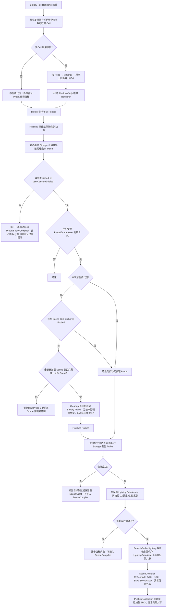

# Unity BRG 植被的 Bakery L2 静态光照与投影代理流程

**标签**：#unity #graphics #architecture #rendering #shader #editor
**来源**：工程实践抽象 - Unity 2022.3 LTS、Bakery 集成源码、当前金样报告与 BRG 光照数据审查
**收录日期**：2026-08-25
**来源日期**：2026-08-25
**更新日期**：2026-08-26
**状态**：📘 有效
**可信度**：⭐⭐⭐⭐（当前 Bakery 版本的代理、Probe、压缩和 Shader 链有实现与既有金样支撑；本次未重新执行完整烘焙，升级与 Domain Reload 分支仍有风险）
**适用版本**：Unity 2022.3 LTS、URP 14、BatchRendererGroup、Bakery 1.98；升级 Bakery 时必须重验反射契约

---

### 概要

BRG 植被没有逐株 MeshRenderer，Bakery 在收集静态投影物时看不到它们。生产级目标链是：完整 Lightmap 烘焙前临时生成只投影、不接收 Lightmap 的合并代理；Bakery 报告结束后验证输出并彻底清理代理；需要静态 Probe 的场景再在无代理状态下烘焙并验证 L2；最后按实例采样并压缩到场景植被资产，运行时由 BRG Shader 读取。投影贡献和 Probe 接收是两个独立开关：不投影的运行时 Cell 仍可能需要从静态 Probe 编译逐株光照。

这条链路必须严格区分三类数据：Prototype 保存可跨场景复用的几何与光照模式声明；场景植被资产保存逐株静态光照；代理和合并 Mesh 只是一次烘焙的临时产物。任何一层所有权混淆，都会造成场景光照污染 Prototype、代理残留或运行时重复渲染。

“当前参考实现”在本文中固定指 2026-08-25 的匿名工程快照：Unity `2022.3.62f3`、URP 14、Bakery 1.98，证据来自源码静态复核、同日 Editor/PlayMode 回归摘要和此前保留的 Bakery 金样报告。本次整理没有重新启动 Bakery，也不保存私有工程路径、提交号或 RunId；因此实现事实可用于复用设计与风险判断，但不能替代读者在自己版本上的最小真实 Bake。当前自动生命周期已经实现代理、清理、Probe 恢复与 SceneAsset 编译主链，但尚未实现完整的残留验证、每 Scene Lightmap 输出验证或跨资产事务；下文会把“当前行为”和“采用要求”分开。本文的“运行时 Cell”指一个独立加载、创建 BRG/Buffer/物理资源并独立卸载的场景植被单元；一个 Unity Scene 可以包含多个运行时 Cell。

匿名证据索引保留到类与报告角色：`VegetationBakeryAutoProxyLifecycle` 编排事件与阶段，`VegetationBakeProxyService` 生成/清理代理，`VegetationBakeryIntegration` 负责 Bakery 1.98 反射和 Probe 恢复，`VegetationSceneCompiler` 采样/压缩逐株记录，BRG Shader 解码两种模式；保留的 `VegetationBakeryLightingModes` 金样报告覆盖“投影代理生成、Storage 清理、无代理 L2 Probe、两种记录编译和 BRG 显示”主链。它没有在本轮复跑，也没有可公开检出的私有快照标识，所以只能视为版本受限的历史金样，而不是读者可独立重现实验。

本文术语：**Heap** 是 SceneAsset 内部空间块；**authored Probe** 是目标 Unity Scene 中作者实际放置的 Light Probe；**无代理 Probe** 是在投影代理清理尝试之后启动的 Bakery Probe；**Bakery Storage** 是第三方插件保存 Renderer、Lightmap 与 Probe 中间/结果引用的数据；**Bake 世代**表示一次具体 Bake 的目标与输出身份，当前实现没有持久世代账本；**PublishNotification** 是 SceneAsset 保存后的编辑器变更通知，不是文件提交事务。

### 内容

#### 一、先明确目标与非目标

目标是让无 GameObject 的 BRG 植被：

- 对 Lightmap 场景产生静态阴影；
- 从 Bakery L2 Probe 获得与位置相关的静态照明；
- 不为每株植物常驻 MeshRenderer、LightProbeProxyVolume 或动态 BlendProbes 绑定；
- 保持场景光照数据随 SceneAsset/Heap 分区，而不是写回 Prototype。

该流程不是逐株 Lightmap 贴图方案。代理 Renderer 使用 `ShadowsOnly` 且 `ScaleInLightmap = 0`，它们的任务是让 Bakery 收集投影几何，不是给每株植被生成 Lightmap UV 和纹理映射。

#### 二、数据所有权

| 数据 | 所有者 | 是否可跨场景复用 | 生命周期 |
|---|---|---:|---|
| Mesh、Material、LOD0、视觉 Bounds、风摆上限、光照模式声明 | Prototype | 是 | 资源生命周期 |
| 实例 TRS、Heap、逐株静态颜色或方向性 SH 记录 | SceneAsset | 否 | 场景内容生命周期 |
| 合并投影 Mesh、代理 Renderer、代理根对象 | Bakery 临时工作集 | 否 | 一次完整 Bake；结束或失败必须清理 |
| BRG GPU Buffer 与量化参数 | 已加载运行时 Cell | 否 | 运行时 Cell 加载到卸载 |

逐株光照与实例位置、场景灯、遮挡关系直接相关，因此不能存到 Prototype。Prototype 刷新若改变视觉 Bounds 中心或光照模式，会改变采样位置或记录格式，必须要求受影响 SceneAsset 重新采样。若 Mesh、LOD0、Material、Alpha Clip、Cull 或其它投影 Shader 语义变化，代理投影也随之失效；所有引用该 Prototype 的目标 Scene 都必须重跑完整 Lightmap 链，存在 authored Probe 时还要在代理清理后重跑无代理 Probe，再重新编译逐株记录。只刷新 Prototype 文件或 SceneAsset 的依赖 Hash 不能替代重新烘焙。

这里必须区分“当前刷新器会做什么”和“光照正确性还要求什么”：

| Prototype 变化 | 当前刷新器行为 | 光照采用要求 |
|---|---|---|
| 光照模式或视觉 Bounds 中心 | 只报告/累计待重新采样引用，不直接写回 SceneAsset | 若投影几何、材质、场景照明与已验证 L2 Probe 均未变，可复用该 Scene/世代已验证的 Probe，只重新采样并编译 SceneAsset；只有投影语义、场景照明或 Probe 场也失效时才重跑 Full Render、清理与无代理 Probe |
| 仅视觉 Bounds 尺寸 | 自动重编译引用 SceneAsset，并保留原逐株光照记录 | 若只影响剔除而投影几何、材质和采样中心不变，可保留；否则按实际变化升级为重烘焙 |
| Mesh、LOD、Material、碰撞或依赖 Hash | 显式执行 Prototype 刷新时扫描引用；采样中心未变时可保留旧逐株记录 | Mesh/LOD/Material/Alpha/Cull 改变静态投影时仍须逐 Scene 重跑 Full Render，旧记录“被保留”不等于 Bakery 输出仍有效；碰撞单独变化则不要求光照 Bake |

当前没有资产导入后自动遍历全部引用的可靠后台协议；Material 的 Alpha/Cull 等属性也主要依赖整体依赖 Hash，而非逐字段缓存。因此发布 Prototype 前应显式执行刷新扫描，并把“引用已重编译”和“目标 Scene 已重新烘焙验证”作为两个独立状态。

#### 三、当前实现的 Full Render 与 Probe 流程

下面画的是当前行为，不是理想化的原子事务：



这里的 `Finished` 只表示观察到 Bakery 结束事件，`userCanceled=false` 只表示没有读到用户取消；当前集成没有据此逐 Scene 验证 Lightmap、Storage、LightmapSettings 或 LightingDataAsset 的完整性。因此不能把该节点写成“Lightmap 已验证完成”。某个运行时 Cell 关闭投影只会跳过代理生成，不会把它从受管 Probe/SceneAsset 刷新目标中移除。若没有 authored Probe，当前链不会启动自动无代理 Probe；后续只能尝试恢复当前 Storage，失败时保留旧 SceneAsset 或报告错误，不能假设存在可用新 Probe。

生产采用必须在 I 与 O 之间另加硬门禁：代理根不存在、生成目录已删除、受检查 Storage 集合无本世代引用，并且要能确认将要恢复的 L2 数据属于当前目标 Scene 与 Bake 世代。当前代码没有这两个门禁，所以图中的 O 特意写成“Cleanup 返回后”，而不是“已经无代理”；内容校验也不能单独证明数据时效与场景归属。

Probe 的精确持久化顺序也很重要：第一次 `TryRestoreLightProbeResultFromStorage` 会先把 SH 写入全局 `LightmapSettings.lightProbes` 并立即保存 LightingDataAsset，随后才做 L2、数量、位置与系数校验；`RefreshProbeLighting` 又执行一次恢复/保存，之后才调用 SceneCompiler、保存 SceneAsset、发布通知并刷新宿主。LightingDataAsset、SceneAsset 与 BRG 因而不是一个事务。

自动 clean Probe 入口和显式验证入口会要求 Bakery L2；用户直接从 Bakery 原生面板发起 Full Render 时，当前植被集成不会预先强制修改其 Probe 模式，只会在恢复/校验阶段拒绝不符合 L2 的结果。因此发布流程仍要把“Bake 前模式门禁”作为显式步骤，不能只依赖结束时报错。

为什么 Probe 阶段必须无代理：Probe 在 LightProbeGroup 的探针位置采样，代理本身因 `LightProbeUsage.Off` 不是额外探针采样目标；风险在于残留代理仍可能被 Bakery 当作额外投影/遮挡几何参与 Probe Bake，或留下错误的场景与 Storage 引用。运行时实际只有 BRG 植被，不应让一次烘焙辅助对象改变最终 Probe 结果或进入场景保存。当前清理函数会尝试做到这一点，但尚无清理后的可执行残留门禁，因此“无代理”仍需验证，不能只由 Cleanup 返回推定。

#### 四、投影代理如何生成

代理生成以 Heap 为首层边界，再按 Material 分组，并把单个合并 Mesh 限制在可控顶点数内。当前参考实现把每块上限设为约 400k 顶点；它是防止无界合并的容量护栏，不是经过跨机器验证的通用安全峰值。使用 LOD0 是为了让静态阴影与近景主形态一致，但这会增加烘焙内存和临时合并成本，必须分块而不能把整个世界合成一张 Mesh；具体上限仍要按编辑器内存与 Bake 峰值测量。

每个代理 Renderer 的关键配置是：

- `ShadowCastingMode.ShadowsOnly`；
- `LightProbeUsage.Off`；
- 标记为静态 GI 贡献者；
- `ScaleInLightmap = 0`；
- 保持可被 Bakery 正常收集的对象可见性，不使用会让第三方收集器忽略它的隐藏标记；
- 代理根、Renderer 和合并 Mesh 都记录到本次受管工作集，禁止靠名称模糊扫描清理。

按 Material 分组可保持 Alpha Clip、Cull 和投影 Shader 语义。按 Heap 分组则限制失败影响和单块合并规模；它不意味着运行时一个 Heap 对应一个 Draw Call。

#### 五、清理必须同时覆盖 Unity 对象和 Bakery Storage

只销毁代理 GameObject 不够。Bakery 会在自身 Storage 中保存 Renderer、Object 和场景索引引用；残留引用可能在后续 Bake 中指向 Missing 对象，或让旧代理再次被处理。目标清理顺序是：

1. 从 Bakery Storage 的所有相关集合移除本次代理 Renderer/Object。
2. 标记受影响 Storage 资产已修改，并在安全时保存。
3. 销毁代理根和 Renderer。
4. 销毁本次生成的临时合并 Mesh 资产或内存对象。
5. 清空受管目标、Bake 状态和事件边沿标记。

失败、用户取消、脚本异常和正常完成都应进入同一个幂等清理函数。再次调用清理不应抛出异常或删除非本次创建的对象。清理后还应执行可证伪门禁：逐目标确认确定性代理根不存在、生成目录已删除、受检查的 Storage 集合不再引用本世代 Renderer/Object；任何一项残留都必须阻止自动 Probe。

当前实现只完成了前半段：会尝试从若干 Bakery Storage 集合删除引用、销毁根与生成 Mesh 目录，但没有上述 post-clean 残留扫描，资源删除返回失败也没有成为硬错误。若 Full Render 前的全量刷新在进入受保护区前抛错，或结束时无法重新定位某个运行时 Cell，对应目标的清理还可能被跳过。因而“调用过 Cleanup”不等于“已经证明无代理”；这是当前最高优先级的采用缺口。

#### 六、从 Bakery L2 到两种逐株记录

Probe Bake 完成后，集成层从 Bakery Storage 恢复探针位置和 SH 数据，先写回并保存 Unity LightingDataAsset，再校验，刷新入口中还会重复一次恢复/保存；SceneCompiler 随后以每株 `VisualRootSpaceBounds.center` 作为单一采样点。当前有两种互斥的 Prototype 光照模式：

| 模式 | 编译阶段 | 每株稀疏记录 | 运行时 |
|---|---|---:|---|
| StaticLightColor | 从完整 L2 探针按实例局部向上方向求最终 RGB | 8 B | 直接读取最终颜色；不按顶点法线重算 |
| StaticBakerySh | 从 L2 来源提取 Bakery Ar/Ag/Ab 方向性表示并量化 | 20 B | Shader 按顶点法线执行 Geomerics 方向评估 |

SceneAsset 只为每株保存其实际模式所需的记录，不为另一种模式预留空间。表中的 8 B/20 B 都只是稀疏光照 payload，不包含矩阵、实例参数、光照寻址、Buffer 头和底层分配对齐。每个 Heap 另保存 128 B 量化参数，用来把压缩整数恢复到该 Heap 的浮点范围；这是每 Heap 开销，不是每株第三种记录。实例记录携带 LightingMode、HeapIndex 和稀疏记录索引，使两种模式可以在同一个运行时 Cell Buffer 中寻址。

`StaticLightColor` 的带宽和顶点 ALU 更低，但丢失随法线方向变化的明暗；`StaticBakerySh` 保留更多方向性，每个顶点要读取压缩数据并执行评估。选择应依据植物形态和真机测量，而不是把“来源是 L2”误写成“两种模式都在 GPU 完整计算 L2”。

#### 七、运行时 Buffer 与 Shader 数据流

单个已加载运行时 Cell 的 GPU Raw Buffer 采用 SoA 布局。与光照相关的完整关系可概括为：

```text
固定头与风场数据
  + 48 B × N ObjectToWorld
  + 48 B × N WorldToObject
  + 16 B × N Instance Params
  + 16 B × N Lighting Address Params
  + 128 B × HeapCount Quantization
  + 8 B × StaticLightColorCount
  + 20 B × StaticBakeryShCount
```

因此固定逐株部分约为 128 B，光照再按真实模式增加 8 B 或 20 B。Heap 激活掩码只控制剔除，不会卸载这些光照记录；整个运行时 Cell 卸载时，BRG、GraphicsBuffer 和 NativeArray 才统一释放。

Shader 流程是：由 visible instance 得到 GPU Slot → 读取对象矩阵和实例参数 → 用 HeapIndex/稀疏索引定位光照 → 解量化 Static RGB 或 Bakery SH → 与 BaseMap、颜色、Alpha Clip、雾和顶点风摆组合。StaticBakerySh 的顶点读取与方向评估可能在顶点密集植被上变成移动 GPU 成本，必须与网格密度、双眼和过绘制一起测量。

#### 八、多运行时 Cell 与多 Unity Scene 的处理

同一 Unity Scene 可以有多个运行时 Cell，每个运行时 Cell 保存自己的 SceneAsset 和光照记录；完整 Bake 前可一起生成投影代理。当前参考实现对每个代理采用下面的确定性归属，不把 Additive Scene 中的临时对象都塞入 Active Scene：

| 临时或跟踪对象 | 当前归属键 | 清理如何命中 |
|---|---|---|
| 代理根与 Renderer | 管理器所在源 Unity Scene + SceneAsset GUID | 根对象先移动到源 Scene；只在该 Scene 根节点中按该 SceneAsset 的固定根名查找 |
| 临时合并 Mesh 目录 | 源 Scene GUID + SceneAsset GUID | 只删除该 Cell 对应的生成目录 |
| Bakery Storage 引用 | 代理所在源 Unity Scene | 把该 Scene 和本次根下 Renderer/Object 集合传给 Storage 清理，不扫描其它 Scene |
| 当前受管目标 | Scene 路径 + SceneAsset 路径 | Full Render 结束时重新定位同一 Cell，避免仅靠对象 InstanceID |

这个映射能隔离同一 Scene 的多个 Cell，也能隔离多个已加载 Scene；但“本次 Bake 世代”仍只存在于非持久 static 状态，没有写入代理根或磁盘清单。Domain Reload 后虽然可按确定性根名发现残留，不能证明它属于哪一次 Bake，也不能恢复准确的阶段进度。这是恢复协议缺口，不应被“路径已隔离”掩盖。

Additive Scene 同时加载时，当前 Full Render 没有预先执行“只允许一个 Scene”的门禁：它会遍历全部有效运行时 Cell，并按上述源 Scene 归属生成/尝试清理代理。这只证明临时资源按 Scene 定位，不证明 Bakery 已为每个已加载 Scene 产生并验证了正确输出。若随后需要代理清理后的自动 Probe，只要加载 Scene 不满足唯一目标条件就会拒绝；即使另一个加载 Scene 没有植被目标，也可能触发该门禁。此时准确状态只能写成“Bakery 报告 Full Render 结束，代理清理已尝试，但每 Scene Lightmap 输出和清理残留尚未验证”，不能写成“Lightmap 已完成”。

如果不需要自动 clean Probe，当前代码会尝试逐目标恢复 Probe/编译 SceneAsset；但它读写的是全局 `LightmapSettings.lightProbes` 与 LightingDataAsset 状态，不足以证明多个 Unity Scene 之间的 Probe 数据隔离。安全操作不是只补跑一次 Probe，而是每次只加载一个目标 Scene，按该 Scene 重跑 Full Render 输出核对 → 残留验证 → 必要的无代理 L2 Probe → LightingDataAsset/SceneAsset 编译与发布整条链。一个完整的世界级方案仍需要显式 Scene 队列、每 Scene LightingDataAsset 句柄、Bake 世代和可恢复进度，而不是调用一次单场景 API。

#### 九、失败状态与权威恢复

“上一份有效光照仍在”不能作为通用口号。当前行为按失败点分层如下：

| 失败点 | 当前可确认状态 | 不能推定 | 恢复动作 |
|---|---|---|---|
| Full Render 异常、未见 Finished 或用户取消 | 只有已经进入受保护生命周期且结束时仍能重新定位的目标才会尝试清理；不会启动自动 Probe/SceneCompiler；已经成功的其它目标不回滚。若 Full Render 前的刷新先抛错或目标丢失，可能根本没有进入清理 | Bakery 的 Storage.maps、LightmapSettings.lightmaps、LightingDataAsset 或其它部分输出仍是旧值、完整新值还是部分新值；代理已零残留 | 先执行独立残留扫描和每 Scene 输出核对；有任何不确定即从已知良好备份/版本控制恢复光照资产，或对该 Scene 重跑完整链 |
| 清理抛错、删除失败或目标无法重新定位 | 后续目标可能继续，失败目标可能残留 Storage 引用、根对象或 Mesh | “Cleanup 已调用”代表无代理 | 禁止进入自动 Probe；按世代/确定性标识清理并复查所有残留，无法证明归属时停止并人工核对 |
| 第一次 Probe 恢复或随后 L2/数量/位置/系数校验失败 | LightingDataAsset 可能已在校验前保存新 SH；SceneCompiler 尚未开始 | LightingDataAsset 仍是上一份有效值 | 以已知良好 LightingDataAsset 备份/版本控制为恢复源，或重新烘焙并完整校验；不要用 Undo 代替磁盘恢复 |
| 第二次恢复、逐 Heap 编译或 SceneAsset Save 失败 | LightingDataAsset 已保存；SceneAsset 内存可能部分更新，磁盘结果需核对；PublishNotification 尚未完成 | 重新加载必然恢复到有效配对；Save 抛错等于零写入 | 比较 LightingDataAsset、SceneAsset 与已知良好候选/版本；必要时从备份/VCS 恢复两者，再重跑整份 SceneAsset |
| SceneAsset Save 成功后 PublishNotification 或宿主刷新失败 | 已保存 SceneAsset 是默认权威，BRG 可能仍显示旧内容 | 重新提交作者数据能安全修复 | 以已保存资产强制重建宿主并重试通知；若要回退，必须成对恢复已知良好的 LightingDataAsset 与 SceneAsset |

Unity Undo 只在已明确登记且仍处于对应编辑会话时可能帮助恢复内存对象；它不是 LightingDataAsset、Bakery Storage 或文件保存失败的备份协议。`reload` 也只有在磁盘版本已经被独立确认良好时才安全。生产采用应保存已知良好版本或生成候选副本，并让 LightingDataAsset、整份 SceneAsset 和发布世代具有可核对的共同标识。

#### 十、可选第三方集成的反射边界

正式 Editor 程序集可以通过反射保持 Bakery 可选，但反射不是“没有编译依赖就无需治理”。能力门禁至少要覆盖：

- 完整 Bake 的启动入口和当前 `bakeInProgress` 状态；
- Full Render、Finished Full Render 与 Finished Probes 事件；
- 代理清理实际使用的 Storage 集合；
- 探针恢复使用的前次 Probe 数组、位置和 SH 读取入口。

已确认的维护风险包括：

1. Bakery 未安装时若不缓存“类型不存在”的负结果，Editor Update 可能反复遍历全部程序集。
2. 初始能力检查若只覆盖启动和事件，而未覆盖清理/Probe 恢复字段，升级后可能“能开始、不能收尾”。
3. Bakery 版本改变字段名、类型或事件签名时，反射失败必须在 Bake 前阻断，不能等到代理已经创建后才报错。

应把第三方版本与已验证反射契约一起记录；升级 Bakery 后先执行能力自检和最小场景 Bake，再允许生产场景使用。

#### 十一、Domain Reload 与恢复风险

受管运行时 Cell 列表、当前 Bake 标记和代理工作集若只保存在非持久 static 字段，脚本重编译或 Domain Reload 会丢失它们。若 Reload 发生在 Bake 中：

- 新域可能只观察到 `bakeInProgress = true`，却不知道哪些代理由旧域创建；
- Bake 结束下降沿无法对应旧受管状态；
- 自动无代理 Probe、SceneAsset 刷新或清理可能漏执行；
- 场景中可能留下代理根或 Bakery Storage 悬空引用。

稳妥策略是使用 SessionState 或显式磁盘标记保存最小恢复信息，包括 Bake 世代、目标 Scene、代理根标识和当前阶段；Reload 前要么安全取消并清理，要么让新域能重新发现并接管同一世代。恢复逻辑必须先验证对象和 Storage 所有权，再执行删除。

#### 十二、验证与性能边界

- 当前 Bakery 1.98 金样报告支持“代理投影 → 清理 → 无代理 L2 Probe → 逐株压缩 → BRG 显示”的主链；本次知识整理没有重新启动完整 Bakery。
- 2026-08-25 当前自动化门禁为 EditMode `239/239`、PlayMode `11/11`，可覆盖数据、生命周期和部分场景闭环，但不能替代一次真实第三方 Bake。
- 现有 Quest 3S A/B/A 性能 APK 使用的是历史 StaticLightColor 表达，不是当前 8 B/20 B v4 布局的设备验证，也没有覆盖 StaticBakerySh 顶点成本。
- Lightmap 代理的合并峰值、Bake 内存、多 Scene 队列、Domain Reload、Bakery 升级和 Quest 当前快照仍需专门验收。

#### 十三、当前状态与采用检查清单

源码静态证据显示当前实现已具备：

- [x] Prototype 只保存可复用声明；逐株场景光照写入 SceneAsset/Heap；两种模式分别使用 8 B 与 20 B 稀疏 payload，并共享每 Heap 128 B 量化参数。
- [x] Full Render 阶段只为启用投影的 Cell 生成代理；已进入受保护生命周期且结束时可重新定位的目标在正常结束、失败或取消时会尝试清理 Storage 引用、Renderer、根对象与临时 Mesh。受保护区前异常或目标丢失仍可能跳过清理；关闭投影的 Cell 仍可作为 Probe/SceneAsset 编译目标。
- [x] 代理按 Heap、Material 和顶点容量护栏分块，使用 ShadowsOnly、LightProbeUsage.Off 与 ScaleInLightmap=0；代理根和生成目录按源 Scene/SceneAsset 隔离。
- [x] 需要代理清理后自动 Probe 且目标 Scene 不唯一时拒绝启动；Probe 第一次恢复后执行 L2 模式和 SH 一致性校验，通过后才进入 SceneCompiler。LightingDataAsset 已在该校验前保存，不能与 SceneAsset 更新混为一个提交点。

本轮真实运行验证边界：

- [x] 历史 Bakery 1.98 金样覆盖代理投影、清理、无代理 L2 Probe、两种记录编译和 BRG 显示主链。
- [ ] 本轮知识整理没有重新执行真实 Bakery Bake；当前 EditMode/PlayMode 回归不能替代该步骤。

当前已知缺口与采用要求：

- [ ] Bakery 未安装时的反射类型负结果没有稳定缓存；初始能力门禁也没有覆盖清理与 Probe 恢复使用的全部反射成员。
- [ ] Bake 中 Domain Reload 的受管运行时 Cell、Bake 世代与代理工作集没有持久恢复协议，不能声称 Reload 分支已经进入完整幂等清理。
- [ ] Cleanup 后没有代理根、生成目录与 Bakery Storage 引用的可执行残留门禁；删除失败或目标丢失也未统一阻止自动 Probe。
- [ ] Finished Full Render 不是逐 Scene Lightmap 输出验证；取消或失败后的部分 Bakery Storage、Lightmap 与 LightingDataAsset 输出没有自动回滚。
- [ ] LightingDataAsset、整份 SceneAsset 与 BRG 尚无跨资产两阶段发布；采用前要做 Probe 恢复、逐 Heap 编译、Save 和 PublishNotification 的失败注入。
- [ ] Prototype 引用刷新只会重编译或标记待采样，不会自动重跑 Lightmap/Probe；必须把“依赖已刷新”与“静态光照已重烘焙”分开验收。
- [ ] 光照模式、每株字节数、每 Heap 量化数据与 C#/HLSL ABI 使用共同版本门禁；升级 Bakery 或 Unity 后先做能力自检和最小真实 Bake。
- [ ] 代理合并峰值、Bake 内存、多 Scene 队列、Domain Reload 故障恢复，以及 StaticBakerySh 在目标移动设备上的顶点带宽与 ALU 仍未验证。

### 相关记录

- [统一 BRG 架构](./unity-vegetation-unified-brg-architecture.md) - SceneAsset、Heap、Buffer、渲染会话和资源释放边界。
- [植被 Painter 作者工作流与事务设计](./unity-vegetation-painter-authoring-transaction-workflow.md) - Prototype 刷新和 SceneCompiler 如何进入光照重采样。
- [Quest 3S BRG 与普通 GO 性能基线](./quest-vegetation-brg-performance-lighting-validation.md) - 历史设备数据、光照路径差异和当前 v4 验证边界。
- [ASE Shader Bakery 集成](./ase-shader-bakery-integration.md) - 常规 Renderer Shader 的 Bakery 集成背景。
- [Bakery SH 与 Toon 光照对齐](./bakery-sh-toon-lighting-liltoon-alignment.md) - Ar/Ag/Ab 与方向性光照计算的相邻经验。

### 验证记录

- [2026-08-25] 复核 Bakery 可选反射接入、完整 Render 代理、Storage 清理、无代理 Probe、L2 恢复、8 B/20 B 稀疏记录、每 Heap 量化和 BRG Shader 解码链；EditMode `239/239`、PlayMode `11/11` 只作为同日工程回归摘要，不单独证明真实 Bakery 全链。
- [2026-08-25] 将多 Scene 自动 Probe、反射能力覆盖、未安装负缓存和 Domain Reload 恢复列为明确边界；没有把既有金样升级为本次重跑结论。

---
