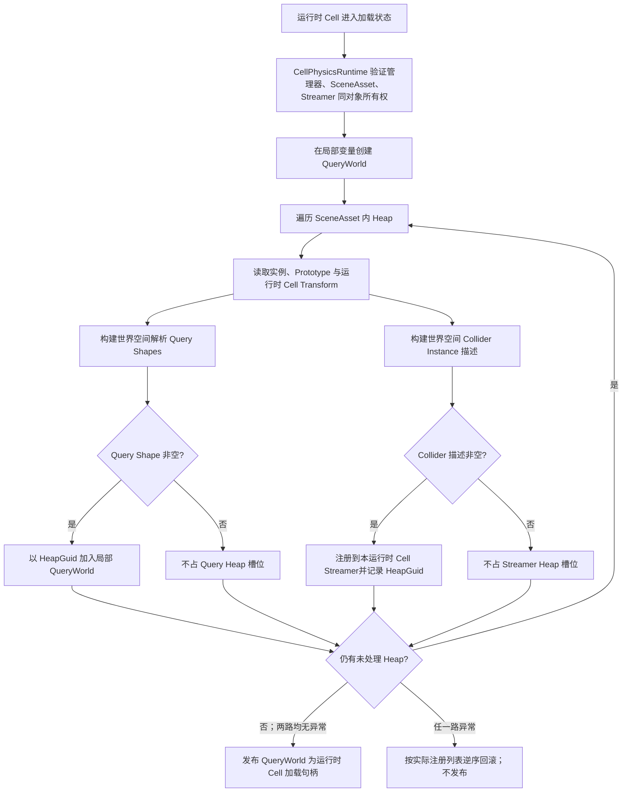
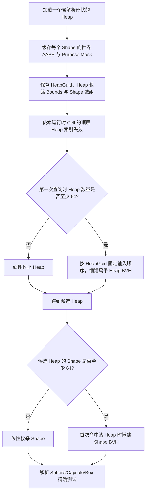
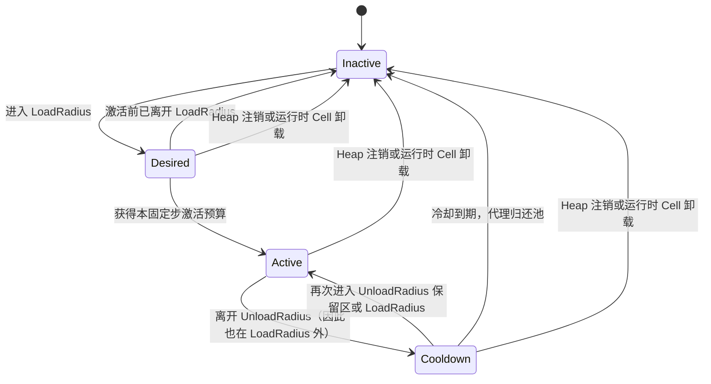
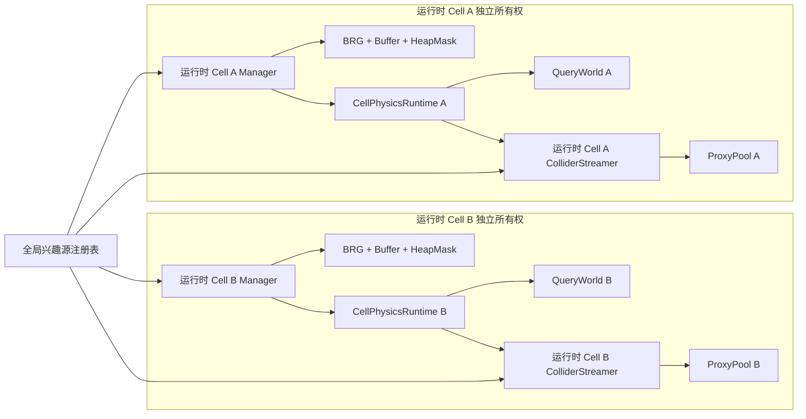

# Unity 植被多运行时 Cell 物理查询与 Collider 流送架构

**标签**：#unity #architecture #physics #performance
**来源**：工程实践抽象 - Unity 2022.3 LTS 多 Cell 植被物理源码、自动化验证与历史 A/B 性能报告
**收录日期**：2026-08-25
**来源日期**：2026-08-26
**更新日期**：2026-08-26
**状态**：📘 有效
**可信度**：⭐⭐⭐⭐（生命周期与状态机有源码和自动化支撑；Collider 大规模数据来自历史 Windows Editor A/B，Quest 与全局预算仍未验证）
**适用版本**：Unity 2022.3 LTS、PhysX、Additive Scene；其它 Unity 版本需复核物理同步与场景生命周期

---

### 概要

大规模植被物理不应只有“为全部植物创建 Collider”和“完全没有碰撞”两个选项。可复用的拆分方式是：每个运行时 Cell 常驻一个轻量解析查询世界，用于 Raycast、Overlap 和 Sweep；只有兴趣源附近的实例才从对象池取得真实 PhysX Collider 代理。多个运行时 Cell 可以共享同一批兴趣源，但必须分别拥有查询数据、代理池、半径、预算和卸载生命周期。

本文的 **运行时 Cell** 指“一个场景管理器 + 一份场景植被资产 + 一套独立渲染/物理资源”；资产内部包含多个 **Heap**。Heap 是空间粗筛单元，不是独立 Scene、GameObject 或 BRG Batch。

本文运行时术语统一如下：

- **SceneAsset**：一个运行时 Cell 的作者数据资产，包含 Prototype 槽位和多个 Heap。
- **Prototype**：一种植物的共享渲染与碰撞描述；实例用本 SceneAsset 内的 PrototypeId 指向它。
- **StableGuid**：实例在一个 SceneAsset 内的持久身份；QueryWorld、ColliderStreamer 与作者工具用它关联同一株植物。
- **Query Shape**：由 Prototype 碰撞描述和实例变换得到的解析 Sphere、Capsule 或 Box；不包括 ConvexMesh。
- **Purpose / Purpose Mask**：作者可多选的碰撞用途位标志。查询传入用途掩码，只让至少共享一个用途位的 Heap/Shape 成为候选；BVH 节点保存子树所有 Shape 用途的按位 OR，用于整棵子树提前拒绝。它不是 Unity Layer。
- **Proxy**：从按 Shape 类型分池的对象池取得、承载一个真实 Unity Collider 的运行 GameObject。对进入 Streamer 的实例，映射是 `1 实例 → N 个 Collider Shape → 激活时 N 个 Proxy`；状态机与激活候选按实例推进，但代理容量按 Shape 数增长。
- **激活预算**：`maxActivationsPerFixedUpdate` 计的是本运行时 Cell 每固定步最多新激活的**实例数**，不是 Proxy/Collider 数。一个获批实例会在同次 `Activate` 中为其全部 N 个 Shape 取得 N 个 Proxy，所以单步新增 Proxy 上限还取决于候选实例的 Shape 数；AllResident 会跳过该实例预算。
- **DesiredReferenceCount**：本固定步内，有多少有效兴趣源让实例进入各自运行时 Cell 的 LoadRadius；大于零表示未激活实例可以竞争新激活预算。
- **RetainReferenceCount**：本固定步内，有多少有效兴趣源让已激活实例仍位于各自运行时 Cell 的 UnloadRadius；大于零表示已有代理应继续保留。由于 `UnloadRadius >= LoadRadius`，Desired 引用同时也是 Retain 引用。

本文保留两个匿名工程快照。2026-08-25 基线使用 Unity `2022.3.62f3`、Windows Editor、Android 构建目标配置，同轮总门禁为 EditMode `239/239`、PlayMode `11/11`，QueryWorld 的 Heap/Shape 宽相位仍为线性枚举。2026-08-26 查询优化增量在相同 Unity/Editor/BuildTarget 口径下引入 Heap 与 Heap 内 Shape 两级懒建 BVH，最终门禁为 EditMode `244/244`、PlayMode `11/11`，其中 Physics EditMode 为 `26/26`；新增 5 项都属于 EditMode，PlayMode 清单未增加。源码证据索引为 `VegetationCellPhysicsRuntime.LoadCell/UnloadCell`、`VegetationPhysicsHeapFactory`、`VegetationQueryWorld/VegetationBoundsIndex`、`VegetationColliderStreamer.Step/EvaluateInterest/ActivationCandidateComparer` 和 `VegetationColliderProxyPool`；自动化入口为 `VegetationQueryWorldTests`、`VegetationColliderStreamerTests`、`VegetationCellPhysicsSmokeTests`、`VegetationAdditiveCellScenePlayModeTests` 与 `VegetationMultiCellRenderPhysicsScenePlayModeTests`。阿卡西不保存私有路径、提交号和 RunId，所以这些名称只能定位证据类型，不能让外部读者检出同一工程快照；本记录据此把它们称为“固定日期的源码/测试摘要”，而不是公开可复现证明。报告没有源码树或程序集哈希，因此“代码、测试和报告同批留档且工作路径干净”仍只是中等强度的精确版本绑定。

页首“📘 有效”表示本文对当前实现、证据与缺口的描述仍有效，不表示已确认假阴性的实现可以不经修复直接作为生产查询正确性门禁。

### 内容

#### 一、为什么需要 QueryWorld 与 ColliderStreamer 两条路径

| 路径 | 保存内容 | 典型用途 | 生命周期与成本 |
|---|---|---|---|
| QueryWorld | 每个实例的解析 Sphere/Capsule/Box 形状与 Heap 粗筛 Bounds | 玩法射线、范围检测、扫掠、目标选择 | 运行时 Cell 加载时注册，卸载时整体释放；不依赖 PhysX 代理是否激活 |
| ColliderStreamer | 可创建真实 Collider 的实例描述、状态机和代理池；ConvexMesh 只走此路径 | Rigidbody 接触、触发器、角色和动态刚体碰撞 | 每固定步只维持兴趣源附近工作集；可切换到 AllResident 对照模式 |

QueryWorld 避免为了偶发查询让数千个 GameObject/Collider 常驻；ColliderStreamer 又保留了 Unity 物理接触语义。两条路径读取同一份 Prototype 碰撞描述和同一 StableGuid，但不能互相代替：解析查询不会自动产生 PhysX 接触，PhysX 代理未激活也不应让玩法查询失效。

解析路径只接收可确定计算的 Sphere、Capsule 和 Box；ConvexMesh 留给 PhysX。这样 QueryWorld 的结果不依赖临时 Collider GameObject，也避免自行重写凸网格碰撞算法。

#### 二、兴趣源只描述运动，运行时 Cell 决定策略

兴趣源可以代表玩家、手、载具、投射物或其它动态对象。共享快照包含：

- 当前世界位置；
- 速度；
- 是否启用高速预测及预测时长；
- 竞争激活预算时的优先级。

**物理加载半径和卸载半径不属于兴趣源。** 它们属于每个运行时 Cell 的 ColliderStreamer。一个玩家同时经过多个 Additive Scene 时，各运行时 Cell 可以使用不同密度、碰撞复杂度和预算，而不会被共享源上的一个半径覆盖。卸载半径必须不小于加载半径，以形成空间滞回。

高速源用“当前位置到预测位置”的线段参与 Heap 与实例 Bounds 距离测试，降低快速运动跨过加载球造成的碰撞迟到。预测只提前移动工作集，不会让静态 Collider 跟随 Shader 中的草叶形变。

#### 三、运行时 Cell 加载时如何生成两套物理工作集

当前所有权不是“ColliderStreamer 包含 QueryWorld”，而是由同对象上的物理编排组件拆分两条路径：

| 对象 | 创建与所有者 | 注册键 / 状态 | 查询与销毁责任 |
|---|---|---|---|
| `VegetationCellPhysicsRuntime` | 每个运行时 Cell 的管理器对象独占一个 | 保存已加载管理器、Cell Transform、实际注册到 Streamer 的 HeapGuid 列表；非空 QueryWorld 本身就是加载句柄 | 编排加载/失败回滚/卸载；对玩法暴露解析查询入口 |
| `VegetationQueryWorld` | 由 CellPhysicsRuntime 在加载局部变量中创建，全部 Heap 成功后才发布到字段 | 以 HeapGuid 保存解析 Shape 与粗筛 Bounds | 执行 Raycast/Overlap/Sweep；由 CellPhysicsRuntime Dispose |
| `VegetationColliderStreamer` | 同一 GameObject 上的独立组件，每运行时 Cell 独占 | 以 HeapGuid 保存 PhysX 实例状态，另持有固定步预算和半径 | 推进状态机、向 ProxyPool 取还代理；由 CellPhysicsRuntime 按实际注册列表反注册，但组件拥有自己的池生命周期 |
| `VegetationColliderProxyPool` | ColliderStreamer 创建并独占 | 按 Collider 类型复用 Proxy | ColliderStreamer 激活/归还；Streamer 销毁时 Dispose |

物理运行组件必须和渲染管理器、ColliderStreamer 位于同一个 GameObject，并只读取该管理器绑定的 SceneAsset。它不允许跨 Additive Scene 绑定其它运行时 Cell 的组件，也不允许两个运行时 Cell 共享同一个 Streamer。这个门禁让卸载时能够精确反注册自己创建的 Heap 和代理。

空运行时 Cell、只含查询形状的运行时 Cell、只含 PhysX 形状的运行时 Cell 都是合法状态。加载态应由 QueryWorld 句柄和所有权记录判断，不能用“注册 Collider Heap 数量大于零”判断，否则空工作集会在 Update 中被反复重建。

##### 两级懒建查询索引如何生成

2026-08-26 增量没有把全部运行时 Cell 合并为一个全局树；每个 QueryWorld 仍独立持有自己的两级索引：

两个索引复用同一个扁平 `VegetationBoundsIndex`：阈值为 64，叶节点最多 8 项；节点保存子树 AABB、连续索引区间和 Purpose 位或掩码。建树选择元素中心分布最长的轴，每层对子区间重新排序，再按中位数二分；中心并列时以原始索引收尾。查询用复用数组栈迭代遍历。Bounds 查询完整包含某个节点时会直接追加该节点连续区间；Purpose 掩码仍用于剪枝或逐项过滤。

阈值 64 和叶容量 8 是当前实现常量，不是已经证明最优的通用参数；当前也没有 63/64 两侧的性能交叉点报告。

Heap 创建时就分配并填充 Shape Bounds/Purpose 数组；有至少 64 个 Shape 的 Heap 只有在第一次成为候选时才构建自己的 BVH。增加、替换或移除 Heap 会使顶层索引失效，下一次查询重新按 HeapGuid 排序并建树；全局原点漂移不会改变拓扑，而是以 `O(H + S)` 平移 Heap、Shape、缓存 Bounds 与已经构建的节点。候选 List、Overlap 去重 HashSet 和遍历栈会复用并保留历史最大容量，整个实现按单运行时线程串行查询/修改设计，不支持查询期间并发注册。

Raycast 先以射线/AABB 找候选 Heap 与 Shape，再做解析命中；OverlapCapsule 先构造胶囊 AABB，并用线段到 Heap AABB 距离补一次粗筛，再做接触测试和 StableGuid 去重/排序；SweepCapsule 以起终胶囊 AABB 的并集筛选，再对候选做最多 64 次保守推进。BVH 只改变候选生成，不替代 Sphere/Capsule/OBB 窄相位。外层 Heap Bounds 必须包含其全部 Query Shape 才能保证无假阴性；当前数据链并没有满足这一前提，详见“已确认的正确性问题”。

#### 四、Streamed 固定步与状态机

每个固定步的处理顺序是：

1. 从已注册且有效的兴趣源获取不可变快照。
2. 完全 Inactive 的 Heap 只用预测线段与 Heap Bounds 检查加载半径；仍有 Desired/Active/Cooldown 实例的 Heap 必须继续处理，直到状态清空。
3. 对候选 Heap 中的实例计算 DesiredReferenceCount 和 RetainReferenceCount。多个源可以同时引用同一实例。
4. 把尚未激活的 Desired 实例加入候选列表，按高速引用、优先级、距离与 StableGuid 的确定性键排序。
5. 在 `maxActivationsPerFixedUpdate` 的实例预算内逐个激活候选；每个获批实例一次性为其全部 Collider Shape 从对应类型池取得 Proxy 并配置 Collider。
6. 推进离开范围的 Cooldown，把到期代理归还对象池。
7. 本固定步若有代理变换或增删，统一调用一次 `Physics.SyncTransforms`。

多来源聚合的当前精确规则是：每个来源都用其 `Position → PredictedPosition` 预测线段到实例 Bounds 的平方距离；距离不超过 LoadRadius 时同时增加 Desired 与 Retain，距离只在 LoadRadius 与 UnloadRadius 之间时只增加 Retain。候选取所有 Desired 来源中的最高 Priority；同一最高 Priority 下取最小平方距离，并记录是否存在任一 Desired 高速来源。全 Cell 候选最终按“有高速引用优先 → Priority 降序 → 平方距离升序 → StableGuid 升序”排列。一个实例只产生一个候选，不会按来源重复占用预算；StableGuid 负责完全同键时的确定性收尾。

在 **Streamed** 模式中，`maxActivationsPerFixedUpdate = 0` 表示暂停新实例激活，而不是卸载已有代理。预算消耗一次只代表一个实例，不能据此推断只新增一个 Collider；该实例有多少 Shape 就会取得多少 Proxy。AllResident 模式仍复用同一状态机，但把本运行时 Cell 的实例视为始终被引用并明确跳过流式激活上限，因此不受这个零值阻塞；它适合小规模场景或 A/B 对照，不应成为大场景默认配置。

进入“仅在 UnloadRadius 内、但尚未进入 LoadRadius”的保留区时，已有 Active/Cooldown 代理可以继续保留或恢复 Active；Inactive 实例不能仅凭 RetainReferenceCount 首次激活，仍要由 DesiredReferenceCount 竞争加载预算。这样两个半径形成的是嵌套滞回，而不是必须分别跨越的两个无关事件。

Cooldown 的所有者是每个运行时 Cell 的 ColliderStreamer；`cooldownSeconds` 是非负秒数，默认 0.5 秒，并在每次 FixedUpdate 用该步 `fixedDeltaTime` 递减。Active 实例首次同时失去 Desired 与 Retain 引用时进入 Cooldown，并把剩余时间重置为完整配置值；配置为 0 时同一步立即归还全部 Shape Proxy 并进入 Inactive。到期前重新进入 LoadRadius 或 UnloadRadius 保留区会恢复 Active、把剩余时间清零；以后再次离开时重新从完整时长开始。Heap 注销或运行时 Cell 卸载不等待倒计时，会把 Desired、Active、Cooldown 全部强制清理为 Inactive 并归还现有 Proxy。

#### 五、多运行时 Cell 如何共同运转

同一个兴趣源会注册到全部已启用消费者，所以玩家跨越运行时 Cell 边界时不需要把源从 A 手工搬到 B。每个运行时 Cell 只在自己的 Heap 和实例中查询，结果、代理池、加载半径和预算不会合并。Additive Scene B 卸载后只释放 B 的物理与渲染资源，A 的计数和代理应保持不变。

这种隔离简化了所有权和故障恢复，但有一个重要的容量边界：激活预算和 `Physics.SyncTransforms` 次数是**每运行时 Cell**的。若同时加载很多运行时 Cell，总激活量上限接近各运行时 Cell 预算之和，且多个 Streamer 可能各自同步一次。系统目前没有跨运行时 Cell 全局物理调度器，不能把单运行时 Cell 配置直接当作整世界预算。

#### 六、卸载与失败回滚

运行时 Cell 加载中若任一 Heap 转换或注册失败，应按已注册顺序的逆序清理：

1. 从实际完成注册的 Streamer 逐一反注册 Heap，而不是读取可能已被 Inspector 改写的新引用。
2. 释放这些 Heap 的所有活动代理并归还对象池。
3. Dispose 尚未发布或已发布的 QueryWorld。
4. 清空已加载管理器、Streamer、运行时 Cell Transform 和 HeapGuid 所有权记录。
5. 保留原始 SceneAsset；加载失败不能修改作者数据。

正常卸载走同一条清理路径。QueryWorld 清空解析形状和粗筛结构，Streamer 注销本运行时 Cell 的 Heap 并释放代理。渲染侧另行等待剔除 Job、移除 Batch、释放 Buffer 和 NativeArray。Mesh、Material 或 SceneAsset 本身是否从内存卸载，仍由外层 Additive Scene、AssetBundle 或资源句柄所有者决定。

#### 七、性能证据一：2026-08-25 线性宽相位历史观测（当前不可复跑）

2026-08-25 源码快照中的 QueryWorld Heap 粗筛为线性枚举。保留的验证摘要记录了 Windows Editor 主线程、空 Shape 宽相位、每组 3 次取中位数的结果；单位是微秒：

| 已注册 Query Heap | Ray | Overlap |
|---:|---:|---:|
| 123 | 3.813 | 4.126 |
| 1024 | 34.300 | 32.414 |
| 4096 | 139.133 | 132.398 |

当前交付没有保留该观测的独立测试案例或报告，也没有记录 CPU 型号、预热流程、Ray/Overlap 几何、Heap 空间分布和命中分布，所以它**不能在当前快照直接复跑**，也不能独立核对绝对耗时。它只能与当日线性枚举源码一起作为“空 Shape 宽相位成本随 Heap 数量近似线性增长”的历史方向性证据，不能当作 Quest ARM、IL2CPP 或包含真实候选 Shape 的耗时。2026-08-26 两级 BVH 已改变当前实现，不得把这三行旧数据冒充为新索引的 before/after 基准。

#### 八、性能证据二：2026-08-26 两级 BVH 增量

新增回归证明了以下有限范围：65 个 Heap、每 Heap 64 个 Sphere 时，Raycast、单命中 OverlapCapsule 与 SweepCapsule 能找到唯一目标；索引建立后的 Heap 替换、移除和全局原点平移保持同步；不同 StableGuid 的完全并列 Ray/Sweep 以稳定身份收尾；预热后的单目标 Overlap 连续 256 次在当前 Editor 线程记录为托管分配增量 0。它们没有覆盖长射线、63/64 阈值两侧、大量重叠、同实例多 Shape 接触详情、多 Cell 大规模实际查询或 Quest。

当前唯一直接性能数字来自一个隔离的 Windows Unity Editor 微基准：

| 项目 | 固定条件 |
|---|---|
| 数据 | 4096 个尺寸为 1 的 AABB，沿 X 轴每 4 米排列 |
| 查询 | 只命中一个候选的稀疏 Bounds 查询 |
| 冷建树 | 测量前以一次全覆盖查询完成，不计入 ticks |
| 热身 | BVH 与简化线性扫描各 32 次 |
| 测量 | 固定顺序先 BVH 后线性，各连续 2048 次，只保存一组聚合 Stopwatch ticks |
| 结果 | BVH `31,961` ticks；简化线性 `1,407,896` ticks；线性/BVH 约 `44.05` |

这个 `44.05×` 只描述该次稀疏 AABB 候选夹具中的聚合差异。线性对照不是旧版完整 QueryWorld，测试没有包含两级 Heap→Shape 路径、Sphere/Capsule/Box 窄相位、首次建树、增删重建，也没有记录 CPU、Stopwatch 频率、独立重复、方差、P95/P99 或随机交错顺序。`BuildTarget=Android` 只是 Editor 的当前构建目标；该测试运行于 Editor 测试程序集，不是 Android Player 或 Quest。两次完整套件耗时也因新增了 5 个用例，不能用来评价优化幅度。

复杂度必须按阶段陈述。设 `H` 为 Heap 数、`S` 为 Shape 总数、`K` 为候选数：

- Heap 注册缓存 Shape AABB/Purpose 为 `O(S_i)`；顶层 HeapGuid 排序为 `O(H log H)`。
- 建树每层对子区间重新 `Array.Sort`，递推上界为 `O(n log²n)`，不是标准 `O(n log n)`；索引常驻内存为 `O(n)`。
- 良好分布、已经预热的稀疏查询趋近 `O(log n + K)`；不能简写成“查询已经从 O(n) 降为 O(log n)”。
- 全覆盖 Bounds、大量重叠或同中心 AABB、超大 Bounds、长射线和长 Sweep 都可能接近 `O(n)`；两级最坏仍为 `O(H + S)`，Sweep 的解析部分还可能对每个候选做最多 64 次推进。
- 增删/替换会让顶层树在下一次查询重建；Shape 树又延迟到该 Heap 首次成为候选，尖峰可能发生在玩家第一次靠近区域。建树先创建容量 `Count × 2` 的节点 List，再复制成精确数组，会形成额外且尚未量化的冷查询临时内存峰值，当前没有分配或时延报告。

因此可沉淀的结论是“两级懒建 BVH 已有正确性回归和一次有利的预热稀疏 Editor 微基准”，不是“完整系统或 Quest 查询提速 44 倍”。

#### 九、性能证据三：历史 Collider 常驻与流送 A/B

一份 2026-08-06 的历史 Windows Editor 基准使用 Intel Core i7-12700、RTX 3060、独立 Local PhysicsScene、50 Hz 固定步、5/7 米加载/卸载半径、16 个动态 Kinematic 探针和 120 个稳态样本。当前交付已删除该独立基准案例和报告，因此下表是**保留的历史证据**，不是当前仓库可直接复跑的性能门禁。

测量口径如下：

- **运行时核心**：`ColliderStreamer.ManualFixedStep`、动态探针更新、`Physics.SyncTransforms` 与 `PhysicsScene.Simulate` 的合计；表中报告 120 个稳态样本的 P95。
- **50 Hz 单核时间占用**：历史报告以运行时核心每步 P50 除以 20 ms 得到单核时间比例；它不是整机 CPU 利用率，也不是整帧耗时。保留下来的摘要没有逐档 P50 原值，因此该百分比是**不可由本文独立复算的历史派生列**，只能连同此限制引用。
- **额外查询**：每个样本另做 128 条固定批次、同一局部区域的 Raycast，用于单独观察查询；它们不计入“运行时核心”列。
- **GC**：只统计上述运行时核心范围内每固定步分配；不能代表整进程或其它玩法系统。

| 实例 | Collider Shape（1 Shape → 1 Proxy） | AllResident 活跃 Proxy | Streamed 活跃 Proxy | Proxy 减少 | 运行时核心 P95：常驻 / 流送 | 历史派生 50 Hz 单核时间占用：常驻 / 流送 | 核心 GC B/步 |
|---:|---:|---:|---:|---:|---:|---:|---:|
| 1024 | 2198 | 2198 | 560 | 74.5% | 0.5719 / 0.5214 ms | 2.6% / 2.3% | 0 / 0 |
| 4096 | 7324 | 7324 | 560 | 92.4% | 1.9911 / 0.5276 ms | 9.4% / 2.3% | 0 / 0 |
| 8192 | 13788 | 13788 | 560 | 95.9% | 5.0894 / 0.4887 ms | 21.8% / 2.3% | 0 / 0 |
| 16384 | 27576 | 27576 | 560 | 98.0% | 7.4740 / 0.4842 ms | 36.0% / 2.3% | 0 / 0 |
| 32768 | 54042 | 54042 | 560 | 99.0% | 14.8610 / 0.5051 ms | 72.0% / 2.3% | 0 / 0 |

历史报告还记录代理归还后再次进入时没有创建新代理，支持池复用路径。报告中的注册耗时和单次最大固定步没有保留足够的计时边界、冷池状态与采样窗口，本记录不再把那些精确值升级为可复用指标。可复用结论是“限制真实 PhysX 工作集能显著降低大规模常驻代理成本”，而不是“所有设备都固定维持 0.5 ms”。报告没有提供 Quest、ARM PhysX、Android IL2CPP、XR Runtime、热降频或整进程内存证据。

#### 十、已确认问题、实现边界与推断风险

##### 已确认的正确性问题

1. **Query Heap Bounds 没有保证包住全部 Query Shape。** 编译器明确只用 Prototype 的视觉 Bounds 聚合 `WorldBoundsAtBake`，并刻意不让碰撞体进入该渲染 Bounds；Query Shape 则由独立碰撞描述生成。运行时仍把这个视觉 Bounds 直接注册成 QueryWorld 外层 Heap Bounds，Prototype 自检又没有检查碰撞 Bounds 被视觉 Bounds 包含。只要一个合法 Sphere/Capsule/Box 伸出视觉 Bounds，外层线性或 BVH 粗筛都可能先拒绝 Heap，后续 Shape 窄相位永远不会发生，形成确定性假阴性。这不是 2026-08-26 BVH 新引入的回归，但新索引仍依赖同一错误前提。现有“不相交 Heap Bounds 会拒绝内部 Shape”测试反而固化了该前提，没有门禁生产数据必须满足包含关系。修复应使用独立 Query Heap Bounds，或在注册时聚合视觉 Bounds 与全部 Query Shape Bounds，并增加外伸形状回归。

##### 已确认的实现边界

1. **查询索引是混合且按运行时 Cell 隔离。** 少于 64 个 Heap 或 Shape 时仍线性枚举；达到阈值才在首次查询懒建各自 BVH。多个运行时 Cell 不共享索引，单 Cell 的良好稀疏查询收益不会自动消除多 Cell 回调、内存与首查总量。
2. **最坏复杂度仍是线性。** 大范围、长射线/扫掠、严重重叠、巨型或同中心 Bounds 会让候选接近全集；减少 PhysX 代理数也不会自动减少 QueryWorld 的解析 Shape 数。
3. **每运行时 Cell 预算不等于世界预算。** 源码中每个 Streamer 独立推进激活预算，并可各自触发一次 `Physics.SyncTransforms`；多运行时 Cell 总量接近各自配置之和，当前没有跨运行时 Cell 全局物理调度器。
4. **渲染 Heap 激活与物理流送是两条策略。** 源码显示它们可以读取同一兴趣源，但半径、更新频率、状态和预算独立；ActiveHeapMask 只控制渲染剔除，不能证明某个 Collider Proxy 已存在。

##### 尚未实测的风险与建议

1. **半径迁移的序列化一致性风险。** 设计已把半径归到每运行时 Cell Streamer，但旧序列化数据、Inspector、测试与外部 API 是否都完成迁移需要逐项验证；不要仅凭新字段位置推断所有旧资产已安全升级。
2. **对象池首次扩容尖峰。** 历史报告只证明代理归还后的再次进入没有新建代理；当前没有目标设备上的冷池首激活峰值。可以按场景预算预热或分帧加载，并明确“碰撞尚未就绪”时的玩法策略，但效果必须另测。
3. **全局调度收益。** 多运行时 Cell 总预算可能需要统一调度只是由当前所有权模型推导出的演进方向；是否值得增加中心调度器，应先记录整世界代理数、激活峰值、SyncTransforms 次数和最坏固定步。
4. **同实例多 Shape 的接触详情可能改变。** 一个实例的多个 Shape 共享 StableGuid。Overlap 会在首个命中后按 StableGuid 去重；大集合跨过 64 阈值后候选顺序从原数组变为 BVH 顺序，因此结果数量和实例身份稳定，但 ShapeType、Purpose、Point、Normal 可能变化。Ray/Sweep 在同 StableGuid、同 HeapGuid、同距离/比例时也没有更细收尾。玩法若消费接触详情，必须定义 Shape 级身份或稳定优先级并补阈值两侧回归。
5. **非有限输入与几何容差未门禁。** 公共查询没有统一拒绝 NaN/Infinity，污染后的 Bounds 可能错误剪枝；Sweep 窄相位使用小容差，但 AABB 粗筛没有同步膨胀。还缺少擦边、零距离、极大坐标、重复原点漂移和长射线测试。
6. **冷建树与重建峰值。** 预热 0 托管分配不覆盖第一次查询、Heap 增删后的顶层重建或多结果容器扩容。应在真实 Cell 分布上记录冷/热 P50、P95/P99、托管峰值和 Quest 主线程时间。

#### 十一、当前状态与采用检查清单

- [x] **当前满足**：QueryWorld 与 ColliderStreamer 从同一 StableGuid 和 Prototype 碰撞描述生成各自工作集；ConvexMesh 只进入 PhysX。
- [x] **当前满足**：兴趣源只提供位置、预测运动和优先级；半径、预算、QueryWorld、Streamer 与代理池按运行时 Cell 隔离。
- [x] **当前满足**：状态机具有嵌套加载/卸载半径、Cooldown、确定性候选排序和 Streamed 固定步预算。
- [x] **当前满足**：运行时 Cell 卸载反注册实际 Collider Heap、Dispose QueryWorld 并清空所有权记录；外层资源句柄另行释放资产。
- [x] **当前满足**：大集合 QueryWorld 使用 Heap/Shape 两级懒建扁平 BVH，小于 64 项回退线性；增删失效顶层索引，原点漂移平移已建索引。目标回归与 2026-08-26 总门禁 EditMode `244/244`、PlayMode `11/11` 通过。
- [ ] **当前已知不满足**：QueryWorld 的 Heap 粗筛 Bounds 必须覆盖全部 Query Shape；当前视觉 Bounds 可能漏包外伸形状。相同 Bounds 也传给 Streamer 粗筛，但 Collider 激活影响还需独立回归，不能把它冒充为已经动态复现的第二个缺陷。
- [ ] **尚未验证**：冷建树/重建峰值、63/64 阈值两侧、同实例多 Shape 接触详情、长射线与重叠退化、多 Cell 大规模实际查询，以及 Quest QueryWorld/固定步成本。
- [ ] **尚未验证**：整世界而非单运行时 Cell 的代理总数、激活峰值、SyncTransforms 次数和冷池首次扩容。
- [ ] **采用要求**：报告必须分别标注 Editor/设备、常驻/稳态、查询负载、固定步、样本数、原始统计量和当前可复现状态；不可复算的历史派生列不得成为门禁。

### 相关记录

- [统一 BRG 架构](./unity-vegetation-unified-brg-architecture.md) - 运行时 Cell、Heap、GPU Buffer 和剔除生命周期。
- [植被 Painter 作者工作流与事务设计](./unity-vegetation-painter-authoring-transaction-workflow.md) - 碰撞描述如何从 Prototype 与 Heap 作者数据产生。
- [Quest 3S BRG 与普通 GO 性能基线](./quest-vegetation-brg-performance-lighting-validation.md) - 真机渲染证据；不能替代本记录缺失的 Quest 物理验证。

### 验证记录

- [2026-08-25] 复核共享兴趣源、每运行时 Cell 半径、CellPhysicsRuntime/QueryWorld/Streamer 双路径、确定性多来源候选排序、Additive Scene 所有权、失败回滚和卸载实现；当日严格自动化摘要为 EditMode `239/239`、PlayMode `11/11`，但不含可公开检出的私有快照标识。
- [2026-08-25] 保留 2026-08-06 Windows Editor Collider A/B 数字作为历史证据，明确其专项案例已从当前交付移除且不能升级为 Quest 结论。
- [2026-08-25] 将视觉 Heap Bounds 未覆盖外伸 Query Shape 记录为源码可确认的正确性问题；将线性 broadphase 与每运行时 Cell 独立预算记录为实现边界，并把迁移、预热和全局调度保留为待测风险或建议。
- [2026-08-26] 审查 Heap 与 Heap 内 Shape 两级懒建 BVH、阈值/叶容量、建树与查询复杂度、索引失效/原点平移和新增回归；最终匿名门禁为 EditMode `244/244`、PlayMode `11/11`。
- [2026-08-26] 保留 4096 AABB、全覆盖冷建一次、两侧各预热 32 次、各测量 2048 次稀疏 Bounds 查询的单次 Editor 微基准原始 ticks 与 `≈44.05×` 推导，同时明确它不含建树、两级 QueryWorld、解析窄相位或 Quest；把外伸 Shape 假阴性、同实例多 Shape 详情、非有限输入和冷建树峰值继续列为边界。

---
