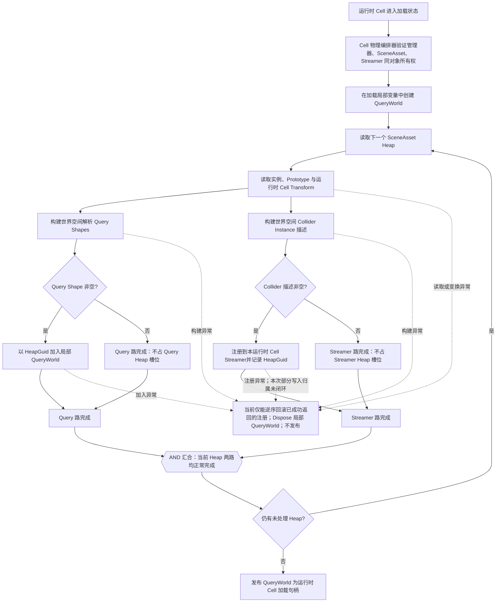
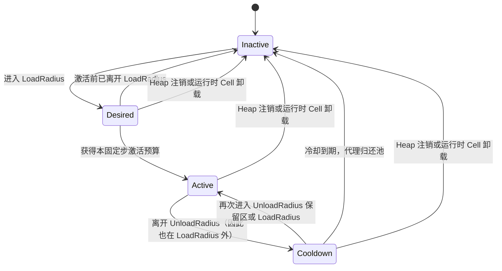
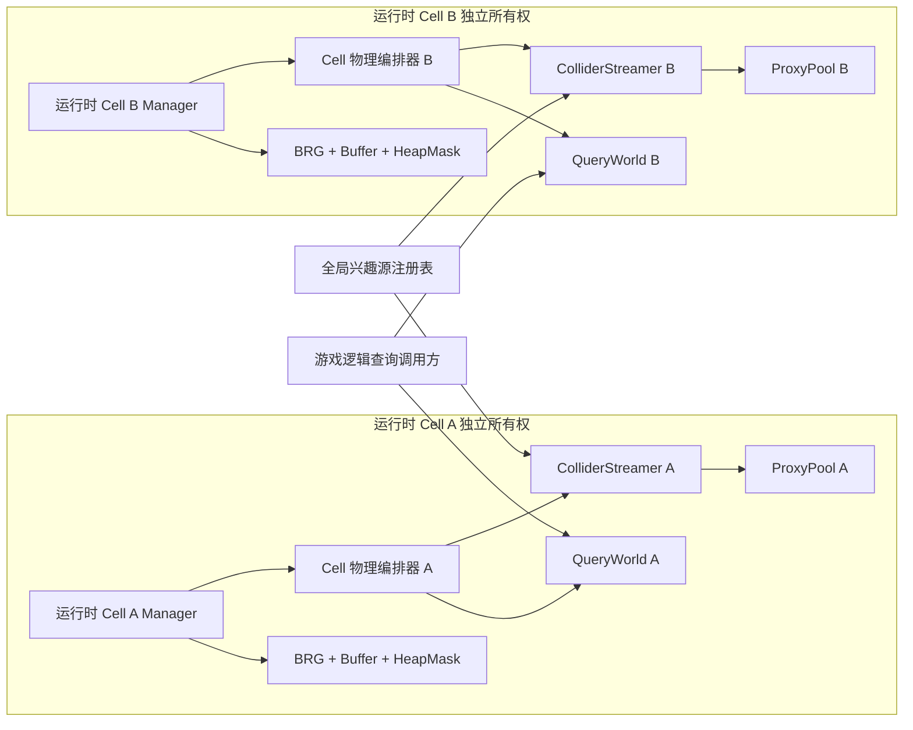

# Unity 植被多运行时 Cell 物理查询与 Collider 流送架构

**标签**：#unity #architecture #physics #performance
**来源**：匿名参考实现源码分析；Git 提交 `f0fef16849cfb8945e9928e5219a140ee250fcf4`，模块 tree `4700f76e0b087fe3935c06e660ee732bbf55c87a`
**收录日期**：2026-08-25
**更新日期**：2026-09-03
**状态**：📘 有效
**可信度**：⭐⭐⭐（冻结源码静态链路可复核；未绑定异常注入、完整运行回归或设备测量）
**适用版本**：Unity 2022.3 LTS、PhysX、Additive Scene；其它 Unity 版本需复核物理同步与场景生命周期

---

### 概要

大规模植被物理不应只有“为全部植物创建 Collider”和“完全没有碰撞”两个选项。本文研究三个问题：如何让玩法查询不依赖真实 Collider 是否驻留；如何让多个 Additive Scene（在主场景运行时叠加加载、可独立卸载的场景）中的运行时 Cell 共享兴趣源而保持所有权隔离；以及这些选择对固定步、查询与常驻内存意味着什么。参考实现的基本答案是：每个运行时 Cell 常驻一个轻量 QueryWorld，供游戏逻辑显式发起 Raycast、Overlap 和 Sweep；这些查询直接对数学形状求交，不进入 PhysX 模拟。兴趣源只驱动 ColliderStreamer，让附近实例临时获得真实 PhysX Collider 代理，并在离开范围后复用这些代理而非反复创建、销毁 GameObject。

本文不试图证明 Quest 性能、不设计完整世界级调度器，也不把渲染剔除、解析查询和 PhysX 代理合并成一套半径。对“当前实现”的判断来自冻结源码的静态调用链；文中提到的测试代码只提供复现入口，没有与本文绑定的运行报告。文章因此只说明参考实现的现状、生产必须补齐的正确性契约，以及不影响当前正确性的可选扩展，不给出设备性能倍率或完整回归通过结论。

#### 术语与身份约定

- **SceneAsset**：一个运行时 Cell 的作者数据资产，包含 Prototype 槽位和多个 Heap。
- **运行时 Cell**：一个场景管理器、一份 SceneAsset 和一套独立渲染/物理资源组成的可加载单元；同一 SceneAsset 被加载两次时形成两个不同运行时 Cell。
- **Heap**：SceneAsset 内的空间粗筛单元，不是程序内存中的“堆”，也不是独立 Scene、GameObject 或渲染批次。Heap 的逻辑分区由作者数据决定，运行时查询与 Collider 流送都按它先做粗筛。
- **HeapGuid**：Heap 在所属 SceneAsset 内的持久 128 位身份，用于注册、替换、注销与调试；它不代替实例 StableGuid。
- **Prototype**：一种植物的共享渲染与碰撞描述；实例用本 SceneAsset 内的 PrototypeId 指向它。
- **StableGuid**：实例在一个 SceneAsset 内的持久 128 位身份；QueryWorld、ColliderStreamer 与作者工具用它关联同一株植物。它在该 SceneAsset 的全部 Heap 之间必须唯一且非空；跨运行时 Cell 时还需和 RuntimeCellIdentity 组合。
- **RuntimeCellIdentity**：一次加载期间区分运行时 Cell 的临时身份。同一 SceneAsset 同时加载两次或卸载后重载时必须取得不同身份；它不写入存档。本文用它描述跨 Cell 查询尚需补齐的契约，不宣称当前源码已有同名字段。
- **QueryWorld**：一个运行时 Cell 常驻的解析查询数据与入口；它保存 Heap、Query Shape 和派生空间索引。所谓“解析查询”是直接用数学几何计算命中，不创建 Collider、不进入 PhysX 模拟，也不会产生刚体接触或触发事件。
- **对象池（ProxyPool）**：预先保留或回收可复用 Collider 代理的容器，目的是避免实例每次靠近、离开时都创建和销毁 GameObject。
- **ColliderStreamer**：一个运行时 Cell 的真实 Collider 工作集控制器；它根据兴趣源、半径、状态机和预算向对象池借还 Proxy。
- **Query Shape**：由 Prototype 碰撞描述和实例变换得到的解析 Sphere、Capsule 或有向 Box；它是不创建 Unity Collider 也能计算命中的数学几何，不包括 ConvexMesh。
- **BatchRendererGroup（BRG）**：Unity 面向大量实例的批量渲染接口；本文只把它当作相邻的渲染路径，不讨论其内部绘制命令。
- **ActiveHeapMask**：渲染路径中标记哪些 Heap 参加当前渲染剔除的掩码；它不控制 QueryWorld 是否可查，也不证明 Collider Proxy 已激活。
- **AllResident**：ColliderStreamer 的对照驻留模式；忽略兴趣范围和流式激活上限，让所属 Cell 的 Collider 实例全部进入激活流程。它用于小场景或 A/B，不是大场景默认值。
- **Purpose / Purpose Mask**：作者可多选的碰撞用途位标志。查询传入用途掩码，只让至少共享一个用途位的 Heap/Shape 成为候选；BVH 节点保存子树所有 Shape 用途的按位 OR，用于整棵子树提前拒绝。它不是 Unity Layer。
- **Proxy**：从按 Shape 类型分池的对象池取得、承载一个真实 Unity Collider 的运行 GameObject。对进入 Streamer 的实例，映射是 `1 实例 → N 个 Collider Shape → 激活时 N 个 Proxy`；状态机与激活候选按实例推进，但代理容量按 Shape 数增长。
- **激活预算**：`maxActivationsPerFixedUpdate` 计的是本运行时 Cell 每固定步最多新激活的**实例数**，不是 Proxy/Collider 数。一个获批实例会在同次 `Activate` 中为其全部 N 个 Shape 取得 N 个 Proxy，所以单步新增 Proxy 上限还取决于候选实例的 Shape 数；AllResident 会跳过该实例预算。
- **DesiredReferenceCount**：本固定步内，有多少有效兴趣源让实例进入各自运行时 Cell 的 LoadRadius；大于零表示未激活实例可以竞争新激活预算。
- **RetainReferenceCount**：本固定步内，有多少有效兴趣源让已激活实例仍位于各自运行时 Cell 的 UnloadRadius；大于零表示已有代理应继续保留。由于 `UnloadRadius >= LoadRadius`，Desired 引用同时也是 Retain 引用。
- **Floating Origin（浮动原点）**：当世界坐标太大、浮点精度开始下降时，把玩家附近的运行对象整体移回坐标原点附近，同时保存一个累计偏移表示其绝对位置。它解决的是大世界数值精度问题；一次迁移必须让查询、真实 Collider、兴趣源和渲染使用同一个偏移世代。

### 内容

#### 一、为什么需要 QueryWorld 与 ColliderStreamer 两条路径

| 路径 | 保存内容 | 典型用途 | 生命周期与成本 |
|---|---|---|---|
| QueryWorld | 每个实例的解析 Sphere/Capsule/Box 形状与 Heap 粗筛 Bounds | 玩法射线、范围检测、扫掠、目标选择 | 运行时 Cell 加载时注册，卸载时整体释放；不依赖 PhysX 代理是否激活 |
| ColliderStreamer | 可创建真实 Collider 的实例描述、状态机和代理池；ConvexMesh 只走此路径 | Rigidbody 接触、触发器、角色和动态刚体碰撞 | 每固定步只维持兴趣源附近工作集；可切换到 AllResident 对照模式 |

QueryWorld 避免为了偶发查询让数千个 GameObject/Collider 常驻；ColliderStreamer 又保留了 Unity 物理接触语义。两条路径读取同一份 Prototype 碰撞描述和同一 StableGuid，但不能互相代替：解析查询不会自动产生 PhysX 接触，PhysX 代理未激活也不应让玩法查询失效。

解析路径只接收可确定计算的 Sphere、Capsule 和 Box；ConvexMesh 留给 PhysX。这样 QueryWorld 的结果不依赖临时 Collider GameObject，也避免自行重写凸网格碰撞算法。

渲染 Heap 激活、QueryWorld 查询和 ColliderStreamer 流送是三条独立策略。它们可以读取同一份作者数据，但半径、更新时机、状态和预算不互相授权；`ActiveHeapMask` 只控制渲染剔除，不能证明某个 Collider Proxy 已存在，也不能限制游戏逻辑可以查询哪些 Shape。

#### 二、兴趣源只描述运动，运行时 Cell 决定策略

兴趣源可以代表玩家、手、载具、投射物或其它动态对象。每个 ColliderStreamer 在自己的 FixedUpdate 开头，从共享注册表捕获一份本步只读的本地快照；快照包含：

- 当前世界位置；
- 速度；
- 是否启用高速预测及预测时长；
- 竞争激活预算时的优先级。

**物理加载半径和卸载半径不属于兴趣源。** 它们属于每个运行时 Cell 的 ColliderStreamer。一个玩家同时经过多个 Additive Scene 时，各运行时 Cell 可以使用不同密度、碰撞复杂度和预算，而不会被共享源上的一个半径覆盖。卸载半径必须不小于加载半径，以形成空间滞回。

高速源用“当前位置到预测位置”的线段参与 Heap 与实例 Bounds 距离测试，目的是降低快速运动跨过加载球时 Collider 迟到的概率。本文没有给出高速穿越场景的对照数据，因此这属于设计意图，不是已经量化验证的效果；预测也不会让静态 Collider 跟随 Shader 中的草叶形变。

当前没有跨 Cell 的统一快照世代：多个 Streamer 会各自捕获同一批源，通常位于同一个物理帧，但不能据此证明它们读到不可分割的同一版本。需要严格多 Cell 一致性时，应由外层固定步协调器发布带 Tick/坐标世代的单份快照，全部 Cell 只读消费。每次被评估的实例都会从零重新聚合 Desired/Retain 计数，不允许把上一固定步的引用数累加到下一步。

#### 三、运行时 Cell 加载时如何生成两套物理工作集

当前所有权不是“ColliderStreamer 包含 QueryWorld”，而是由同对象上的物理编排器拆分两条路径：

| 对象 | 创建与所有者 | 注册键 / 状态 | 查询与销毁责任 |
|---|---|---|---|
| Cell 物理编排器 | 每个运行时 Cell 的管理器对象独占一个 | 保存已加载管理器、Cell Transform、成功返回后才记录的 Streamer HeapGuid 列表；非空 QueryWorld 本身就是加载句柄 | 编排成功加载与正常卸载；异常时只能按已取得的所有权记录尽力回滚，并对游戏逻辑暴露解析查询入口 |
| QueryWorld | 由编排器先在加载局部变量中创建，全部 Heap 成功后才发布 | 以 HeapGuid 保存解析 Shape 与粗筛 Bounds | 执行 Raycast/Overlap/Sweep；由编排器释放 |
| ColliderStreamer | 同一 GameObject 上的独立组件，每运行时 Cell 独占 | 以 HeapGuid 保存 PhysX 实例状态，另持有固定步预算和半径 | 推进状态机、向 ProxyPool 取还代理；编排器按实际注册列表反注册，Streamer 管理自己的池生命周期 |
| ProxyPool | ColliderStreamer 创建并独占 | 按 Collider 类型复用 Proxy | ColliderStreamer 激活/归还；Streamer 销毁时释放 |



图中的 AND 汇合只表示推进条件，不要求 Query 与 Streamer 两路并行执行：实现可以串行，但只有当前 Heap 的两路都正常完成后，才能读取下一 Heap 或发布 QueryWorld。图中的虚线异常回滚是**生产设计契约**，不是当前实现已经具备强异常安全的证明。

当前调用方只在 `RegisterHeap` 正常返回后，才把 HeapGuid 加入回滚列表；异常捕获因此只能可靠识别此前已经成功返回的注册。当前 `RegisterHeap` 又会先移除同 Guid 的旧 Heap，再复制与校验描述，随后逐项写入实例表，最后才写入 Heap 表。这个顺序不提供“抛出时外部状态完全不变”的强保证：替换注册在后续校验失败时已经失去旧数据，极端分配或写入异常也可能发生在部分实例已进入表、但方法尚未返回的窗口。现有加载回滚既拿不到该次未返回注册的所有权凭据，也没有失败注入证据证明这一窗口必然为空。因此，加载异常的所有权闭环仍是未验证的生产门禁。

生产实现可以选择以下两种闭环方式之一，不需要同时维护两套：

1. **让 `RegisterHeap` 具备强异常保证。** 先在局部临时对象中完成描述复制、StableGuid 冲突检查、Bounds 聚合和完整 HeapEntry 构建；全部成功后再以单一提交点替换旧 Heap 并发布实例索引。提交前抛出必须保持旧状态不变，提交后返回即表示调用方取得完整 Heap 所有权。若提交动作本身包含多个容器写入，还要有内部补偿，不能把半成品暴露给调用方。
2. **显式注册事务或租约。** `BeginRegisterHeap` 在任何可见写入前返回不可复用的事务令牌；后续每一步变更都记入令牌，`Commit` 后才生成正式注册凭据。异常时调用方保留该令牌并请求 `Rollback`；回滚未确认完成时，Cell 必须停在 `CleanupFailed` 并保存原 Streamer 与令牌，不能清空所有权记录或发布 Unloaded。

无论采用哪一种，QueryWorld 都只能在全部 Query Heap 与 Collider Heap 成功提交后发布；失败测试必须分别注入到旧 Heap 移除前、实例表部分写入后和 Heap 表发布前，证明最终状态不是完整旧版本就是完整新版本，而不会出现无主实例或丢失重试依据。

物理运行组件必须和渲染管理器、ColliderStreamer 位于同一个 GameObject，并只读取该管理器绑定的 SceneAsset。它不允许跨 Additive Scene 绑定其它运行时 Cell 的组件，也不允许两个运行时 Cell 共享同一个 Streamer。这个门禁让卸载时能够精确反注册自己创建的 Heap 和代理。

空运行时 Cell、只含查询形状的运行时 Cell、只含 PhysX 形状的运行时 Cell 都是合法状态。加载态应由 QueryWorld 句柄和所有权记录判断，不能用“注册 Collider Heap 数量大于零”判断，否则空工作集会在 Update 中被反复重建。

两条路径的调用点都传入同一份变换后 `heap.WorldBoundsAtBake`，但注册后的处理不同。QueryWorld 直接采用传入 Bounds，因此存在包含性缺口；ColliderStreamer 的 `RegisterHeapInternal` 会调用保守聚合，把注册 Bounds 与全部 Collider Instance Bounds 取并集，而每个 Instance Bounds 已聚合该实例全部 Collider Shape（包括 ConvexMesh）。因此当前成立的是：

```text
ColliderInstanceBounds ⊇ union(all Collider Shape Bounds of the instance)
StreamerHeapBounds ⊇ union(all ColliderInstanceBounds in the Heap)
```

而 `QueryHeapBounds ⊇ union(all QueryShapeBounds in the Heap)` 尚未满足。正确修复应为 QueryWorld 单独聚合 Query Heap Bounds，不把碰撞外伸范围合并回渲染 Bounds，也不让视觉剔除范围承担查询正确性。

##### 查询索引与跨 Cell 结果边界

每个 QueryWorld 可以独立维护 Heap–Shape 两级查询索引，但索引不读取兴趣源，也不依赖 Collider Proxy 是否激活。游戏逻辑显式选择要查询的运行时 Cell 和 QueryWorld；若只查询单个 Cell，结果保持该 QueryWorld 的本地语义。

若一次玩法查询需要覆盖多个运行时 Cell，外层查询协调器必须完成以下合并契约：

1. 在查询开始时捕获一份稳定的活动 Cell 集合；查询窗口内必须通过主线程顺序、只读租约或等价所有权协议，保证所访问的 QueryWorld 不会被卸载并 Dispose。
2. 每条结果必须同时携带 `RuntimeCellIdentity` 与 `StableGuid`。StableGuid 只在所属 SceneAsset 内稳定，跨 Cell 去重或排序不能只使用 StableGuid。
3. Raycast 与 Sweep 从各 Cell 的有效结果中选择全局最近命中。距离统一使用运行时世界空间米值；若项目约定 `1 Unity unit != 1 m`，协调器必须先换算到同一物理单位。候选 Distance 必须有限且不小于零，NaN、Infinity 或负值使该 Cell 查询失败，不能进入排序。

   生产合并采用固定绝对容差 `ε = 0.0001 m`，并用两阶段选择避免分桶改变最近语义，也避免把带容差的成对比较器直接交给排序算法：

   1. 对全部有效候选只比较原始 Distance，取得严格数值最小值 `d_min`。
   2. 构造并列集合 `T = { hit | hit.Distance - d_min <= ε }`。集合外候选无论身份多小都不能获胜；集合内距离按契约视为不可区分，再按 `RuntimeCellIdentity` 升序、StableGuid 的 `(High, Low)` 升序选择唯一实例。

   例如 `d_min = 2.00000 m` 时，`2.00005 m` 在容差内，可以由身份键收尾；`2.00011 m` 超出容差，即使 RuntimeCellIdentity 更小也不能胜出。若项目尺度或玩法精度不接受 `0.0001 m`，必须在 API 版本层明确修改这一个常量并重做边界测试，不能由各 Cell 使用不同容差。
4. Overlap 先合并各 Cell 结果，再以 `(RuntimeCellIdentity, StableGuid)` 去重并稳定排序；相同 StableGuid 出现在不同 Cell 时仍表示不同实例。
5. Cell 在查询快照之外新增或卸载，只影响下一次查询；外层不得继续消费已经解除所有权的 QueryWorld 引用。`RuntimeCellIdentity` 在 QueryWorld 发布为 Loaded 时产生，在其 Dispose 后退休；同一 SceneAsset 重载也取得新身份，防止迟到结果被误认成新 Cell。

BVH 只改变 Heap 与 Shape 候选的生成方式，不替代 Sphere、Capsule 和 OBB 的解析窄相位；ConvexMesh 仍只进入 PhysX 路径。索引构建、更新、复杂度、微基准和正确性前提见[两级懒建 BVH 查询专题](./unity-vegetation-two-level-lazy-bvh-query.md)。

当前单 Cell QueryWorld 对 Raycast 距离并列和 Sweep 比例并列仍使用浮点精确相等判断，且 `VegetationQueryHit` 不携带 RuntimeCellIdentity；上述跨 Cell 两阶段最近命中算法因此是协调器必须补齐并验证的生产契约，不是当前公共 API 已经实现的行为。尤其不能把 Sweep 的 `0.0001` 世界单位接触判定容差直接当作跨 Cell 结果排序已经完成的证据：一个决定“几何是否接触”，另一个只定义多个有效命中的规范次序。若调用方需要同一实例内多个 Shape 的接触细节也具有全序，还必须增加稳定 ShapeId；当前实例键只能保证实例级合并顺序。

这套合并还依赖明确的确定性身份契约。冻结实现中的 `SerializableGuid` 由无符号 64 位 `High` 与 `Low` 两段组成，规范顺序是先比较 `High`、相等时再比较 `Low`；需要跨语言传输时，应把 `High`、`Low` 各按大端序写成 8 字节后做无符号字典序比较，不能改用受格式或语言区域影响的字符串顺序，也不能假定 .NET `Guid.ToByteArray()` 的混合字段布局等价。编译器会拒绝 SceneAsset 内空值或跨 Heap 重复的 StableGuid，ColliderStreamer 也拒绝自身已注册实例的重复身份；QueryWorld 允许同一实例的多个 Query Shape 共用 StableGuid，并在 Overlap 中按实例合并，这不等于修复重复实例。若资产绕过编译器进入运行时，当前加载链尚未证明会在发布前独立拒绝重复实例，因此运行时身份校验仍属于采用门禁。

##### 两个兴趣源、两个 Cell 的最小例子

假设玩家和载具各注册为一个全局兴趣源，同时加载 Cell A 与 Cell B。两个 Cell 的 Streamer 都读取这两份位置/速度快照，但分别使用自己的加载半径、卸载半径和激活预算；玩家进入 A 的加载范围只会让 A 的候选实例竞争 A 的预算，载具进入 B 同理。卸载 B 时只归还 B 的 Proxy 并释放 B 的 QueryWorld，A 的代理与查询数据不应变化。

玩法若发起一次覆盖 A、B 的 Raycast，外层先持有两个 QueryWorld 的查询租约并分别取得单 Cell 命中，再按前述算法合并。假设 A 返回 `2.00000 m`，B 返回 `2.00011 m`，则 A 必须胜出；若 B 改为 `2.00005 m`，两者进入 `0.0001 m` 并列集合，才由 RuntimeCellIdentity 和 StableGuid 收尾。兴趣源决定 Proxy 工作集，不参与这次 QueryWorld 命中排序。

#### 四、Streamed 固定步与状态机



每个固定步的处理顺序是：

1. 从已注册且有效的兴趣源捕获本 Streamer、本固定步不可变快照；当前实现尚无跨 Cell 统一 Tick 世代。
2. 完全 Inactive 的 Heap 只用预测线段与 Heap Bounds 检查加载半径；仍有 Desired/Active/Cooldown 实例的 Heap 必须继续处理，直到状态清空。
3. 对候选 Heap 中的实例计算 DesiredReferenceCount 和 RetainReferenceCount。多个源可以同时引用同一实例。
4. 把尚未激活的 Desired 实例加入候选列表，按高速引用、优先级、距离与 StableGuid 的确定性键排序。
5. 在 `maxActivationsPerFixedUpdate` 的实例预算内逐个激活候选；每个获批实例一次性为其全部 Collider Shape 从对应类型池取得 Proxy 并配置 Collider。
6. 推进离开范围的 Cooldown，把到期代理归还对象池。
7. 本固定步若有代理变换或增删，统一调用一次 `Physics.SyncTransforms`。

架构契约要求一个实例含多个 Shape 时，激活表现为实例级事务：任意一次 Proxy 获取或配置失败，都应归还本次已经取得的全部 Proxy，使实例回到 Desired，再由上层按失败政策重试或终止；不能留下“部分 Shape 已激活”的 Active 实例。本文没有绑定该失败注入路径的直接证据，因此把它列为生产接入必须满足的契约，不把本段文字本身当作已验证证明。

多来源聚合的当前精确规则是：每个来源都用其 `Position → PredictedPosition` 预测线段到实例 Bounds 的平方距离；距离不超过 LoadRadius 时同时增加 Desired 与 Retain，距离只在 LoadRadius 与 UnloadRadius 之间时只增加 Retain。候选取所有 Desired 来源中的最高 Priority；同一最高 Priority 下取最小平方距离，并记录是否存在任一 Desired 高速来源。全 Cell 候选最终按“有高速引用优先 → Priority 降序 → 平方距离升序 → StableGuid 升序”排列。一个实例只产生一个候选，不会按来源重复占用预算；StableGuid 负责完全同键时的确定性收尾。

在 **Streamed** 模式中，`maxActivationsPerFixedUpdate = 0` 表示暂停新实例激活，而不是卸载已有代理。预算消耗一次只代表一个实例，不能据此推断只新增一个 Collider；该实例有多少 Shape 就会取得多少 Proxy。AllResident 模式仍复用同一状态机，但把本运行时 Cell 的实例视为始终被引用并明确跳过流式激活上限，因此不受这个零值阻塞；它适合小规模场景或 A/B 对照，不应成为大场景默认配置。

进入“仅在 UnloadRadius 内、但尚未进入 LoadRadius”的保留区时，已有 Active/Cooldown 代理可以继续保留或恢复 Active；Inactive 实例不能仅凭 RetainReferenceCount 首次激活，仍要由 DesiredReferenceCount 竞争加载预算。这样两个半径形成的是嵌套滞回，而不是必须分别跨越的两个无关事件。

Cooldown 的所有者是每个运行时 Cell 的 ColliderStreamer；`cooldownSeconds` 是非负秒数，默认 0.5 秒，并在每次 FixedUpdate 用该步 `fixedDeltaTime` 递减。Active 实例首次同时失去 Desired 与 Retain 引用时进入 Cooldown，并把剩余时间重置为完整配置值；配置为 0 时同一步立即归还全部 Shape Proxy 并进入 Inactive。到期前重新进入 LoadRadius 或 UnloadRadius 保留区会恢复 Active、把剩余时间清零；以后再次离开时重新从完整时长开始。Heap 注销或运行时 Cell 卸载不等待倒计时，会把 Desired、Active、Cooldown 全部强制清理为 Inactive 并归还现有 Proxy。

#### 五、多运行时 Cell 如何共同运转



兴趣源只向全局注册表登记一次；每个已启用 ColliderStreamer 在自己的固定步捕获该注册表快照，所以玩家跨越运行时 Cell 边界时不需要把源从 A 手工搬到 B。兴趣源只更新 Proxy 工作集；需要跨 Cell 查询时，游戏逻辑显式调用各 Cell 的 QueryWorld。每个运行时 Cell 只处理自己的 Heap 和实例，查询结果、代理池、加载半径和预算不会合并。Additive Scene B 卸载后只释放 B 的物理与渲染资源，A 的计数和代理应保持不变。

这种隔离简化了所有权和故障恢复，但有一个重要的容量边界：激活预算和 `Physics.SyncTransforms` 次数是**每运行时 Cell**的。若同时加载很多运行时 Cell，总激活量上限接近各运行时 Cell 预算之和，且多个 Streamer 可能各自同步一次。系统目前没有跨运行时 Cell 全局物理调度器，不能把单运行时 Cell 配置直接当作整世界预算。

##### 多 Cell 流送的成本模型

以下复杂度是由第四节处理顺序推导出的保守成本模型，不是设备实测。设活动运行时 Cell 数为 `C`；Cell `c` 本步捕获的有效兴趣源数为 `R_c`，注册 Heap 数为 `H_c`，进入逐实例状态推进的实例数为 `I_c`，需要排序的 Desired 候选数为 `D_c`，本步实际取得或归还的 Proxy 数为 `P_c`。`I_c` 包含进入范围的 Heap，也包含因为仍有 Desired、Active 或 Cooldown 状态而必须继续推进的 Heap；AllResident 时还会覆盖全部实例。按逐源距离测试表达，Streamer 在一个固定步中的保守托管侧上界为：

```text
O(Σ_c (H_c + I_c + R_c × H_c + R_c × I_c + D_c log D_c + P_c))

等价写法：O(Σ_c ((R_c + 1) × (H_c + I_c) + D_c log D_c + P_c))
```

其中 `H_c + I_c` 是不能被兴趣源数量相乘项吞掉的基础成本：即使 `R_c = 0`，固定步仍会遍历全部已注册 Heap；完全 Inactive 的 Heap 可以在粗筛后跳过实例，但仍有实时状态的 Heap 必须逐实例把 Desired 清空、推进 Cooldown 并归还到期 Proxy，所以此时仍有 `O(H_c + I_c + D_c log D_c + P_c)`。若所有 Heap 都完全 Inactive，则 `I_c = D_c = P_c = 0`，仍保留 `O(H_c)` 的 Heap 状态检查。上式把 Heap–兴趣源测试写成最坏的 `R_c × H_c`；已有实时状态或 AllResident 的 Heap会提前进入逐实例阶段，实际不一定完成全部源–Heap 距离测试。

`maxActivationsPerFixedUpdate` 只限制新激活实例数，不限制 Heap/实例扫描、引用聚合或候选排序；一个获批实例包含多个 Shape 时，`P_c` 也可能大于获批实例数。AllResident 又会跳过该实例激活上限，因此不能用单 Cell 的激活预算推导整世界 CPU 或 Proxy 峰值。`Physics.SyncTransforms` 和 PhysX 模拟成本还取决于本步脏变换、活动 Collider 和接触负载，不包含在上述托管侧表达式中。

每个 Cell 的常驻内存与已注册实例/Shape 描述、状态记录、候选与复用容器历史最大容量、已借出 Proxy 和对象池历史高水位近似线性相关；整世界成本是所有活动 Cell 的总和。这个推导不能替代对 `C`、`R_c`、`I_c`、`D_c` 和对象池首次（冷启动）扩容的目标环境测量。

#### 六、Floating Origin 与世界空间世代

QueryWorld、ColliderStreamer 和兴趣源快照都使用运行时世界坐标。本文采用以下唯一方向约定：

```text
delta = newAbsoluteOriginOffset - oldAbsoluteOriginOffset
runtimeTranslation = -delta
```

一次合法 Rebase 必须由外层协调器使用同一个有限 `delta` 和同一个坐标世代完成：

1. 停止向本世代发起新的解析查询和固定步评估。
2. 对 QueryWorld 调用一次增量入口；它把 Query Heap Bounds、Query Shape、缓存 AABB 和已建 BVH 节点统一平移 `-delta`。
3. 对 ColliderStreamer 调用一次增量入口；它把 Streamer Heap Bounds、实例 Bounds/Shape 描述和全部**已借出 Proxy**统一平移 `-delta`，包括 Active 与仍持有代理的 Cooldown 实例，并把物理变更标脏。
4. 让兴趣源的当前位置与预测位置进入同一新坐标基准。若外层已经平移兴趣源 GameObject，就只重新捕获快照，不能再手工把快照减一次 `delta`。
5. 丢弃 Rebase 前尚未消费的候选与兴趣源快照；下一固定步重新聚合引用、重建候选，并由 Streamer 在步末至多调用一次 `Physics.SyncTransforms`。
6. 只有查询、Streamer、兴趣源与渲染都确认同一世代后，才恢复对外查询和物理步进。

`delta` 必须在任何写入前完成有限值校验。多次增量可以在下一个固定步前累积，但每个子系统对每个增量只能应用一次。Cell 根 Transform 变化走的是另一条低频政策：当前物理编排器会卸载后完整重建世界空间数据；若外层已经通过根 Transform 移动同一 Cell，就不能再把同一位移作为 Origin delta 叠加，否则会双重平移。

当前实现只具备 QueryWorld 与 ColliderStreamer 两个独立增量入口，以及各自的局部回归；Cell 物理编排器尚未提供上述单一广播和回滚边界。因此这套流程是生产接入契约，不是已经原子闭环的事实。

#### 七、卸载与失败回滚

Streamer 侧的唯一释放所有者是 `UnregisterHeap`：成功路径中，它负责归还该 Heap 中全部已借出 Proxy、清除实例状态、移除 Heap，并在最后一个 Heap 离开时销毁运行时对象池。调用方不得在反注册之后再次逐 Proxy 归还。

异常路径选择**强清理契约**，而不是让调用方猜测方法执行到哪一步：`UnregisterHeap` 必须在内部逐项回收并汇总错误，最终保证该 Heap、实例、Proxy 列表和空池所有权已经解除，再把诊断返回给调用方。只有取得“已解除所有权”的结果后，编排器才能从实际注册列表删除 HeapGuid；否则 Cell 必须停在 `CleanupFailed`，保留原 Streamer 引用和失败 HeapGuid，供重试或整体强制销毁，禁止宣称卸载完成。

当前参考实现的成功路径符合唯一释放所有者规则，但异常路径还没有上述强保证：编排器会继续尝试其它 Heap，之后无条件清空所有权记录。若某次反注册在完成前抛出，可能失去重试依据。因此异常卸载仍是生产阻断项，不能用“已调用 UnregisterHeap”代替零残留证明。

只有先采用第三节的一种注册闭环、使加载方能够识别本次完整或部分注册所有权，并同时满足本节的强清理契约后，运行时 Cell 加载失败与正常卸载才可以共用以下顺序，并按可证明的注册记录逆序清理：

1. 向**实际完成注册的 Streamer**逐一请求强清理，而不是读取可能已被 Inspector 改写的新引用；每个成功结果才从所有权列表移除对应 HeapGuid。
2. 记录失败项并继续尝试其余 Heap；失败项、原 Streamer 引用和诊断必须保留在 `CleanupFailed` 状态，不能被全量清空。
3. 只有 Streamer 侧全部解除所有权后，才 Dispose 尚未发布或已发布的 QueryWorld，清空解析 Shape、缓存与查询索引。
4. 全部成功后再清空已加载管理器、Streamer、运行时 Cell Transform 和 HeapGuid 所有权记录，并发布 Unloaded。
5. 保留原始 SceneAsset；加载失败和运行时卸载都不能修改作者数据。

当前正常成功路径是先反注册 Streamer，再 Dispose QueryWorld，最后清空 Cell 物理所有权；异常路径则尚未达到上述强清理契约。渲染侧另行等待剔除 Job、移除 Batch、释放 Buffer 和 NativeArray。Mesh、Material 或 SceneAsset 本身是否从内存卸载，仍由外层 Additive Scene、AssetBundle 或资源句柄所有者决定。

#### 八、查询索引的性能边界

限制真实 PhysX 工作集不会自动减少 QueryWorld 常驻的解析 Shape 数，也不能证明查询已经加速。当前 QueryWorld 使用 Heap–Shape 两级混合索引：顶层先筛 Heap，候选 Heap 内再筛 Shape；每一级少于 64 项时线性扫描，达到 64 项时在第一次查询时懒建扁平包围体层次结构（Bounding Volume Hierarchy，BVH）。BVH 只产生 AABB 粗筛候选，最终命中仍由 Sphere、Capsule 或有向 Box 的解析窄相位决定。

设单个 QueryWorld 有 `H` 个 Heap，第 `i` 个 Heap 有 `S_i` 个 Shape；`K_H` 是一次查询的候选 Heap 数，`K_i` 是候选 Heap `i` 的 Shape 候选数，`K_S = ΣK_i`。预热完成、分布良好且查询局部稀疏时，查询边界可摘要为：

```text
顶层：H < 64  → O(H)
      H >= 64 → O(log H + K_H)

Heap i 内：S_i < 64  → O(S_i)
           S_i >= 64 → O(log S_i + K_i)

总成本 = 顶层宽相位 + Σ(候选 Heap 的 Shape 宽相位) + 解析窄相位(K_S)
```

这不是所有输入下的 `O(log n)` 保证。全覆盖查询、巨型或高度重叠 Bounds、长 Ray/Sweep 和退化空间分布仍可能访问全部 Heap 与 Shape，最坏回到 `O(H + ΣS_i)`；Overlap 还要按返回实例数排序，Sweep 对每个 Shape 候选最多执行 64 次保守推进。达到阈值后的首次查询还要支付懒建成本；当前中位数构建在每层对子区间重新排序，单棵树的保守构建上界是 `O(n log² n)`，不能混入稳态查询数字。

QueryWorld 的常驻索引内存不会随 Proxy 卸载而下降。每个 Heap 至少保留 Shape 权威数组、每 Shape AABB 和用途掩码；树构建后还保留有序索引、扁平节点和遍历栈。顶层同样保留 Heap 注册表、稳定 Heap 数组、Heap AABB/用途数组和可选树；候选 List 与 Overlap 去重 HashSet 会保留历史最大容量。因此单 Cell 的常驻量级为 `O(H + ΣS_i)`，但包含多份线性辅助数组，不能只按 Shape 结构体大小估算字节数。`C` 个活动 Cell 的 QueryWorld 总量是各 Cell 之和；ColliderStreamer 的实例状态、已借出 Proxy 和池高水位是另一笔内存，不能与 QueryWorld 互相抵消。

Heap 增删会使顶层索引失效，下一次查询重新分配并构建；冷建过程中节点列表与最终数组可能同时存在，旧托管数组也要等垃圾回收，因此瞬时峰值可能高于稳态 `O(H + ΣS_i)` 常数。生产测量应分别记录冷建/重建峰值、预热后单次查询分位数、活动 Cell 数、Heap/Shape 分布、查询范围和命中率。完整构建算法与微基准方法可继续阅读[两级懒建 BVH 查询专题](./unity-vegetation-two-level-lazy-bvh-query.md)，但本节已经给出理解本架构所需的复杂度和常驻内存边界。

#### 九、证据与验证边界

本文对当前实现的判断绑定顶部所列 Git 提交与模块 tree，主要入口为 `Runtime/Integration/VegetationCellPhysicsRuntime.cs`、`Runtime/Physics/VegetationColliderStreamer.cs`、`Runtime/Physics/VegetationQueryWorld.cs`、`Runtime/Core/SerializableGuid.cs` 和 `Editor/Compiler/VegetationSceneCompiler.cs`。这条静态源码链足以确认正常调用顺序、数据所有权、状态机和索引结构，不足以证明异常分配、异常注销或目标设备性能。文中标为“生产契约”或“可选扩展”的内容，也不会因为源码入口可追溯而自动成为已实现事实。

可复现实验可以从 `VegetationCellPhysicsSmokeTests`、`VegetationMultiCellRenderPhysicsScenePlayModeTests`、`VegetationInterestSourceRegistrationPlayModeTests`、`VegetationQueryWorldTests` 和 `VegetationColliderStreamerTests` 建立，但在绑定冻结源码提交、测试程序集清单、原始结果文件及运行环境之前，本文不报告通过数量。

若要把本文从“架构与当前实现说明”提升为生产验收证据，最小实验包必须同时冻结：源码提交、Unity/包版本、Player 或 Editor 平台、测试程序集与完整用例名、原始结果、失败注入点、场景/资产身份以及结果 SHA-256。物理性能还应分别测量 QueryWorld 查询、Streamer 托管更新、`Physics.SyncTransforms`、PhysX 模拟、对象池首次扩容和常驻内存；单一总帧时间无法判断是哪条路径产生收益或回归。

#### 十、实现状态与采用门禁

下面的“门禁”表示采用方在自己的版本、场景和设备中必须取得直接证据或补齐契约，并不是项目进度列表。当前实现已经具备的正常链路与仍会影响正确性、资源释放或容量判断的缺口统一列在这里，避免把源码存在、结构校验和生产验收混为一谈。

| 主题 | 冻结实现能够支持的结论 | 采用前必须关闭的边界 |
|---|---|---|
| 解析查询与真实碰撞 | 每个 Cell 独立拥有 QueryWorld 与 ColliderStreamer；Sphere、Capsule、Box 可做不进入 PhysX 的解析查询，ConvexMesh 只进入 PhysX；兴趣源只决定代理工作集 | 验证两条路径来自同一 StableGuid 与 Prototype 碰撞描述；多 Shape 激活失败时必须完整归还本次 Proxy，不能留下部分激活实例 |
| Query Heap Bounds | Streamer 会用全部 Collider Instance Bounds 保守扩张自己的 Heap Bounds；QueryWorld 则直接使用主要来自视觉范围的 `heap.WorldBoundsAtBake` | 为 QueryWorld 独立聚合全部有限 Query Shape 的 AABB，并逐 Shape 验证包含性；否则外伸视觉 Bounds 的 Shape 可能在 Heap 粗筛阶段形成假阴性。这一范围不能回写成渲染 Bounds |
| 实例身份 | 编译器拒绝单一 SceneAsset 内空值或跨 Heap 重复 StableGuid；Streamer 也拒绝自身实例表中的重复身份 | 运行时发布 QueryWorld 或 Streamer 状态前仍须校验绕过编译器的资产；Overlap 去重不能代替输入身份校验 |
| Heap 注册异常 | 调用方只记录成功返回的 HeapGuid；`RegisterHeap` 正常完成时所有权明确 | 采用内部原子注册或显式事务/租约，并在旧 Heap 移除前、实例表部分写入后、Heap 表发布前做失败注入；失败后必须保留回滚凭据，不能产生无主实例 |
| 卸载与注销异常 | 正常路径由 `UnregisterHeap` 唯一负责归还 Proxy、清状态和移除 Heap，随后才释放 QueryWorld | 注销必须返回可验证的强清理结果；失败项进入 `CleanupFailed` 并保留原 Streamer 与 HeapGuid 供重试，不能无条件清空所有权记录或宣称 Unloaded |
| 跨 Cell 身份与查询 | 每个 QueryWorld 具有单 Cell 查询语义；StableGuid 只在所属 SceneAsset 内稳定 | 只有玩法需要一次查询覆盖多个 Cell 时，才须增加稳定 Cell 快照、QueryWorld 租约、每加载世代唯一的 RuntimeCellIdentity、两阶段最近命中合并以及确定性身份全序；否则不得跨 Cell 复用裸 StableGuid 或已释放引用 |
| Floating Origin | QueryWorld 与 Streamer 各自提供增量平移入口 | 使用 Floating Origin 的项目必须由外层以同一有限 delta 和坐标世代同步查询、Streamer、兴趣源与渲染，并证明不会与 Cell Transform 位移重复施加；不使用该能力时无需引入协调层 |
| Cell 隔离与世界总成本 | 半径、固定步激活预算、QueryWorld、Streamer 和对象池按 Cell 独立；单 Cell 正常状态机与正常卸载职责可由源码链确认 | 容量与性能必须按全部活动 Cell 汇总，分别测量代理总数、Heap/实例扫描、候选排序、`Physics.SyncTransforms`、PhysX 模拟、QueryWorld 常驻索引和对象池冷启动峰值；稳态复用或单 Cell 预算不能代表整世界上限 |
| 已有内容迁移 | 半径语义位于每个 Cell 的 Streamer，而不是兴趣源 | 若项目已有旧序列化内容、Inspector 或外部 API，须逐项确认它们没有继续承载旧半径语义；字段位置变化本身不是迁移证据 |

其中 Query Heap Bounds 是当前会直接改变查询正确性的门禁：最低回归应覆盖 Sphere、Capsule、Box、旋转、正数统一缩放和各轴尺寸不同的合法 Box，并构造 Query Shape 外伸视觉 Bounds 的场景。Raycast、Overlap、Sweep 在只与外伸部分相交时仍应命中，越过真实 Shape 边界时不得命中；索引结果还应与逐 Shape 解析窄相位基准比较，实例集合与 StableGuid 必须一致，Raycast 和 Sweep 的距离、命中点、法线则在测试预先声明的数值容差内一致。运行时 Cell 根按当前契约仍拒绝非均匀缩放与剪切。

对象池的冷启动也必须和稳态分开解释：池复用能够减少重复创建与销毁，却不能证明首次扩容没有尖峰。采用方可以按容量预热或分帧加载，但必须同时定义“碰撞尚未就绪”时玩法是否等待、降级或禁止进入，并在目标设备上测量该策略。

### 结论

QueryWorld 与 ColliderStreamer 的拆分，使解析查询不再依赖真实 Collider 是否驻留，并把高成本 PhysX 代理限制在每个运行时 Cell 的局部工作集内。当前源码能够说明正常加载、状态推进、解析查询与正常卸载的职责划分；本文没有可追溯的整轮或设备测量，因此不据此宣称完整 PlayMode、Quest 或整世界性能已经通过。

因此，这套结构目前适合作为“解析查询与真实碰撞分层、每 Cell 独立所有权”的可复核参考实现，而不能直接等同于生产验收完成。采用判断应以第十节为唯一收口：先关闭会改变命中与资源所有权的正确性门禁，再按项目是否需要跨 Cell 查询或 Floating Origin 补齐条件契约，最后用目标场景和设备测量整世界容量与性能。

### 相关记录

- [统一 BRG 架构](./unity-vegetation-unified-brg-architecture.md) - 运行时 Cell、Heap、GPU Buffer 和剔除生命周期。
- [Heap–Shape 两级懒建 BVH 查询](./unity-vegetation-two-level-lazy-bvh-query.md) - 索引构建、复杂度、微基准和 Query Bounds 正确性前提。
- [植被 Painter 作者工作流与事务设计](./unity-vegetation-painter-authoring-transaction-workflow.md) - 碰撞描述如何从 Prototype 与 Heap 作者数据产生。
- [历史 Quest 3S BRG 与普通 GO 系统观察](./quest-vegetation-brg-performance-lighting-validation.md) - 真机渲染证据；不能替代本记录缺失的 Quest 物理验证。

### 验证记录

- [2026-09-03] 证据快照：基于 Git 提交 `f0fef16849cfb8945e9928e5219a140ee250fcf4`、模块 tree `4700f76e0b087fe3935c06e660ee732bbf55c87a` 的静态源码链，确认正常加载、每 Cell 所有权、Streamed/AllResident 状态机、两级 QueryWorld 索引、正常卸载与两个局部 Rebase 入口；Query Heap Bounds 包含性、注册与注销异常注入、跨 Cell 查询协调器、Cell 级同世代 Floating Origin、对象池冷启动、完整自动化整轮、Quest 与多 Cell 世界级预算尚无本文绑定的直接证据。

---
