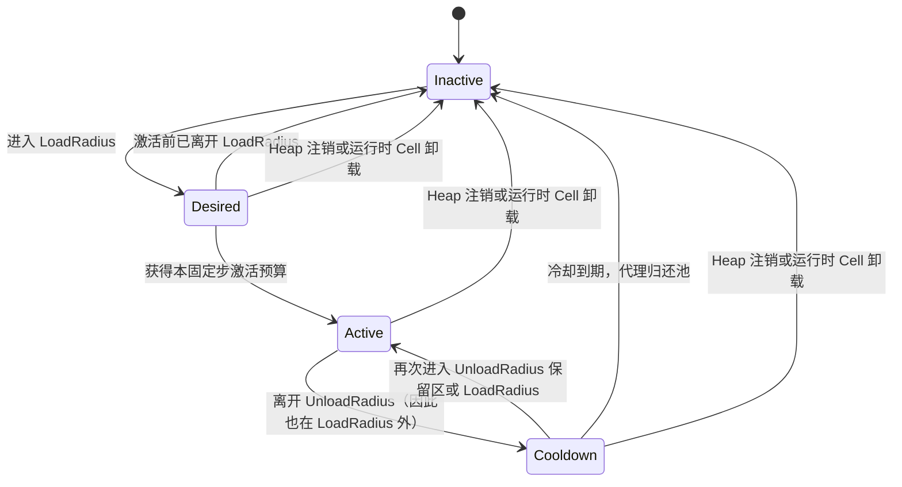
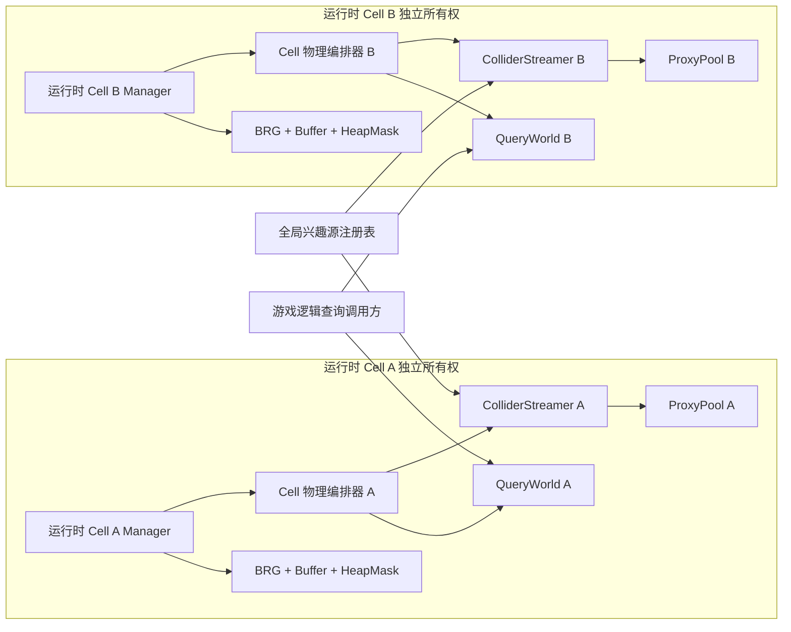

# Unity 植被多运行时 Cell 物理查询与 Collider 流送架构

**标签**：#unity #architecture #physics #performance
**来源**：工程实践抽象 - Unity 植被解析查询与 Collider 工作集流送
**收录日期**：2026-08-25
**更新日期**：2026-08-26
**状态**：⚠️ 待验证
**可信度**：⭐⭐⭐（生命周期、状态机、Streamer 保守 Bounds、子组件 Rebase 入口与历史 Windows Editor A/B 有实现证据；Query Heap 包含性、Cell 级坐标世代广播和异常卸载强保证尚未闭环，冷池、Quest 与全局预算仍未验证）
**适用版本**：Unity 2022.3 LTS、PhysX、Additive Scene；其它 Unity 版本需复核物理同步与场景生命周期

---

### 概要

大规模植被物理不应只有“为全部植物创建 Collider”和“完全没有碰撞”两个选项。可复用的拆分方式是：每个运行时 Cell 常驻一个轻量 QueryWorld，供游戏逻辑显式发起 Raycast、Overlap 和 Sweep；兴趣源只驱动 ColliderStreamer，让附近实例从对象池取得真实 PhysX Collider 代理。多个运行时 Cell 可以共享同一批兴趣源，但必须分别拥有查询数据、代理池、半径、预算和卸载生命周期。

> **生产采用警告**：参考实现把只覆盖视觉几何的 Heap Bounds 同时用于物理粗筛，未保证它包含全部 Query Shape。外伸的 Sphere、Capsule 或 Box 可能在 Heap 级被提前拒绝，形成确定性假阴性。使用该查询链前必须生成独立 Query Heap Bounds，或在注册时聚合全部 Query Shape Bounds，并建立包含性门禁。

> **坐标迁移警告**：QueryWorld 与 ColliderStreamer 已分别提供增量平移入口，但当前 Cell 物理编排器没有把一次 Floating Origin 事件原子转发给两者。接入方必须补齐同世代协调；否则解析查询、真实 Collider、兴趣源和渲染可能永久错位。

本文的 **运行时 Cell** 指“一个场景管理器 + 一份场景植被资产 + 一套独立渲染/物理资源”；资产内部包含多个 **Heap**。Heap 是空间粗筛单元，不是独立 Scene、GameObject 或 BRG Batch。

本文运行时术语统一如下：

- **SceneAsset**：一个运行时 Cell 的作者数据资产，包含 Prototype 槽位和多个 Heap。
- **Prototype**：一种植物的共享渲染与碰撞描述；实例用本 SceneAsset 内的 PrototypeId 指向它。
- **StableGuid**：实例在一个 SceneAsset 内的持久身份；QueryWorld、ColliderStreamer 与作者工具用它关联同一株植物。
- **Query Shape**：由 Prototype 碰撞描述和实例变换得到的解析 Sphere、Capsule 或 Box；不包括 ConvexMesh。
- **Purpose / Purpose Mask**：作者可多选的碰撞用途位标志。查询传入用途掩码，只让至少共享一个用途位的 Heap/Shape 成为候选；BVH 节点保存子树所有 Shape 用途的按位 OR，用于整棵子树提前拒绝。它不是 Unity Layer。
- **Proxy**：从按 Shape 类型分池的对象池取得、承载一个真实 Unity Collider 的运行 GameObject。对进入 Streamer 的实例，映射是 `1 实例 → N 个 Collider Shape → 激活时 N 个 Proxy`；状态机与激活候选按实例推进，但代理容量按 Shape 数增长。
- **激活预算**：`maxActivationsPerFixedUpdate` 计的是本运行时 Cell 每固定步最多新激活的**实例数**，不是 Proxy/Collider 数。一个获批实例会在同次 `Activate` 中为其全部 N 个 Shape 取得 N 个 Proxy，所以单步新增 Proxy 上限还取决于候选实例的 Shape 数；AllResident 会跳过该实例预算。
- **DesiredReferenceCount**：本固定步内，有多少有效兴趣源让实例进入各自运行时 Cell 的 LoadRadius；大于零表示未激活实例可以竞争新激活预算。
- **RetainReferenceCount**：本固定步内，有多少有效兴趣源让已激活实例仍位于各自运行时 Cell 的 UnloadRadius；大于零表示已有代理应继续保留。由于 `UnloadRadius >= LoadRadius`，Desired 引用同时也是 Retain 引用。
- **OriginOffsetDelta**：累计原点从 `O_old` 变为 `O_new` 时的增量 `delta = O_new - O_old`。缓存的运行时世界坐标统一变为 `worldNew = worldOld - delta`；作者局部坐标、StableGuid 与 Heap 身份不变。

### 内容

#### 一、为什么需要 QueryWorld 与 ColliderStreamer 两条路径

| 路径 | 保存内容 | 典型用途 | 生命周期与成本 |
|---|---|---|---|
| QueryWorld | 每个实例的解析 Sphere/Capsule/Box 形状与 Heap 粗筛 Bounds | 玩法射线、范围检测、扫掠、目标选择 | 运行时 Cell 加载时注册，卸载时整体释放；不依赖 PhysX 代理是否激活 |
| ColliderStreamer | 可创建真实 Collider 的实例描述、状态机和代理池；ConvexMesh 只走此路径 | Rigidbody 接触、触发器、角色和动态刚体碰撞 | 每固定步只维持兴趣源附近工作集；可切换到 AllResident 对照模式 |

QueryWorld 避免为了偶发查询让数千个 GameObject/Collider 常驻；ColliderStreamer 又保留了 Unity 物理接触语义。两条路径读取同一份 Prototype 碰撞描述和同一 StableGuid，但不能互相代替：解析查询不会自动产生 PhysX 接触，PhysX 代理未激活也不应让玩法查询失效。

解析路径只接收可确定计算的 Sphere、Capsule 和 Box；ConvexMesh 留给 PhysX。这样 QueryWorld 的结果不依赖临时 Collider GameObject，也避免自行重写凸网格碰撞算法。

渲染 Heap 激活、QueryWorld 查询和 ColliderStreamer 流送是三条独立策略。它们可以读取同一份作者数据，但半径、更新时机、状态和预算不互相授权；`ActiveHeapMask` 只控制渲染剔除，不能证明某个 Collider Proxy 已存在，也不能限制游戏逻辑可以查询哪些 Shape。

#### 二、兴趣源只描述运动，运行时 Cell 决定策略

兴趣源可以代表玩家、手、载具、投射物或其它动态对象。每个 ColliderStreamer 在自己的 FixedUpdate 开头，从共享注册表捕获一份本步只读的本地快照；快照包含：

- 当前世界位置；
- 速度；
- 是否启用高速预测及预测时长；
- 竞争激活预算时的优先级。

**物理加载半径和卸载半径不属于兴趣源。** 它们属于每个运行时 Cell 的 ColliderStreamer。一个玩家同时经过多个 Additive Scene 时，各运行时 Cell 可以使用不同密度、碰撞复杂度和预算，而不会被共享源上的一个半径覆盖。卸载半径必须不小于加载半径，以形成空间滞回。

高速源用“当前位置到预测位置”的线段参与 Heap 与实例 Bounds 距离测试，降低快速运动跨过加载球造成的碰撞迟到。预测只提前移动工作集，不会让静态 Collider 跟随 Shader 中的草叶形变。

当前没有跨 Cell 的统一快照世代：多个 Streamer 会各自捕获同一批源，通常位于同一个物理帧，但不能据此证明它们读到不可分割的同一版本。需要严格多 Cell 一致性时，应由外层固定步协调器发布带 Tick/坐标世代的单份快照，全部 Cell 只读消费。每次被评估的实例都会从零重新聚合 Desired/Retain 计数，不允许把上一固定步的引用数累加到下一步。

#### 三、运行时 Cell 加载时如何生成两套物理工作集

当前所有权不是“ColliderStreamer 包含 QueryWorld”，而是由同对象上的物理编排器拆分两条路径：

| 对象 | 创建与所有者 | 注册键 / 状态 | 查询与销毁责任 |
|---|---|---|---|
| Cell 物理编排器 | 每个运行时 Cell 的管理器对象独占一个 | 保存已加载管理器、Cell Transform、实际注册到 Streamer 的 HeapGuid 列表；非空 QueryWorld 本身就是加载句柄 | 编排加载、失败回滚和卸载；对游戏逻辑暴露解析查询入口 |
| QueryWorld | 由编排器先在加载局部变量中创建，全部 Heap 成功后才发布 | 以 HeapGuid 保存解析 Shape 与粗筛 Bounds | 执行 Raycast/Overlap/Sweep；由编排器释放 |
| ColliderStreamer | 同一 GameObject 上的独立组件，每运行时 Cell 独占 | 以 HeapGuid 保存 PhysX 实例状态，另持有固定步预算和半径 | 推进状态机、向 ProxyPool 取还代理；编排器按实际注册列表反注册，Streamer 管理自己的池生命周期 |
| ProxyPool | ColliderStreamer 创建并独占 | 按 Collider 类型复用 Proxy | ColliderStreamer 激活/归还；Streamer 销毁时释放 |


物理运行组件必须和渲染管理器、ColliderStreamer 位于同一个 GameObject，并只读取该管理器绑定的 SceneAsset。它不允许跨 Additive Scene 绑定其它运行时 Cell 的组件，也不允许两个运行时 Cell 共享同一个 Streamer。这个门禁让卸载时能够精确反注册自己创建的 Heap 和代理。

空运行时 Cell、只含查询形状的运行时 Cell、只含 PhysX 形状的运行时 Cell 都是合法状态。加载态应由 QueryWorld 句柄和所有权记录判断，不能用“注册 Collider Heap 数量大于零”判断，否则空工作集会在 Update 中被反复重建。

两条路径对外层 Bounds 的处理并不相同。QueryWorld 当前直接接受传入的 Heap Bounds，因而存在本文开头所述包含性缺口；ColliderStreamer 则先让每个 Collider Instance Bounds 聚合其全部 Shape（包括 ConvexMesh），再把注册 Bounds 与全部 Instance Bounds 取并集，形成自己的保守 Streamer Heap Bounds。完全 Inactive 的 Streamer Heap 粗筛只有在这条包含链保持成立时才不会漏掉需要激活的代理：

```text
ColliderInstanceBounds ⊇ union(all Collider Shape Bounds of the instance)
StreamerHeapBounds ⊇ union(all ColliderInstanceBounds in the Heap)
```

##### 查询索引的接口边界

每个 QueryWorld 可以独立维护 Heap–Shape 两级查询索引，但索引不读取兴趣源，也不依赖 Collider Proxy 是否激活。游戏逻辑显式选择要查询的运行时 Cell 和 QueryWorld；若要查询整个世界，外层还需枚举当前活动 Cell。

BVH 只改变 Heap 与 Shape 候选的生成方式，不替代 Sphere、Capsule 和 OBB 的解析窄相位；ConvexMesh 仍只进入 PhysX 路径。索引构建、更新、复杂度、微基准和正确性前提见[两级懒建 BVH 查询专题](./unity-vegetation-two-level-lazy-bvh-query.md)。

#### 四、Streamed 固定步与状态机



每个固定步的处理顺序是：

1. 从已注册且有效的兴趣源捕获本 Streamer、本固定步不可变快照；当前实现尚无跨 Cell 统一 Tick 世代。
2. 完全 Inactive 的 Heap 只用预测线段与 Heap Bounds 检查加载半径；仍有 Desired/Active/Cooldown 实例的 Heap 必须继续处理，直到状态清空。
3. 对候选 Heap 中的实例计算 DesiredReferenceCount 和 RetainReferenceCount。多个源可以同时引用同一实例。
4. 把尚未激活的 Desired 实例加入候选列表，按高速引用、优先级、距离与 StableGuid 的确定性键排序。
5. 在 `maxActivationsPerFixedUpdate` 的实例预算内逐个激活候选；每个获批实例一次性为其全部 Collider Shape 从对应类型池取得 Proxy 并配置 Collider。
6. 推进离开范围的 Cooldown，把到期代理归还对象池。
7. 本固定步若有代理变换或增删，统一调用一次 `Physics.SyncTransforms`。

一个实例含多个 Shape 时，激活必须表现为实例级事务：任意一次 Proxy 获取或配置失败，都归还本次已经取得的全部 Proxy，使实例回到 Desired，再由上层按失败政策重试或终止；不能留下“部分 Shape 已激活”的 Active 实例。

多来源聚合的当前精确规则是：每个来源都用其 `Position → PredictedPosition` 预测线段到实例 Bounds 的平方距离；距离不超过 LoadRadius 时同时增加 Desired 与 Retain，距离只在 LoadRadius 与 UnloadRadius 之间时只增加 Retain。候选取所有 Desired 来源中的最高 Priority；同一最高 Priority 下取最小平方距离，并记录是否存在任一 Desired 高速来源。全 Cell 候选最终按“有高速引用优先 → Priority 降序 → 平方距离升序 → StableGuid 升序”排列。一个实例只产生一个候选，不会按来源重复占用预算；StableGuid 负责完全同键时的确定性收尾。

在 **Streamed** 模式中，`maxActivationsPerFixedUpdate = 0` 表示暂停新实例激活，而不是卸载已有代理。预算消耗一次只代表一个实例，不能据此推断只新增一个 Collider；该实例有多少 Shape 就会取得多少 Proxy。AllResident 模式仍复用同一状态机，但把本运行时 Cell 的实例视为始终被引用并明确跳过流式激活上限，因此不受这个零值阻塞；它适合小规模场景或 A/B 对照，不应成为大场景默认配置。

进入“仅在 UnloadRadius 内、但尚未进入 LoadRadius”的保留区时，已有 Active/Cooldown 代理可以继续保留或恢复 Active；Inactive 实例不能仅凭 RetainReferenceCount 首次激活，仍要由 DesiredReferenceCount 竞争加载预算。这样两个半径形成的是嵌套滞回，而不是必须分别跨越的两个无关事件。

Cooldown 的所有者是每个运行时 Cell 的 ColliderStreamer；`cooldownSeconds` 是非负秒数，默认 0.5 秒，并在每次 FixedUpdate 用该步 `fixedDeltaTime` 递减。Active 实例首次同时失去 Desired 与 Retain 引用时进入 Cooldown，并把剩余时间重置为完整配置值；配置为 0 时同一步立即归还全部 Shape Proxy 并进入 Inactive。到期前重新进入 LoadRadius 或 UnloadRadius 保留区会恢复 Active、把剩余时间清零；以后再次离开时重新从完整时长开始。Heap 注销或运行时 Cell 卸载不等待倒计时，会把 Desired、Active、Cooldown 全部强制清理为 Inactive 并归还现有 Proxy。

#### 五、多运行时 Cell 如何共同运转



同一个兴趣源会注册到全部已启用 ColliderStreamer，所以玩家跨越运行时 Cell 边界时不需要把源从 A 手工搬到 B。兴趣源只更新 Proxy 工作集；需要跨 Cell 查询时，游戏逻辑显式调用各 Cell 的 QueryWorld。每个运行时 Cell 只处理自己的 Heap 和实例，查询结果、代理池、加载半径和预算不会合并。Additive Scene B 卸载后只释放 B 的物理与渲染资源，A 的计数和代理应保持不变。

这种隔离简化了所有权和故障恢复，但有一个重要的容量边界：激活预算和 `Physics.SyncTransforms` 次数是**每运行时 Cell**的。若同时加载很多运行时 Cell，总激活量上限接近各运行时 Cell 预算之和，且多个 Streamer 可能各自同步一次。系统目前没有跨运行时 Cell 全局物理调度器，不能把单运行时 Cell 配置直接当作整世界预算。

#### 六、Floating Origin 与世界空间世代

QueryWorld、ColliderStreamer 和兴趣源快照都使用运行时世界坐标。本文采用以下唯一方向约定：

```text
delta = newAbsoluteOriginOffset - oldAbsoluteOriginOffset
runtimeTranslation = -delta
```

一次合法 Rebase 必须由外层协调器使用同一个有限 `delta` 和同一个坐标世代完成：

1. 停止向本世代发起新的解析查询和固定步评估。
2. 对 QueryWorld 调用一次增量入口；它把 Query Heap Bounds、Query Shape、缓存 AABB 和已建 BVH 节点统一平移 `-delta`。
3. 对 ColliderStreamer 调用一次增量入口；它把 Streamer Heap Bounds、实例 Bounds/Shape 描述和全部**已借出 Proxy**统一平移 `-delta`，包括 Active 与仍持有代理的 Cooldown 实例，并把物理变更标脏。
4. 让兴趣源的当前位置与预测位置进入同一新坐标基准。若外层已经平移兴趣源 GameObject，就只重新捕获快照，不能再手工把快照减一次 `delta`。
5. 丢弃 Rebase 前尚未消费的候选与兴趣源快照；下一固定步重新聚合引用、重建候选，并由 Streamer 在步末至多调用一次 `Physics.SyncTransforms`。
6. 只有查询、Streamer、兴趣源与渲染都确认同一世代后，才恢复对外查询和物理步进。

`delta` 必须在任何写入前完成有限值校验。多次增量可以在下一个固定步前累积，但每个子系统对每个增量只能应用一次。Cell 根 Transform 变化走的是另一条低频政策：当前物理编排器会卸载后完整重建世界空间数据；若外层已经通过根 Transform 移动同一 Cell，就不能再把同一位移作为 Origin delta 叠加，否则会双重平移。

当前实现只具备 QueryWorld 与 ColliderStreamer 两个独立增量入口，以及各自的局部回归；Cell 物理编排器尚未提供上述单一广播和回滚边界。因此这套流程是生产接入契约，不是已经原子闭环的事实。

#### 七、卸载与失败回滚

Streamer 侧的唯一释放所有者是 `UnregisterHeap`：成功路径中，它负责归还该 Heap 中全部已借出 Proxy、清除实例状态、移除 Heap，并在最后一个 Heap 离开时销毁运行时对象池。调用方不得在反注册之后再次逐 Proxy 归还。

异常路径选择**强清理契约**，而不是让调用方猜测方法执行到哪一步：`UnregisterHeap` 必须在内部逐项回收并汇总错误，最终保证该 Heap、实例、Proxy 列表和空池所有权已经解除，再把诊断返回给调用方。只有取得“已解除所有权”的结果后，编排器才能从实际注册列表删除 HeapGuid；否则 Cell 必须停在 `CleanupFailed`，保留原 Streamer 引用和失败 HeapGuid，供重试或整体强制销毁，禁止宣称卸载完成。

当前参考实现的成功路径符合唯一释放所有者规则，但异常路径还没有上述强保证：编排器会继续尝试其它 Heap，之后无条件清空所有权记录。若某次反注册在完成前抛出，可能失去重试依据。因此异常卸载仍是生产阻断项，不能用“已调用 UnregisterHeap”代替零残留证明。

满足强清理契约后，运行时 Cell 加载失败与正常卸载应共用以下顺序，并按成功注册列表逆序清理：

1. 向**实际完成注册的 Streamer**逐一请求强清理，而不是读取可能已被 Inspector 改写的新引用；每个成功结果才从所有权列表移除对应 HeapGuid。
2. 记录失败项并继续尝试其余 Heap；失败项、原 Streamer 引用和诊断必须保留在 `CleanupFailed` 状态，不能被全量清空。
3. 只有 Streamer 侧全部解除所有权后，才 Dispose 尚未发布或已发布的 QueryWorld，清空解析 Shape、缓存与查询索引。
4. 全部成功后再清空已加载管理器、Streamer、运行时 Cell Transform 和 HeapGuid 所有权记录，并发布 Unloaded。
5. 保留原始 SceneAsset；加载失败和运行时卸载都不能修改作者数据。

当前正常成功路径是先反注册 Streamer，再 Dispose QueryWorld，最后清空 Cell 物理所有权；异常路径则尚未达到上述强清理契约。渲染侧另行等待剔除 Job、移除 Batch、释放 Buffer 和 NativeArray。Mesh、Material 或 SceneAsset 本身是否从内存卸载，仍由外层 Additive Scene、AssetBundle 或资源句柄所有者决定。

#### 八、查询索引的性能边界

限制真实 PhysX 工作集不会自动减少 QueryWorld 常驻的解析 Shape 数，也不能证明查询已经加速。查询索引的性能问题由独立专题说明；本篇只要求索引产生候选、解析窄相位给出精确结果，并且查询始终不受 Collider Proxy 激活状态影响。完整算法、性能证据与不可推广边界见[两级懒建 BVH 查询专题](./unity-vegetation-two-level-lazy-bvh-query.md)。

#### 九、历史 Collider 常驻与流送 A/B 性能证据

以下数字只是一组历史 Windows Editor A/B 证据，不是 Quest、目标设备、当前源码身份或完整游戏帧预算。每组历史夹具在同一合成输入内比较 AllResident 与 Streamed 驻留政策；保存材料没有源码树或程序集指纹，因而只能作为受控条件内的历史关联。基准使用 Intel Core i7-12700、RTX 3060、独立 Local PhysicsScene、50 Hz 固定步、5/7 米加载/卸载半径、16 个动态 Kinematic 探针和 120 个稳态样本。运行时核心包含流送固定步、动态探针更新、`Physics.SyncTransforms` 与 `PhysicsScene.Simulate`；表中给出 120 个稳态样本的 P95。GC 只统计这一核心范围，不能代表整进程。

| 实例 | Collider Shape（1 Shape → 1 Proxy） | AllResident 活跃 Proxy | Streamed 活跃 Proxy | Proxy 减少 | 运行时核心 P95：常驻 / 流送 | 核心 GC B/步 |
|---:|---:|---:|---:|---:|---:|---:|
| 1024 | 2198 | 2198 | 560 | 74.5% | 0.5719 / 0.5214 ms | 0 / 0 |
| 4096 | 7324 | 7324 | 560 | 92.4% | 1.9911 / 0.5276 ms | 0 / 0 |
| 8192 | 13788 | 13788 | 560 | 95.9% | 5.0894 / 0.4887 ms | 0 / 0 |
| 16384 | 27576 | 27576 | 560 | 98.0% | 7.4740 / 0.4842 ms | 0 / 0 |
| 32768 | 54042 | 54042 | 560 | 99.0% | 14.8610 / 0.5051 ms | 0 / 0 |

该观察支持“限制真实 PhysX 工作集能显著降低大规模常驻代理成本”，不支持“所有设备都固定维持 0.5 ms”。原实验没有覆盖 Quest、ARM PhysX、Android IL2CPP、XR Runtime、热降频、冷池首次扩容或整进程内存。

#### 十、采用边界与尚未实测风险

1. **Query Heap Bounds 包含性是生产门禁。** 外层 Query Heap Bounds 必须保守包含全部 Query Shape；视觉 Bounds 若排除外伸碰撞体，就不能直接承担查询粗筛。修复方案、阈值两侧回归和 Shape 级稳定性要求见[两级懒建 BVH 查询专题](./unity-vegetation-two-level-lazy-bvh-query.md)。
2. **对象池首次扩容可能产生尖峰。** 稳态池复用不能证明冷池首激活没有峰值。可以按场景预算预热或分帧加载，并明确“碰撞尚未就绪”时的玩法策略，但效果必须另测。
3. **已有内容的半径迁移需要逐项验证。** 将半径归到每运行时 Cell Streamer 后，旧序列化数据、Inspector 和外部 API 仍可能保留旧语义，不能仅凭新字段位置推断迁移完成。
4. **Floating Origin 仍缺 Cell 级协调闭环。** 两个物理子组件能分别平移，不等于协调器已保证同一 delta、同一世代、有限值校验和失败恢复；接入前必须补齐第六节协议。
5. **异常卸载仍缺强清理保证。** 成功路径的 Proxy 归还职责清楚，但反注册中途抛出时，当前编排器可能清空仍需重试的所有权记录；补齐 `CleanupFailed` 与强清理结果之前，不能把异常卸载视为零残留。

#### 十一、采用检查清单

- [ ] QueryWorld 与 ColliderStreamer 从同一 StableGuid 和 Prototype 碰撞描述生成各自工作集；ConvexMesh 只进入 PhysX。
- [ ] 兴趣源只向 ColliderStreamer 提供位置、预测运动和优先级；游戏逻辑显式调用 QueryWorld，查询不依赖 Proxy 是否激活。
- [ ] 半径、预算、QueryWorld、Streamer 与代理池按运行时 Cell 隔离，且整世界容量按所有活动 Cell 汇总。
- [ ] 状态机具有嵌套加载/卸载半径、Cooldown、确定性候选排序和固定步激活预算。
- [ ] 多 Shape 激活中途失败会归还本次全部 Proxy，实例不会停在部分激活状态。
- [ ] Collider Instance Bounds 保守包含实例全部 Shape，Streamer Heap Bounds 再保守包含全部 Instance Bounds。
- [ ] `UnregisterHeap` 是 Streamer 侧 Proxy 归还与状态清理的唯一所有者；调用方不重复释放。
- [ ] `UnregisterHeap` 具备可验证的强清理结果；失败项进入 `CleanupFailed` 并保留重试所有权，禁止无条件清空。
- [ ] 运行时 Cell 卸载按实际注册记录清理 Collider Heap，全部成功后再 Dispose QueryWorld 并发布 Unloaded；外层资源句柄另行释放资产。
- [ ] Floating Origin 以同一有限 delta 和坐标世代同步 QueryWorld、Streamer、兴趣源与渲染，且不会与 Cell Transform 位移重复施加。
- [ ] Query Heap Bounds 保守包含全部 Query Shape，并完成[查询索引专题的采用检查](./unity-vegetation-two-level-lazy-bvh-query.md#十一采用检查清单)。
- [ ] 统计整世界的代理总数、激活峰值、`Physics.SyncTransforms` 次数和冷池首次扩容，而不是只看单运行时 Cell。
- [ ] 性能报告分别标注 Editor/设备、常驻/稳态、查询负载、固定步、样本数和原始统计量，不把单一合成微基准推广为完整系统或 Quest 结论。

### 相关记录

- [统一 BRG 架构](./unity-vegetation-unified-brg-architecture.md) - 运行时 Cell、Heap、GPU Buffer 和剔除生命周期。
- [Heap–Shape 两级懒建 BVH 查询](./unity-vegetation-two-level-lazy-bvh-query.md) - 索引构建、复杂度、微基准和 Query Bounds 正确性前提。
- [植被 Painter 作者工作流与事务设计](./unity-vegetation-painter-authoring-transaction-workflow.md) - 碰撞描述如何从 Prototype 与 Heap 作者数据产生。
- [历史 Quest 3S BRG 与普通 GO 系统观察](./quest-vegetation-brg-performance-lighting-validation.md) - 真机渲染证据；不能替代本记录缺失的 Quest 物理验证。

### 验证记录

- [2026-08-26] 生命周期、状态机、Streamer 保守 Bounds、子组件 Origin delta 平移与历史 Windows Editor Collider A/B 支持按运行时 Cell 限制 PhysX 工作集；Query Heap Bounds 包含性、Cell 级坐标世代广播、异常卸载强清理、冷池首次扩容、Quest 与多 Cell 世界级预算仍未验证。

---
