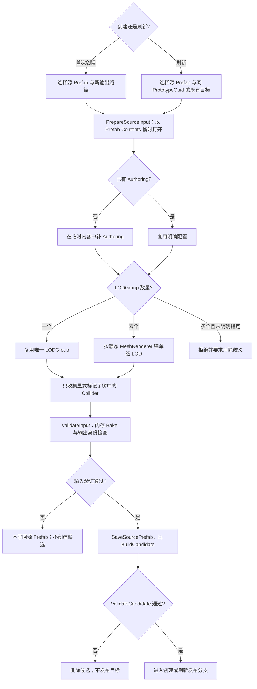
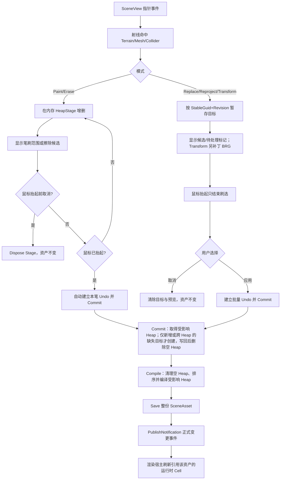

# Unity 植被 Painter 的作者工作流与事务设计

**标签**：#unity #experience #editor #custom-editor #ui #scriptable-object
**来源**：工程实践抽象 - Unity 2022.3 LTS 植被作者工具、源码静态审查与自动化验证
**收录日期**：2026-08-25
**来源日期**：2026-08-25
**更新日期**：2026-08-26
**状态**：📘 有效
**可信度**：⭐⭐⭐⭐（主要交互、事务、预览和自动化主流程已有实现证据；长时间人工手感、大数量笔划和失败注入仍有边界）
**适用版本**：Unity 2022.3 LTS；以 ScriptableObject 保存实例、以 BatchRendererGroup 预览的编辑器植被工具

---

### 概要

一个可维护的植被 Painter 不应把鼠标拖动直接等同于资产写入。稳定的作者闭环应明确为七段：**选择数据权威 → 暂存本次操作 → 给出与模式相符的可视反馈 → Commit 作者数据 → Compile 派生缓存 → Save 资产 → PublishNotification 变更通知**。反馈可以是笔刷范围、候选标记或真实变换预览，不能把三者都宣称为最终结果预览。这样才能让 Paint、Erase、Replace、Reproject 和 Transform 共用清楚的 Undo、取消、跨空间块移动和错误处理语义。本文另把 Prototype 文件的正式化称为 **Promote/ReplaceFile**；它与 SceneAsset 保存后的 PublishNotification 不是同一个动作。

本文记录一套已经落地的实现模式。它使用“运行时 Cell + 内嵌 Heap”的数据模型：一个运行时 Cell 由一个场景管理器和一份场景植被资产组成，资产中包含多个 Heap；Heap 是内部空间分区，不是独立 Unity 资产或独立 BRG Batch。文中只保留可复用的交互和数据原则，不依赖具体项目路径或美术资源。

### 内容

#### 一、用户面对的四类对象

| 对象 | 用户如何接触 | 系统责任 | 不能承担的责任 |
|---|---|---|---|
| 源 Prefab | 选择一类植物的原始资源 | 提供 MeshRenderer、LODGroup 和显式标记的 Collider | 不直接成为逐株运行对象 |
| Prototype 资产 | 在创建/刷新界面生成 | 保存可复用的 Mesh、Material、LOD、视觉 Bounds、风摆上限、碰撞描述与光照模式声明 | 不保存某个场景的实例位置或逐株光照 |
| 运行时 Cell | 在场景中选择管理器 | 绑定一份场景植被资产，并成为编辑授权、渲染与物理生命周期边界 | 不等于内部 Heap |
| Painter | 通过窗口、SceneView Overlay 和快捷键操作 | 选择模式、筛选目标、暂存、预览、应用或取消 | 不拥有长期 BRG 会话，也不应在 Repaint 中重建全场数据 |

这四类对象的分离解决了一个常见冲突：美术希望用熟悉的 Prefab 和笔刷工作，运行时却不能为每株植物创建 GameObject。Prototype 负责把 Prefab 变成批渲染可消费的稳定数据，SceneAsset 负责保存场景实例，Painter 只修改这份权威数据。

本文后续身份与暂存术语统一如下：

- **SceneAsset**：一份运行时 Cell 的场景植被 ScriptableObject；新建资产时生成 SceneGuid，此后在该资产生命周期内稳定。当前复制 `.asset` 会连同非空 SceneGuid 一起复制，且没有全局冲突检测；所以“SceneGuid 唯一”是外部引用成立所需的治理契约，不是当前实现已经强制保证的事实。
- **PrototypeGuid**：一种 Prototype 资产的稳定身份；刷新同一资产时不改变。
- **PrototypeId**：某个 SceneAsset 的 Prototype 槽位索引，只在该资产内有意义；运行时以 `SceneAsset.Prototypes[PrototypeId]` 取得 Prototype 资产，再由该资产的 PrototypeGuid 识别其稳定种类。实例本身不直接保存 PrototypeGuid。
- **StableGuid**：实例在一个 SceneAsset 内的持久身份。Paint 以一次笔划的随机 StrokeGuid 和样本/候选序号确定性生成；Replace、Reproject、Transform 和跨 Heap 移动不得重建。真正复制成一株新实例时才应生成新身份。当前门禁只检查单个 SceneAsset 内非空且不重复；输入不含 SceneGuid，因此不能假设 StableGuid 在所有运行时 Cell 间全局唯一。跨 SceneAsset 引用应使用 `(SceneGuid, StableGuid)`，并先保证 SceneGuid 没有因资产复制而冲突。
- **HeapStage**：一次操作只为实际触及 Heap 建立的内存副本；Commit 前不是权威数据。
- **Scene Revision**：序列化在 SceneAsset 内、由作者与编译变更推进的变化计数；一次用户操作可能递增多次。它参与 Unity Undo，因此不是永不回退的全局事务号，只能作为当前实现的快速失效信号。
- **作者 Authority**：当前唯一允许被 Painter 写入的运行时 Cell，不是额外资源类型。
- **BRG**：Unity `BatchRendererGroup`；本文中负责编辑器预览与运行时批量绘制。
- **Morton 空间码**：把多维局部坐标交错编码成排序键，使相近实例在数组中更可能相邻；它只用于派生排序。

本文把容易混称的四个动作固定为：

- **Commit**：`VegetationSceneEditSession` 校验 Stage，登记完整 SceneAsset Undo，把作者实例写回内存中的序列化对象、创建/删除 Heap，并把资产标脏；它不等于已经写入磁盘。
- **Compile**：编译入口先清理空 Heap、按坐标排序，再从作者实例生成 RuntimeIndex、Bounds、光照表和内容 Hash，并逐 Heap 写回同一 SceneAsset 的可再生字段。
- **Save**：Compile 成功走到末尾后调用 `SaveAssetIfDirty`，把当时的整个 SceneAsset 状态写入磁盘；当前没有独立日志或双文件事务。
- **PublishNotification**：Save 后通过变更通道通知编辑器渲染宿主按正式资产刷新 BRG；它不是作者数据的第二次复制，也不是 Prototype 的文件提升/替换。
- **PrepareSourceInput**：在 Prefab Contents 中解析或补齐 Authoring、唯一 LODGroup、显式碰撞根和非空 PrototypeGuid。
- **ValidateInput**：对尚未保存的 Prefab Contents 执行一次内存 Bake 与输出路径身份检查；失败时不写回源 Prefab。
- **SaveSourcePrefab**：ValidateInput 通过后，把 PrepareSourceInput 产生的 Authoring、LODGroup 与 PrototypeGuid 写回源 Prefab。后续失败不会自动回滚这一步。
- **BuildCandidate / ValidateCandidate**：从已保存源 Prefab 再次 Bake，创建独占临时 Prototype 资产并执行资产级 SelfCheck；失败时删除候选，不进入目标文件替换。
- **Promote/ReplaceFile**：ValidateCandidate 通过后，首次创建把候选及其 `.meta` 移动为目标文件，刷新已有资产则只替换目标 `.asset` 内容并保留既有目标 `.meta`。随后才进入 `RefreshReferencedSceneAssets`，顺序刷新所有引用它的 SceneAsset。

成功路径各检查点的权威状态如下；表中“磁盘旧版本”专指当前显式调用链尚未执行 Save，不对 Unity 后续自动保存时机作额外承诺：

| 检查点 | HeapStage | SceneAsset 内存作者数据 | 派生缓存 | 磁盘 SceneAsset | BRG |
|---|---|---|---|---|---|
| Commit 前 | 保存本次候选 | 不变 | 不变 | 不变 | 正式 BRG 不变；仅 Transform 可有临时矩阵/Bounds 补丁 |
| Commit 完成 | 已消费，随后由会话释放 | 已写回、增删 Heap、登记 Undo 并标脏 | 可能仍对应旧作者数据 | 旧版本 | 旧正式内容 |
| Compile 完成 | 已释放 | 新作者数据 | 受影响 Heap 已全部更新，场景 Hash 已重算 | 旧版本 | 旧正式内容 |
| Save 完成 | 已释放 | 新作者数据 | 新缓存 | 新版本 | 旧正式内容 |
| PublishNotification 被宿主消费 | 已释放 | 新作者数据 | 新缓存 | 新版本 | 引用该资产的会话按正式资产重建；通知本身不复制作者数据 |
| Undo/Redo 之后 | 当前实现不保证主动清空所有 Stage | Unity 恢复序列化对象 | 随同同一对象恢复 | Undo 回调不主动 Save，磁盘何时同步取决于后续保存 | 宿主强制扫描并重建全部已加载运行时 Cell 会话，不只刷新当前 Authority |

#### 二、首次建立运行时 Cell 的可取消流程

新建运行时 Cell 时，工具先要求选择场景植被资产的保存位置。用户取消文件选择后，流程必须在创建资产、GameObject 和 Undo 记录之前结束，不能留下半成品。确认后再按顺序执行：

1. 创建带“正常资产生命周期内稳定”SceneGuid 的场景植被资产；初始可以没有 Heap。只有受控的复制冲突修复可以更换该身份，并且必须同步迁移 HeapGuid 与外部复合引用。
2. 创建或配置场景管理器，并把资产绑定到它。
3. 在同一对象上建立该运行时 Cell 独占的碰撞流送器和物理运行组件。
4. 由编辑器渲染宿主发现有效管理器，为该运行时 Cell 创建独立预览会话。

源码控制流显示的当前创建入口失败边界如下：确认路径后若组件装配或保存抛错，会销毁本次创建的管理器对象，并且只删除本次新建、尚未交付成功的 SceneAsset；复用的既有 SceneAsset 不会被删除。创建成功后的 Unity Undo 只登记管理器 GameObject 与组件，**不会自动删除已经由 AssetDatabase 创建的 SceneAsset**，因此“撤销建运行时 Cell”与“删除数据资产”是两个动作。这一点应在 UI 中明确，不能让用户以为 Ctrl+Z 会清理磁盘资产。

当同一场景只有一个有效管理器时，Painter 可以自动选择；存在多个管理器时必须显式选择，避免把操作写入错误资产。Additive Scene 不要求先成为 Active Scene：在 Hierarchy 中选择其管理器即可切换作者目标。

#### 三、从 Prefab 到 Prototype 的输入门禁

首次创建与刷新已有 Prototype 共用烘焙器，但资产发布语义不同。首次创建应先选择输出位置；用户取消时不打开 Prefab、不创建临时或正式资产。确认位置后走下面的输入门禁：



Prototype 的文件发布分支必须显式区分；这里统一称为 Promote/ReplaceFile，避免与 SceneAsset 的 PublishNotification 混称：

- **首次创建**：源 Prefab 没有合法身份时，PrototypeGuid 在 PrepareSourceInput 阶段生成于临时 Prefab Contents，并在 ValidateInput 通过后的 SaveSourcePrefab 阶段写回；源 Prefab 已有合法值时直接沿用。候选继承该 PrototypeGuid；临时候选由 `CreateAsset` 获得 Unity GUID，Promote 时通过 `MoveAsset` 连同 `.meta` 移到正式路径，因此该候选 Unity GUID 直接成为正式资产 GUID，不在 Promote 时再生成身份。
- **刷新已有资产**：目标已存在且 PrototypeGuid 必须与源 Prefab 一致；ReplaceFile 只替换目标 `.asset` 内容，保留目标 `.meta` 与 Unity GUID，内容中的 PrototypeGuid 也保持同一稳定值。候选失败时删除临时内容，旧目标保持不变。

Promote/ReplaceFile 成功后，刷新流程才进入 RefreshReferencedSceneAssets，扫描引用同一 PrototypeGuid 的 SceneAsset；首次创建尚无既有引用，不需要执行“保持旧引用”的替换语义。

Prefab Contents 阶段也有独立的持久化边界：PrepareSourceInput 可能补 Authoring、LODGroup 或 PrototypeGuid；ValidateInput 先以未保存的临时内容完成内存 Bake 和输出身份检查，通过后才调用 `SaveAsPrefabAsset`。BuildCandidate 随后重新 Bake、创建临时资产并执行 ValidateCandidate。因此 BuildCandidate、ValidateCandidate、Promote/ReplaceFile 或引用刷新失败都不会自动回滚源 Prefab；ValidateInput 失败则不会写回。

候选验证只保护发布前阶段。当前 Prototype 创建/刷新使用独占临时目录：候选自检失败会删除候选且不触碰旧目标；成功发布时，首次创建移动临时资产，刷新则用候选内容替换目标文件并保留 `.meta`。这类 AssetDatabase/File 发布没有登记 Unity Undo，也没有完整的发布日志；如果移动、文件替换、重导入或最终保存阶段抛错，不能仅凭“临时候选”推导旧目标一定已自动恢复。工具必须检查目标与临时目录，必要时从版本控制恢复旧资产再重烘焙。这里记录的是当前恢复边界，也是进一步引入备份交换或可恢复发布协议的理由。

刷新已有 Prototype 还有第二层、跨资产的非原子边界：新 Prototype 文件先经 Promote/ReplaceFile 成为权威版本，随后工具以未承诺稳定顺序扫描所有引用同一 PrototypeGuid 的 SceneAsset。每份 SceneAsset 会先把自己的全部 Heap 编译到内存候选，验证通过后才统一写回该资产，再 Save 和 PublishNotification；但多份 SceneAsset 之间没有总事务。若第 N 份失败：候选编译或写回前失败时，第 N 份可能仍是旧状态；Save 失败时内存与磁盘结果需另行核对；PublishNotification 抛错时，第 N 份已经保存为新状态但通知未完成。前 N-1 份已保存并发布通知，N+1 及后续资产尚未处理，而 Prototype 始终是新版本。当前没有进度日志、自动继续或跨资产回滚。默认恢复路径是保留新 Prototype，修复失败原因后重新扫描并核对所有引用资产；若从版本控制回退 Prototype，则已经按新版本更新过的 SceneAsset 也必须全部重新编译，不能只恢复 Prototype 文件。

普通 Collider 不应被无条件纳入植被物理。只有位于显式碰撞根或标记子树中的 Collider 才进入烘焙；这让“美术预览碰撞”和“运行时植被碰撞”不会因 Prefab 中偶然存在的组件而混在一起。

Prototype 刷新需要区分两类变化：

- Mesh、LOD 或碰撞描述变化时，当前刷新器可以在保留已有逐株光照记录的前提下重编译受影响场景；这只说明记录未被丢弃，不证明参与静态烘焙投影的几何变化后旧 Bakery 结果仍然有效，是否重烘焙应按光照管线另行判断。
- 光照模式或视觉 Bounds 中心变化时，旧采样位置或表达方式已经失效，应把场景标记为需要重新采样，而不是静默复用旧光照。

#### 四、Painter 模式与用户可观察结果

| 模式 | 暂存内容 | SceneView 反馈 | 提交触发与 Undo | 取消语义 |
|---|---|---|---|---|
| Paint | 候选新实例、StableGuid、PrototypeId 与目标 HeapStage | 绿色笔刷范围；暂存实例在提交刷新前不进入正式 BRG | 鼠标抬起自动提交本笔，形成一个 Undo | 抬起前取消会丢弃 Stage；抬起后用 Undo 撤销 |
| Erase | 目标 StableGuid 与待删除 HeapStage | 红色候选标记；正式 BRG 实例在提交前仍存在 | 鼠标抬起自动提交本笔，形成一个 Undo | 抬起前取消不删除；抬起后用 Undo 恢复 |
| Replace | 来源筛选、目标 StableGuid、目标 PrototypeId | 青色可选点、黄色待处理标记；不预演替换后的网格 | 拖刷抬起只结束选择，点击“应用替换”才以一个 Undo 提交 | “取消”清除标记，PrototypeId 不变且不产生 Undo |
| Reproject | 目标 StableGuid 与当前投射表面 | 青色可选点、黄色待处理标记；新位置在应用时计算，不提供位置结果预览 | 拖刷抬起只结束选择，点击“应用重投射”才以一个 Undo 提交 | “取消”清除标记，位置不变且不产生 Undo |
| Transform | 目标 StableGuid 与每株预览矩阵 | 黄色结果标记、组 Handle，并补丁 BRG 矩阵与 CPU Bounds | 点击“应用变换”以一个 Undo 写回；必要时跨 Heap 重分桶 | “取消”清除矩阵补丁并立即恢复原始显示 |

范围型操作先用 `StableGuid + Scene Revision` 建立目标快照。若资产在暂存期间已发生其它修改，应用前必须重新验证修订号和身份，不能用过期数组下标写入。

#### 五、一次操作如何变成可持久化 Heap



规则网格下，Heap 坐标可写为：

```text
heapCoordinate = floor((cellLocalPosition - partitionOrigin) / heapSize)
heapOrigin = partitionOrigin + heapCoordinate * heapSize
```

`cellLocalPosition` 来自管理器根变换的逆变换。这样运行时 Cell 整体平移或旋转时，作者数据仍保持在运行时 Cell 局部空间。第一次有效 Paint 落点只会为对应坐标创建内存 HeapStage；正式 Heap 要到 Commit 的 `GetOrCreateHeapForEditor` 才生成，提交前取消不会在 SceneAsset 中留下 Heap。HeapGuid 可由 `SceneGuid + heapCoordinate` 确定性生成；实例位置保存为 `cellLocalPosition - heapOrigin`，因此 Heap 内数据稳定且便于量化。当前只检查单一资产内 HeapGuid 非空且不重复，不会扫描其它 SceneAsset 重新推导或治理相同 SceneGuid。

提交后，单个 Heap 内实例按 `PrototypeId → Morton 空间码 → StableGuid` 排序，并重新分配仅在该 Heap 内连续的 RuntimeIndex。运行时 GPU 槽位由“该 Heap 在运行时 Cell Buffer 中的基址 + RuntimeIndex”派生；RuntimeIndex 不是稳定身份。SceneAsset 内的编辑选择和 Undo 定位使用 StableGuid；跨 SceneAsset 或跨运行时 Cell 的外部引用必须使用 `(SceneGuid, StableGuid)`。

#### 六、跨 Heap 移动为什么必须保留身份

Reproject 或 Transform 可能把实例从 Heap A 移到 Heap B。当前 Painter 的 Stage 只搬作者实例，不搬 Heap 中按稀疏索引压缩的旧光照字节；正确顺序是：

1. 用 StableGuid 取得旧作者实例；旧光照仍留在正式 Heap 的派生缓存中，不能按旧 RuntimeIndex 直接搬运。
2. 从旧 Heap 的暂存集合移除。
3. 由新位置计算目标 Heap 坐标。
4. 在目标 Heap 写入同一个 StableGuid、PrototypeId 和新局部 TRS。
5. 对源、目标两个 Heap 调用带 `sampleLighting=true` 的局部编译：按每株新的视觉 Bounds 中心从当前场景 Probe 重新采样，重建两张稀疏光照表和 RuntimeIndex；旧 Heap 为空时删除。Reproject/Transform 改变采样位置，Replace 还可能改变 Bounds 中心或光照模式，因此这些 Painter 操作不把旧字节冒充为新位置的有效记录。

不能使用旧数组下标或 RuntimeIndex 标识实例，因为排序和跨 Heap 移动都会改变它们。StableGuid 保持不变，才能让选择集、Undo 和后续工具引用继续指向同一株植物；当前 Painter 的光照正确性来自对受影响 Heap 重新采样，不来自 StableGuid 自动复用旧压缩记录。其它明确设计为“保留光照”的重分桶/依赖刷新流程可以用 StableGuid 重绑已解码样本，但那是独立入口，不能套用到 Painter。

#### 七、预览、Undo 与渲染宿主的所有权

编辑器预览由独立宿主持有，而不是由 Painter 窗口持有。宿主扫描已加载且非 Preview 的 Unity Scene，为每个有效运行时 Cell 维护独立 BRG、Buffer 与 Scene CullingMask。关闭 Painter 窗口不应让植被消失；进入 PlayMode 时编辑器宿主释放会话，运行时管理器从同一 SceneAsset 建立同类型后端。

SceneView 反馈分为三类，不能统称为“最终结果预览”：

- **Paint/Erase 笔划反馈**：笔刷范围、待新增位置或待删除实例只存在于 HeapStage；正式资产与正式 BRG 在鼠标抬起提交前不变。它说明“本笔会影响哪里”，不证明提交后的最终网格结果。
- **Replace/Reproject 目标反馈**：青色与黄色标记只说明可选和待处理对象。替换后的网格、重投射后的最终位置在点击应用时才计算，因此取消只需清除目标快照和标记。
- **Transform 结果预览**：Handle 操作会补丁 BRG 矩阵和对应 CPU Bounds，使拖动结果即时可见；点击应用才把矩阵写回作者资产，取消则恢复原显示。

Undo 的用户目标是“一次笔划或一次批量应用对应一次撤销”，但必须区分资产层与派生层。Paint/Erase 在鼠标抬起时创建本笔 Undo 并提交；Replace/Reproject/Transform 在点击应用时建立外层 Undo Group。外层 Group 可以尝试回退作者资产修改，逐 Heap 编译缓存与 BRG 刷新却不是同一个两阶段事务，不能据此承诺任意编译失败后所有派生状态自动原子回滚。取消发生在 Commit 前时，只清除 Stage、目标快照或预览补丁，不应把资产标脏。

正常 Undo/Redo 的当前链路是：编辑会话在首次写入前登记整个 SceneAsset；作者实例与序列化派生缓存位于同一对象；Unity 恢复该对象后，编辑器渲染宿主收到 `undoRedoPerformed`，先刷新 Authority 选择，再以 `forceRebuild` 扫描所有已加载、非 Preview 的 Unity Scene 和其中全部有效管理器。因此即使用户提交运行时 Cell A 后把 Authority 切到 B，再执行 Undo，宿主也会重建包含 A 在内的全部已加载 Cell 会话，而不是只刷新 B。回调没有调用 `SaveAssetIfDirty`：Undo/Redo 后内存对象与 BRG 会先一致，磁盘是否已经同步不能仅凭画面判断，仍要等待 Unity 后续保存或执行显式保存。

这个链路没有证明所有异常中断都完整；尤其 Painter 的范围 Stage 本身没有直接订阅 Undo，它只在后续 GUI/SceneView 检查发现 `(SceneAsset, Mode, Revision)` 不匹配时清空，Transform 补丁随 Stage 清理而撤销。由于 Revision 是可被 Undo 回退的序列化数值，回到相同数字时理论上可能让旧 Stage 表面重新匹配；更稳妥的实现应在 Undo/Redo 时无条件清除所有暂存，并增加不随资产 Undo 回退的编辑会话世代。

下表把失败点与恢复责任分开；“作者数据仍是权威”不等于“派生缓存已经自动恢复”：

| 失败点 | 作者资产 | Stage / 预览 | 派生缓存 / BRG | 恢复动作 |
|---|---|---|---|---|
| 运行时 Cell 或 Prototype 输出对话框取消 | 未创建或未修改 | 无临时状态 | 不变 | 直接结束，不产生 Undo |
| 运行时 Cell 确认路径后的创建失败 | 删除本次新资产，复用资产不删除；销毁本次管理器对象 | 无 Painter Stage | 不建立有效会话 | 修复错误后重试；成功后 Ctrl+Z 只撤销 GameObject，不删除资产 |
| Prototype 候选验证失败 | 已有目标保持不变；首次创建不发布目标 | 删除临时候选 | 不刷新运行资源 | 修正 Prefab 后重试 |
| Prototype Promote/ReplaceFile 阶段失败 | 目标状态取决于失败发生在移动、替换、重导入还是最终保存；当前无完整自动回滚保证；源 Prefab 可能已经写回 | 独占临时目录可能需要检查/清理 | RefreshReferencedSceneAssets 不应继续 | 检查源 Prefab、目标与临时资产，从版本控制恢复后重烘焙；不能用 Unity Undo 代替 |
| Prototype 刷新第 N 份 SceneAsset 失败 | Prototype 已是新版本；前 N-1 份已保存并完成通知；若第 N 份 PublishNotification 失败，它也已保存，只是通知未完成；后续资产未处理 | 无 Painter Stage | 各运行时 Cell 可能暂时引用不同代际的编译结果 | 修复原因后幂等重扫全部引用并核对；不要只从第 N 份继续，也不要假设扫描顺序固定 |
| Paint/Erase 在鼠标抬起前取消 | 不变 | 丢弃本笔 HeapStage | 正式 BRG 不变 | 无需 Undo |
| Paint/Erase 的 Commit 校验失败 | `Validate` 发生在创建 Undo、写回和标脏之前，SceneAsset 不变 | `EndStroke` 的 finally 会 Dispose 会话并清空本笔状态，候选不能原地重试；异常会越过末尾的显式 `RefreshPreview` | 正式 BRG 不变；后续 SceneView 绘制不再有本笔 Session | 修正输入后重新画一笔；无需 Undo 或恢复磁盘，但 UI 应捕获异常并主动刷新/提示是待改进项 |
| Commit 写回阶段抛错 | 可能已有部分 Heap 写回内存并登记 Undo；尚未进入显式 Save | 本笔会话最终释放；范围操作保留目标快照 | 派生缓存与 BRG 仍旧 | 用本次 Undo Group 回退并核对内存对象；当前未用失败注入证明所有异常点 |
| Compile 在 Save 前失败 | 作者数据已写入内存；当前显式 Save 尚未执行 | 本笔 Stage 在 finally 中结束；范围操作 catch 后保留目标快照 | 较早的受影响 Heap 可能已写回新缓存，后续 Heap 未更新；正式 BRG 仍旧 | Paint/Erase 由用户 Undo；范围操作会调用 `RevertAllDownToGroup`。随后核对完整 SceneAsset，再显式重编译、保存并强制重建 |
| Save 抛错 | 内存作者数据与全部目标派生缓存已经更新；磁盘结果不可仅凭异常推定 | 同上 | PublishNotification 尚未调用，BRG 通常仍旧 | 核对磁盘与内存版本；选择重试保存或 Undo 后重新编译，不能假设 Save 失败必然零写入 |
| Replace/Reproject/Transform 在 Commit 前校验失败 | 不变 | 保留目标或预览，供用户修正/取消 | 正式缓存不变；Transform 应恢复临时矩阵补丁 | 修正条件后重试，或取消 |
| 范围操作 Commit、Compile、Save 或 PublishNotification 抛错 | catch 会尝试 `RevertAllDownToGroup`，但该动作不主动保存磁盘；若异常发生在 Save 后，磁盘可能仍是提交版本 | 当前实现失败后保留目标快照，Transform 补丁仍需明确取消或重试 | BRG 是否收到通知取决于失败点 | 先确认 Undo 后的内存、磁盘与全部相关会话状态，再编译、保存并重建；不要只看窗口提示判断恢复完成 |
| Save 成功后 PublishNotification 或 BRG 刷新失败 | 新作者数据与派生缓存已经保存，是默认权威版本 | 清理已消费 Stage；范围操作的 catch 仍可能回退内存 Undo | 通知可能未送达全部订阅者，或预览仍旧 | 优先从已保存作者资产强制重建 BRG；若 UI 已回退内存，还需明确选择重新加载磁盘或重新保存回退结果，不能盲目重复提交 |

#### 八、多运行时 Cell 作者工作如何避免串写

Painter 同一时刻只持有一个作者 Authority。切换到另一个运行时 Cell 前必须检查：

- 当前是否有未应用的范围目标或变换预览；
- 当前笔划是否尚未结束；
- 新管理器是否位于有效、已保存且非 Preview 的 Scene；
- 管理器和 SceneAsset 是否一一对应，且没有两个已加载运行时 Cell 绑定同一份资产；另外应检查不同资产是否因复制而持有相同 SceneGuid，当前工具不会自动发现这种冲突。

若仍有待应用内容，工具应阻止切换并保持原运行时 Cell 被选中，要求用户明确“应用”或“取消”。Scene 卸载时只释放该 Scene 所属运行时 Cell 的会话，不能清空其它 Additive Scene 的预览和渲染所有权。

#### 九、已确认的风险与改进顺序

1. **Prototype 槽位不能作为普通可重排数组暴露。** 实例保存的是 PrototypeId 索引。删除、插入或调序已引用槽位会让合法索引静默指向另一种植物。安全 UI 应禁止修改已引用槽位的结构；压缩列表必须生成旧 ID 到新 ID 的显式映射并事务化重编译。
2. **笔刷数量必须设硬上限。** 未限制的目标数量遇到线性 StableGuid 查找、每候选分配式 Hash 和最坏 `O(n²)` 的 Poisson 距离检查时，会造成 Editor 卡顿或大额 GC。应先限制一次操作规模，再引入空间网格、身份索引和无分配 Hash。
3. **作者事务与派生缓存不是同一原子层。** 普通增量编译会逐 Heap 写回；后续 Heap 失败时，前面可能已经更新。批量操作的外层 Undo 只提供作者层回退尝试，现有证据没有证明逐 Heap 缓存和 BRG 能在全部失败点自动整体回滚；单次 Paint/Erase 也不能冒充完整两阶段提交。更稳妥的方向是先生成全部候选编译结果，自检后统一发布，并对每个失败点做注入测试。
4. **CPU 增量不等于 GPU 增量。** 作者编译可以只处理受影响 Heap，但当前编辑器宿主仍可能按运行时 Cell 内容指纹重建整套 BRG 资源。应分别测量作者计算、Buffer 上传和预览刷新，而不是看到“affected Heap”就推断运行资源也局部更新。
5. **PlayMode 必须只读。** 播放时 Painter 可以显示状态和预览，但资产修改控件应禁用，避免运行实例状态和作者资产相互覆盖。
6. **Scene Revision 不是不可回退事务号。** 它能在普通向前编辑中使旧 Stage 失效，但 Unity Undo 可以恢复旧数值；Undo/Redo 应直接清空范围 Stage、选择缓存和 Transform 补丁，或另用编辑会话世代防止 ABA 式重新匹配。
7. **AssetDatabase 发布不自动等于 Unity Undo。** 运行时 Cell 数据资产创建和 Prototype 文件替换有各自的磁盘生命周期；UI、错误处理和版本控制恢复说明必须与 GameObject/SceneAsset 内容 Undo 分开。
8. **复合身份依赖 SceneGuid 治理。** `(SceneGuid, StableGuid)` 只有在 SceneGuid 跨资产唯一时才成立；当前复制 SceneAsset 会保留 SceneGuid，且没有全局扫描或导入后修复。生产工具应检测冲突、让复制品显式再生 SceneGuid，并同步重建由它派生的 HeapGuid 与外部引用。

#### 十、采用与验收检查清单

当前实现与静态证据已经满足：

- [x] 确认输出路径前取消运行时 Cell 或 Prototype 创建，不留下资产、对象或 Undo 碎片。
- [x] 多管理器场景要求显式选择作者运行时 Cell，且切换前处理所有待应用内容。
- [x] 每个实例有 StableGuid；数组下标、RuntimeIndex 和 GPU Slot 只作派生地址，跨资产身份另加 SceneGuid。
- [x] 五种模式都先暂存；Paint/Erase 显示笔划影响范围，Replace/Reproject 显示目标，Transform 才提供真实矩阵结果预览。
- [x] Paint/Erase 只在鼠标抬起自动提交；范围操作只在显式应用时提交，Commit 前取消不写资产。
- [x] 跨 Heap 移动保留 StableGuid，并同时编译源/目标 Heap。
- [x] 编辑器渲染宿主独立于窗口生命周期；普通变更按引用资产定位，Undo/Redo 强制重建全部已加载 Cell 会话。

当前已知未满足或需要工程改进：

- [ ] Undo/Redo 主动清空所有待应用 Stage 与 Transform 补丁，不只依赖可回退的 Scene Revision。
- [ ] Prototype 列表结构变更有显式 ID 迁移，不允许 Inspector 静默重排。
- [ ] Prototype 与多份引用 SceneAsset 使用可恢复的跨资产发布协议，记录进度并支持幂等重试或整体回滚。
- [ ] SceneAsset 创建、复制和导入时有 SceneGuid 冲突治理；重新生成身份时同步迁移 HeapGuid 与外部复合引用。
- [ ] 大数量操作有硬上限、进度、取消和性能基准。

工具投入生产或发布新版本前仍需验证：

- [ ] 一次用户动作的 Undo 边界、作者层回退、磁盘持久化、派生缓存和 BRG 恢复均经过逐失败点注入。
- [ ] 运行时 Cell 创建与 Prototype 发布的 UI 文案明确区分 Unity Undo、磁盘资产删除和版本控制恢复。
- [ ] 长时间人工交互、大数量笔划与目标设备性能分别验证，不用自动化回归互相代替。

### 相关记录

- [统一 BRG 架构](./unity-vegetation-unified-brg-architecture.md) - 数据权威、空间分区、渲染会话与高级演进契约。
- [多运行时 Cell 物理查询与 Collider 流送](./unity-vegetation-multi-cell-physics-streaming.md) - 运行时 Cell/Heap 在物理查询、代理流送与卸载中的对应关系。
- [Bakery L2 静态光照与投影代理](./unity-vegetation-bakery-static-lighting-pipeline.md) - Prototype 刷新、实例采样与编译光照记录的后续链路。

### 验证记录

- [2026-08-25] 源码静态复核运行时 Cell 创建、Prototype 创建与刷新、Painter 五种模式、HeapStage、StableGuid、预览补丁、Undo 边界、多运行时 Cell Authority 和编辑器渲染宿主的实现路径；脱离私有路径保留的实现符号入口包括 `VegetationSceneRuntimeSetupUtility`、`VegetationPrototypeBaker`、`VegetationSceneEditSession.Commit`、`VegetationSceneCompiler.RefreshAffected`、`VegetationPainterWindow.TryCommitPendingBrushTargets` 与 `VegetationEditorSceneRenderHost.OnUndoRedoPerformed`。
- [2026-08-25] 当前快照严格自动化门禁为 EditMode `239/239`、PlayMode `11/11`；保留报告没有在本文逐项列出测试身份，因此这里只把它视为相关主流程回归信号，不用它单独证明每条交互和失败语义。
- [2026-08-25] 本次没有完成长时间 SceneView 人工手感、大数量笔划、保存失败与所有编译失败注入，也没有把编辑器交互结果升级为目标设备性能结论。

---
