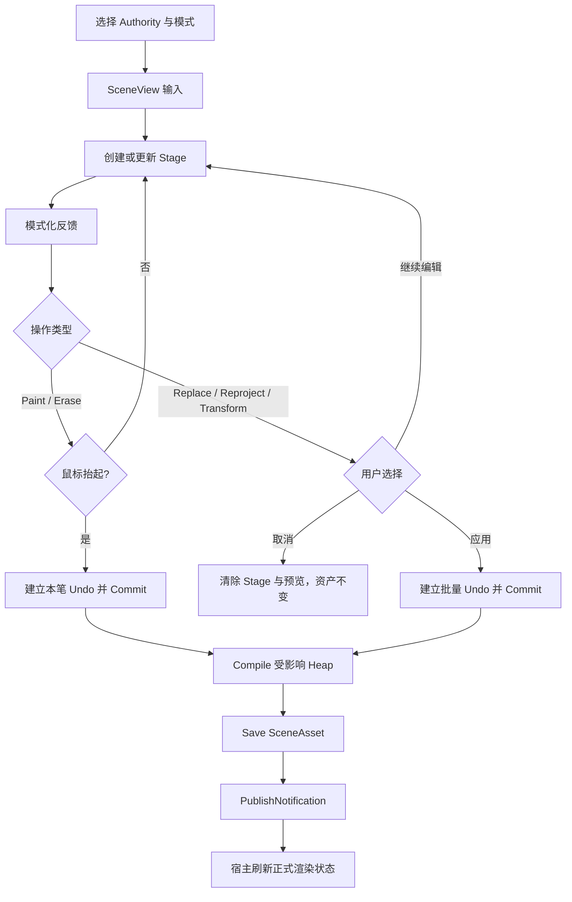

# Unity 植被 Painter 的作者工作流与事务设计

**标签**：#unity #experience #editor #custom-editor #ui #scriptable-object
**来源**：工程实践抽象 - Unity 编辑器植被工具的交互、身份与事务设计
**收录日期**：2026-08-25
**更新日期**：2026-08-26
**状态**：⚠️ 待验证
**可信度**：⭐⭐⭐⭐（核心交互、身份和事务边界有实践支撑；跨文件原子性、长时间交互和大数量操作仍需验证）
**适用版本**：Unity 2022.3 LTS；以 ScriptableObject 保存实例、以 BatchRendererGroup 预览的编辑器植被工具

---

### 概要

植被 Painter 不应把每次鼠标移动直接写入资产。稳定的作者闭环是：**选择唯一 Authority → 在 Stage 暂存操作 → 给出与模式相符的反馈 → Commit 作者数据 → Compile 派生缓存 → Save 资产 → PublishNotification 通知渲染宿主**。

Paint、Erase、Replace、Reproject 和 Transform 可以共享这条状态机，但它们的提交时机和预览承诺不同。本文只拥有 Painter 的作者事务、Undo、StableGuid、跨 Heap 移动和多运行时 Cell 作者隔离；Prototype 文件发布、BRG 内部地址、物理与静态光照只保留必要接口。

## 一、用户面对的对象与权威关系

| 对象 | 用户如何接触 | 系统责任 | 不应承担的责任 |
|---|---|---|---|
| Prototype | 在资源选择器中选择植物类型 | 提供身份稳定、已校验的渲染与碰撞描述 | 保存某个场景的逐株位置 |
| SceneAsset | 由运行时 Cell 绑定 | 保存 Prototype 表、Heap、作者实例和稳定身份 | 主动渲染或持有窗口状态 |
| 运行时 Cell | 在场景中选择管理器 | 成为作者授权、渲染和资源生命周期边界 | 与内部 Heap 混为同一层级 |
| Painter | 通过窗口、SceneView Overlay 和快捷键操作 | 选择模式、筛选目标、暂存、预览、应用或取消 | 持有长期 BRG 会话或在 Repaint 中重建全场数据 |

Prototype 把可复用植物资源交给 SceneAsset，SceneAsset 保存场景中的逐株作者数据，Painter 只通过受控事务修改当前 SceneAsset。Prototype 如何创建、刷新或替换文件属于独立资产发布流程；Painter 只接受“身份稳定且输入校验通过”的结果，并在 Prototype 变化时使相关派生缓存失效。

## 二、术语与核心不变量

- **Authority**：当前唯一允许被 Painter 写入的运行时 Cell。它是授权状态，不是额外资产。
- **Heap**：运行时 Cell 内部的空间分区；实例以运行时 Cell 局部空间保存，并在一个编译快照内只属于一个 Heap。
- **Stage**：一次操作的内存工作副本或目标快照；Commit 前不是权威数据。
- **StableGuid**：实例在一个 SceneAsset 内的持久身份。排序、跨 Heap 移动、重新投射和变换不得重建它。
- **SceneRevision**：随 SceneAsset 一起序列化、可被 Undo 恢复的作者版本提示。
- **SessionGeneration**：编辑器会话内单调递增且不随 Undo 回退的失效世代，用于识别旧 Stage。
- **Commit**：把通过校验的 Stage 一次性发布为新的内存作者状态，并形成一个明确的 Undo 边界。
- **Compile**：从作者状态生成排序、运行索引、Bounds、光照展开和内容键等可再生数据。
- **Save**：把当前内存中的 SceneAsset 状态持久化到磁盘；它不等同于 Commit。
- **PublishNotification**：通知渲染宿主正式资产已经发生变化；它不复制作者数据，也不是文件发布动作。

核心不变量是：

1. 同一时刻只有一个 Authority 能接收作者写入。
2. 所有模式先 Stage，再 Commit；取消 Stage 不修改正式资产。
3. 一次用户笔划或一次显式应用对应一个 Undo 边界。
4. StableGuid 标识实例，数组下标、RuntimeIndex 和 GPU Slot 只是派生地址。
5. Commit、Compile、Save 和 PublishNotification 是四个不同边界，失败语义不能混用。
6. Painter 只发布预览和正式变更，不拥有长期 BRG、Buffer 或渲染会话。

## 三、Authority 选择与切换

同一场景只有一个有效运行时 Cell 时，Painter 可以自动选择；存在多个候选时，必须要求用户显式选择，不能依赖组件查找顺序。Additive Scene 不必先成为 Active Scene，只要用户能够明确选择该 Scene 中的运行时 Cell。

切换 Authority 前必须检查：

- 是否仍有未结束的笔划；
- 是否有待应用的 Replace、Reproject 或 Transform Stage；
- 是否存在尚未取消的变换预览；
- 新目标是否位于已加载、可编辑且非 Preview 的 Scene；
- 两个运行时 Cell 是否错误地绑定同一 SceneAsset，或两个资产是否存在身份命名空间冲突。

只要仍有待应用内容，就应阻止切换并要求用户明确“应用”或“取消”。Scene 卸载只释放该 Scene 的会话和 Stage，不能清空其它 Additive Scene 的作者状态。

播放模式默认只读。若项目允许运行时编辑，必须另行定义运行实例状态与作者资产的合并协议，不能直接复用编辑模式写入路径。

## 四、五种模式的用户语义

| 模式 | Stage 内容 | SceneView 反馈 | 提交时机 | 取消语义 |
|---|---|---|---|---|
| Paint | 候选新实例、StableGuid、PrototypeId 和目标 Heap | 笔刷范围及候选落点；不承诺正式网格已更新 | 鼠标抬起自动提交本笔 | 抬起前丢弃 Stage；抬起后用 Undo |
| Erase | 目标 StableGuid 和待删除 Heap | 待删除目标标记；正式实例提交前仍存在 | 鼠标抬起自动提交本笔 | 抬起前不删除；抬起后用 Undo |
| Replace | 来源筛选、目标 StableGuid 和新 PrototypeId | 可选与待处理标记；不预演替换后网格 | 点击“应用替换” | 清除目标，PrototypeId 不变 |
| Reproject | 目标 StableGuid 和投射条件 | 可选与待处理标记；新位置在应用时求解 | 点击“应用重投射” | 清除目标，位置不变 |
| Transform | 目标 StableGuid 和临时矩阵 | 真实矩阵结果预览及保守 Bounds | 点击“应用变换” | 清除补丁并恢复正式显示 |

“反馈”不等于“最终结果预览”。Paint/Erase 主要说明本笔影响范围，Replace/Reproject 主要说明目标集合，只有 Transform 承诺在提交前显示临时变换结果。UI 文案和验收测试必须使用相同语义。

范围型操作应以 `StableGuid + SceneRevision + SessionGeneration` 建立目标快照。应用前重新校验三者，避免资产变化后继续用旧数组下标或恰好回退到相同 Revision 的旧 Stage。

## 五、一次操作的状态机



Paint/Erase 的鼠标抬起是一次笔划的提交边界；Replace/Reproject/Transform 的鼠标抬起只结束选择，必须等显式应用。任何模式在 Commit 前取消，都只清除 Stage、目标标记和预览，不应标脏资产或产生 Undo。

## 六、Commit、Compile、Save 与通知

### Commit

Commit 是内存作者事务，推荐顺序为：

1. 冻结当前 Stage，禁止继续接收同一操作的输入。
2. 校验 Authority、SceneRevision、SessionGeneration、StableGuid、Prototype 引用、有限数值和 Heap 归属。
3. 在修改前登记所有受影响的序列化对象，并建立一个 Undo Group。
4. 在候选副本中生成新的 Heap/实例集合及维持作者状态可解释所必需的索引。
5. 候选全部合法后，一次性发布为新的内存作者状态并标脏资产。
6. 发布成功后再消费 Stage；失败则回退本次作者事务，且不发送正式变更通知。

“提交必需结构”和“可再生缓存”不能混为一类。StableGuid 唯一性、Prototype 引用和 Heap 归属等结构失败，说明作者事务不合法；运行排序、GPU 排列或光照展开失败，则应把缓存标为 Stale/Error，或者按明确政策回退整个作者操作，但不能留下部分 Heap 已更新、部分仍旧且对外声称成功的状态。

### Compile、Save 与 PublishNotification

Compile 只消费已经合法的作者状态。它可以同步、延迟或后台执行，但必须为结果记录作者内容键和外部依赖版本，防止 Undo 分支或 Prototype 变化复用旧缓存。

Save 把当前内存对象写入磁盘。保存失败时，内存对象和 Dirty 状态可能仍然存在；系统应允许重试或显式回退，不能把“Save 抛错”自动解释为磁盘必然没有变化。

PublishNotification 只能在准备作为正式版本的内存/磁盘状态已经确定后发送。通知至少描述 SceneAsset、受影响 Heap、Prototype 表是否变化、缓存失效范围和是否允许局部更新。渲染宿主决定重建还是局部刷新，Painter 不依赖后端 Buffer 或 Batch 布局。

各检查点的状态应能被观察：

| 检查点 | Stage | 内存作者数据 | 派生缓存 | 磁盘 | 正式渲染 |
|---|---|---|---|---|---|
| Commit 前 | 保存候选 | 旧 | 旧 | 旧 | 旧；Transform 可有临时预览 |
| Commit 后 | 已冻结或消费 | 新 | 旧或 Stale | 旧 | 旧 |
| Compile 后 | 已消费 | 新 | 新 | 旧 | 旧 |
| Save 后 | 已消费 | 新 | 新 | 新 | 旧 |
| 通知被宿主消费后 | 已消费 | 新 | 新 | 新 | 新 |

### 失败恢复原则

| 失败点 | 必须保持的事实 | 恢复方向 |
|---|---|---|
| Stage 取消或提交前校验失败 | 正式作者数据、磁盘和 BRG 不变 | 丢弃或修正 Stage，不产生 Undo |
| Commit 发布失败 | 不得对外暴露半份作者状态 | 回退本次 Undo Group，重新核对内存对象 |
| Compile 失败 | 不能把部分缓存标成完整有效 | 标记 Stale/Error 后重试，或按政策回退整个作者操作 |
| Save 失败 | 不得发布“已持久化” | 核对内存与磁盘后重试保存或显式回退 |
| 通知或正式刷新失败 | 已保存作者状态仍是恢复依据 | 从正式资产强制重建渲染，不重复执行用户操作 |

跨 Prototype 文件和多份 SceneAsset 的原子发布不由 Painter 事务保证。若一项工具同时修改多个文件，必须由独立资产发布协议提供候选、提交点、进度记录和幂等恢复，不能借用 Unity Undo 冒充跨文件事务。

## 七、StableGuid 与跨 Heap 移动

StableGuid 是作者工具定位实例的唯一可靠身份：

- 新增或真正复制实例时生成新 StableGuid；
- Replace、Reproject、Transform 和同资产内跨 Heap 移动保留 StableGuid；
- 删除后不复用身份；Undo 恢复实例时恢复原身份；
- 跨 SceneAsset 的引用使用 `SceneAssetID + StableGuid`，并治理资产复制造成的命名空间冲突。

规则网格下，Heap 坐标可以表示为：

```text
heapCoordinate = floor((cellLocalPosition - partitionOrigin) / heapSize)
heapOrigin = partitionOrigin + heapCoordinate * heapSize
heapLocalPosition = cellLocalPosition - heapOrigin
```

第一次有效落点只创建内存 Stage；正式 Heap 到 Commit 时才创建，因此取消不会留下空 Heap。编译可以按 Prototype、空间码和 StableGuid 排序并重新分配 RuntimeIndex，但 RuntimeIndex、数组下标和 GPU Slot 都不能替代 StableGuid。

Reproject 或 Transform 跨 Heap 时，正确顺序是：

1. 用 StableGuid 从源 Heap 取得作者实例。
2. 从源 Heap 的候选集合移除。
3. 根据新位置计算目标 Heap 和局部 TRS。
4. 在目标 Heap 写入同一个 StableGuid、Prototype 引用和新 TRS。
5. 同时编译源、目标 Heap；源 Heap 为空时删除。
6. 使依赖位置、Bounds 或 Prototype 的派生数据失效并重新生成。

跨 Heap 移动不能直接搬运以旧 RuntimeIndex 编址的派生光照字节。哪些变化必须重新采样、哪些变化可以按 StableGuid 重绑，见[Bakery 静态光照与投影代理](./unity-vegetation-bakery-static-lighting-pipeline.md)。运行时地址如何由作者身份派生，见[统一 BRG 架构](./unity-vegetation-unified-brg-architecture.md)。

## 八、预览、Undo 与会话失效

Painter 只发布预览描述，编辑器渲染宿主持有长期 BRG 会话。关闭 Painter 窗口不应让正式植被消失；进入播放模式、Scene 卸载或 Domain Reload 时，由宿主按会话生命周期安全释放资源。

Transform 预览必须同时更新临时矩阵和保守 Bounds，并使用同一预览世代；否则可能出现剔除位置已变化、几何仍在旧位置的问题。CPU/GPU 预览发布及在途资源退役见[统一 BRG 架构](./unity-vegetation-unified-brg-architecture.md)。

Undo/Redo 应遵守：

- 一次笔划或一次显式应用对应一次 Undo；连续预览不生成碎片化 Undo。
- Commit 前取消只清除 Stage 和预览，不登记 Undo。
- Undo/Redo 后无条件清除所有 Stage、选择缓存和 Transform 补丁，而不是只比较可回退的 SceneRevision。
- 每次 Commit、Undo、Redo、Authority 切换或外部依赖失效都递增 SessionGeneration。
- 宿主根据恢复后的作者状态重建所有受影响运行时 Cell；当前窗口选中的 Authority 不能限制刷新范围。
- Undo 恢复的是内存序列化对象；磁盘是否同步必须由保存政策明确处理，不能根据画面一致就推断已经持久化。

## 九、性能与交互边界

Painter 的交互规模必须有预算。一次操作的候选数、射线采样数、StableGuid 查找、空间去重和 Compile 范围都可能随笔刷面积增长。推荐同时采用：

- 一次操作的候选硬上限和清晰提示；
- 可取消、可分批的长操作；
- StableGuid 到当前作者记录的索引，避免反复线性搜索；
- 空间网格或其它邻域索引，避免最坏二次距离检查；
- 把作者计算、缓存编译、GPU 上传和渲染刷新分别计时。

“只编译受影响 Heap”只描述 CPU 作者路径，不等于 GPU 一定局部更新。是否重建整个运行时 Cell、局部 Patch Buffer 或交换快照，由渲染宿主的能力和一致性协议决定。

## 十、采用与验证

| 主张 | 验证方法 | 失败信号 |
|---|---|---|
| 所有模式先 Stage 再提交 | 在 Commit 前取消每一种模式 | 资产变脏、出现 Undo 或正式显示残留 |
| 反馈语义与模式一致 | 分别观察五种模式的提交前显示 | 目标标记被误当最终网格预览 |
| 一次用户动作一个 Undo | 连续拖动后应用并逐次撤销 | 一次操作生成大量 Undo 或无法整体撤销 |
| 旧 Stage 不会复用 | Stage 期间触发 Commit、Undo、Redo 或切换 Authority | 旧数组下标写入新内容或预览复活 |
| 跨 Heap 移动保留身份 | 移动后重新排序、编译并恢复选择 | StableGuid 变化、选择丢失或引用错位 |
| 派生缓存失败不伪装成功 | 在 Compile 的不同阶段注入失败 | 部分 Heap 被标为完整有效或通知已发送 |
| 保存与通知边界明确 | 分别注入 Save 和刷新失败 | UI 宣称已保存，或重复执行用户操作 |
| 多运行时 Cell 不串写 | 在 Additive Scene 间切换并卸载其中一个 Scene | 写入错误资产或清除其它 Cell 的 Stage |
| 大操作不冻结编辑器 | 测量最大允许候选数、取消延迟和 GC | 无上限增长、长时间无响应或无法取消 |

验收要分别覆盖自动化失败注入、长时间人工交互、大数量笔划和目标设备上的预览刷新成本；其中任何一类通过，都不能替代其它边界。

### 相关记录

- [统一 BRG 架构](./unity-vegetation-unified-brg-architecture.md) - 渲染会话、地址映射、快照和预览发布接口。
- [Bakery L2 静态光照与投影代理](./unity-vegetation-bakery-static-lighting-pipeline.md) - 位置、Bounds 与 Prototype 变化后的光照失效政策。
- [多运行时 Cell 物理查询与 Collider 流送](./unity-vegetation-multi-cell-physics-streaming.md) - 运行时 Cell/Heap 在物理侧的所有权和卸载接口。

### 验证记录

- **主题证据**：Authority、Stage、五种模式、StableGuid、Commit/Compile/Save/PublishNotification 和 Undo 可以通过作者资产、Dirty 状态、Undo 栈与正式渲染状态的逐阶段观察相互验证。
- **未验证边界**：跨文件原子发布、所有异常点的失败注入、长时间连续编辑、大数量笔划、SceneGuid 冲突迁移和目标设备预览成本，需要在采用对应能力的工具中分别验证。
