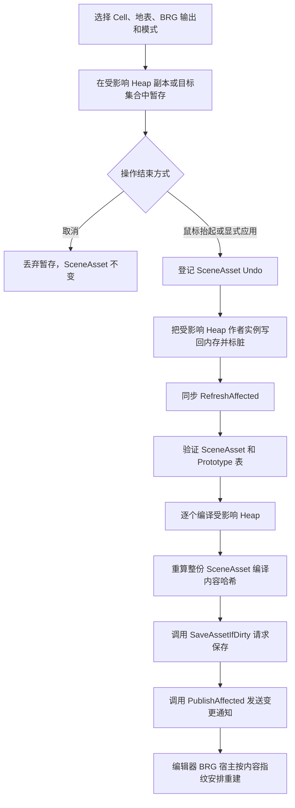

# Unity 植被 Painter 的作者工作流与事务设计

**标签**：#unity #experience #editor #custom-editor #ui #scriptable-object
**来源**：工程实践抽象 - Unity 编辑器植被工具的交互、身份与事务设计
**收录日期**：2026-08-25
**更新日期**：2026-09-03
**状态**：📘 有效
**可信度**：⭐⭐⭐⭐（星级表示本文案例主张与匿名参考实现之间的静态证据强度，不表示软件成熟度、生产就绪度或测试已经运行；异常恢复、跨场景用户交互和未来异步编译协议仍有明确未验证边界。）
**适用版本**：Unity 2022.3 LTS；以 ScriptableObject 保存实例、以 BatchRendererGroup（BRG，Unity 低层批量渲染接口）预览的编辑器植被工具

---

本文把 **Painter** 特指在 Unity SceneView 中刷取和编辑植被的作者工具；**SceneAsset** 是该案例自定义的 ScriptableObject 类型，用于保存一个植被区域的作者数据；**Cell** 是场景管理器与其 SceneAsset 共同代表的完整区域；**Heap** 是 Cell 内部的空间分桶；**Stage** 是尚未写回 SceneAsset 的暂存状态；**StableGuid** 是逐株实例的稳定身份；**Commit** 是把 BRG 暂存作者数据写回 SceneAsset 并建立 Undo 边界；**Compile** 是从作者数据生成可再生运行缓存。代码中名为 `PublishAffected` 和 `PublishFull` 的方法只是在 Unity 编辑器进程内发送变更通知，不是 Git 提交、软件包对外分发或远程交付。为避免混淆，后文统一称其为“发送变更通知”。**Additive Scene** 是在不卸载已有场景的前提下附加加载的另一个 Unity Scene。后文会分别展开这些术语的职责和边界。

### 概要

植被 Painter 的难点不是“在鼠标位置放一个模型”，而是同时协调三类状态：用户正在操作的临时候选、可撤销的作者数据，以及由作者数据生成的渲染缓存。若把三者混成一个“保存”动作，取消、Undo、编译失败或场景切换都会留下难以解释的半成品。

当前工具有两种输出，它们必须分别理解：

- **BRG 输出**把逐株实例写入当前 Cell 的 SceneAsset。Paint、Erase、Replace、Reproject 和 Select/Edit 都通过暂存数据修改作者资产；正常前向路径在主线程同步完成局部编译，然后调用资产保存 API 并发送渲染变更通知。
- **GameObject 输出**只提供 Paint/Erase。它在拖动时直接创建或删除普通场景对象，依靠一个 Unity Undo Group 包住整笔操作；鼠标抬起只是结束并确认这笔操作，不进入 BRG 编译链，也不会自动保存 Scene 文件。

本文先还原当前实现，再提出生产化必须补齐的一致性要求。当前正常链、GameObject 笔划事务和底层多 Scene 归属都有源码入口，也有部分测试定义；但本文没有与冻结快照绑定的测试运行报告。BRG Undo/Redo 的磁盘重载一致性、保存失败恢复、Painter 用户层跨 Additive Scene 体验和延迟编译都不是已验证能力。后文使用“当前实现”和“生产要求”明确区分这两类内容。

## 一、问题模型与术语

### 1.1 为什么 Painter 需要事务

一次刷取可能触及多个空间分区，批量移动还可能把实例从一个分区迁到另一个分区。与此同时，编辑器要持续显示预览、支持取消与 Undo，并让 BatchRendererGroup 使用最新的派生缓存。如果中途失败，至少需要回答四个问题：

1. SceneAsset 中的作者实例是否已经变化？
2. 运行时排序、Bounds 和光照数据是否与作者实例属于同一版本？
3. 磁盘文件是否已经保存？
4. 编辑器 BRG 当前显示的是哪一版？

因此，“看见变化”“可以 Undo”“已经保存”和“BRG 已刷新”是四个不同事实，不能互相替代。

### 1.2 首次术语定义

- **Unity Scene**：Unity 的场景文件与当前加载的场景实例。多个 Scene 可以用 Additive 模式同时加载。
- **Additive Scene**：在不卸载已有 Scene 的前提下附加加载的另一个 Scene。它不必是 Active Scene，但仍有独立的对象归属和保存状态。
- **BRG（BatchRendererGroup）**：Unity 提供的低层批量渲染接口。本文中的 BRG 输出保存的是作者实例数据，不是普通 GameObject 层级。
- **SceneAsset**：一个 ScriptableObject，保存某个植被 Cell 的 Prototype 表、Heap 和逐株作者实例；它是 BRG 作者数据的权威来源。
- **Cell**：一个场景中的植被管理器及其绑定 SceneAsset 所代表的完整区域。Cell 是作者授权、渲染和生命周期边界，不等同于内部 Heap。
- **Prototype**：可复用植被原型，描述网格、材质、LOD 和碰撞等跨场景数据；它不保存某个场景的逐株位置。
- **Heap**：SceneAsset 内按 Cell 局部空间划分的分桶。一个实例在一个作者版本中只属于一个 Heap。
- **Stage（暂存）**：尚未写回权威数据的操作副本或目标集合。取消 Stage 不应改变正式 SceneAsset。
- **StableGuid**：BRG 实例在一个 SceneAsset 内的稳定身份。数组下标、排序位置和 GPU 槽位都只是可重建地址。
- **Revision**：SceneAsset 随作者修改序列化的版本值，当前用于判断暂存目标是否仍对应原资产版本。
- **Undo Group**：Unity 编辑器把多个对象修改折叠成一次用户撤销的分组。
- **Compile（编译）**：由作者实例生成排序、运行时索引、Bounds、内容哈希和光照展开等可再生数据。
- **Save（保存）**：把当前内存对象写入磁盘。它不等于作者数据已经写回内存，也不等于渲染已经刷新。
- **Preview Scene（预览场景）**：Unity 编辑器为 Prefab Stage、导入预览等临时上下文建立的场景，不是普通项目 Scene 的作者数据归属目标。
- **Dirty（已修改未确认持久化）**：Unity 编辑器对象或 Scene 的内存状态已变化，需要保存才能与磁盘版本一致。“已标记 Dirty”只是待保存信号，本身不证明已写盘，也不证明关闭时一定出现提示。
- **Domain Reload（托管域重载）**：Unity 因脚本重编译等原因重建 C# 运行域的过程。静态字段和非序列化状态会丢失，可序列化的 EditorWindow 字段可能被恢复，所以不能仅凭窗口开关判断旧 Stage 仍然有效。
- **Stale（过期）**：派生缓存或预览仍对应旧版作者输入、Prototype 依赖或 Cell 变换，因而不能被当作当前有效结果。
- **有限 Transform**：本案例的最低数据门禁，要求位置、旋转四元数和统一缩放的每个浮点分量都不是 `NaN` 或正负无穷，且统一缩放大于零。这不等于四元数已归一化，也不代表缩放上限已校验。
- **SceneAsset 编译内容哈希**：写入 SceneAsset 的 `Hash128`，由场景身份与分区配置摘要、Prototype 依赖摘要和全部 Heap 编译哈希合成，用来表示派生内容版本。
- **编辑器宿主内容指纹**：编辑器进程内计算的 `int`，组合了 Layer、Cell 位移/旋转/缩放、SceneAsset 实例 ID、Revision、SceneAsset 编译哈希、Heap 和 Prototype 的若干版本信号，只用于决定编辑器 BRG 会话是否重建。它不是 SceneAsset 编译内容哈希的别名，也不是持久化或密码学完整性证明。
- **变更通知**：通过 `PublishAffected` 或 `PublishFull` 在进程内通知编辑器渲染宿主某个 SceneAsset 发生变化；它不保存文件，也不复制一份新资产。

### 1.3 匿名参考实现与证据等级

本文的实现性陈述绑定到一个匿名化参考快照：Git 提交 `f0fef16849cfb8945e9928e5219a140ee250fcf4`，植被模块 tree `4700f76e0b087fe3935c06e660ee732bbf55c87a`。提交哈希固定整个仓库版本，tree 哈希固定本文所讨论的模块内容；读者无需知道项目名即可在拥有该快照的仓库中复核。

本文使用三种证据等级：

1. **实现静态确认**：在上述 tree 中读取生产源码及调用顺序，但没有执行 Unity。
2. **测试定义存在**：在上述 tree 中读取测试方法的准备、操作和断言；只证明测试意图与复现入口，不证明测试已运行或通过。
3. **历史运行证据**：必须能绑定报告原文、执行环境与同一代码快照。本文没有取得满足这些条件的运行报告，因此没有任何主张使用这一级证据。

核心主张与快照入口如下。路径都相对于模块根，不包含本机或项目绝对路径：

| 核心主张 | 生产源码与关键方法 | 测试定义 | 本文证据等级 |
|---|---|---|---|
| 一个 Painter 笔划锁定一个表面，不隐式跨网格 | `Editor/Painter/VegetationPainterWindow.cs`：`BeginStroke`、`TrySelectSurfaceAtPointer`、`TryGetSurface` | `Tests/Editor/VegetationPainterShortcutTests.cs`：`SelectedSurface_DoesNotCrossToAnotherVisibleMesh` | 实现静态确认；测试定义存在；无运行证据 |
| MeshRenderer 可不依赖 Collider 且支持非 Read/Write Mesh | `Editor/Painter/VegetationPaintSurfaces.cs`：`TryCreateSelectable`；`Editor/Painter/VegetationMeshSurfaceIntersection.cs`：`MeshIntersectionMetadata.Create` | `Tests/Editor/VegetationMeshSurfaceQueryTests.cs`：`MeshRaycast_SupportsNonReadableMesh` | 实现静态确认；测试定义存在；无运行证据 |
| BRG 先改 Heap 副本，Commit 时建立 Undo 并写回作者数据 | `Editor/Painter/VegetationSceneEditSession.cs`：`GetOrCreateStage`、`Validate`、`Commit` | `Tests/Editor/VegetationAuthoringPipelineTests.cs`：`SceneEditSession_CommitCreatesOneUndoBoundary`；`Tests/Editor/VegetationBrushOperationTests.cs`：`SceneEditSession_BatchReplaceDoesNotTouchAssetUntilCommit` | 实现静态确认；测试定义存在；无运行证据 |
| 当前 BRG 编译、保存 API 调用和通知按同步顺序发生 | `Editor/Painter/VegetationPainterWindow.cs`：`RefreshSceneAsset`；`Editor/Compiler/VegetationSceneCompiler.cs`：`RefreshAffected` | 本文未找到覆盖完整顺序和异常点的单一测试定义 | 实现静态确认；无运行证据 |
| SceneAsset 编译哈希与编辑器宿主指纹职责不同 | `Editor/Compiler/VegetationSceneCompiler.cs`：`RefreshAffected`、`ComputeSceneIdentityHash`；`Editor/Rendering/VegetationEditorSceneRenderHost.cs`：`ComputeContentFingerprint` | 本文未找到专用测试定义 | 实现静态确认；无运行证据 |
| 保存调用没有磁盘回读或上层恢复协议 | `Editor/Compiler/VegetationSceneCompiler.cs`：`RefreshAffected` 尾部依次调用 `SaveAssetIfDirty`、`PublishAffected` | 本文未找到保存失败注入测试定义 | 实现静态确认；无运行证据 |
| BRG Undo/Redo 后强制重建显示，但不自动重编译或保存 | `Editor/Rendering/VegetationEditorSceneRenderHost.cs`：`OnUndoRedoPerformed` | 本文未找到覆盖保存、重载和缓存一致性的测试定义 | 实现静态确认；无运行证据 |
| GameObject 笔划直接修改 Scene 对象并用 Undo Group 收束 | `Editor/Painter/VegetationGameObjectBrushStroke.cs`：`Begin`、`Paint`、`Erase`、`Commit`、`Cancel` | `Tests/Editor/VegetationGameObjectBrushTests.cs`：`Paint_UndoAndRedoRestoreWholeStroke`、`DisposeWithoutCommit_RollsBackCreatedObjects` | 实现静态确认；测试定义存在；无运行证据 |
| 底层 GameObject 笔划可按 TargetScene 隔离对象归属 | `Editor/Painter/VegetationGameObjectBrushStroke.cs`：`Paint`、`GetOrFindRoot` | `Tests/Editor/VegetationGameObjectBrushTests.cs`：`OneStroke_WritesEachAdditiveSceneIndependently` | 实现静态确认；测试定义存在；无运行证据；不是 Painter UI 跨场景证明 |
| 关闭 Scene 时渲染宿主只释放该 Scene 的 Cell 会话 | `Editor/Rendering/VegetationEditorSceneRenderHost.cs`：`OnSceneClosed`、`ReleaseSceneCells` | 本文未找到对应行为的直接测试定义 | 实现静态确认；无运行证据 |

## 二、权威对象与不变量

| 对象 | 当前责任 | 明确不负责 |
|---|---|---|
| Prototype | 提供稳定原型身份及渲染、LOD、碰撞描述 | 保存某个 Scene 的逐株位置 |
| SceneAsset | 保存 BRG 作者实例和随资产序列化的派生缓存 | 保存 GameObject 输出或 Painter 窗口状态 |
| Cell 管理器 | 绑定 SceneAsset，并提供 Cell 根变换和运行参数 | 取代 SceneAsset 保存逐株数据 |
| Painter | 选择 Cell、表面、输出和操作，建立暂存与 Undo 边界 | 直接持有长期 BRG Buffer 或替 Unity 保存 Scene 文件 |
| 编辑器 BRG 宿主 | 为每个已加载有效 Cell 建立渲染会话并响应资产变化 | 成为第二份作者数据权威 |

参考快照的实现结构表达以下当前规则；它们是静态代码结论，不是测试运行结论：

1. BRG 编辑必须先确定一个 Cell Authority，也就是当前唯一允许写入的 Cell。
2. BRG 实例只写入该 Cell 绑定的 SceneAsset；Prototype 不承载场景逐株数据。
3. BRG Paint/Erase 在编辑会话的 Heap 副本中修改；显式批量操作先保存 StableGuid 目标集合，再建立编辑会话。
4. GameObject 输出不要求 Cell，也不修改 SceneAsset。
5. 代码为一次鼠标笔划或一次显式应用建立一个 Undo 分组边界；真实用户路径是否在所有模式下只产生一次可解释的 Undo，仍需运行验收。
6. StableGuid 在 Replace、Reproject、Select/Edit 和同资产跨 Heap 移动中保持不变。
7. 当前正常 BRG 前向链是同步链；不能把本文的未来异步协议写成现状。

## 三、Cell、表面与 Additive Scene

### 3.1 当前 Cell 选择规则

Cell Authority 只在进入编辑并选择 BRG 输出后才必要。只有一个有效 Cell 时工具可以自动绑定；存在多个 Cell 时，用户可以从列表或 SceneView 明确选择。被选 Cell 可以位于一个已加载但非 Active 的 Additive Scene。

静态实现中，窗口控件会在存在待应用批量操作时禁用 Cell 切换；如果 Hierarchy 选择先改变了 Authority，`VegetationPainterWindow.SynchronizeRuntimeBinding` 会尝试恢复原 Cell，并要求先应用或取消待处理内容。`VegetationEditorSceneRenderHost.OnSceneClosed` 按关闭 Scene 的 handle 调用 `ReleaseSceneCells`，只释放该 Scene 的渲染会话，随后重新扫描仍加载的 Scene。由此可以确认渲染宿主的释放范围；但“Scene 关闭过程中的任意时点都能先清除 Painter 全部瞬时 Stage”没有绑定测试运行或异常注入，应作为待验证生命周期要求。当前 PlayMode 门禁的源码明确拒绝作者编辑，只保留运行时显示。

### 3.2 当前地表选择规则

Painter 不在每次鼠标移动时扫描全场网格。进入编辑后，用户先选择一个明确地表，后续悬停和拖动只对该表面求交：

- 新交互允许选择同一 GameObject 上带 MeshFilter 的可见 MeshRenderer，或可用的 Terrain。
- MeshRenderer 路径直接读取网格数据求交，不要求 Collider，也不要求 Mesh 开启 Read/Write。
- Terrain 的精确命中仍依赖 TerrainCollider。
- 当前选中表面未命中时，本次采样暂停；工具不会因为鼠标移到另一网格上就隐式更换地表。
- 更换表面是显式动作，而且不能在仍有待应用内容时进行。

BRG 与 GameObject 的场景约束不同：

| 输出 | 可选地表的 Scene | 结果归属 |
|---|---|---|
| BRG | 必须与当前 Cell 管理器位于同一个已加载 Scene | 写入该 Cell 的 SceneAsset |
| GameObject | 选择器可接受任意已加载 Scene 中的有效表面；真正写入时还会拒绝 Preview Scene | 写入命中表面所属普通 Scene 的 `Vegetation GameObjects` 根 |

这里存在两个必须显式说明的边界。第一，当前 Painter 在一笔开始时保存一个 `_strokeSurface`，因此一笔交互不会自动跨到另一表面或另一 Additive Scene；用户若要向另一 Scene 绘制，应结束当前笔划，再显式选择新 Scene 中的表面。第二，GameObject 的表面选择校验本身只要求 Scene 有效且已加载，而真正创建或删除对象时才明确拒绝 Preview Scene；这两个门禁尚未统一，不能把“能选中”写成“必然能写入”。

底层 GameObject 笔划服务按每个落点携带的 `TargetScene` 查找或创建归组根，因此同一个 Undo Group 在结构上可以接收来自不同 Scene 的命中。参考快照中的测试方法 `OneStroke_WritesEachAdditiveSceneIndependently` 定义了“向同一底层笔划注入两个合成表面，再执行 Undo/Redo”的场景；本文没有绑定该测试的运行报告，所以它只能说明测试意图和可复现入口，不能作为通过证据。即使未来执行通过，证明的也是**底层多 Scene 事务原语**，不是 Painter SceneView 中“一笔跨场景拖刷”的端到端体验；后者当前不是 UI 行为，也没有对应验收证据。

## 四、两种输出的操作语义

### 4.1 BRG 五种模式

| 模式 | 暂存内容 | 提交前反馈 | 写回时机 | 取消 |
|---|---|---|---|---|
| Paint | 新实例、StableGuid、PrototypeId 和目标 Heap | 笔刷范围与候选落点 | 鼠标抬起 | 抬起前丢弃会话；抬起后使用 Undo |
| Erase | 受影响 Heap 的实例副本 | 范围内待删实例标记 | 鼠标抬起 | 抬起前正式实例不变；抬起后使用 Undo |
| Replace | 来源筛选、目标 StableGuid、新 PrototypeId | 待处理目标集合 | 点击“应用替换” | 清除目标集合，原 PrototypeId 不变 |
| Reproject | 目标 StableGuid、当前投射表面和方向 | 待处理目标集合 | 点击“应用重投射” | 清除目标集合，位置不变 |
| Select/Edit | 一个或多个 StableGuid 与临时矩阵 | 真实移动、旋转、缩放预览 | 点击“应用变换” | 清除临时矩阵并恢复正式显示 |

“提交前反馈”不等于所有模式都预演最终网格。Paint/Erase 重点显示影响范围，Replace/Reproject 显示目标集合，Select/Edit 才显示变换后的几何。UI 文案、截图和测试不应把目标高亮写成最终结果预览。

### 4.2 GameObject Paint/Erase

GameObject 输出不是 BRG 的特殊 Prototype，也没有 BRG 与 GameObject 的相互转换：

- Paint 只接受 Project 中的 Prefab 资产，实例保持 Prefab 连接。
- 每个落点写入命中表面所属 Scene 的公开根 `Vegetation GameObjects`。
- Erase 只删除该 Scene 中专用根的直接子对象，不处理场景里其它同名模型。
- 拖动期间对象已经存在于 Scene 内存中，但全部创建或删除都登记到本笔 Undo Group。
- 鼠标抬起时只是结束并确认该笔划，把 Undo Group 折叠成一次操作。
- Escape、窗口关闭或未完成事务被释放时，整笔 Undo Group 回滚。
- 发生变化的 Scene 会被标记为 Dirty，但工具不自动调用 Scene 保存 API。

因此 GameObject 输出没有 BRG 意义上的 Commit、Compile 或变更通知。对用户而言，它只有“正在进行的笔划”“已结束并可 Undo 的场景修改”“Scene 文件已保存”三个阶段。

## 五、当前 BRG 正常前向链

当前实现不是后台管线，而是一条同步调用链：



不用图表示时，顺序是：先选择 Cell、地表、输出和模式；再把操作写入暂存副本；取消时直接丢弃暂存；确认时先登记 SceneAsset Undo，再写回作者实例；随后同步验证并编译受影响 Heap，重算整资产编译内容哈希，调用 Unity 保存 API，发送进程内变更通知，最后由编辑器 BRG 宿主安排渲染会话重建。这里能由源码确认的是调用顺序，不是保存已成功的磁盘证明。

对应实现入口可以由下列调用关系复核：

1. `VegetationPainterWindow.BeginStroke` 建立 BRG 编辑会话，或为显式批量操作保存 StableGuid 目标集合。
2. `VegetationSceneEditSession` 只复制实际访问的 Heap；其 `Commit` 校验 StableGuid、有限 Transform 和 Heap 归属，登记完整对象 Undo，再写回作者实例。
3. `VegetationPainterWindow.RefreshSceneAsset` 调用 `VegetationSceneCompiler.RefreshAffected`，并明确关闭第二次 Undo 登记。
4. `RefreshAffected` 同步验证、逐 Heap 编译、写入派生缓存、更新 SceneAsset 编译内容哈希并标记 Dirty，然后依次调用 `AssetDatabase.SaveAssetIfDirty` 与 `VegetationSceneAssetChangeHub.PublishAffected`。该方法没有对保存结果做磁盘回读、版本比对或重试。
5. `VegetationEditorSceneRenderHost` 收到通知后，根据内容指纹重建引用该资产的 Cell 会话。该指纹包含 SceneAsset 编译内容哈希，但还包含 Cell 变换、对象实例 ID、Revision、Heap 和 Prototype 信号，因而它是编辑器会话的快速变更检测值，不是第二份 SceneAsset 哈希。

这条链说明当前版本不存在“Compile 已在后台完成但 Save 尚未跟上”的正常调度状态，因为整条链在主线程同步调用。但“调用 Save”不能等价为“已证明磁盘持久化成功”。局部编译只重做受影响 Heap，SceneAsset 编译内容哈希则会用全部 Heap 编译哈希重新合成；渲染宿主是否局部 Patch GPU Buffer 是另一层能力，不能由“局部编译”推断。

### 5.1 内容哈希与宿主指纹的关系

`RefreshAffected` 中的 SceneAsset 编译内容哈希可概括为：

```text
SceneAssetCompiledHash = Combine(
    SceneIdentityHash(DataVersion, SceneGuid, PartitionOrigin, HeapSize),
    PrototypeDependencyHash,
    EveryHeapCompiledContentHash)
```

其中每个 Heap 的编译哈希又合成了实例内容、Prototype 依赖、光照数据和编译器版本摘要。因此，SceneAsset 编译内容哈希是序列化派生内容的版本摘要。它没有把 Cell 管理器的当前世界位移、旋转和缩放作为独立字段直接合成；但在重新采样光照时，Cell 变换可能通过改变逐株采样结果而间接改变 Heap 光照哈希。

`VegetationEditorSceneRenderHost.ComputeContentFingerprint` 则是更宽的编辑器重建键：它把上述 SceneAsset 哈希与 Cell 变换、Layer、Unity 对象实例 ID、SceneAsset/Heap Revision、实例数以及 Prototype 对象与依赖哈希再次组合。所以两者是“持久化派生内容摘要”与“编辑器会话重建键”的包含关系，不是同一值的两个名称。该 `int` 指纹的目的是快速检测变化，源码没有把它当作无碰撞保证。

## 六、Undo/Redo 的真实边界

### 6.1 BRG Undo/Redo 当前做了什么

`VegetationSceneEditSession.Commit` 使用 Unity 的完整对象 Undo 记录 SceneAsset。执行 Undo 或 Redo 时，Unity 恢复该序列化对象；`VegetationEditorSceneRenderHost` 监听 `Undo.undoRedoPerformed`，刷新 Cell Authority 并强制安排编辑器 BRG 重建。

当前没有发现 Undo/Redo 回调执行下列动作：

- 重新调用 `VegetationSceneCompiler.RefreshAffected` 或 `RefreshAll`；
- 自动执行 `SaveAssetIfDirty`；
- 重新调用 `PublishAffected` 或 `PublishFull`。

因此可以静态确认的是“显示宿主会从 Undo/Redo 后的 SceneAsset 内存状态重建”。源码不足以证明重建出来的所有派生数据已被重编译，也不足以证明 Undo/Redo 结果已写入磁盘。要把 Undo 和 Redo 变成可对外承诺的功能，验收必须分三层：

| 层次 | Undo 的应有语义 | Redo 的应有语义 | 当前证据边界 |
|---|---|---|---|
| 内存与显示 | SceneAsset 内存中的作者实例和与其配套的派生缓存回到操作前版本，BRG 显示与该版本一致 | SceneAsset 内存中的作者实例和派生缓存恢复到操作后版本，BRG 显示与该版本一致 | 已找到完整对象 Undo 登记与宿主强制重建；未找到对作者数据、派生缓存和实际显示逐项比对的运行结果 |
| 显式保存后重载 | Undo 后由用户明确保存，再重新导入资产或重启 Unity，应重现操作前版本 | Redo 后由用户明确保存，再重新导入资产或重启 Unity，应重现操作后版本 | Undo/Redo 回调不调用 Save，本文也没有绑定重载测试；该语义尚未验证 |
| 未保存关闭 | Undo 后若未显式保存就关闭，用户要么先收到可理解的保存/放弃选择，要么重开时明确回到上一个磁盘版本；不得把仅存内存的 Undo 冒充为已持久化 | Redo 后若未显式保存就关闭，同样必须提供保存/放弃选择，或在重开时明确回到上一个磁盘版本；不得静默假定 Redo 已写盘 | 当前模块没有自己的关闭提示或放弃恢复协议，也没有验证 Unity 宿主在该资产路径上的具体提示行为；该语义未实现为模块保证 |

第三层不规定一定要由植被模块自制对话框，但必须明确依赖 Unity 的哪一种保存提示，并用真实关闭/重开路径验证。如果宿主不会为 ScriptableObject 资产提示，模块就需自行显示未持久化状态并提供保存或放弃入口。当前参考实现没有建立这项上层责任。

一个能同时验收 Undo 与 Redo 的具体例子是：设操作前为 A，正常操作后为 B，而 B 已被保存。Undo 到 A 但不保存时，选择放弃并重开应恢复磁盘中的 B；若先把 Undo 后的 A 明确保存，再 Redo 到 B 但不保存，选择放弃并重开应恢复磁盘中的 A。这个对称实验能防止“初次操作恰好已自动保存”掩盖 Redo 未持久化的问题。

另外，外部 Prototype 已变化时，恢复的旧派生缓存是否会被正确判为 Stale，以及 Undo/Redo 恢复到相同 Revision 时旧目标集合是否会重新通过版本门禁，仍需专门验证。

当前暂存目标的主要版本门禁是 `SceneAsset + Revision`。参考快照中没有找到一个独立、只在编辑器会话内单调递增且不随 Undo 回退的 SessionGeneration。因此，“Undo/Redo 无条件淘汰所有旧 Stage”应视为生产设计要求，而不是当前实现事实。

### 6.2 GameObject Undo/Redo 当前做了什么

GameObject 路径在笔划开始时创建独立 Undo Group，每次 Prefab 创建和范围删除都登记到该组。结束并确认笔划后，该组被折叠为一次 Undo；取消或释放未完成笔划时，使用 `Undo.RevertAllDownToGroup` 回到笔划前。

参考快照为整笔 Paint 的 Undo/Redo、未结束笔划回滚、专用根擦除，以及底层同组操作的两个 Additive Scene 归属定义了测试方法。本文只静态核对这些测试的 Arrange/Act/Assert，没有绑定测试执行报告，因而不能声称测试已经通过。这些定义本身也没有证明 Scene 文件已保存，未覆盖全部异常抛出点和保存失败后的 Dirty 状态恢复。

## 七、失败恢复：现状与生产要求

### 7.1 当前实现能够保证的部分

- Stage 被正常取消时，BRG 作者实例不写回 SceneAsset。
- `VegetationSceneEditSession.Commit` 在写回前先验证整份候选中的 StableGuid、有限 Transform 和 Heap 归属。
- Replace、Reproject 和 Select/Edit 的显式批量应用由外层 Undo Group 包裹；其中任一目标失败或后续刷新抛出异常时，窗口会回退该组。
- `RefreshAffected` 只在编译步骤正常返回并且 `SaveAssetIfDirty` 调用返回后才发送变更通知；如果其中任一调用抛出异常，后续通知不会执行。但源码没有检查“保存 API 正常返回”是否等于“目标字节已持久化”。
- GameObject 未结束笔划在 Dispose 时默认回滚。

### 7.2 尚未闭环的风险

Paint/Erase 的鼠标抬起路径在作者会话写回后直接调用 `RefreshAffected`，没有与显式批量应用相同的外层异常回退。与此同时，编译器按 Heap 顺序把成功生成的派生数据写回正式对象；如果后续 Heap 才失败，现有源码不足以证明先前 Heap 会自动恢复。因此不能把当前路径描述成“任意 Compile 失败都原子回滚”。

生产化至少需要为每个失败点规定可观察状态：

| 失败点 | 不能出现的结果 | 最小恢复要求 |
|---|---|---|
| 暂存校验 | 正式作者数据被部分修改 | 丢弃或修正 Stage，不产生 Undo |
| 作者数据写回 | 一部分 Heap 是新作者数据，另一部分仍旧 | 在候选副本完成全量验证后一次替换正式状态，或统一 Undo 回退 |
| 派生编译 | 部分缓存被当成完整有效 | 先在候选产品中完成全部受影响 Heap，再交换；失败时保留旧缓存并标明 Stale |
| 资产保存 | UI 宣称已持久化，但磁盘仍是旧版或只写入了部分数据 | 保留 Dirty 并给出明确失败提示；不得发送可被理解为“已持久化”的成功通知；提供重试保存或恢复到上一磁盘版本的显式入口 |
| 渲染重建 | 为恢复显示而重复执行用户操作 | 从权威 SceneAsset 重建，不重新生成 StableGuid 或重复 Paint |

保存失败恢复是正式采用的硬门禁，不是可选的稳健性增强。最小失败注入需覆盖只读文件、保存 API 异常和“API 返回但重新导入仍是旧内容”三类情形，并验证 UI 提示、Dirty、重试、回退和重开后结果。参考快照中既没有编译器层的磁盘确认，也没有 Painter 上层的统一重试/放弃协议，因而这项责任目前无法归结为“已由上层处理”。

Unity Undo 不是跨文件事务。Prototype 资产和多个 SceneAsset 若需要作为一个逻辑操作共同生效，必须另设候选、提交点和幂等恢复协议。

## 八、未来延迟或后台 Compile 的版本一致性协议

当前 Painter 同步编译。只有在大笔划测量证明同步编译确实阻塞编辑器后，才有理由引入延迟或后台 Compile；引入后必须同时满足以下门禁：

1. 任务启动时冻结 SceneAsset 身份、Revision、作者内容哈希、Prototype 依赖哈希和 Cell 根变换版本。
2. 后台任务只生成不可变候选产品，不直接逐 Heap 改写正式 SceneAsset。
3. 完成回调再次比较所有版本键；Undo、Redo、新 Commit、Prototype 变化、Cell 切换或 Domain Reload 后的旧结果必须丢弃。
4. 只有候选仍对应当前作者版本时，才在主线程一次交换派生缓存。
5. Save 和变更通知只针对已经成功交换的版本；通知携带相同内容键，渲染宿主拒绝旧通知覆盖新状态。
6. 编译期间继续显示上一份完整正式缓存，或明确显示 Stale；不能混合新旧 Heap 冒充同一版本。
7. 关闭窗口不能成为取消正式作者数据的信号，但应取消只属于该窗口且尚未交换为正式缓存的预览任务。

这些是未来接口要求，当前实现和现有测试都不能作为其完成证据。

## 九、StableGuid 与跨 Heap 移动

规则网格中的分桶可以写成：

```text
heapCoordinate = floor((cellLocalPosition - partitionOrigin) / heapSize)
heapOrigin = partitionOrigin + heapCoordinate * heapSize
heapLocalPosition = cellLocalPosition - heapOrigin
```

StableGuid 解决的是“实例是谁”，Heap 坐标解决的是“实例当前存在哪里”。正确规则是：

- 新增或真正复制实例时生成新 StableGuid；
- Replace 只改 PrototypeId；
- Reproject 和 Select/Edit 改位置、旋转或缩放，必要时迁移 Heap，但保留 StableGuid；
- 删除后不复用身份，Undo 恢复时恢复原身份；
- RuntimeIndex、排序下标和 GPU Slot 可以在每次编译后变化。

跨 Heap 移动时，编辑会话从源 Heap 的候选副本删除该实例，根据新 Cell 局部位置取得目标 Heap，并把同一个 StableGuid 写入目标副本；源、目标 Heap 都进入受影响集合。空源 Heap 在写回后删除，光照、Bounds 和内容哈希随局部编译重新生成。

跨 Heap 迁移不能直接沿用按旧 RuntimeIndex 编址的派生光照字节。光照重新采样与 StableGuid 重绑策略见[Bakery 静态光照与投影代理](./unity-vegetation-bakery-static-lighting-pipeline.md)。

## 十、性能与可用性边界

Painter 的成本至少由四部分组成：表面求交、候选生成与去重、作者数据查找、派生编译与渲染刷新。当前“显式选择一个表面”避免了每帧全场 Mesh 扫描，但大笔刷仍可能扩大候选数和受影响 Heap 数。

可采用的工程预算包括：

- 给单笔候选数设置硬上限并给出清晰提示；
- 用 StableGuid 索引替代大量重复线性搜索；
- 用空间索引处理最小间距和范围选择，避免最坏二次比较；
- 分别记录表面查询、作者修改、编译、保存与 BRG 重建耗时；
- 长操作必须可取消，并证明取消延迟在可接受范围内。

是否需要后台编译应由最大真实笔划的测量决定。不能因为代码可以异步就先引入跨线程版本协议，也不能用小型自动化夹具推断超大场景不会冻结编辑器。

## 十一、复现实验与工程采用前提

下表把“应该验证什么”和“已有证据到哪里”分开；验证方法本身不代表已经执行。

| 主张 | 最小复现实验 | 当前证据 | 通过标准 |
|---|---|---|---|
| 选中表面不会隐式切换 | 选中网格 A 后把鼠标移到网格 B | 实现静态确认；存在对应测试定义，但无运行证据 | B 不接收本笔，用户显式更换后才生效 |
| BRG 表面与 Cell 同 Scene | 在非 Active Additive Scene 选择 Cell，再分别点同 Scene 与其它 Scene 表面 | 源码约束明确；端到端人工记录未绑定 | 只接受 Cell 所在 Scene 的表面 |
| BRG 一次操作一个 Undo | 分别执行 Paint、Erase 和三种显式应用，再逐次 Undo/Redo | 作者会话及部分模式存在测试定义，但无运行证据 | 每个用户动作只形成一个可解释边界 |
| BRG Undo/Redo 内存与显示 | 对同一操作依次 Undo、Redo，比较作者实例、派生缓存与 BRG 显示 | 有完整对象 Undo 与宿主重建的源码依据；无运行证据 | Undo 恢复操作前版本，Redo 恢复操作后版本，两者显示均与内存一致 |
| BRG Undo/Redo 保存后重载 | 分别在 Undo 和 Redo 后显式保存，重新导入或重启 Unity | 未验证 | Undo 后重现操作前磁盘版本，Redo 后重现操作后磁盘版本 |
| BRG Undo/Redo 未保存关闭 | 分别在 Undo 和 Redo 后不保存就关闭并重开 | 未验证；模块无独立关闭协议 | 出现可理解的保存/放弃选择，或重开后明确回到上一磁盘版本，不静默冒充已持久化 |
| GameObject 笔划整体回滚 | Paint/Erase 中途取消，再结束一笔并 Undo/Redo | 实现静态确认；存在主要路径的测试定义，但无运行证据 | 无半笔残留，SceneAsset 始终不变 |
| GameObject 多 Scene 归属 | 底层注入两个 Scene 命中；另做用户层逐 Scene 换表面测试 | 底层实现静态确认且有测试定义；Painter 用户层与测试执行均未验证 | 每个对象只进入命中 Scene，UI 不误导为自动跨面拖刷 |
| Compile 失败不暴露半缓存 | 在第一个和后续 Heap 编译点分别注入异常 | 未验证 | 正式作者数据和缓存回到同一完整版本，且不发送成功通知 |
| Save 失败不误报成功 | 分别模拟只读、保存 API 异常和 API 返回但重载仍为旧版本 | 未验证；当前无磁盘确认与统一上层恢复协议 | UI 明确未持久化，Dirty 可观察，不发送误导性成功通知，重试或回退后重开结果可预测 |
| 大笔划仍可控 | 在最大目标密度和半径下记录候选数、主线程耗时、GC 和取消延迟 | 未验证 | 满足项目预算，无无限增长或不可取消冻结 |

正式采用前，至少应关闭四项硬门禁：Paint/Erase 编译失败的原子恢复；Save 失败的提示、重试或回退闭环；BRG Undo/Redo 在内存显示、保存后重载和未保存关闭三层上的一致性；Painter 用户层的多 Additive Scene 选择与切换验收。未来若引入异步编译，还必须新增旧任务丢弃和候选原子交换测试。

### 相关记录

- [统一 BRG 架构](./unity-vegetation-unified-brg-architecture.md) - 编辑器渲染会话、地址映射与未来不可变快照交换协议。
- [Bakery L2 静态光照与投影代理](./unity-vegetation-bakery-static-lighting-pipeline.md) - 位置、Bounds 与 Prototype 变化后的光照失效政策。
- [多运行时 Cell 物理查询与 Collider 流送](./unity-vegetation-multi-cell-physics-streaming.md) - Cell/Heap 在物理侧的所有权和卸载接口。

### 验证记录

- [2026-09-03] 实现核对：本文的现状结论来自冻结快照中 Painter、编辑会话、局部编译器、编辑器 BRG 宿主、SceneAsset 和 GameObject 笔划的静态源码核对。相关测试文件只作为实验入口，不作为已执行证据。
- [2026-09-03] 证据边界：本文未取得与冻结快照绑定的 Unity Test Runner 报告；编译/保存失败注入、BRG Undo/Redo 三层语义、Painter 用户层跨 Additive Scene、长时间连续编辑、超大笔划和目标设备预览成本均未经运行验证。

## 结论

一个可维护的植被 Painter 必须把临时候选、作者数据、派生缓存、磁盘文件和渲染显示视为五个可分别观察的状态。当前 BRG 正常路径已经形成同步的作者写回、局部编译、保存 API 调用和变更通知链；GameObject 路径则是独立的场景对象 Undo 笔划，不应借用 BRG 的 Commit 概念解释。

现有实现尚不能被描述成完整生产事务：BRG Undo/Redo 只静态确认了序列化恢复与显示宿主重建，Paint/Erase 的编译失败原子回退、Save 失败恢复以及 Undo/Redo 的三层语义都未闭环。多 Additive Scene 已有底层对象归属原语，但 Painter UI 仍是一笔锁定一个表面。将这些边界如实保留，文档才能既解释现状，也给出可执行的生产化验收条件，而不把设计目标伪装成已实现能力。
