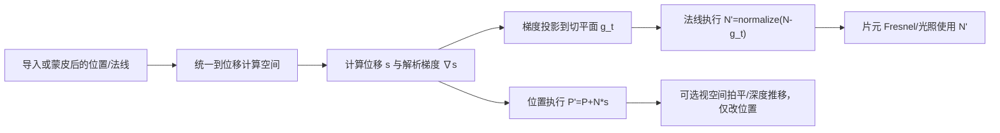

# Unity 顶点位移后的雅可比法线修正

**标签**：#unity #graphics #shader #hlsl #math #experience
**来源**：原创实践整理 - Unity URP 顶点流动 Shader、静态 A/B 对照与编译验证，并结合 NVIDIA、Unity、Microsoft 官方资料复核
**收录日期**：2026-08-11
**来源日期**：2026-08-11
**更新日期**：2026-08-11
**状态**：✅ 已验证
**可信度**：⭐⭐⭐⭐（解析导数实现、Shader 变体验证与静态法线 A/B 对照，并由权威资料佐证）
**适用版本**：Unity 2022.3 LTS / URP 14 / HLSL Shader Model 3.0；数学原理适用于可微顶点形变

### 概要

自定义顶点着色器只修改顶点位置时，GPU 不会根据变形后的三角面自动重算法线。网格中的对象空间法线仍是原始属性，对象到世界的法线矩阵也只描述对象 Transform；片元阶段收到的只是顶点阶段显式输出法线的插值结果。因此，依赖 Fresnel、光照或反射的效果会继续使用旧表面方向，严重顶点流动时可能出现与新轮廓分离的暗线、亮线或高光。

通用解法是把顶点形变写成映射 \(F(P)\)，求其雅可比矩阵 \(J=\partial F/\partial P\)，再用逆转置变换法线：

```text
P' = F(P)
J  = ∂F / ∂P
N' = normalize(J^(-T) N)
```

对于沿法线进行标量位移的移动端效果，可以不构造矩阵、不求逆，也不使用 `ddx/ddy`。若把原曲面局部近似为切平面，并忽略原始法线场自身的空间导数，只需求位移标量 \(s(P)\) 的解析梯度，投影到切平面后使用：

```text
g_t = ∇s - N * dot(∇s, N)
N'  = normalize(N - g_t)
```

这是完整雅可比思想在“局部切平面 + 标量法线位移”条件下的移动端化简。它能低成本同步程序化流动的主要坡度，但不是任意曲面、任意形变的普适精确法线重建。

### 内容

## 一、问题的真实数据流

一个常规 Unity 顶点输入包含彼此独立的位置和法线属性：

```hlsl
struct Attributes
{
    float3 positionOS : POSITION;
    float3 normalOS   : NORMAL;
};
```

自定义顶点位移通常类似：

```hlsl
float3 positionWS = TransformObjectToWorld(input.positionOS);
float3 normalWS = normalize(TransformObjectToWorldNormal(input.normalOS));

positionWS += normalWS * displacement;
```

这段代码只改了 `positionWS`。以下数据都不会因此自动变化：

- `input.normalOS`：Mesh 中保存的原始对象空间法线。
- `unity_ObjectToWorld` 及其法线逆转置语义：只描述对象 Transform，不描述 Shader 内部逐顶点位移。
- 顶点阶段输出的法线：除非 Shader 主动改写，否则仍由原始 `normalOS` 变换得到。
- 片元阶段法线：只是各顶点输出法线经过透视正确插值后的结果，不会从变形后三角形位置重新推导。

因此，“位置已经动了”不能推出“法线也跟着新三角面动了”。光栅器知道三角形的新屏幕覆盖，但不会替 Shader 改写自定义法线 varying。

## 二、为什么蒙皮骨骼看起来能自动带动法线

骨骼蒙皮同样是顶点变换，但成熟蒙皮管线会显式处理多组顶点属性，而不是只修改位置：

```text
P_skin = Σ w_i * M_i * P_bind
N_skin = normalize(Σ w_i * NormalMatrix(M_i) * N_bind)
```

其中 `w_i` 是骨骼权重，`M_i` 包含绑定姿态逆矩阵与当前骨骼矩阵。法线使用与位置相同的骨骼权重，并按方向/逆转置语义变换；切线通常也会同步处理。

这解释了两类常见观察：

1. **骨骼运动后法线能跟随**：因为蒙皮实现主动变换了法线，不是 GPU 根据新三角面自动重建。
2. **蒙皮后再叠加自定义顶点流动仍会错**：蒙皮只负责自身变形；额外的 Shader 位移还需要继续修正蒙皮后的法线。

BlendShape 也遵循类似的数据分离。它可以保存位置差量 `ΔP` 和法线差量 `ΔN`；只有位置差量正确并不代表法线会自动正确。

## 三、雅可比矩阵是什么

设顶点形变是一个从三维位置到三维位置的函数：

```text
F(P) = P'
```

雅可比矩阵是该函数在某一点附近的一阶局部线性近似：

```text
        [ ∂F_x/∂P_x  ∂F_x/∂P_y  ∂F_x/∂P_z ]
J(P) = [ ∂F_y/∂P_x  ∂F_y/∂P_y  ∂F_y/∂P_z ]
        [ ∂F_z/∂P_x  ∂F_z/∂P_y  ∂F_z/∂P_z ]
```

它回答的是：“原位置沿 X、Y、Z 各移动一个很小的量，变形后的位置会怎样变化？”

对原曲面的两个局部切向量 `T`、`B`，变形后的切向量是一阶近似：

```text
T' = J * T
B' = J * B
```

法线必须继续垂直于两个新切向量，因此有两种等价表达：

```text
N' = normalize(transpose(inverse(J)) * N)
```

或：

```text
N' = normalize(cross(J * T, J * B))
```

后者避免显式矩阵求逆，但需要可靠的局部切向基。两者都要求形变在当前位置可微，而且局部没有退化到雅可比接近奇异。

“顶点偏移后重建一个矩阵去变换法线”的想法，本质上就是在构造形变的局部雅可比，而不是重建对象 Transform 矩阵。对象 Transform 对整个对象统一；雅可比可以随顶点位置和时间变化。

## 四、标量法线位移的移动端化简

考虑常见外壳、火焰、气体或能量流动：

```text
P' = P + N * s(P, t)
```

- `P`：进入程序化位移前的位置。
- `N`：进入程序化位移前的单位法线。
- `s(P,t)`：沿法线的有符号位移标量。
- `t`：时间，不参与空间梯度，只改变相位。

若在一个顶点邻域内把原始曲面近似为切平面，并暂时忽略 `N` 自身随位置变化的曲率项，则位移标量沿曲面的变化率由空间梯度给出：

```text
∇s = (∂s/∂x, ∂s/∂y, ∂s/∂z)
```

只有梯度在切平面内的分量会改变表面坡度：

```text
g_t = ∇s - N * dot(∇s, N)
```

新的局部法线可写为：

```text
N' = normalize(N - g_t)
```

符号可以用二维高度场直观检查。平面 `z=s(x,y)` 的未归一化法线是：

```text
(-∂s/∂x, -∂s/∂y, 1)
```

它正是“原法线减去切向梯度”的形式。

### 4.1 该化简省略了什么

完整形变的导数还可能包含原始法线场的变化：

```text
d(P + N*s) = dP + N*ds + s*dN
```

移动端化简保留 `N*ds`，忽略 `s*dN`。因此：

- 能反映程序化标量位移产生的主要斜率。
- 不会精确补偿高曲率曲面上原始法线场的空间变化。
- 位移越小、网格越平滑、局部曲率越低，近似越可靠。
- 若要求严格几何法线，应使用完整雅可比、可靠切向基，或基于邻域/三角形重建。

这项取舍适合移动端外壳 VFX：它避免矩阵逆、邻点采样和逐片元导数，同时让 Fresnel 不再完全滞留在未位移表面。

## 五、解析求导示例

### 5.1 单个方向波

设：

```text
q(P,t) = dot(A, P) - ωt + φ
s(P,t) = h * sin(q)
```

则：

```text
∇q = A
∇s = h * cos(q) * A
```

对应 HLSL：

```hlsl
float phase = dot(axisWS, positionWS) - angularSpeed * time + phaseOffset;
float wave = amplitude * sin(phase);

// 时间只改变相位；空间梯度由相位对 positionWS 的导数决定。
float3 waveGradientWS = amplitude * cos(phase) * axisWS;
```

### 5.2 多波叠加

若位移是多个波相加：

```text
s = s1 + s2 + ... + sn
```

梯度同样线性相加：

```text
∇s = ∇s1 + ∇s2 + ... + ∇sn
```

每个波在计算位移时复用同一个 `phase`、`sin`、`cos`，可以避免法线修正与几何运动使用不同相位。

### 5.3 振幅遮罩与节奏包络

若：

```text
s(P,t) = mask(P) * wave(P,t)
```

必须使用乘积法则：

```text
∇s = ∇mask * wave + mask * ∇wave
```

若节奏包络只依赖时间：

```text
s(P,t) = rhythm(t) * wave(P,t)
```

则对空间位置求导时 `rhythm(t)` 是常量：

```text
∇s = rhythm(t) * ∇wave
```

遗漏遮罩的空间导数，会在遮罩变化最剧烈的区域继续产生法线与几何不一致。

## 六、推荐的 Shader 顺序



关键约束：

1. 位置、法线、位移方向和梯度必须处于同一坐标空间。
2. 蒙皮模型应先得到蒙皮后的 `P`、`N`，再对额外程序化位移求导。
3. Fresnel 使用修正后的法线和片元到相机方向。
4. 若“拍平”只是深度/投影手段，而视觉上仍希望保留外壳曲面朝向，不应把拍平变换纳入法线雅可比。
5. 若视空间深度推移只用于让效果被原模型遮挡，同样通常只改位置，不改变 VFX 表面法线语义。

## 七、移动端参考实现

下面只展示法线位移和修正的核心。`EvaluateDisplacementAndGradientWS` 必须让位移与梯度共享完全相同的相位、频率、遮罩和节奏参数。

### 关键代码

```hlsl
void EvaluateDisplacementAndGradientWS(
    float3 positionWS,
    float time,
    out float displacement,
    out float3 displacementGradientWS)
{
    float3 axis0 = normalize(float3(0.31, 0.93, 0.19));
    float3 axis1 = normalize(float3(-0.72, 0.38, 0.58));

    float phase0 = dot(positionWS, axis0) * 3.2 - time * 4.1;
    float phase1 = dot(positionWS, axis1) * 5.7 - time * 2.6;

    float amplitude0 = 0.018;
    float amplitude1 = 0.009;

    float wave0 = amplitude0 * sin(phase0);
    float wave1 = amplitude1 * sin(phase1);

    displacement = wave0 + wave1;

    // 对 dot(positionWS, axis) * frequency 解析求导。
    displacementGradientWS =
        amplitude0 * cos(phase0) * axis0 * 3.2 +
        amplitude1 * cos(phase1) * axis1 * 5.7;
}

void ApplyNormalDisplacementWS(
    inout float3 positionWS,
    inout float3 normalWS,
    float time)
{
    float displacement;
    float3 gradientWS;
    EvaluateDisplacementAndGradientWS(
        positionWS,
        time,
        displacement,
        gradientWS);

    float3 originalNormalWS = normalize(normalWS);
    positionWS += originalNormalWS * displacement;

    // 仅切向梯度改变局部表面坡度；法线方向分量不参与。
    float3 tangentGradientWS = gradientWS -
        originalNormalWS * dot(gradientWS, originalNormalWS);

    normalWS = normalize(originalNormalWS - tangentGradientWS);
}
```

### 7.1 精度与性能

- 位置、相位、梯度和归一化链路优先使用 `float`，避免远距离或高频下 `half` 精度造成抖动。
- 最终颜色、透明度可继续使用 `half`。
- 位移与导数复用相位；部分目标 GPU 可通过 `sincos` 或编译器公共子表达式优化降低成本。
- 只有启用顶点流动和依赖方向的片元效果时才需要该修正，可使用本地 Shader Keyword 做静态分支。
- 该方法增加少量顶点 ALU，不增加纹理采样和片元 Overdraw，通常比逐片元重建更适合移动端外壳效果。

## 八、其他方案与适用边界

| 方案 | 原理 | 优点 | 局限 |
|---|---|---|---|
| 完整雅可比逆转置 | 求 `J`，使用 `J^(-T)N` | 通用、数学语义完整 | 解析推导和矩阵处理更复杂；接近奇异时不稳定 |
| 雅可比变换切线再叉乘 | `normalize(cross(JT, JB))` | 不显式求逆 | 需要可靠的 `T/B`；切线可能因 UV 缝或平滑策略不适合几何方向 |
| 局部切平面梯度化简 | `normalize(N-g_t)` | 无矩阵逆、无邻点、移动端低成本 | 忽略 `s*dN` 曲率项，只适合标量法线位移近似 |
| 三点数值差分 | 分别计算 `F(P)`、`F(P+εT)`、`F(P+εB)` | 不必手推解析导数 | 约三次执行形变函数；`ε` 选择影响误差和稳定性 |
| 片元 `ddx/ddy` | 从逐片元位置导数叉乘重建法线 | 能贴合光栅后的局部面 | 是显式重建而非自动行为；通常呈三角面/屏幕导数特征，成本转到片元阶段 |
| 配套法线纹理 | 同步采样位移与法线场 | 可提供丰富微表面细节 | 只有法线纹理与位移使用同一空间、相位和导数时才匹配；不会改变真实几何 |
| CPU `RecalculateNormals` | 修改 CPU Mesh 后重算法线 | 可得到基于网格邻接的结果 | 不适用于纯 GPU 每帧顶点位移；会产生 CPU/上传成本 |

### 8.1 采样法线纹理是否能保证正确

不能仅凭“用了法线纹理”保证正确。它需要同时满足：

- 法线纹理由同一个位移函数或高度场导出。
- 坐标空间一致，例如世界空间位移不能直接套用无关的切线空间法线。
- 时间相位、频率、滚动方向和遮罩一致。
- 强度单位与真实位移坡度相符。

普通噪声法线可以让效果更活，但只是在视觉上增加微表面方向；它不能替代由真实顶点位移产生的宏观坡度法线。

### 8.2 为什么水面 Plane 有时看起来无需处理

可能原因包括：

- Shader 实际已经从高度图、波函数或法线纹理计算了法线，只是实现隐藏在节点或函数中。
- 位移很小、网格密、材质高光不敏感，旧法线错误不明显。
- 只观察了颜色/透明度，没有使用能明显暴露方向错误的镜面反射或 Fresnel。
- Plane 原始法线一致，旧法线会产生统一光照，看起来“稳定”，但并不等于垂直于变形后的三角面。

若只修改 Plane 顶点高度却始终输出原始竖直法线，强镜面反射和视角相关效果在数学上仍是不正确的。

## 九、容易造成暗线或面分离的真实根因

### 9.1 硬截断导致不可导折线

以下表达式会在阈值处产生导数突变：

```hlsl
float expand = max(animatedExpand, minimumExpand);
```

阈值两侧分别是：

```text
animatedExpand > minimumExpand：梯度来自 animatedExpand
animatedExpand < minimumExpand：梯度为 0
```

即使法线修正完全匹配这段分段函数，几何本身仍存在真实的一阶不连续边界，剧烈抖动时可能表现为环形折痕或面分离。可选修复包括：

- 使用足够宽的 `smoothstep`/平滑最小值替代硬 `max`。
- 让动画参数范围不跨越硬下限。
- 对位移值和梯度同时应用同一平滑函数及其导数。

只平滑法线而不平滑位置函数，会掩盖明暗但不能消除真实几何折线。

### 9.2 网格细分不足

顶点着色器只移动已有顶点。高频、大振幅位移作用于低细分网格时会拉长、翻折或分离三角形；法线修正只影响着色方向，不能补出不存在的顶点。

### 9.3 梯度与位移不一致

常见错误：

- 位移使用两组波，梯度只计算一组。
- 位移使用节奏变速后的时间，梯度使用匀速时间。
- 位移经过遮罩、饱和或 clamp，梯度仍按未处理函数计算。
- 位移在对象空间计算，梯度却当作世界空间使用。

这些错误会让新法线在某些相位比旧法线更差。最稳妥的结构是由同一个函数同时返回位移和梯度。

### 9.4 雅可比退化

当形变把一个方向压缩到接近零、三角形翻面，或局部频率与振幅使表面极端陡峭时，雅可比可能接近奇异。此时法线对数值误差非常敏感。需要限制位移强度/频率、提高网格密度，或接受形变已经超出单层光滑曲面的表达范围。

## 十、验证方法

### 10.1 静态 A/B 对照

为了排除动画截图时刻不同造成的误判，应使用完全相同的时间、相机、几何和材质，仅切换法线修正开关：

1. 片元暂时直接输出映射后的法线颜色。
2. 固定时间或暂停编辑器。
3. 分别记录修正关闭与开启结果。
4. 确认轮廓/几何位置一致，而法线输出发生可解释变化。
5. 恢复 Fresnel 或正式颜色，再观察暗线是否随新法线移动。

### 10.2 已完成的实践验证

- Unity 2022.3 LTS / URP 14 下 Shader 受支持。
- 顶点流动相关的 8 组功能变体全部完成编译与预热。
- Shader 编译消息、警告和错误均为 0。
- 静态 A/B 对照中，几何位置保持一致，法线可视化结果随雅可比化简开关变化。
- 位移使用的多频波、节奏包络和梯度解析式共享同一套相位参数。

该验证证明实现链路生效，并支持“旧法线不会自动跟随自定义顶点位移”的结论；它不证明局部切平面化简在任意高曲率、高振幅或拓扑退化场景下等同于完整几何法线。

## 十一、核心结论

1. 自定义顶点位移不会自动修改 Mesh 法线或对象法线矩阵；片元只接收 Shader 显式传递的法线插值。
2. 蒙皮法线能跟随，是因为蒙皮管线显式按骨骼变换法线，不是运行时从新三角面自动重算。
3. “为顶点形变重建局部矩阵”就是雅可比思想：位置用 `J` 作用于切向量，法线用 `J` 的逆转置。
4. 标量法线位移可用 `normalize(N-g_t)` 做移动端化简；它捕捉位移坡度，但忽略原法线场曲率项。
5. 解析导数必须与位移共享空间、相位、频率、遮罩、节奏和分段函数。
6. 法线修正不能修复低细分造成的拉伸、三角形翻折或硬 `max/clamp` 造成的真实不可导折痕。
7. 法线纹理、`ddx/ddy`、数值差分和 CPU 重算都是不同取舍，不存在“位置一动就自动得到正确法线”的隐式路径。

### 参考链接

- [NVIDIA GPU Gems：Chapter 42 - Deformers](https://developer.nvidia.com/gpugems/gpugems/part-vi-beyond-triangles/chapter-42-deformers) - 用形变雅可比变换切线/法线，并比较解析导数与三点数值近似。
- [NVIDIA GPU Gems：Chapter 1 - Effective Water Simulation](https://developer.nvidia.com/gpugems/gpugems/part-i-natural-effects/chapter-1-effective-water-simulation-physical-models) - 从几何波/高度导数构造切线与法线的经典实例。
- [NVIDIA GPU Gems：Chapter 4 - Animation in the Dawn Demo](https://developer.nvidia.com/gpugems/gpugems/part-i-natural-effects/chapter-4-animation-dawn-demo) - 蒙皮阶段同步处理位置、法线、切线和副切线的数据流示例。
- [Unity Mesh.RecalculateNormals](https://docs.unity3d.com/ja/6000.0/ScriptReference/Mesh.RecalculateNormals.html) - 修改 CPU Mesh 顶点后需显式重新计算法线，且不会自动生成切线。
- [Unity Shader Graph：Normal From Height](https://docs.unity3d.com/ja/Packages/com.unity.shadergraph%4010.0/manual/Normal-From-Height-Node.html) - 使用 `ddx/ddy` 从高度变化显式构造法线的官方生成代码示例。
- [Microsoft HLSL Semantics](https://learn.microsoft.com/en-us/windows/win32/direct3dhlsl/dx-graphics-hlsl-semantics) - `POSITION`、`NORMAL`、`TEXCOORD` 与系统值语义的数据传递定义。

### 相关记录

- [HLSL 顶点/片元数据流](./hlsl-vertex-fragment-dataflow.md) - 顶点输出如何作为 varying 插值后进入片元阶段。
- [3ds Max 到 Unity 的平滑组与 BlendShape 法线异常排查](./3dsmax-unity-blendshape-smoothing-group-normals.md) - 位置差量与法线差量相互独立的资产管线实例。
- [Unity 保持轮廓的视空间拍平与对象中心稳定屏幕 UV](./unity-perspective-correct-flattening-screen-uv.md) - 同类外壳效果中的视空间拍平、深度与屏幕坐标边界。

### 验证记录

- [2026-08-11] 初次记录：由 Unity URP 移动端外壳顶点流动实践整理；实现标量法线位移的解析梯度与局部切平面法线修正。
- [2026-08-11] 编译验证：相关 8 组 Shader 功能变体全部完成编译与预热，Shader 受支持，编译消息、警告和错误均为 0。
- [2026-08-11] 静态 A/B 验证：固定时间、几何和相机，仅切换法线修正开关；几何位置保持一致，顶点传递到片元的法线输出发生预期变化。
- [2026-08-11] 来源复核：以 NVIDIA GPU Gems 的 Deformer 雅可比与水面导数方法、Unity 法线重算/高度法线文档、Microsoft HLSL 语义文档交叉核对。
- [2026-08-11] 本地查重：`data/*.md` 中未发现“自定义顶点位移 + 雅可比/解析梯度法线修正”的直接记录；已有顶点片元数据流、BlendShape 法线和视空间拍平记录作为相邻知识交叉引用。
- [2026-08-11] 脱敏审查：已移除真实项目名、本机绝对路径、材质/资产名称、测试角色语境和内部截图，仅保留可复用的数学推导、通用 HLSL 示例、版本范围与验证结论。

---
