# 高品质后处理：十种图像模糊算法的总结与实现

**标签**：#unity #shader #graphics #post-processing #performance #reference #zhihu
**来源**：[知乎专栏 - 高品质后处理：十种图像模糊算法的总结与实现](https://zhuanlan.zhihu.com/p/125744132)
**收录日期**：2026-06-01
**来源日期**：2020-04-06
**更新日期**：2026-06-01
**状态**：⚠️ 待验证
**可信度**：⭐⭐（外部社区文章；知乎原页受反爬限制，正文按同作者 CSDN 页面与 SegmentFault/UWA 同题页面交叉校验归档，未实测算法效果）
**适用版本**：Unity Post Processing Stack v2；实时后处理 Blur 算法参考

### 概要

知乎文章《高品质后处理：十种图像模糊算法的总结与实现》的学习用途本地留档。文章横向比较高斯模糊、Kawase 模糊、Dual Blur、散景模糊、径向模糊、方向模糊等十种实时图像模糊算法，并结合 X-PostProcessing Library 给出 Unity 后处理实现方向与效果示例。

### 内容

**        本文由@浅墨_毛星云 出品，转载请注明出处  **

**        CSDN版文章链接： [https://qianmo.blog.csdn.net/article/details/105350519](https://qianmo.blog.csdn.net/article/details/105350519)**

**        知乎专栏版文章链接：[https://zhuanlan.zhihu.com/p/125744132](https://zhuanlan.zhihu.com/p/125744132)**

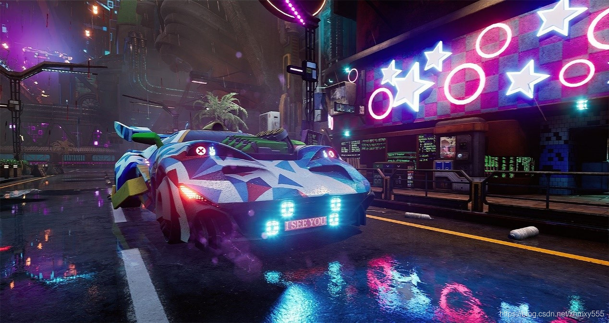

后处理（Post-Processing），在图形学和游戏开发等领域是提升最终画面呈现品质的重要渲染技术。后处理渲染技术的好坏，往往决定了游戏画面是否能够达到令人惊艳的级别。

图像模糊算法在后处理渲染领域中占据着重要的地位。很多产品级后处理的实现，都会直接或间接依赖于图像模糊算法中的一种或多种。无论是基于高斯模糊（Gaussian Blur）或其改进算法的Bloom特效，还是基于径向模糊（Radial Blur）的Sun Shaft（God Ray），或是基于方向模糊（Directional Blur）的镜头眩光光晕（Glare Lens Flare），抑或是景深（Depth of Field）特效中摄影级失焦感的散景模糊（Bokeh Blur），都以模糊算法作为重要的支撑。所以说，后处理中所采用模糊算法的优劣，决定了后处理管线最终的渲染品质和消耗性能的多少。

本文将对后处理管线中会使用到的如下十种模糊算法进行总结、对比和盘点，以及提供了这十种模糊算法以及其衍生算法对应的Unity Post Processing Stack v2版本的实现：

- 高斯模糊（Gaussian Blur）
- 方框模糊（Box Blur）
- Kawase模糊（Kawase Blur）
- 双重模糊（Dual Blur）
- 散景模糊（Bokeh Blur）
- 移轴模糊（Tilt Shift Blur）
- 光圈模糊（Iris Blur）
- 粒状模糊（Grainy Blur）
- 径向模糊（Radial Blur）
- 方向模糊（Directional Blur）

另外，本文暂不涉及运动模糊（Motion Blur），因为其主要作用于帧之间的运动变化，不属于静态型模糊。还有一些其他的模糊算法由于不太适用于实时渲染，本文也暂不涉及，如Moving Averages filter。

下面先放一组使用了依赖于模糊算法的后处理特效的实时渲染截图，然后开始我们的正文。

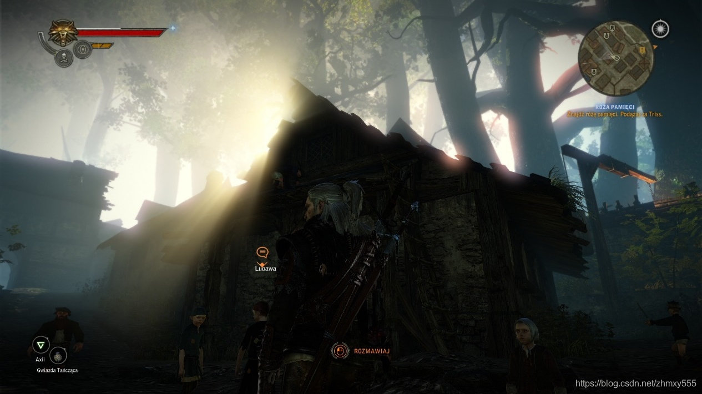

图《巫师2》 中基于径向模糊（Radial Blur）的Sun Shaft

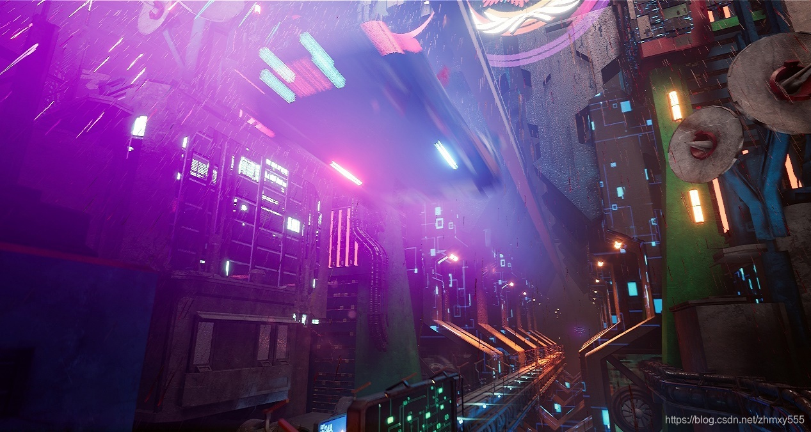

图 UE4场景中，间接基于高斯模糊（Gaussian Blur）的Bloom特效给画面带了更好的光感 @ UE4 CyberNeon @Junliang Zhang

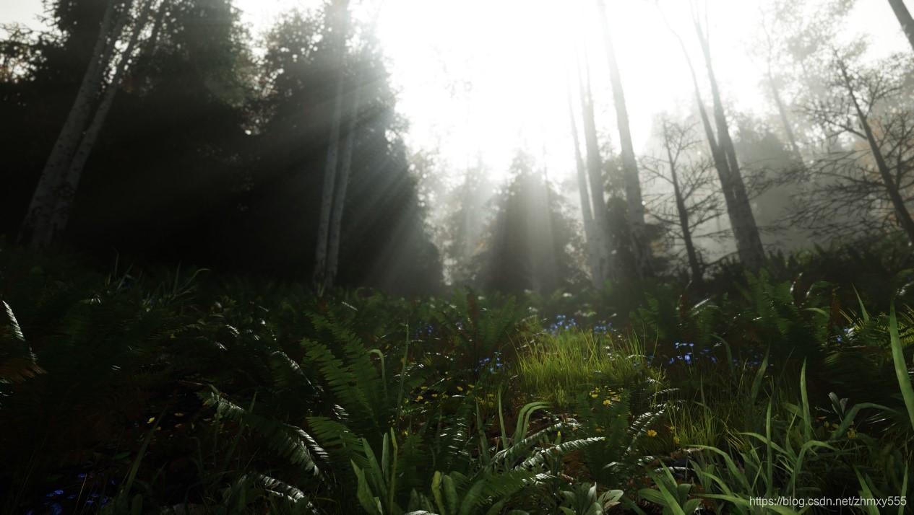

图 Sun Shaft Forest @UE4

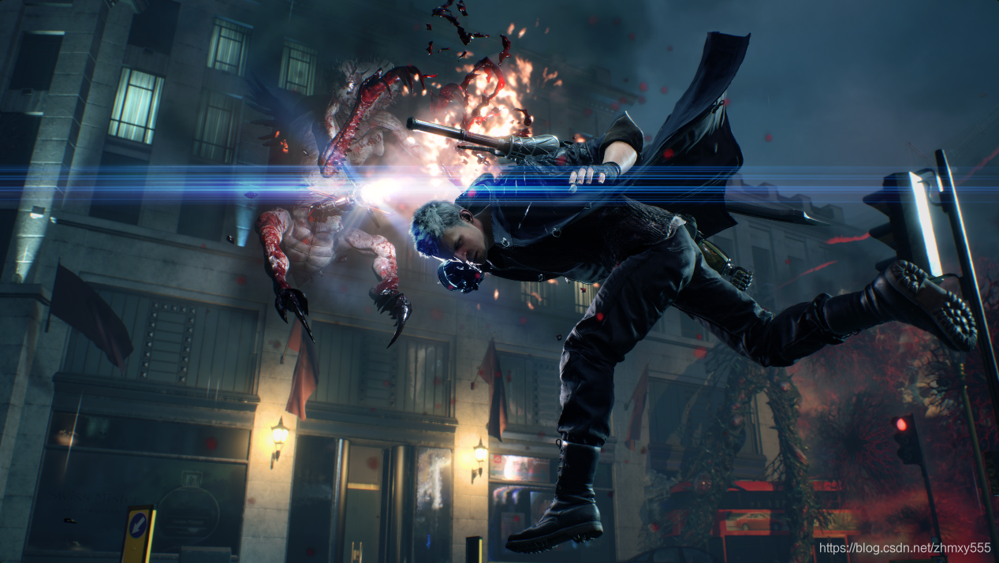

图 《鬼泣5》中的镜头眩光光晕（Glare Lens Flare）

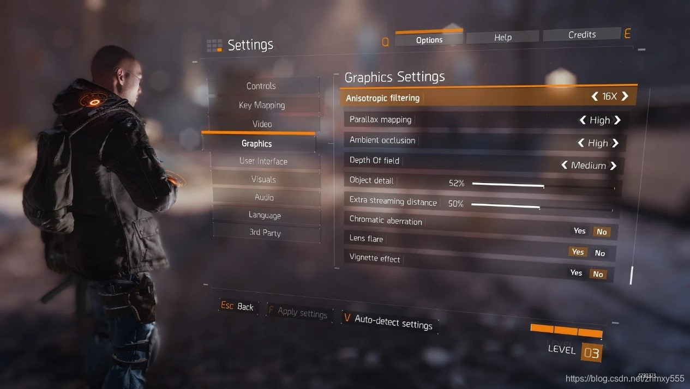

图 Tom Clancys The Division中的基于散景模糊（Bokeh Blur）的景深

这里也放一个《赛博朋克:霓虹中国(CyberNeon)》的视频（ArtStation原贴：[https://www.artstation.com/artwork/Z5RkbZ](https://www.artstation.com/artwork/Z5RkbZ)），

 其中对于赛博朋克风夜中国风城市的展现，如果缺少了Bloom和Glare Lens Flare等依赖于本文讲到的模糊算法的后处理特效，展现出来的品质将少了很多韵味：

[https://www.youtube.com/watch?v=CZ4MOBSx2xw](https://www.youtube.com/watch?v=CZ4MOBSx2xw)

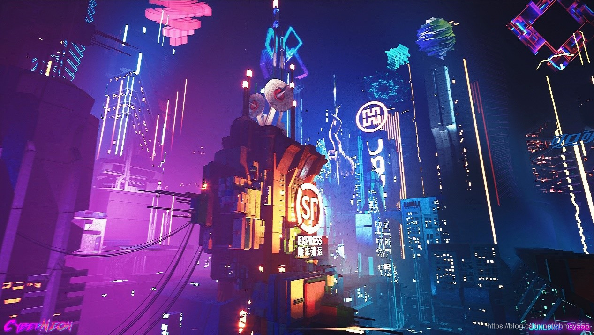

## 十种图像模糊算法横向对比

在展开全文，对这十种图像模糊算法进行分别介绍之前，这一节中先做一个总览，即一个横向的对比。要评判一种模糊算法的好坏，主要有三个标准：

- **模糊品质（Quality）** 。模糊品质的好坏是模糊算法是否优秀的主要指标。
- **模糊稳定性（Stability）** 。模糊的稳定性决定了在画面变化过程中，模糊是否稳定，不会出现跳变或者闪烁。
- **性能（Performance）** 。性能的好坏是模糊算法是否能被广泛使用的关键所在。

以下是本文涉及的十种模糊算法在标准情况下以上述三个指标作为评判标准的横向对比：

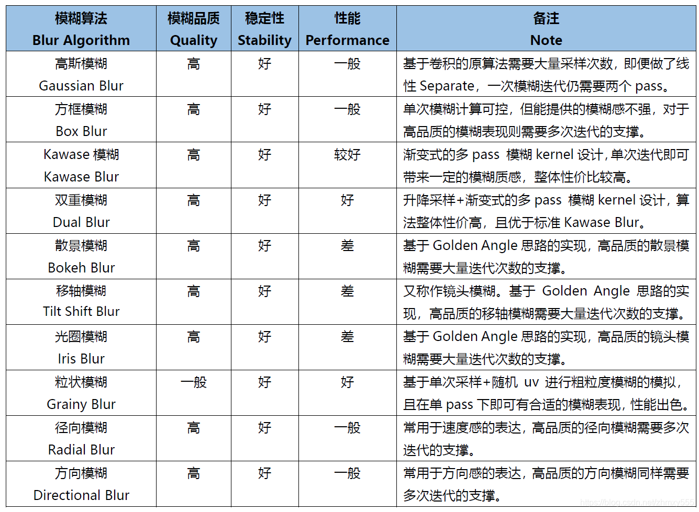

从上表的对比可以看到，除了Grainy Blur因其模糊质感的特殊性获得了“一般”的模糊品质评级之外，另外九种模糊算法在模糊品质和稳定性这两方面都获得了不错的评级。这是因为给到足够的迭代次数，且不做RT的DownSample，他们都可以收敛到一个高品质的模糊质感。

最终的分化在于性能，这才是评判一种算法性价比是否高，能否广泛用于实时渲染的关键因素。其中，可以看到仅双重模糊（Dual Blur）和粒状模糊（Grainy Blur）两种算法，获得了高的性能评级。当然，这是针对标准的算法而言，其他八种算法如果进行进一步的性能优化，也能具有更佳的性能。

## 关于X-PostProcessing Libray

X-PostProcessing Libray，简称XPL，是本人开发的Unity引擎下的高品质开源后处理算法库，旨在提供业界主流的高品质后处理特效的完整解决方案，目前已完美支持Unity Post-processing Stack v2。后续也将提供对Unity引擎URP/LWRP/HDRP的兼容支持。

【GitHub地址】[https://github.com/QianMo/X-PostProcessing-Library](https://github.com/QianMo/X-PostProcessing-Library)

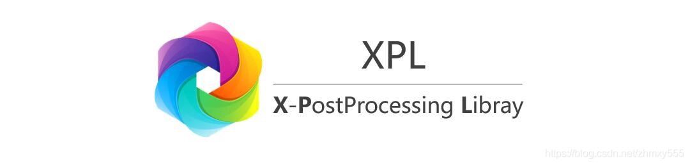

截止本文发表，目前已以开源形式放出了17种Blur算法的后处理实现。而随着后续更多内容的公开，X-PostProcessing Libray将成型为一个具有100+种后处理特效的高品质后处理开源算法库。

OK，下面我们开始正文。先从最热门，最为大众所熟知的高斯模糊开始。

## 一、高斯模糊（Gaussian Blur）

高斯模糊（Gaussian Blur），也叫高斯平滑（Gaussian smoothing），作为最经典的模糊算法，一度成为模糊算法的代名词。

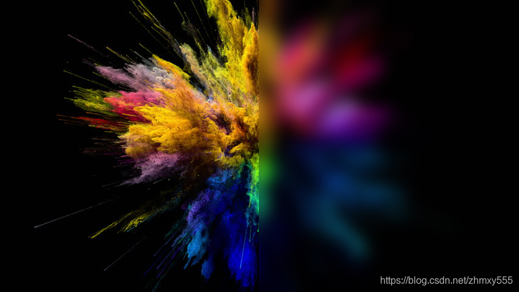

高斯模糊在图像处理领域，通常用于减少图像噪声以及降低细节层次，以及对图像进行模糊，其视觉效果就像是经过一个半透明屏幕在观察图像。

从数字信号处理的角度看，图像模糊的本质一个过滤高频信号，保留低频信号的过程。过滤高频的信号的一个常见可选方法是卷积滤波。从这个角度来说，图像的高斯模糊过程即图像与正态分布做卷积。由于正态分布又叫作“高斯分布”，所以这项技术就叫作高斯模糊。而由于高斯函数的傅立叶变换是另外一个高斯函数，所以高斯模糊对于图像来说就是一个低通滤波器。

用于高斯模糊的高斯核（Gaussian Kernel）是一个正方形的像素阵列，其中像素值对应于2D高斯曲线的值。

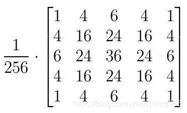

图 一个典型的高斯核

图像中的每个像素被乘以高斯核，然后将所有这些值相加，得到输出图像中此处的值。

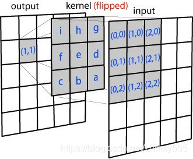

N维空间高斯模糊方程可以表示为：

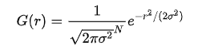

在二维空间定义为：

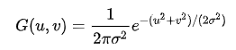

其中r是模糊半径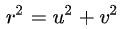

下图为高斯函数的3维图示：

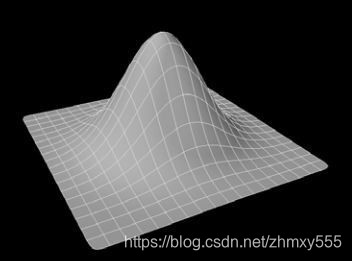

高斯模糊也可以在二维图像上对两个独立的一维空间分别进行计算，即满足线性可分（Linearly separable）。这也就是说，使用二维矩阵变换得到的效果也可以通过在水平方向进行一维高斯矩阵变换加上竖直方向的一维高斯矩阵变换得到。从计算的角度来看，这是一项有用的特性，因为这样只需要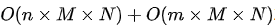的计算复杂度，而原先的计算复杂度为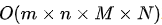，其中M,N是需要进行滤波的图像的维数，m、n是滤波器的维数。

以下为一个Gaussian Kernel的线性分解过程：

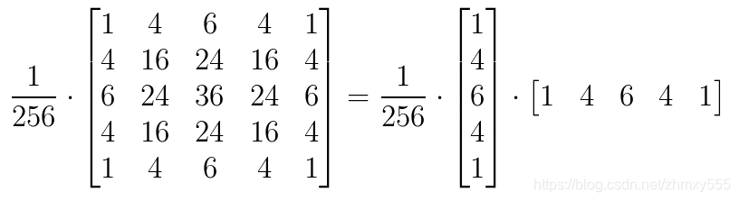

下图很好的对Gaussian Kernel的线性可分进行了描述：

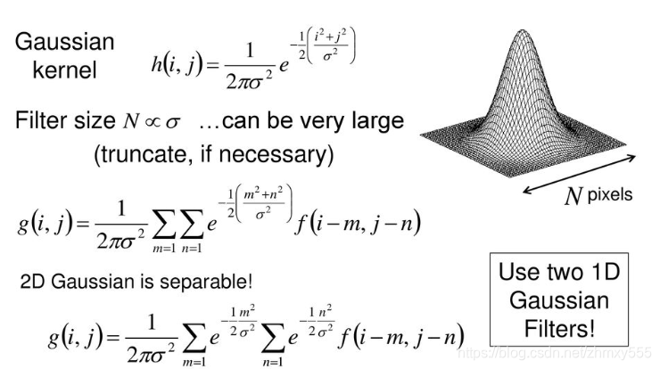

实现方面，可以采用经过线性分解的高斯核的方案，且用乒乓RT交互blit的方法。高斯模糊对应的Fragment Shader的实现为：
```hlsl
float4 FragGaussianBlur(v2f i): SV_Target
{
	half4 color = float4(0, 0, 0, 0);
	
	color += 0.40 * SAMPLE_TEXTURE2D(_MainTex, sampler_MainTex, i.uv);
	color += 0.15 * SAMPLE_TEXTURE2D(_MainTex, sampler_MainTex, i.uv01.xy);
	color += 0.15 * SAMPLE_TEXTURE2D(_MainTex, sampler_MainTex, i.uv01.zw);
	color += 0.10 * SAMPLE_TEXTURE2D(_MainTex, sampler_MainTex, i.uv23.xy);
	color += 0.10 * SAMPLE_TEXTURE2D(_MainTex, sampler_MainTex, i.uv23.zw);
	color += 0.05 * SAMPLE_TEXTURE2D(_MainTex, sampler_MainTex, i.uv45.xy);
	color += 0.05 * SAMPLE_TEXTURE2D(_MainTex, sampler_MainTex, i.uv45.zw);
	
	return color;
}
```
篇幅原因，在这里以及后文中，对应后处理的Runtime + Shader的完整的实现就不贴了，但会给出X-PostProcessing Libray中的完整实现链接。

**完整的高斯模糊Runtime + Shader实现可见**： [https://github.com/QianMo/X-PostProcessing-Library/tree/master/Assets/X-PostProcessing/Effects/GaussianBlur](https://github.com/QianMo/X-PostProcessing-Library/tree/master/Assets/X-PostProcessing/Effects/GaussianBlur)

 以下是开启高斯模糊后处理前后的对比图：

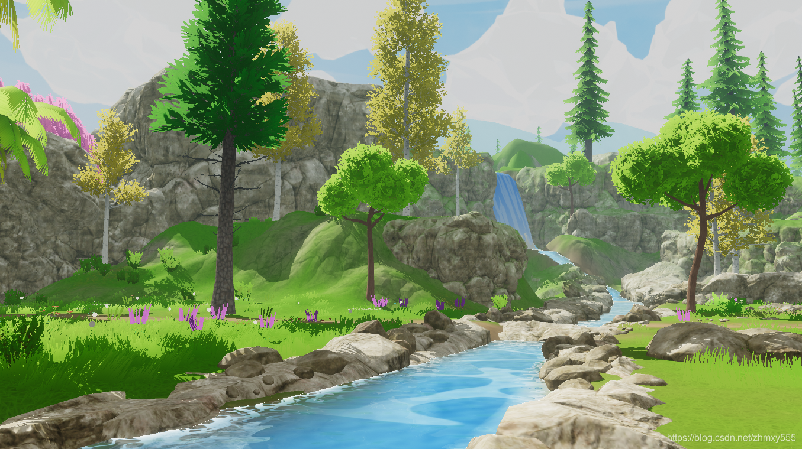

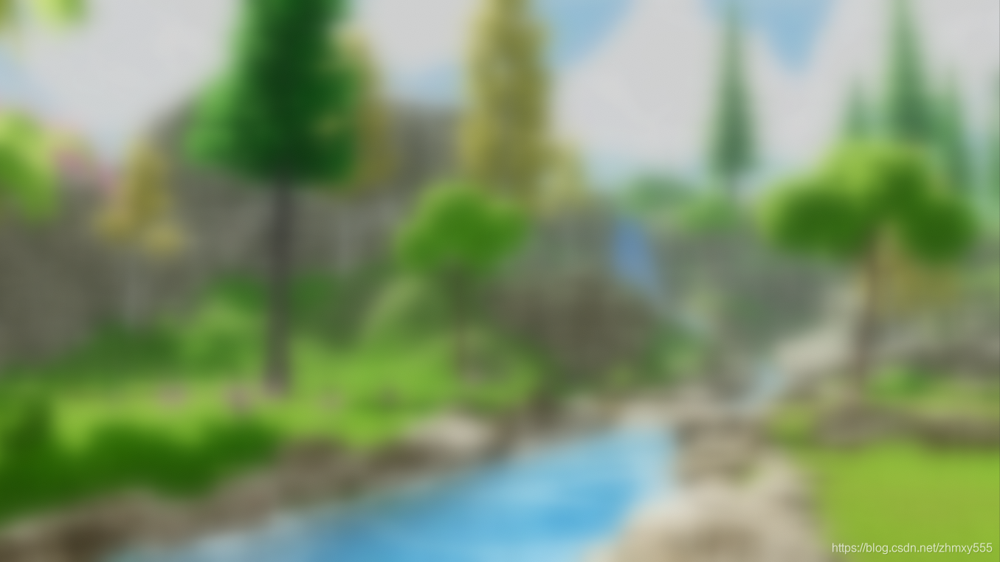

以及展示了BlurRadius为3，Iteration为6，RTDownScale为1的设置下，经过横纵线性分解的高斯模糊的渲染过程的动图：


对模糊半径（Blur Radius）参数的调节，可以控制高斯模糊的程度：


## 二、方框模糊（Box Blur）

方框模糊（Box Blur），又常被称为盒式模糊，其中所得到的图像中的每个像素具有的值等于其邻近的像素的输入图像中的平均值。和高斯模糊一样，Box Blur也是低通滤波器的一种形式。在图像处理领域，Box Blur通常用于近似高斯模糊。因为根据中心极限定理，重复应用Box Blur可以得到和高斯模糊非常近似的模糊表现。

可以将3 x 3的box blur的kernel表示为如下矩阵：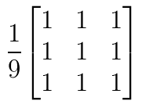

而2x2的box blur的kernel表示为如下矩阵：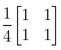

Box Blur和高斯模糊的性质对比可见下图：

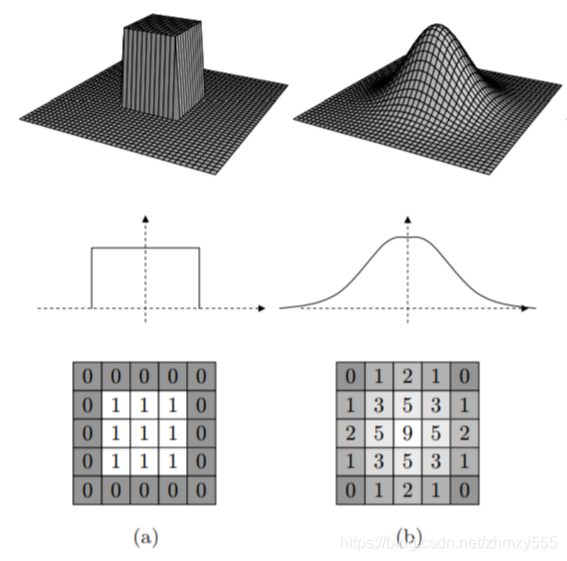

图 3D结构，2D结构和示例矩阵对比（a）Box Blur（b）Gaussian Blur

以下是Box Blur的作用过程：

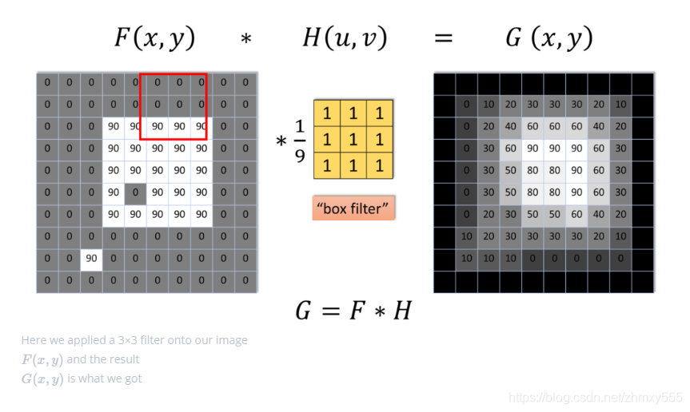

Box Blur也是线性可分的，如有需要，也可以借助其此性质，如下所示：

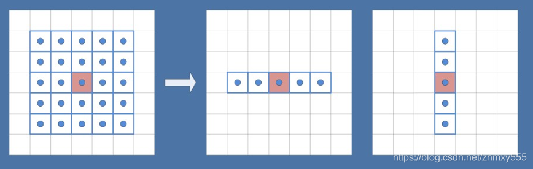

另外box blur也有不少扩展与变体，比如Tent Blur（两次Box Blur）、Quadratic Blur（三次Box Blur）等，具体本文暂时就不展开了。

其中，Tent Blur也已在XPL中进行了实现，具体可见：[https://github.com/QianMo/X-PostProcessing-Library/tree/master/Assets/X-PostProcessing/Effects/TentBlur](https://github.com/QianMo/X-PostProcessing-Library/tree/master/Assets/X-PostProcessing/Effects/TentBlur)

以下是一个4 x 4的box filter的shader实现，low level optimize方面，可以采用乘加组合的书写方式，即MAD指令友好的形式，以在部分GPU上实现指令数的优化：
```hlsl
half4 BoxFilter_4Tap(TEXTURE2D_ARGS(tex, samplerTex), float2 uv, float2 texelSize)
{
	float4 d = texelSize.xyxy * float4(-1.0, -1.0, 1.0, 1.0);
	
	half4 s = 0;
	s = SAMPLE_TEXTURE2D(tex, samplerTex, uv + d.xy) * 0.25h;  // 1 MUL
	s += SAMPLE_TEXTURE2D(tex, samplerTex, uv + d.zy) * 0.25h; // 1 MAD
	s += SAMPLE_TEXTURE2D(tex, samplerTex, uv + d.xw) * 0.25h; // 1 MAD
	s += SAMPLE_TEXTURE2D(tex, samplerTex, uv + d.zw) * 0.25h; // 1 MAD
	
	return s;
}
```
**完整的Runtime + Shader实现可见：**[https://github.com/QianMo/X-PostProcessing-Library/tree/master/Assets/X-PostProcessing/Effects/BoxBlur](https://github.com/QianMo/X-PostProcessing-Library/tree/master/Assets/X-PostProcessing/Effects/BoxBlur)

另外也可以考虑将uv计算放到vertex层。

Box Blur的渲染效果接近高斯模糊，但性价比并不高，需要较多的迭代次数才能达到高品质的模糊效果：

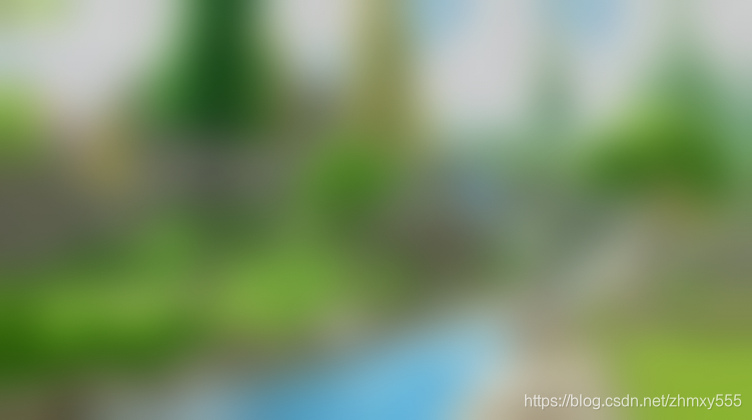

以下是Box Blur在BlurRadius为1.6，Iteration为6，RTDownScale为1的设置下模糊过程的动图：


## 三、Kawase模糊（Kawase Blur）

Kawase Blur于Masaki Kawase 在GDC2003的分享《Frame Buffer Postprocessing Effects in DOUBLE-S.T.E.A.L (Wreckless)》中提出。Kawase Blur最初用于Bloom后处理特效，但其可以推广作为专门的模糊算法使用，且在模糊外观表现上与高斯模糊非常接近。 Kawase Blur的思路是对距离当前像素越来越远的地方对四个角进行采样，且在两个大小相等的纹理之间进行乒乓式的blit。创新点在于，采用了随迭代次数移动的blur kernel，而不是类似高斯模糊，或box blur一样从头到尾固定的blur kernel。

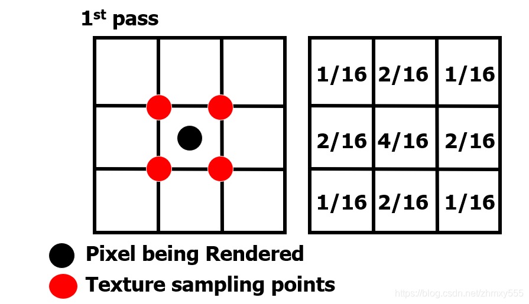

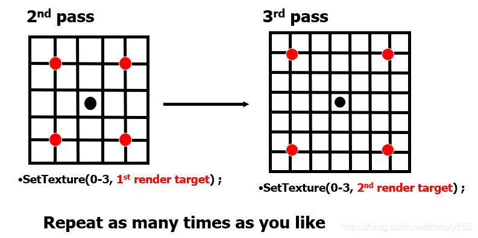

实践数据表明，在相似的模糊表现下，Kawase Blur比经过优化的高斯模糊的性能约快1.5倍到3倍。

具体思路是在runtime层，基于当前迭代次数，对每次模糊的半径进行设置，而Shader层实现一个4 tap的Kawase Filter即可：
```hlsl
half4 KawaseBlur(TEXTURE2D_ARGS(tex, samplerTex), float2 uv, float2 texelSize, half pixelOffset)
{
	half4 o = 0;
	o += SAMPLE_TEXTURE2D(tex, samplerTex, uv + float2(pixelOffset +0.5, pixelOffset +0.5) * texelSize);
	o += SAMPLE_TEXTURE2D(tex, samplerTex, uv + float2(-pixelOffset -0.5, pixelOffset +0.5) * texelSize);
	o += SAMPLE_TEXTURE2D(tex, samplerTex, uv + float2(-pixelOffset -0.5, -pixelOffset -0.5) * texelSize);
	o += SAMPLE_TEXTURE2D(tex, samplerTex, uv + float2(pixelOffset +0.5, -pixelOffset -0.5) * texelSize);
	return o * 0.25;
}
```
**完整的Runtime + Shader实现可见：**[https://github.com/QianMo/X-PostProcessing-Library/tree/master/Assets/X-PostProcessing/Effects/KawaseBlur](https://github.com/QianMo/X-PostProcessing-Library/tree/master/Assets/X-PostProcessing/Effects/KawaseBlur)

Kawase Blur渲染效果接近高斯模糊，但具有更好的性能：

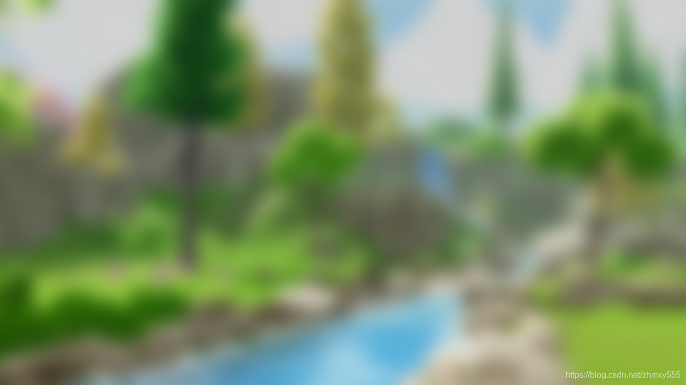

以下是在初始RT DownScale为1、Iteration为6的设置下，Dual Kawase Blur的渲染步骤：

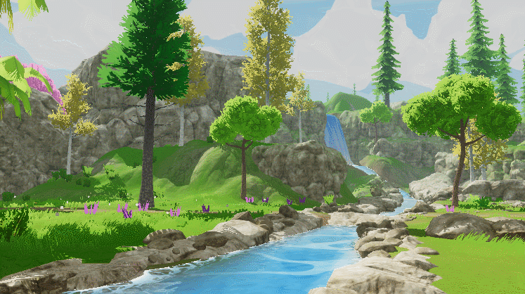

同样，对模糊半径（Blur Radius）参数的调节，可以控制Kawase模糊的程度：


## 四、双重模糊（Dual Blur）

Dual Kawase Blur，简称Dual Blur，是SIGGRAPH 2015上ARM团队提出的一种衍生自Kawase Blur的模糊算法。其由两种不同的Blur Kernel构成，如下图所示。

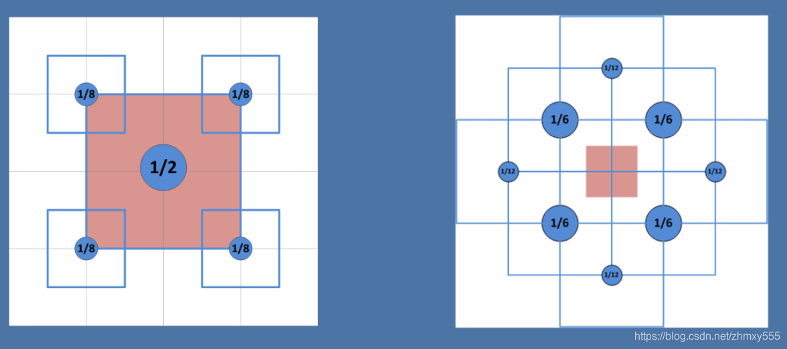

相较于Kawase Blur在两个大小相等的纹理之间进行乒乓blit的的思路，Dual Kawase Blur的核心思路在于blit过程中进行降采样和升采样,即对RT进行了降采样以及升采样。如下图所示：

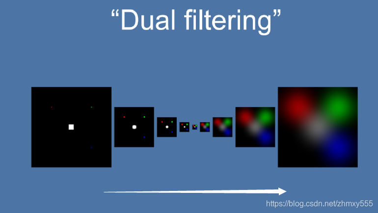

由于灵活的升降采样带来了blit RT所需计算量的减少等原因， Dual Kawase Blur相较于上文中提到的Gauusian Blur、Box Blur、Kawase Blur等Blur算法,有更好的性能，下图是相同条件下的性能对比。

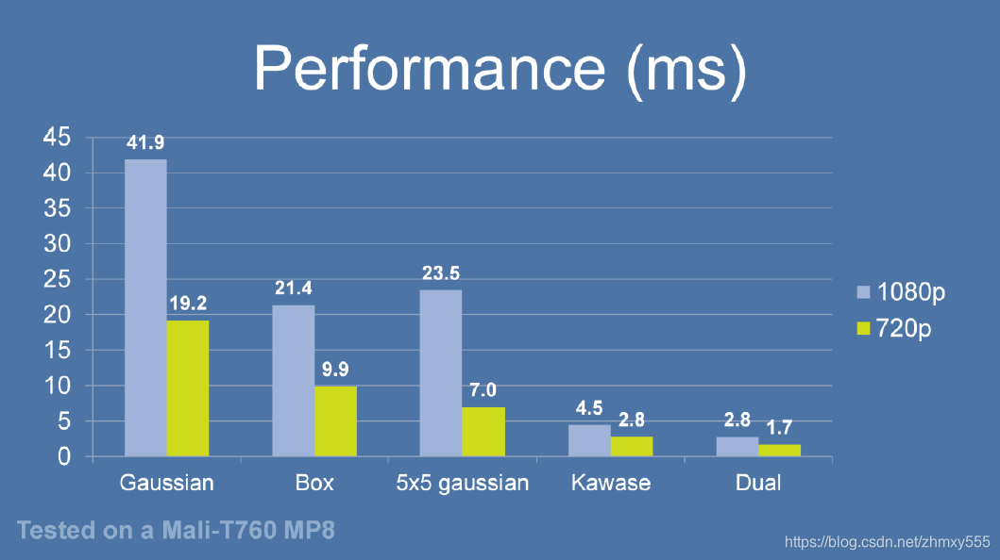

可以看到，Dual Kawase Blur具有最佳的性能表现。

为了带来更好的性能表现，可以将uv的偏移放在Vert Shader中进行，而Fragment Shader中基本上仅进行采样即可。

Dual Kawase Blur的Fragment Shader实现为：
```hlsl
half4 Frag_DownSample(v2f_DownSample i): SV_Target
{
	half4 sum = SAMPLE_TEXTURE2D(_MainTex, sampler_MainTex, i.uv) * 4;
	sum += SAMPLE_TEXTURE2D(_MainTex, sampler_MainTex, i.uv01.xy);
	sum += SAMPLE_TEXTURE2D(_MainTex, sampler_MainTex, i.uv01.zw);
	sum += SAMPLE_TEXTURE2D(_MainTex, sampler_MainTex, i.uv23.xy);
	sum += SAMPLE_TEXTURE2D(_MainTex, sampler_MainTex, i.uv23.zw);
	
	return sum * 0.125;
}

half4 Frag_UpSample(v2f_UpSample i): SV_Target
{
	half4 sum = 0;
	sum += SAMPLE_TEXTURE2D(_MainTex, sampler_MainTex, i.uv01.xy);
	sum += SAMPLE_TEXTURE2D(_MainTex, sampler_MainTex, i.uv01.zw) * 2;
	sum += SAMPLE_TEXTURE2D(_MainTex, sampler_MainTex, i.uv23.xy);
	sum += SAMPLE_TEXTURE2D(_MainTex, sampler_MainTex, i.uv23.zw) * 2;
	sum += SAMPLE_TEXTURE2D(_MainTex, sampler_MainTex, i.uv45.xy);
	sum += SAMPLE_TEXTURE2D(_MainTex, sampler_MainTex, i.uv45.zw) * 2;
	sum += SAMPLE_TEXTURE2D(_MainTex, sampler_MainTex, i.uv67.xy);
	sum += SAMPLE_TEXTURE2D(_MainTex, sampler_MainTex, i.uv67.zw) * 2;
	
	return sum * 0.0833;
}
```
**完整的Runtime + Shader实现可见：**[https://github.com/QianMo/X-PostProcessing-Library/tree/master/Assets/X-PostProcessing/Effects/DualKawaseBlur](https://github.com/QianMo/X-PostProcessing-Library/tree/master/Assets/X-PostProcessing/Effects/DualKawaseBlur)

XPL中也提供了启发自Dual Kawase Blur的Dual Gaussian Blur、Dual Box Blur、Dual Tent Blur的实现。

- **Dual Gaussian Blur**：[https://github.com/QianMo/X-PostProcessing-Library/tree/master/Assets/X-PostProcessing/Effects/DualGaussianBlur](https://github.com/QianMo/X-PostProcessing-Library/tree/master/Assets/X-PostProcessing/Effects/DualGaussianBlur)
- **Dual Box Blur**：[https://github.com/QianMo/X-PostProcessing-Library/tree/master/Assets/X-PostProcessing/Effects/DualBoxBlur](https://github.com/QianMo/X-PostProcessing-Library/tree/master/Assets/X-PostProcessing/Effects/DualBoxBlur)
- **Dual Tent Blur**：[https://github.com/QianMo/X-PostProcessing-Library/tree/master/Assets/X-PostProcessing/Effects/DualTentBlur](https://github.com/QianMo/X-PostProcessing-Library/tree/master/Assets/X-PostProcessing/Effects/DualTentBlur)

Dual Kawase Blur最终的模糊效果截图如下，可以看到其与高斯模糊的模糊表现也非常接近：


以下是在初始RT DownScale为1、Iteration为5的设置下，Dual Kawase Blur的渲染步骤：


同样，对模糊半径（Blur Radius）参数的调节，可以控制Dual Kawase Blur模糊的程度：


## 五、散景模糊（Bokeh Blur）

散景（Bokeh）亦称焦外成像，是一个摄影名词，一般表示在景深较浅的摄影成像中，落在景深以外的画面，会有逐渐产生松散模糊的效果。散景效果有可能因为摄影技巧或光圈孔形状的不同，而产生各有差异的效果。例如镜头本身的光圈叶片数不同（所形成的光圈孔形状不同），会让圆形散景呈现不同的多角形变化。此外，反射式镜头焦外的散景，会呈现独有的甜甜圈形状。

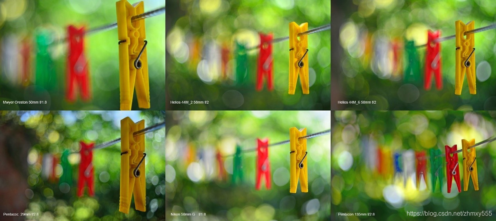

图 不同相机参数下得到的不同散景模糊（Bokeh Blur）

散景（Bokeh）在摄影学中被称为焦外成像，而在光学上被称为Circle of Confusion, CoC（弥散圆/散光圈/散射圆盘 ），即下图橙色Image Plane 中的蓝色C所示区域。由于不同的物距（物体到镜头的距离）投影到镜头所形成的焦点不同，但Image Plane 只能放在某个点上，所以就形成了Circle of Confusion, CoC（弥散圆）。

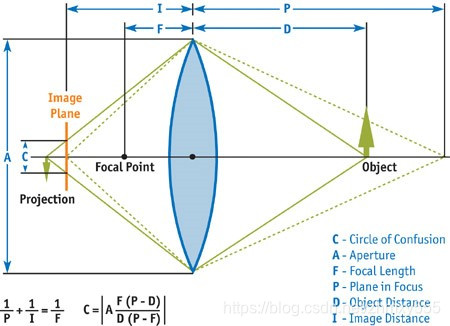

图 散景（Bokeh）成因 （图片来自GPU Gems 1）

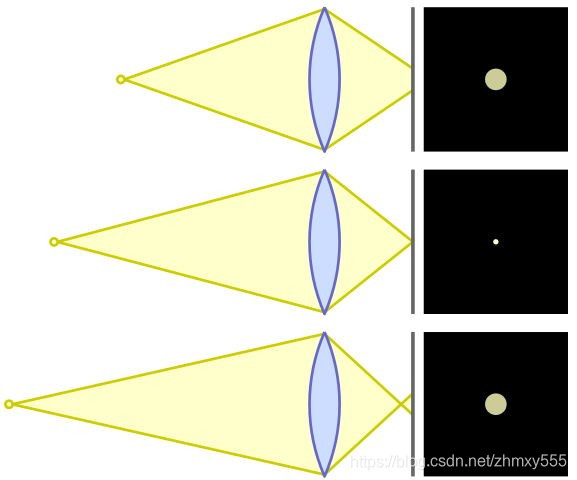

图 散景（Bokeh）大小不同的成因，即Circle of Confusion, CoC（弥散圆）的大小与人眼分辨率不同的区域。

镜头本身的光圈叶片数不同（所形成的光圈孔形状不同），会让散景形状呈现不同的多角形变化。从最初的多边形，过渡到最终的圆形。

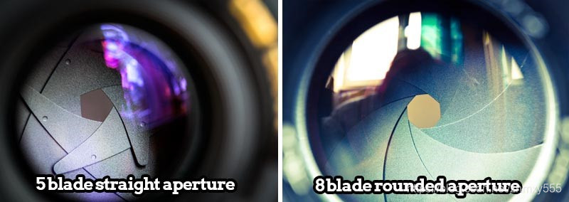

图 不同光圈叶片数的镜头，决定了不同的散景形状

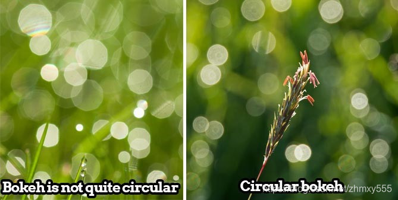

图 不同光圈叶片数的镜头，决定了不同的散景形状

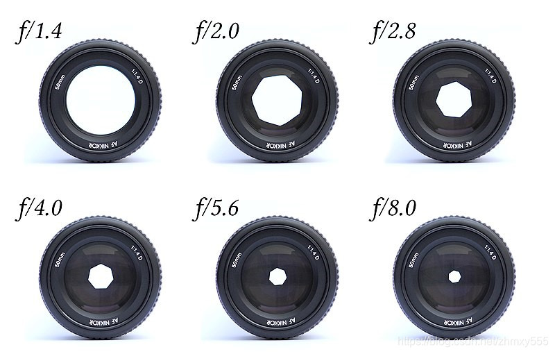

图 不同光圈数值的镜头形态，决定了不同的散景形态

从上图可以看出， 由于光圈大小和叶片数量的不同，散景（Bokeh）的形态各异。

在图形学领域模拟散景（Bokeh）的方法有很多，本文将以最标准的圆形散景为例，采用Golden angle([https://en.wikipedia.org/wiki/Golden_angle](https://en.wikipedia.org/wiki/Golden_angle))的思路进行散景模糊（Bokeh Blur）算法的实现。

具体而言，算法思路是基于对大量离散螺旋型（spiral）分布的点的渲染，来模拟出圆形Bokeh的形状。

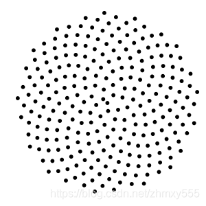

核心的Shader算法实现为：
```hlsl
half4 BokehBlur(VaryingsDefault i)
{
	half2x2 rot = half2x2(_GoldenRot);
	half4 accumulator = 0.0;
	half4 divisor = 0.0;

	half r = 1.0;
	half2 angle = half2(0.0, _Radius);

	for (int j = 0; j < _Iteration; j++)
	{
		r += 1.0 / r;
		angle = mul(rot, angle);
		half4 bokeh = SAMPLE_TEXTURE2D(_MainTex, sampler_MainTex, float2(i.texcoord + _PixelSize * (r - 1.0) * angle));
		accumulator += bokeh * bokeh;
		divisor += bokeh;
	}
	return accumulator / divisor;
}
```
即对于每一次迭代，让采样uv旋转一个角度，经过足够次数的迭代后，众多以圆形分散开来的点，将一起组成合适的Bokeh形状。

**完整的Runtime + Shader实现可见：**

[https://github.com/QianMo/X-PostProcessing-Library/tree/master/Assets/X-PostProcessing/Effects/BokehBlur](https://github.com/QianMo/X-PostProcessing-Library/tree/master/Assets/X-PostProcessing/Effects/BokehBlur)

下图为最终实现的效果图：

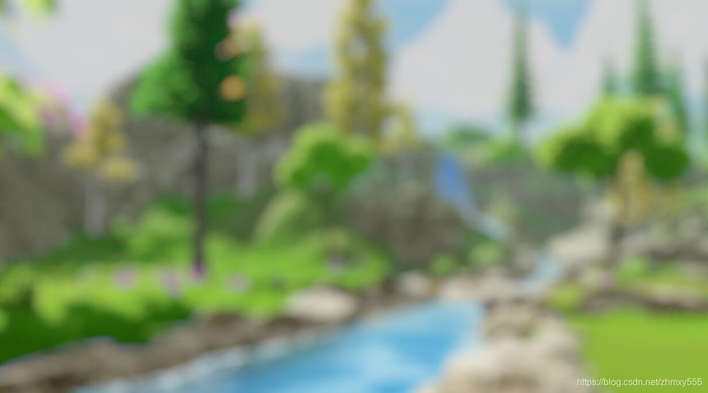

不同模糊半径（Blur Radius）变化，可以控制不同的Bokeh半径的变化：

## 六、移轴模糊 （Tilt Shift Blur）

移轴模糊（Tilt Shift Blur），又称镜头模糊（Lens Blur） ，是源自摄影领域的一种模糊算法。

在摄影领域，移轴摄影（Tilt-Shift Photography）泛指利用移轴镜头创作的作品，所拍摄的照片效果就像是缩微模型一样，非常特别。移轴镜头的作用，本来主要是用来修正以普通广角镜拍照时所产生出的透视问题，但后来却被广泛利用来创作变化景深聚焦点位置的摄影作品。移轴镜摄影是将真实世界拍成像假的一样，使照片能够充分表现出“人造都市”的感觉。


图 移轴摄影作品

在后处理渲染中进行移轴摄影的模拟，可以采用Grident uv算法控制画面区域模糊强度，配合全屏模糊算法的方式来实现。

采用Grident uv算法控制画面区域模糊强度的Shader核心实现如下：
```hlsl
float TiltShiftMask(float2 uv)
{
	float centerY = uv.y * 2.0 - 1.0 + _Offset; // [0,1] -> [-1,1]
	return pow(abs(centerY * _Area), _Spread);
}
```
得到的屏幕模糊强度的mask图如下：

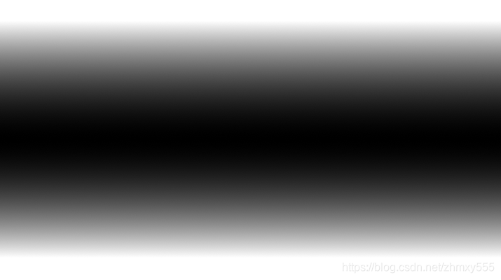

接着，配合合适的全屏图像模糊算法，如Bokeh Blur，便可以营造出移轴摄影的画面感：

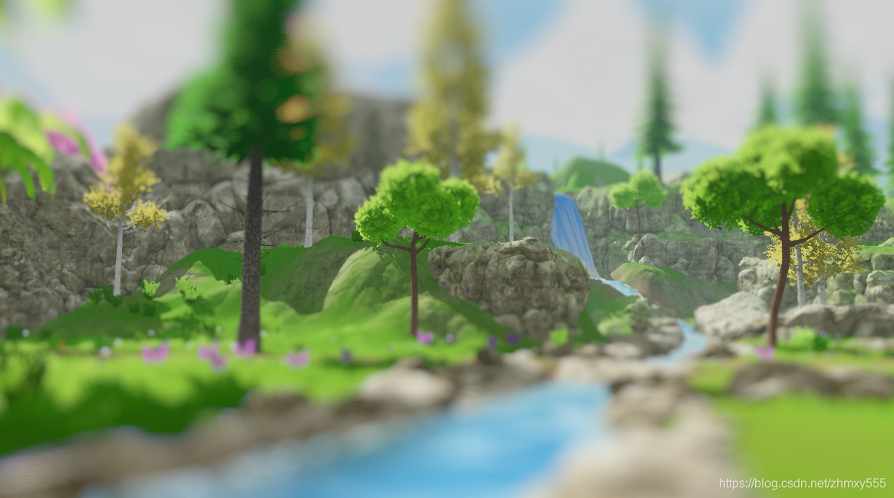

**完整的Runtime + Shader实现可见：**[https://github.com/QianMo/X-PostProcessing-Library/tree/master/Assets/X-PostProcessing/Effects/TiltShiftBlurV2](https://github.com/QianMo/X-PostProcessing-Library/tree/master/Assets/X-PostProcessing/Effects/TiltShiftBlurV2)

**XPL中也提供了另一个版本的实现：**[https://github.com/QianMo/X-PostProcessing-Library/tree/master/Assets/X-PostProcessing/Effects/TiltShiftBlur](https://github.com/QianMo/X-PostProcessing-Library/tree/master/Assets/X-PostProcessing/Effects/TiltShiftBlur)

对模糊半径（Blur Radius）参数的调节，可以用于控制移轴Bokeh半径的变化：

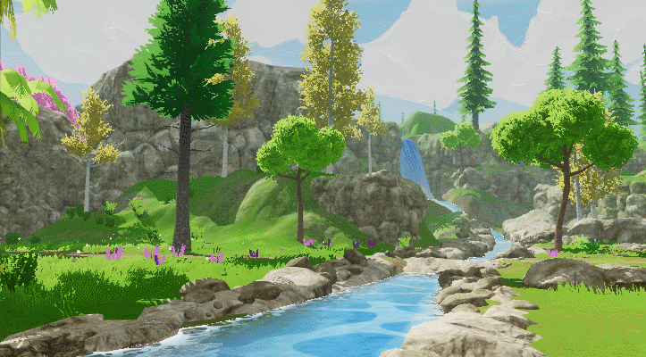

在一定的区域平滑度（Area Smooth）设置下，调节区域尺寸（Area Size）可以控制移轴模糊区域的变化：


## 七、光圈模糊（Iris Blur）

光圈模糊（Iris Blur）是Photoshop CS6中新增的功能，用于模拟浅景深的效果。

可以根据用户不同的输入参数，将普通照片模拟出景深以及散景的效果。（PS: Photoshop中也同样有Tilf-Shift Blur功能）

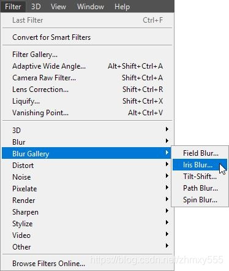

图 Photoshop中的光圈模糊（Iris Blur）功能

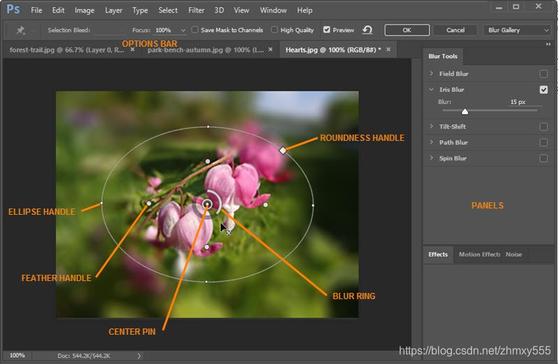

图 Photoshop中的光圈模糊（Iris Blur）功能

在后处理渲染中进行光圈模糊的模拟，可以采用一个径向的Grident uv算法沿轴心控制画面区域模糊强度，并配合全屏模糊算法的方式来实现。

采用径向Grident uv算法控制画面区域模糊强度的Shader核心实现如下：
```hlsl
float IrisMask(float2 uv)
{
	float2 center = uv * 2.0 - 1.0 + _Offset; // [0,1] -> [-1,1]
	return dot(center, center) * _AreaSize;
}
```
得到的屏幕模糊强度的mask图如下：

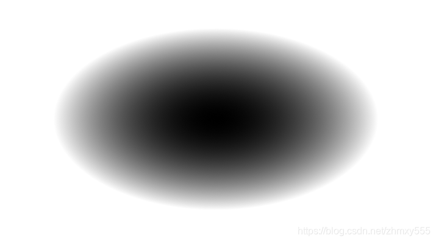

同样，配合合适的全屏图像模糊算法，如Bokeh Blur，便可以营造出移轴摄影的画面感：

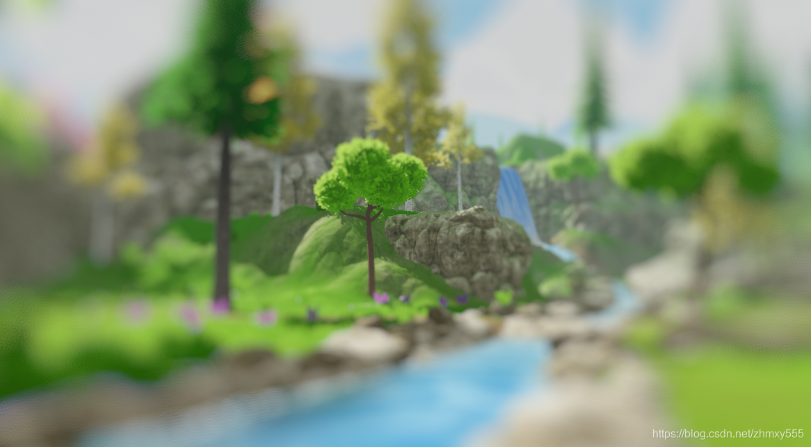

**光圈模糊（Iris Blur）完整的Runtime + Shader实现可见：**[https://github.com/QianMo/X-PostProcessing-Library/tree/master/Assets/X-PostProcessing/Effects/IrisBlurV2](https://github.com/QianMo/X-PostProcessing-Library/tree/master/Assets/X-PostProcessing/Effects/IrisBlurV2)

**XPL中也提供了另一个版本的实现：**[https://github.com/QianMo/X-PostProcessing-Library/tree/master/Assets/X-PostProcessing/Effects/IrisBlur](https://github.com/QianMo/X-PostProcessing-Library/tree/master/Assets/X-PostProcessing/Effects/IrisBlur)

对模糊半径（Blur Radius）参数的调节，可以用于控制光圈Bokeh半径的变化：


同样，调节区域尺寸（Area Size）可以控制光圈模糊区域的变化：


## 八、粒状模糊（Grainy Blur）

粒状模糊（Grainy Blur）是一种低成本的模糊方法，在单pass下即可有合适的模糊表现，性能出色，且其模糊质感有点类似在画面上蒙了一层细碎的冰霜。

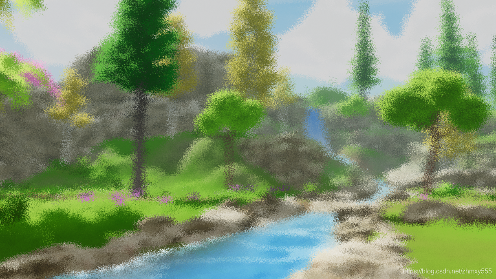

其思路是基于随机uv进行采样的抖动，以对粗粒度的模糊进行模拟。核心算法的Shader实现如下：
```hlsl
float Rand(float2 n)
{
	return sin(dot(n, half2(1233.224, 1743.335)));
}

half4 GrainyBlur(VaryingsDefault i)
{
	half2 randomOffset = float2(0.0, 0.0);
	half4 finalColor = half4(0.0, 0.0, 0.0, 0.0);
	float random = Rand(i.texcoord);
	
	for (int k = 0; k < int(_Iteration); k ++)
	{
		random = frac(43758.5453 * random + 0.61432);;
		randomOffset.x = (random - 0.5) * 2.0;
		random = frac(43758.5453 * random + 0.61432);
		randomOffset.y = (random - 0.5) * 2.0;
		
		finalColor += SAMPLE_TEXTURE2D(_MainTex, sampler_MainTex, half2(i.texcoord + randomOffset * _BlurRadius));
	}
	return finalColor / _Iteration;
}
```
**粒状模糊（Grainy Blur）完整的Runtime + Shader实现可见：**[https://github.com/QianMo/X-PostProcessing-Library/tree/master/Assets/X-PostProcessing/Effects/GrainyBlur](https://github.com/QianMo/X-PostProcessing-Library/tree/master/Assets/X-PostProcessing/Effects/GrainyBlur)

这边是一个模糊半径更大的粒状模糊（Grainy Blur）的渲染效果：


对模糊半径（Blur Radius）参数的调节，也可以控制粒状模糊的程度：


## 九、径向模糊（Radial Blur）

径向模糊（Radial Blur）可以给画面带来很好的速度感，是各类游戏中后处理的常客，也常用于Sun Shaft等后处理特效中作为光线投射的模拟。

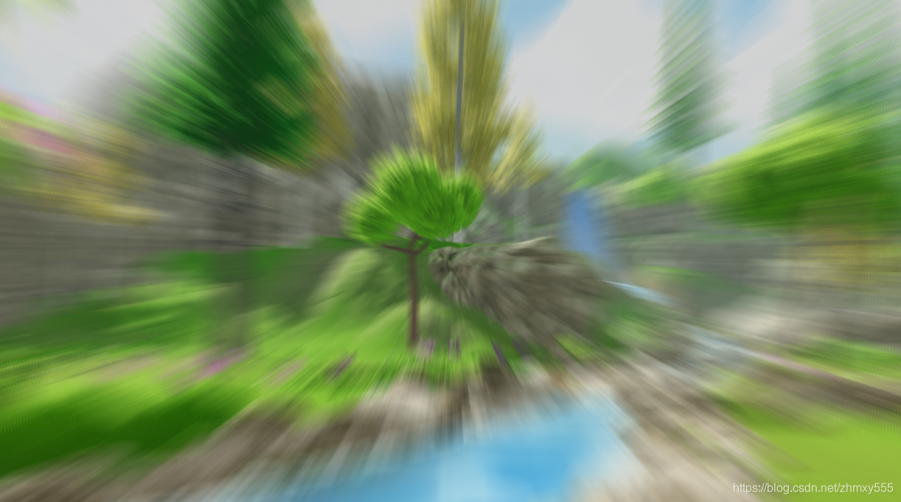

径向模糊的原理比较直接，首先选取一个径向轴心（Radial Center），然后将每一个采样点的uv基于此径向轴心进行偏移（offset），并进行一定次数的迭代采样，最终将采样得到的RGB值累加，并除以迭代次数。

其核心算法的Shader代码实现如下：
```hlsl
half4 RadialBlur(VaryingsDefault i)
{
	float2 blurVector = (_RadialCenter - i.texcoord.xy) * _BlurRadius;
	
	half4 acumulateColor = half4(0, 0, 0, 0);
	
	[unroll(30)]
	for (int j = 0; j < _Iteration; j ++)
	{
		acumulateColor += SAMPLE_TEXTURE2D(_MainTex, sampler_MainTex, i.texcoord);
		i.texcoord.xy += blurVector;
	}
	
	return acumulateColor / _Iteration;
}
```
**完整的Runtime + Shader实现可见：**[https://github.com/QianMo/X-PostProcessing-Library/tree/master/Assets/X-PostProcessing/Effects/RadialBlur](https://github.com/QianMo/X-PostProcessing-Library/tree/master/Assets/X-PostProcessing/Effects/RadialBlur)

另外需要注意的是，如果迭代次数不够多，而又设置了较高的Offset值，则会在屏幕四周出现较为明显的折痕，但一般情况下都还可以接受：

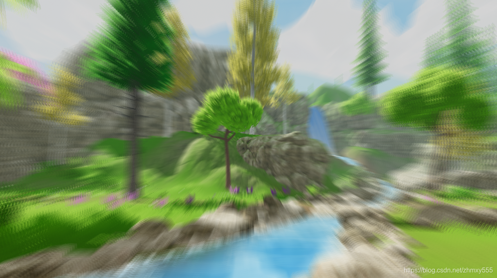

同样，对模糊半径（Blur Radius）参数的调节，可以控制模糊的程度：


## 十、方向模糊（Directional Blur）

方向模糊（Directional Blur）可以看做是径向模糊（Radial Blur）的一个变体。其主要思路是传入一个角度，然后在runtime层计算出对应的矢量方向：
```hlsl
float sinVal = (Mathf.Sin(settings.Angle) * settings.BlurRadius * 0.05f) / settings.Iteration;
float cosVal = (Mathf.Cos(settings.Angle) * settings.BlurRadius * 0.05f) / settings.Iteration;
sheet.properties.SetVector(ShaderIDs.Direction, new Vector2(sinVal, cosVal));
```
然后，在Shader层，将每一个采样点的uv基于此方向进行正负两次偏移（offset），接着进行一定次数的迭代采样，最终将采样得到的RGB值累加，并除以迭代次数，得到最终的输出。

核心算法的Shader代码实现如下：
```hlsl
half4 DirectionalBlur(VaryingsDefault i)
{
	half4 color = half4(0.0, 0.0, 0.0, 0.0);

	for (int k = -_Iteration; k < _Iteration; k++)
	{
		color += SAMPLE_TEXTURE2D(_MainTex, sampler_MainTex, i.texcoord - _Direction * k);
	}
	half4 finalColor = color / (_Iteration * 2.0);

	return finalColor;
}
```
**完整的Runtime + Shader实现可见：**[https://github.com/QianMo/X-PostProcessing-Library/tree/master/Assets/X-PostProcessing/Effects/DirectionalBlur](https://github.com/QianMo/X-PostProcessing-Library/tree/master/Assets/X-PostProcessing/Effects/DirectionalBlur)

方向模糊后处理的渲染效果如下：

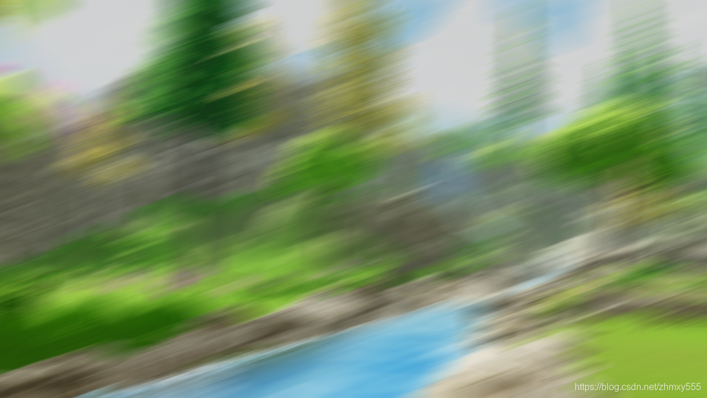

同样，对模糊半径（Blur Radius）参数的调节，可以控制模糊的程度：


而调节Angle参数，可以控制模糊旋转的方向：


## 总结

本文开头已经提到，模糊算法在后处理渲染领域占据着非常重要的地位。很多产品级后处理的实现，都会直接或间接依赖于一种或多种图像模糊算法。后处理管线中所采用的模糊算法的优劣，决定了产品最终的渲染品质和消耗的性能大小。

让我们重新看一下这十种模糊算法的横向对比，相信此时，大家对这十种模糊算法已经有了更全面的理解，以及自己的选择。


The End.

## Reference

[1] GDC 2003, Frame Buffer Postprocessing Effects in DOUBLE-S.T.E.A.L (Wreckless)

[2] SIGGRAPH 2015, Bandwidth-Efficient Rendering

[3] SIGGRAPH 2001，Fast Image Convolutions

[4] Gonzalez R C, Woods R E. Digital image processing, 4th edn. ISBN: 9780133356724[J]. 2017.

[5] [https://computergraphics.stackexchange.com/questions/39/how-is-gaussian-blur-implemented](https://computergraphics.stackexchange.com/questions/39/how-is-gaussian-blur-implemented)

[6] [http://datahacker.rs/opencv-average-and-gaussian-filter/](http://datahacker.rs/opencv-average-and-gaussian-filter/)

[7] [https://towardsdatascience.com/image-processing-class-egbe443-4-filters-aa1037676130](https://towardsdatascience.com/image-processing-class-egbe443-4-filters-aa1037676130)

[8] [https://www.zhihu.com/question/20813608/answer/261346592](https://www.zhihu.com/question/20813608/answer/261346592)

[9] [https://en.wikipedia.org/wiki/Box_blur](https://en.wikipedia.org/wiki/Box_blur)

[10] [https://en.wikipedia.org/wiki/Gaussian_blur](https://en.wikipedia.org/wiki/Gaussian_blur)

[11] [http://blog.marmakoide.org/?p=1](http://blog.marmakoide.org/?p=1)

[12] [https://developer.nvidia.com/gpugems/gpugems/part-iv-image-processing/chapter-23-depth-field-survey-techniques](https://developer.nvidia.com/gpugems/gpugems/part-iv-image-processing/chapter-23-depth-field-survey-techniques)

[13] [https://www.flickr.com/photos/valpil58/9425151785](https://www.flickr.com/photos/valpil58/9425151785)

[14] [https://en.wikipedia.org/wiki/Bokeh](https://en.wikipedia.org/wiki/Bokeh)

[15] [https://commons.wikimedia.org/wiki/File:Lenses_with_different_apertures.jpg](https://commons.wikimedia.org/wiki/File:Lenses_with_different_apertures.jpg)

[16] [https://improvephotography.com/29529/aperture-blades-many-best/](https://improvephotography.com/29529/aperture-blades-many-best/)

[17] [https://www.webucator.com/how-to/how-apply-an-iris-blur-effect-adobe-photoshop.cfm](https://www.webucator.com/how-to/how-apply-an-iris-blur-effect-adobe-photoshop.cfm)

[18] 题图来自：[https://www.artstation.com/artwork/Z5RkbZ](https://www.artstation.com/artwork/Z5RkbZ)


### 图片资源清单

| # | 文件名 | 说明 | 大小 |
|---|--------|------|------|
| 1 | `01-zhihu-image.jpeg` | 原文配图 1 | 314.8 KB |
| 2 | `02-zhihu-image.jpeg` | 原文配图 2 | 246.4 KB |
| 3 | `03-zhihu-image.jpeg` | 原文配图 3 | 384.2 KB |
| 4 | `04-zhihu-image.jpeg` | 原文配图 4 | 198.3 KB |
| 5 | `05-zhihu-image.png` | 原文配图 5 | 1.2 MB |
| 6 | `06-zhihu-image.jpeg` | 原文配图 6 | 149.6 KB |
| 7 | `07-zhihu-image.jpeg` | 原文配图 7 | 315.2 KB |
| 8 | `08-zhihu-image.png` | 原文配图 8 | 335.5 KB |
| 9 | `09-zhihu-image.jpeg` | 原文配图 9 | 20.6 KB |
| 10 | `10-zhihu-image.jpeg` | 原文配图 10 | 147.1 KB |
| 11 | `11-zhihu-image.png` | 原文配图 11 | 14.3 KB |
| 12 | `12-zhihu-image.jpeg` | 原文配图 12 | 29.7 KB |
| 13 | `13-zhihu-image.png` | 原文配图 13 | 3.4 KB |
| 14 | `14-zhihu-image.png` | 原文配图 14 | 3.6 KB |
| 15 | `15-zhihu-image.png` | 原文配图 15 | 1.5 KB |
| 16 | `16-zhihu-image.jpeg` | 原文配图 16 | 12.4 KB |
| 17 | `17-zhihu-image.png` | 原文配图 17 | 3.6 KB |
| 18 | `18-zhihu-image.png` | 原文配图 18 | 2.6 KB |
| 19 | `19-zhihu-image.png` | 原文配图 19 | 18.4 KB |
| 20 | `20-zhihu-image.png` | 原文配图 20 | 192.8 KB |
| 21 | `21-zhihu-image.png` | 原文配图 21 | 1.7 MB |
| 22 | `22-zhihu-image.png` | 原文配图 22 | 788.0 KB |
| 23 | `23-zhihu-image.gif` | 原文配图 23 | 4.8 MB |
| 24 | `24-zhihu-image.gif` | 原文配图 24 | 4.7 MB |
| 25 | `25-zhihu-image.png` | 原文配图 25 | 1.5 KB |
| 26 | `26-zhihu-image.png` | 原文配图 26 | 0.8 KB |
| 27 | `27-zhihu-image.png` | 原文配图 27 | 144.8 KB |
| 28 | `28-zhihu-image.png` | 原文配图 28 | 103.9 KB |
| 29 | `29-zhihu-image.png` | 原文配图 29 | 94.9 KB |
| 30 | `30-zhihu-image.png` | 原文配图 30 | 241.2 KB |
| 31 | `31-zhihu-image.gif` | 原文配图 31 | 5.0 MB |
| 32 | `32-zhihu-image.png` | 原文配图 32 | 38.9 KB |
| 33 | `33-zhihu-image.png` | 原文配图 33 | 38.3 KB |
| 34 | `34-zhihu-image.png` | 原文配图 34 | 719.8 KB |
| 35 | `35-zhihu-image.gif` | 原文配图 35 | 3.7 MB |
| 36 | `36-zhihu-image.gif` | 原文配图 36 | 4.6 MB |
| 37 | `37-zhihu-image.png` | 原文配图 37 | 51.8 KB |
| 38 | `38-zhihu-image.png` | 原文配图 38 | 46.1 KB |
| 39 | `39-zhihu-image.png` | 原文配图 39 | 61.7 KB |
| 40 | `40-zhihu-image.png` | 原文配图 40 | 641.8 KB |
| 41 | `41-zhihu-image.gif` | 原文配图 41 | 1.5 MB |
| 42 | `42-zhihu-image.gif` | 原文配图 42 | 4.6 MB |
| 43 | `43-zhihu-image.jpeg` | 原文配图 43 | 177.0 KB |
| 44 | `44-zhihu-image.jpeg` | 原文配图 44 | 38.0 KB |
| 45 | `45-zhihu-image.jpeg` | 原文配图 45 | 31.9 KB |
| 46 | `46-zhihu-image.jpeg` | 原文配图 46 | 56.1 KB |
| 47 | `47-zhihu-image.jpeg` | 原文配图 47 | 54.8 KB |
| 48 | `48-zhihu-image.jpeg` | 原文配图 48 | 81.4 KB |
| 49 | `49-zhihu-image.png` | 原文配图 49 | 30.2 KB |
| 50 | `50-zhihu-image.jpeg` | 原文配图 50 | 71.9 KB |
| 51 | `51-zhihu-image.jpeg` | 原文配图 51 | 80.6 KB |
| 52 | `52-zhihu-image.png` | 原文配图 52 | 143.1 KB |
| 53 | `53-zhihu-image.png` | 原文配图 53 | 869.7 KB |
| 54 | `54-zhihu-image.gif` | 原文配图 54 | 3.4 MB |
| 55 | `55-zhihu-image.gif` | 原文配图 55 | 4.7 MB |
| 56 | `56-zhihu-image.jpeg` | 原文配图 56 | 34.8 KB |
| 57 | `57-zhihu-image.jpeg` | 原文配图 57 | 74.4 KB |
| 58 | `58-zhihu-image.png` | 原文配图 58 | 90.1 KB |
| 59 | `59-zhihu-image.png` | 原文配图 59 | 780.0 KB |
| 60 | `60-zhihu-image.gif` | 原文配图 60 | 4.8 MB |
| 61 | `61-zhihu-image.gif` | 原文配图 61 | 4.5 MB |
| 62 | `62-zhihu-image.png` | 原文配图 62 | 1.7 MB |
| 63 | `63-zhihu-image.png` | 原文配图 63 | 2.3 MB |
| 64 | `64-zhihu-image.gif` | 原文配图 64 | 3.8 MB |
| 65 | `65-zhihu-image.png` | 原文配图 65 | 912.6 KB |
| 66 | `66-zhihu-image.png` | 原文配图 66 | 1.1 MB |
| 67 | `67-zhihu-image.gif` | 原文配图 67 | 4.6 MB |
| 68 | `68-zhihu-image.png` | 原文配图 68 | 816.0 KB |
| 69 | `69-zhihu-image.gif` | 原文配图 69 | 4.3 MB |
| 70 | `70-zhihu-image.gif` | 原文配图 70 | 4.9 MB |
| 71 | `71-zhihu-image.png` | 原文配图 71 | 335.5 KB |

### 参考链接

- [知乎专栏原文](https://zhuanlan.zhihu.com/p/125744132) - 用户指定的原始留档目标；抓取时返回知乎 JS 校验壳，未直接取得正文。
- [CSDN 同作者页面](https://blog.csdn.net/poem_qianmo/article/details/105350519) - 正文开头列出同一知乎专栏链接，用作全文与图片归档来源。
- [SegmentFault 同题页面](https://segmentfault.com/a/1190000023013329) - 页面元数据 `origin_url` 指向同一知乎专栏链接，用于交叉校验来源。
- [UWA 同题页面](https://blog.uwa4d.com/archives/USparkle_PostProcessing.html) - 同题页面，用于交叉校验正文尾部与图片序列。
- [X-PostProcessing-Library](https://github.com/QianMo/X-PostProcessing-Library) - 文章引用的 Unity 后处理开源库。

### 相关记录

- [Shader案例:顶点运动模糊](./zhihu-shader-vertex-motion-blur.md) - 同为知乎图形/Shader 文章学习用途本地留档。
- [URP 屏幕空间描边 RenderFeature 实现](./urp-renderfeature-screen-space-outline.md) - 同属 Unity 后处理与 Shader 效果方向。

### 验证记录

- [2026-06-01] 初次记录。已在阿卡西 `data/` 内查重，未发现 `125744132`、同题标题或相关 Dual Blur/Kawase 记录；知乎原页抓取返回 `zse-ck` JS 校验壳，未取得正文；正文与图片按 CSDN 同作者页面归档，并用 SegmentFault `origin_url`、UWA 同题页面和搜索结果交叉确认同一来源。文章算法效果未在 Unity 中实测，状态标记为待验证。
