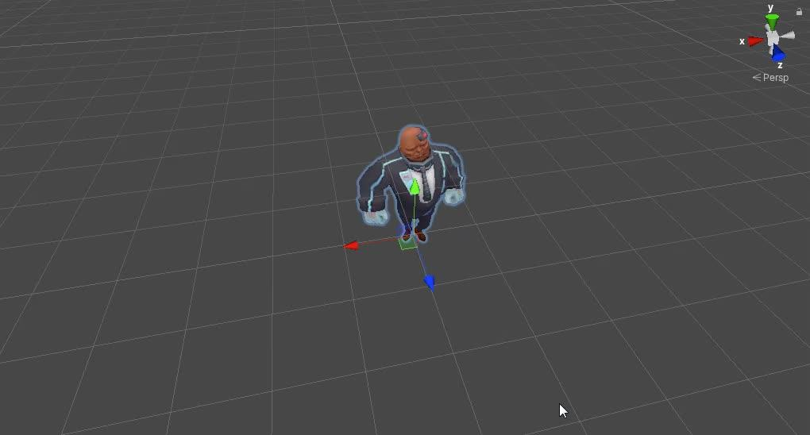
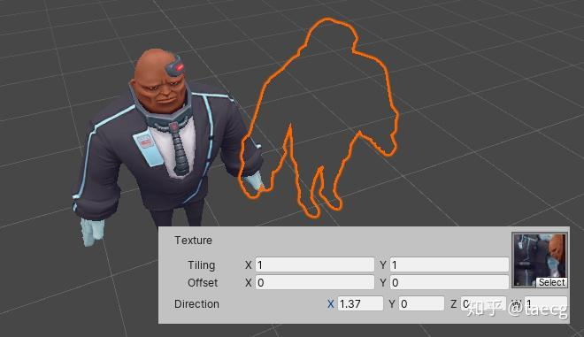
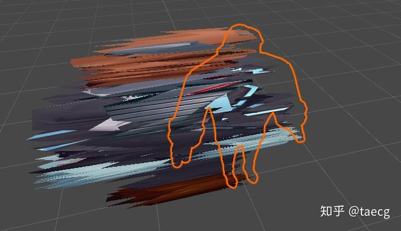
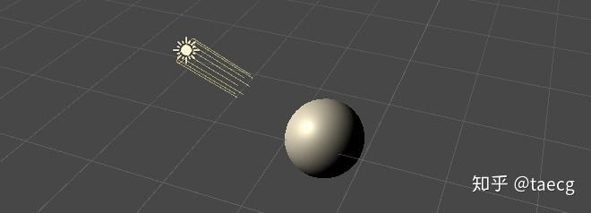
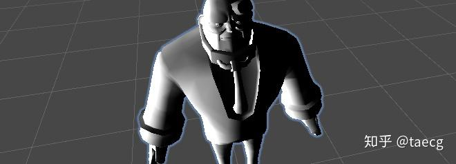
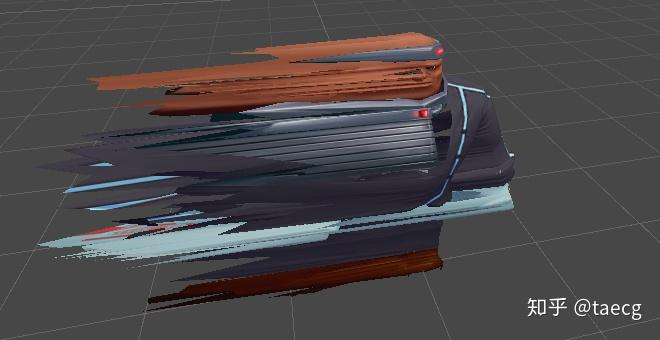
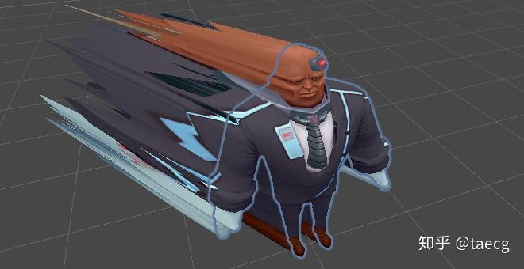
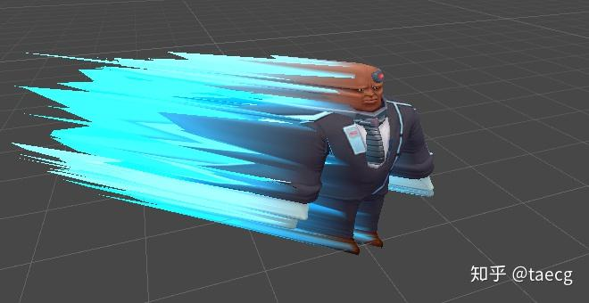
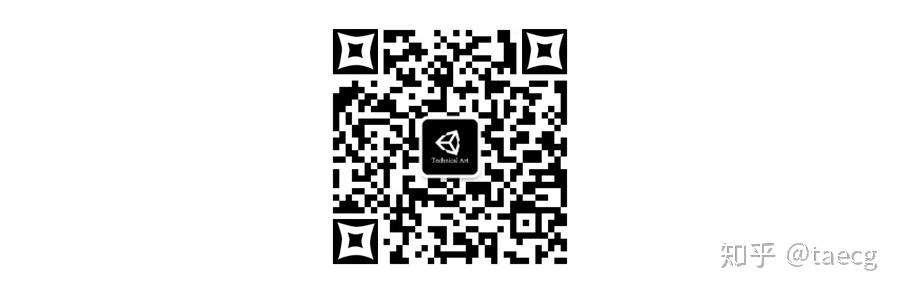

# Shader案例:顶点运动模糊

**标签**：#unity #shader #graphics #hlsl #performance #reference #zhihu
**来源**：[知乎专栏 - Shader案例:顶点运动模糊](https://zhuanlan.zhihu.com/p/99487181)
**收录日期**：2026-05-27
**来源日期**：2019-12-26
**更新日期**：2026-05-27
**状态**：⚠️ 待验证
**可信度**：⭐⭐（外部社区文章，已按原文转载存档，未实测）
**适用版本**：Unity Built-in / Unlit Shader；Shader Model 2.0 约束场景

### 概要

知乎文章《Shader案例:顶点运动模糊》的转载存档。文章介绍通过顶点着色器沿运动方向偏移顶点，并结合噪声、法线方向遮罩和脚本实时更新参数，近似实现低成本运动模糊效果。

### 内容

## 前言

通过后处理我们可以实现效果很好的运动模糊效果，但是怎耐性能却吃不消，于是，让我们变通一下，换个思路来实现另一种风情的运动模糊。

效果如下：

原文视频：00:11（见原文页面）



00:11

**实现思路 **

1. 通过在顶点着色器中对顶点进行偏移，加上适当的噪波来实现随机性。
2. 对象在移动的时候，利用脚本实时更新偏移参数来实现最终的效果。

---

## 顶点着色器部分(一)

顶点着色器是本效果的核心实现，所以我们先来看下顶点着色器中的逐步分解与实现。

首先呢，我们建一个默认的Unlit Shader.

其中顶点着色器代码如下：

```hlsl
v2f vert (appdata v)
{
      v2f o;
      o.vertex = UnityObjectToClipPos(v.vertex);
      o.uv = TRANSFORM_TEX(v.uv, _MainTex);
      UNITY_TRANSFER_FOG(o,o.vertex);
      return o;
}
```

其中，**UnityObjectToClipPos(v.vertex)**表示的是将模型的顶点本地坐标转换到齐次裁剪空间下，那我们就选择在顶点的本地空间下来做偏移。

**顶点偏移**

同时由于最后顶点的偏移不是固定的一个方向，所以我们需要引入一个vector向量用来承载变化的方向方量,如下面的**_Direction**

```hlsl
_Direction("Direction",vector) = (0,0,0,1)
```

 对顶点本地坐标进行偏移运算，由方向是三维向量，所以我们指定的是xyz分量，同时又由于_Direction是四维向量，刚好最后一个分量w我们可以利用起来，用来做整体偏移的强度。

```hlsl
v.vertex.xyz += _Direction.xyz * _Direction.w;
```

此时当我们调节材质面板中的_Direction属性时，可以看到对象的顶点已经产生了偏移，只不过现在是整体偏移了而已(注意橙色框中是角色原来的位置)。



**偏移随机**

好，那接下来呢，我们要实现随机偏移效果

原理很简单，我们只需要让每个顶点的坐标加上的值不一样即可，有两种方式可实现:

1. 在顶点着色器中采样一张噪波贴图
2. 通过噪波算法实现

由于第一种方式在SM2.0上不支持，所以我们这里采用第二种方式,关于噪波，之前有篇文章专门介绍过，传送门：

 我们采用常见的噪波公式算出噪波并应用于本地顶点上。

```hlsl
float noise = frac(sin(dot(v.uv.xy, float2(12.9898, 78.233))) * 43758.5453);
v.vertex.xyz += _Direction.xyz * _Direction.w * noise;
```

此时的效果如下：



**偏移部分**

顶点偏移也有了，随机拉伸感也出来了，但是我们希望的并不是整个对象都被拉伸了，而是只需要部分拉伸。

而这里的部分到底是指哪部分呢？

假如对象向正前方移动，那我们所希望的是对象正面不拉伸，背部那部分才会拉伸，其它方向同理，那这个要如何实现呢？

首先哪部分拉伸哪部分不拉伸，这个我们需要用黑白来区分，这样用一个乘法就可以实现了。

那么问题变成了如何根据方向来求出对象表面的黑白效果.

这时大家可以在场景中新建一个默认球体，然后仔细观察它与平行光的关系，是不是恍然大悟。。。



没错，通过简单的Lambert光照模型就可以实现我们想要的效果。(需要我们在appdata中引入顶点的normal数据进来)

```hlsl
fixed NdotD = max(0,dot(v.normal,_Direction));
```



然后将NdotD乘到顶点偏移中去。

```hlsl
v.vertex.xyz += _Direction.xyz * _Direction.w * noise * NdotD;
```



OK，效果已基本成型，片断着色器中暂时不做任何处理。

---

## C#脚本部分

当运行时，我们需要动态的获取到对象当前帧的位置坐标与上一帧的位置坐标，这样我们就可以计算出对象运动的方向与速度，然后我们就可以利用这些信息去修改我们上面的Shader，以便产生动态的顶点偏移效果。

脚本代码部分都有详细注释，就不再另做解释，直接贴上代码:

```csharp
using System.Collections;
using System.Collections.Generic;
using UnityEngine;

public class MotionVertexController : MonoBehaviour
{
    private Transform trans;
    private Material[ ] mats;
    private Vector3 lastPosition;
    private Vector3 newPosition;
    private Vector3 direction;
    private float t = 0;

    void Start ()
    {
        trans = transform;
        lastPosition = newPosition = trans.position;

        //获取对象及子对象中的所有渲染器（MeshRenderer或者SkinnedMeshRenderer）
        var renderers = trans.GetComponentsInChildren<Renderer> ();
        //获取所有的材质球(针对有些对象有多个部件多个材质的情况)
        mats = new Material[renderers.Length];
        for (int i = 0; i < renderers.Length; i++)
        {
            mats[i] = renderers[i].sharedMaterial;
        }
    }

    void Update ()
    {
        newPosition = trans.position;

        //如果上一帧的位置追到了当前帧的位置，则重置t
        if (newPosition == lastPosition) t = 0;
        t += Time.deltaTime;
        //上一帧的位置通过t来做插值
        lastPosition = Vector3.Lerp (lastPosition, newPosition, t / 2);
        //求出移动的方向
        direction = lastPosition - newPosition;
        //遍历修改所有材质的_Direction属性
        foreach (var m in mats)
        {
            m.SetVector ("_Direction", new Vector4 (direction.x, direction.y, direction.z, m.GetVector ("_Direction").w));
        }
    }

}
```

使用方法：直接将脚本拖到对象的最外层GameObject上。

运行，然后移动角色观察下效果，这时会发现效果很奇怪，主要表现在顶点拉伸的方向不对。这是为什么呢？

这其实是由于我们在脚本中使用的是模型在世界空间下的坐标，而Shader中的顶点偏移计算却是在模型的本地空间下进行的，两者的坐标空间不一致导致的原因。

因为，我们选择修改Shader，将相关的计算从模型的本地空间改成世界空间。

---

##  顶点着色器部分(二)

 由于UnityObjectToClipPos封装的原因，我们需要自行拆出世界空间，如下：

```hlsl
float4 wPos = mul(unity_ObjectToWorld,v.vertex);
o.vertex=mul(UNITY_MATRIX_VP,wPos);
```

然后我们的顶点偏移改成在世界空间下来做，同时也需要把顶点法线转换到世界空间下。

```hlsl
float4 wPos = mul(unity_ObjectToWorld,v.vertex);
half3 wNormal = UnityObjectToWorldNormal(v.normal);
fixed NdotD = max(0,dot(wNormal,_Direction));
float noise = frac(sin(dot(v.uv.xy, float2(12.9898, 78.233))) * 43758.5453);
wPos.xyz += _Direction.xyz * _Direction.w * noise * NdotD;
o.vertex=mul(UNITY_MATRIX_VP,wPos);
```

再次运行，效果就正确了



---

## 片断着色器

最后我们可以给整个效果加点修饰，比如给顶点偏移叠加点颜色，这里可以好好利用下顶点着色器中计算出来的NdotD。

完整的代码如下：

```hlsl
Shader "Unlit/MotionVertex"
{
    Properties
    {
        _Color("Color",color) = (1,0,0.65,1)
        _MainTex ("Texture", 2D) = "white" {}
        _Direction("Direction",vector) = (0,0,0,1)
    }
    SubShader
    {
        Tags { "RenderType"="Opaque" }
        LOD 100

        Pass
        {
            CGPROGRAM
            #pragma vertex vert
            #pragma fragment frag
            #pragma multi_compile_fog

            #include "UnityCG.cginc"

            struct appdata
            {
                float4 vertex : POSITION;
                float2 uv : TEXCOORD0;
                half3 normal:NORMAL;
            };

            struct v2f
            {
                float2 uv : TEXCOORD0;
                UNITY_FOG_COORDS(1)
                float4 vertex : SV_POSITION;
                fixed NdotD:TEXCOORD1;
            };

            fixed4 _Color;
            sampler2D _MainTex;
            float4 _MainTex_ST;
            half4 _Direction;

            v2f vert (appdata v)
            {
                v2f o;
                float4 wPos = mul(unity_ObjectToWorld,v.vertex);
                half3 wNormal = UnityObjectToWorldNormal(v.normal);
                fixed NdotD = max(0,dot(wNormal,_Direction));
                o.NdotD = NdotD;
                float noise = frac(sin(dot(v.uv.xy, float2(12.9898, 78.233))) * 43758.5453);
                wPos.xyz += _Direction.xyz * _Direction.w * noise * NdotD;
                o.vertex=mul(UNITY_MATRIX_VP,wPos);
                // o.vertex = UnityObjectToClipPos(v.vertex);
                o.uv = TRANSFORM_TEX(v.uv, _MainTex);
                UNITY_TRANSFER_FOG(o,o.vertex);
                return o;
            }

            fixed4 frag (v2f i) : SV_Target
            {
                fixed4 col = tex2D(_MainTex, i.uv);
                col += i.NdotD * _Color;
                UNITY_APPLY_FOG(i.fogCoord, col);
                return col;
            }
            ENDCG
        }
    }
}
```



---

## **最后**

欢迎大家关注更多干货的公众号：**Unity技术美术 ( ID:gh_8b69cca044dc )**



Unity技术美术QQ交流分享群：**19470667(1群已满）､763506271**


### 图片资源清单

| # | 文件名 | 说明 | 大小 |
|---|--------|------|------|
| 1 | `01-zhihu-image.jpg` | 原文配图 1 | 33 KB |
| 2 | `02-zhihu-image.jpg` | 原文配图 2 | 26 KB |
| 3 | `03-zhihu-image.jpg` | 原文配图 3 | 33 KB |
| 4 | `04-zhihu-image.jpg` | 原文配图 4 | 11 KB |
| 5 | `05-zhihu-image.jpg` | 原文配图 5 | 16 KB |
| 6 | `06-zhihu-image.jpg` | 原文配图 6 | 26 KB |
| 7 | `07-zhihu-image.jpg` | 原文配图 7 | 26 KB |
| 8 | `08-zhihu-image.jpg` | 原文配图 8 | 27 KB |
| 9 | `09-zhihu-image.jpg` | 原文配图 9 | 25 KB |
| 10 | `10-zhihu-image.jpg` | 原文配图 10 | 46 KB |

### 参考链接

- [Shader案例:顶点运动模糊 - 知乎](https://zhuanlan.zhihu.com/p/99487181) - 原始文章

### 相关记录

- [VR 相机壳层特效替代后处理](./vr-camera-shell-effects-without-post-processing.md) - 同样关注用几何/材质方案替代昂贵后处理
- [渲染管线概览](./rendering-pipeline-overview.md) - Lambert 光照、顶点/片元阶段等基础概念

### 验证记录

- [2026-05-27] 初次记录。已执行重复检测，未发现 `99487181` 或同题记录。先前误写成摘要版，后按“转载存档”要求改为基于 `/tmp/zhihu-99487181-full.json` 的全文转载版；正文来自 `zhihu download-full` 抓取结果，图片已保存到 `assets/zhihu-shader-vertex-motion-blur/` 并替换为相对路径。原文视频为知乎临时签名直链，未写入直链，仅保留视频占位与封面图。未实测 shader 效果。

---
